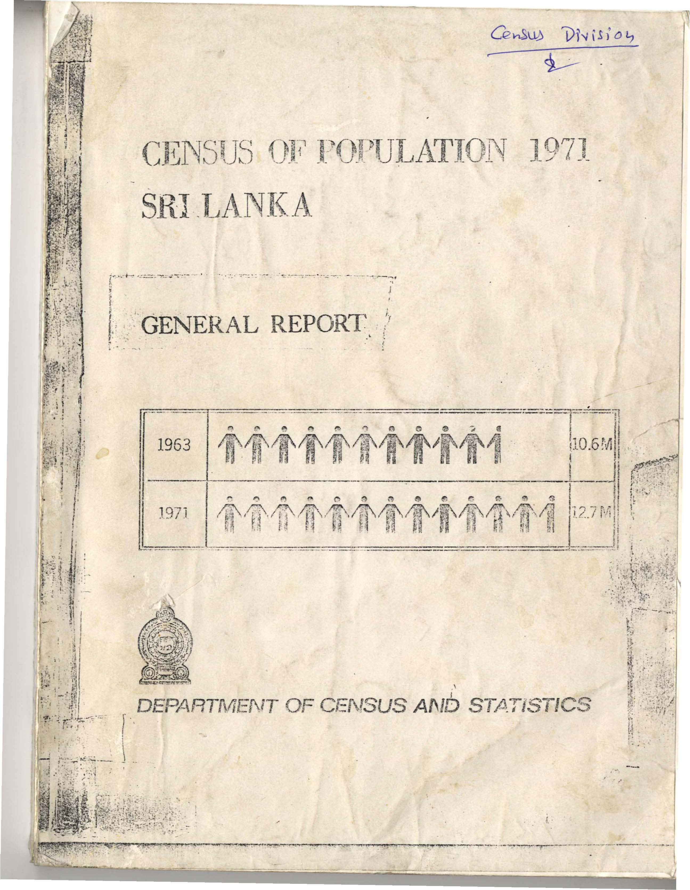
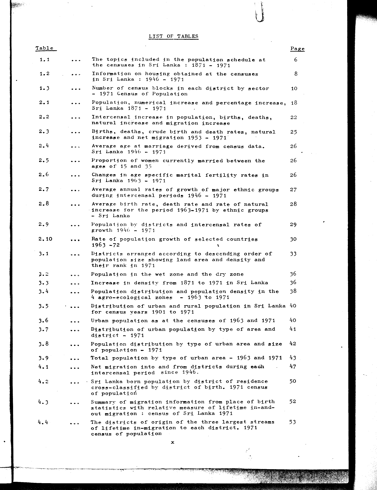

# Sri Lanka 🇱🇰  - Census of Population 1971

This repo contains structured data from the **Census of Population 1971, Sri Lanka.**

 The data was extracted from the *[General Report](original_data/Census1971_Report.pdf)*, published by the [Department of Census and Statistics, Sri Lanka](https://www.statistics.gov.lk/), and covers **102** tables, extracted using [claude-opus-4-6](https://www.anthropic.com/claude/opus) (8192 tokens, [prompt](src/census/table/prompt.txt)).

Structured data is availble in multiple JSON and TSV formats. PDF and Images of the original tables are also included.

## Tables

### 1.x

- 1.1: [The topics included in the population schedule at the censuses in Sri Lanka: 1871-1971](data/tables/table-1/table-1-01/README.md)
- 1.2: [Information on housing obtained at the censuses in Sri Lanka: 1946-1971](data/tables/table-1/table-1-02/README.md)
- 1.3: [Number of census blocks in each district by sector - 1971 Census of Population](data/tables/table-1/table-1-03/README.md)

### 2.x

- 2.1: [Population, numerical increase and percentage increase, Sri Lanka 1871-1971](data/tables/table-2/table-2-01/README.md)
- 2.2: [Intercensal increase in population, births, deaths, natural increase and migration increase](data/tables/table-2/table-2-02/README.md)
- 2.3: [Births, deaths, crude birth and death rates, natural increase and net migration 1953-1971](data/tables/table-2/table-2-03/README.md)
- 2.4: [Average age at marriage derived from census data, Sri Lanka 1946-1971](data/tables/table-2/table-2-04/README.md)
- 2.5: [Proportion of women currently married between the ages of 15 and 35](data/tables/table-2/table-2-05/README.md)
- 2.6: [Changes in age specific marital fertility rates in Sri Lanka 1963-1971](data/tables/table-2/table-2-06/README.md)
- 2.7: [Average annual rates of growth of major ethnic groups during intercensal periods 1946-1971](data/tables/table-2/table-2-07/README.md)
- 2.8: [Average birth rate, death rate and rate of natural increase for the period 1963-1971 by ethnic groups - Sri Lanka](data/tables/table-2/table-2-08/README.md)
- 2.9: [Population by districts and intercensal rates of growth 1946-1971](data/tables/table-2/table-2-09/README.md)
- 2.10: [Rate of population growth of selected countries 1963-72](data/tables/table-2/table-2-10/README.md)

### 3.x

- 3.1: [Districts arranged according to descending order of population size showing land area and density and their rank in 1971](data/tables/table-3/table-3-01/README.md)
- 3.2: [Population in the wet zone and the dry zone](data/tables/table-3/table-3-02/README.md)
- 3.3: [Increase in density from 1871 to 1971 in Sri Lanka](data/tables/table-3/table-3-03/README.md)
- 3.4: [Population distribution and population density in 4 agro-ecological zones - 1963 to 1971](data/tables/table-3/table-3-04/README.md)
- 3.5: [Distribution of urban and rural population in Sri Lanka for census years 1901 to 1971](data/tables/table-3/table-3-05/README.md)
- 3.6: [Urban population as at the censuses of 1963 and 1971](data/tables/table-3/table-3-06/README.md)
- 3.7: [Distribution of urban population by type of area and district - 1971](data/tables/table-3/table-3-07/README.md)
- 3.8: [Population distribution by type of urban area and size of population - 1971](data/tables/table-3/table-3-08/README.md)
- 3.9: [Total population by type of urban area - 1963 and 1971](data/tables/table-3/table-3-09/README.md)

### 4.x

- 4.1: [Net migration into and from districts during each intercensal period since 1946](data/tables/table-4/table-4-01/README.md)
- 4.2: [Sri Lanka born population by district of residence cross-classified by district of birth, 1971 census of population](data/tables/table-4/table-4-02/README.md)
- 4.3: [Summary of migration information from place of birth statistics with relative measure of lifetime in-and-out migration: census of Sri Lanka 1971](data/tables/table-4/table-4-03/README.md)
- 4.4: [The districts of origin of the three largest streams of lifetime in-migration to each district, 1971 census of population](data/tables/table-4/table-4-04/README.md)
- 4.5: [The district of destination of the three largest streams of lifetime out-migration from each district](data/tables/table-4/table-4-05/README.md)
- 4.6: [Number and percentage of internal migrants in Sri Lanka - 1971 census](data/tables/table-4/table-4-06/README.md)
- 4.7: [Number and percentage of in-migrants from other districts during specified time intervals prior to the census date derived from duration of residence data - 1971 census of population](data/tables/table-4/table-4-07/README.md)
- 4.8: [Number and percentage of out-migrants to other districts during specified time intervals prior to the census date derived from duration of residence data - 1971 census of population](data/tables/table-4/table-4-08/README.md)
- 4.9: [Number and percentage of net migrants into districts during specified time intervals prior to the census date derived from duration of residence data - 1971 census of population](data/tables/table-4/table-4-09/README.md)
- 4.10: [Comparison of lifetime in-migrants (inter-district) with in-migrants, derived from data on duration of residence - 1971 census of population](data/tables/table-4/table-4-10/README.md)
- 4.11: [Percentage of migrants in the resident population by duration of residence](data/tables/table-4/table-4-11/README.md)
- 4.12: [Sex ratios of migrants (males per 1000 females)](data/tables/table-4/table-4-12/README.md)

### 5.x

- 5.1: [Myer's index of digital preference for digits 0-9: Sri Lanka census of 1946-1971](data/tables/table-5/table-5-01/README.md)
- 5.2: [Age accuracy index by the U.N. Secretariat method Sri Lanka censuses of 1921, 1946, 1953, 1963 and 1971](data/tables/table-5/table-5-02/README.md)
- 5.3: [Population by 5 year age groups 1946-1971](data/tables/table-5/table-5-03/README.md)
- 5.4: [Percentage distribution of population by 5 year age groups - 1921-1971](data/tables/table-5/table-5-04/README.md)
- 5.5: [Percent distribution of population in broad age groups and dependency](data/tables/table-5/table-5-05/README.md)
- 5.6: [Population of Sri Lanka classified by sex, sex ratio and masculinity proportion - 1871 to 1971](data/tables/table-5/table-5-06/README.md)
- 5.7: [Sex ratio: males per 1000 females by five year age groups - 1946-1971](data/tables/table-5/table-5-07/README.md)
- 5.8: [Sex ratios by districts 1971](data/tables/table-5/table-5-08/README.md)
- 5.9: [Number of males per 1000 females in selected countries 1971](data/tables/table-5/table-5-09/README.md)

### 6.x

- 6.1: [Population of Sri Lanka by ethnic groups in census years](data/tables/table-6/table-6-01/README.md)
- 6.2: [Percentage distribution of ethnic groups in the census years](data/tables/table-6/table-6-02/README.md)
- 6.3: [Annual average growth rates (percentages) of ethnic groups during intercensal periods](data/tables/table-6/table-6-03/README.md)
- 6.4: [Percentage distribution of each ethnic group in the various districts - 1971](data/tables/table-6/table-6-04/README.md)
- 6.5: [Percentage distribution of ethnic groups in each district - 1971](data/tables/table-6/table-6-05/README.md)
- 6.6: [Population by race and religion and religion as a percentage of race - 1971](data/tables/table-6/table-6-06/README.md)
- 6.7: [Religion classified by race](data/tables/table-6/table-6-07/README.md)
- 6.8: [Number and percentage of total population of each religion - 1971](data/tables/table-6/table-6-08/README.md)
- 6.9: [Population of Sri Lanka by religion](data/tables/table-6/table-6-09/README.md)
- 6.10: [Percentage changes in religion and race](data/tables/table-6/table-6-10/README.md)
- 6.11: [Percentage distribution of religious groups by districts - 1971 census](data/tables/table-6/table-6-11/README.md)
- 6.12: [Percentage distribution of district population by religion](data/tables/table-6/table-6-12/README.md)
- 6.13: [Population by citizenship - 1963 and 1971](data/tables/table-6/table-6-13/README.md)

### 7.x

- 7.1: [Mean age at marriage 1946, 1953, 1963 and 1971](data/tables/table-7/table-7-01/README.md)
- 7.2: [Proportion of women currently married and never married by age groups 1946, 1953, 1963 and 1971 censuses](data/tables/table-7/table-7-02/README.md)
- 7.3: [Proportion of men currently married and never married by age groups 1946, 1953, 1963 and 1971 censuses](data/tables/table-7/table-7-03/README.md)
- 7.4: [Proportion of females widowed and divorced by age groups 1946, 1953, 1963 and 1971 censuses](data/tables/table-7/table-7-04/README.md)
- 7.5: [Proportion of currently married and never married females in the four agro-ecological zones - 1963 and 1971](data/tables/table-7/table-7-05/README.md)
- 7.6: [Age-specific fertility rates, general fertility rates (15-44) and total fertility rates for 1953 and 1963 and percent changes 1953-1963](data/tables/table-7/table-7-06/README.md)
- 7.7: [Age specific marital fertility rates and percent changes 1953-1963](data/tables/table-7/table-7-07/README.md)
- 7.8: [Age specific fertility rates, general fertility rates (15-44) and total fertility rates for 1963 and 1971 and percent changes 1963-1971](data/tables/table-7/table-7-08/README.md)
- 7.9: [Age specific marital fertility rates 1963-1971 and percent changes](data/tables/table-7/table-7-09/README.md)
- 7.10: [Live births borne by ever married women by age at the 1971 Census](data/tables/table-7/table-7-10/README.md)
- 7.11: [Urban-rural fertility differentials for Sri Lanka: child woman ratio (children 0-4 per 1000 females aged 15-49)](data/tables/table-7/table-7-11/README.md)
- 7.12: [Fertility rates by zones - 1963 and 1971](data/tables/table-7/table-7-12/README.md)
- 7.13: [Number of live births borne by ever married women according to age and educational attainment and fertility indices considering the live-births borne by women with no schooling as equivalent to 100](data/tables/table-7/table-7-13/README.md)
- 7.14: [Child-woman ratio by ethnic group - Sri Lanka 1963 and 1971](data/tables/table-7/table-7-14/README.md)
- 7.15: [Crude birth rates by ethnic groups - Sri Lanka 1946-1971](data/tables/table-7/table-7-15/README.md)
- 7.16: [Child-woman ratios by religion - 1971](data/tables/table-7/table-7-16/README.md)

### 8.x

- 8.1: [Literacy rates of the cohort aged 20-49 in 1946 traced through the censuses of 1953, 1963 and 1971](data/tables/table-8/table-8-01/README.md)
- 8.2: [Literacy rates of the population aged 10 years and over (number of literates per 1000 persons)](data/tables/table-8/table-8-02/README.md)
- 8.3: [Literacy rates by sex and age - 1971 Census](data/tables/table-8/table-8-03/README.md)
- 8.4: [Literacy of the population aged 10 and over for urban and rural sectors of Sri Lanka 1963 and 1971](data/tables/table-8/table-8-04/README.md)
- 8.5: [Literacy rates of the population aged 10 years and over by districts - 1963 and 1971](data/tables/table-8/table-8-05/README.md)
- 8.6: [Comparison of 1971 Census figures on school attendance with Education Ministry figures of school enrolment](data/tables/table-8/table-8-06/README.md)
- 8.7: [Percentage of children attending school by sex and single years of age for urban and rural sector 1971](data/tables/table-8/table-8-07/README.md)
- 8.8: [Percentage of children 6-14 attending school by sex for districts 1971](data/tables/table-8/table-8-08/README.md)
- 8.9: [Population 10 years and over by level of educational attainment 1971 Census](data/tables/table-8/table-8-09/README.md)
- 8.10: [Percentage distribution of persons who have completed primary and higher levels, by age group](data/tables/table-8/table-8-10/README.md)
- 8.11: [Number reported as literate compared with the number estimated as literate from the reported educational attainment 1971 Census](data/tables/table-8/table-8-11/README.md)

### 9.x

- 9.1: [Population and labour force](data/tables/table-9/table-9-01/README.md)
- 9.2: [Population and labour force by age group and sectors, 1971](data/tables/table-9/table-9-02/README.md)
- 9.3: [Distribution of population and labour force by districts - 1971](data/tables/table-9/table-9-03/README.md)
- 9.4: [Age and sex composition of the population and the labour force 1946-1971](data/tables/table-9/table-9-04/README.md)
- 9.5: [Percentage distribution by activity of children aged 10-14 years: 1963 and 1971](data/tables/table-9/table-9-05/README.md)
- 9.6: [Percentage distribution by activity of young persons aged 15-19 years 1963 and 1971](data/tables/table-9/table-9-06/README.md)
- 9.7: [Percentage distribution by activity of adult persons aged 20-59, 1971](data/tables/table-9/table-9-07/README.md)
- 9.8: [Employment status of women 1953-1971](data/tables/table-9/table-9-08/README.md)
- 9.9: [Employment status of women in agricultural occupations, 1953-1971](data/tables/table-9/table-9-09/README.md)
- 9.10: [Percentage distribution by activity status of old persons aged 60 years and over, 1971](data/tables/table-9/table-9-10/README.md)
- 9.11: [Distribution of employment by sectors, 1953-1971](data/tables/table-9/table-9-11/README.md)
- 9.12: [Employment and acreage cultivated under tea, rubber and paddy (rice), 1953-1971](data/tables/table-9/table-9-12/README.md)
- 9.13: [Distribution of those employed in the agriculture sector by status - 1971](data/tables/table-9/table-9-13/README.md)
- 9.14: [Distribution of persons employed in manufacturing industries 1953-1971](data/tables/table-9/table-9-14/README.md)
- 9.15: [Distribution of those employed in the industry sector by status, 1953 and 1971](data/tables/table-9/table-9-15/README.md)
- 9.16: [Employment in the selected activities in the service sector, 1953-1971](data/tables/table-9/table-9-16/README.md)
- 9.17: [Distribution of those employed in the service sector by status, 1953-1971](data/tables/table-9/table-9-17/README.md)
- 9.18: [Distribution of employed persons by occupation and educational attainment, Sri Lanka: 1971 census of population](data/tables/table-9/table-9-18/README.md)
- 9.19: [Distribution of employed population by status, 1953-1971](data/tables/table-9/table-9-19/README.md)

## Census Datasets available on [github.com/@nuuuwan](https://github.com/nuuuwan)

- [nuuuwan/lk_census_1971](https://github.com/nuuuwan/lk_census_1971)
- [nuuuwan/lk_census_2001](https://github.com/nuuuwan/lk_census_2001)
- [nuuuwan/lk_census_2012](https://github.com/nuuuwan/lk_census_2012)
- [nuuuwan/lk_census_2024](https://github.com/nuuuwan/lk_census_2024)

