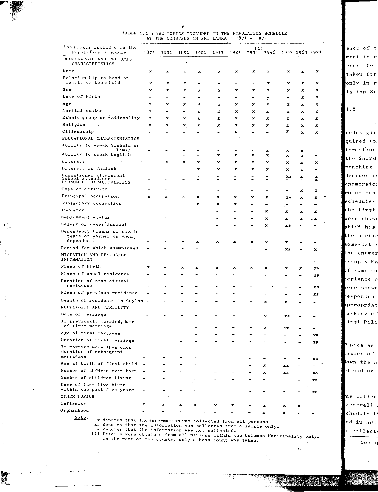

# 1.1: The topics included in the population schedule at the censuses in Sri Lanka: 1871-1971


- 📜 Original Table PDF - [data/tables/table-1/table-1-01/original.pdf (58.3 kB)](../../../../data/tables/table-1/table-1-01/original.pdf)
- 📜 Original Table Image - [data/tables/table-1/table-1-01/original.images/image-01.png (133.3 kB)](../../../../data/tables/table-1/table-1-01/original.images/image-01.png)
- 📄 Extracted JSON Data - [data/tables/table-1/table-1-01/data.json (17.5 kB)](../../../../data/tables/table-1/table-1-01/data.json)

## Extracted [JSON Data](../../../../data/tables/table-1/table-1-01/data.json)

```json
{
    "found": true,
    "table_no": "1.1",
    "table_name": "The topics included in the population schedule at the censuses in Sri Lanka: 1871-1971",
    "primary_keys": [
        "The Topics included in the Population Schedule"
    ],
    "field_keys": [
        "1871",
        "1881",
        "1891",
        "1901",
        "1911",
        "1921",
        "1931 (1)",
        "1946",
        "1953",
        "1963",
        "1971"
    ],
    "rows": [
        {
            "The Topics included in the Population Schedule": "DEMOGRAPHIC AND PERSONAL CHARACTERISTICS",
            "values": {
                "1871": null,
                "1881": null,
                "1891": null,
                "1901": null,
                "1911": null,
                "1921": null,
                "1931 (1)": null,
                "1946": null,
                "1953": null,
                "1963": null,
                "1971": null
            }
        },
        {
            "The Topics included in the Population Schedule": "Name",
            "values": {
                "1871": true,
                "1881": true,
                "1891": true,
                "1901": true,
                "1911": true,
                "1921": true,
                "1931 (1)": true,
                "1946": true,
                "1953": true,
                "1963": true,
                "1971": null
            }
        },
        {
            "The Topics included in the Population Schedule": "Relationship to head of family or household",
            "values": {
                "1871": true,
                "1881": true,
                "1891": true,
                "1901": false,
                "1911": false,
                "1921": false,
                "1931 (1)": true,
                "1946": null,
                "1953": true,
                "1963": true,
                "1971": true
            }
        },
        {
            "The Topics included in the Population Schedule": "Sex",
            "values": {
                "1871": true,
                "1881": true,
                "1891": true,
                "1901": true,
                "1911": true,
                "1921": true,
                "1931 (1)": true,
                "1946": null,
                "1953": true,
                "1963": true,
                "1971": true
            }
        },
        {
            "The Topics included in the Population Schedule": "Date of birth",
            "values": {
                "1871": false,
                "1881": false,
                "1891": false,
                "1901": false,
                "1911": false,
                "1921": false,
                "1931 (1)": false,
                "1946": null,
                "1953": true,
                "1963": true,
                "1971": null
            }
        },
        {
            "The Topics included in the Population Schedule": "Age",
            "values": {
                "1871": true,
                "1881": true,
                "1891": true,
                "1901": true,
                "1911": true,
                "1921": true,
                "1931 (1)": true,
                "1946": null,
                "1953": true,
                "1963": true,
                "1971": true
            }
        },
        {
            "The Topics included in the Population Schedule": "Marital status",
            "values": {
                "1871": true,
                "1881": false,
                "1891": false,
                "1901": true,
                "1911": true,
                "1921": true,
                "1931 (1)": true,
                "1946": null,
                "1953": true,
                "1963": true,
                "1971": true
            }
        },
        {
            "The Topics included in the Population Schedule": "Ethnic group or nationality",
            "values": {
                "1871": true,
                "1881": true,
                "1891": true,
                "1901": true,
                "1911": true,
                "1921": true,
                "1931 (1)": true,
                "1946": null,
                "1953": true,
                "1963": true,
                "1971": true
            }
        },
        {
            "The Topics included in the Population Schedule": "Religion",
            "values": {
                "1871": true,
                "1881": true,
                "1891": true,
                "1901": true,
                "1911": true,
                "1921": true,
                "1931 (1)": true,
                "1946": null,
                "1953": true,
                "1963": true,
                "1971": true
            }
        },
        {
            "The Topics included in the Population Schedule": "Citizenship",
            "values": {
                "1871": false,
                "1881": false,
                "1891": false,
                "1901": false,
                "1911": false,
                "1921": false,
                "1931 (1)": false,
                "1946": null,
                "1953": true,
                "1963": true,
                "1971": null
            }
        },
        {
            "The Topics included in the Population Schedule": "EDUCATIONAL CHARACTERISTICS",
            "values": {
                "1871": null,
                "1881": null,
                "1891": null,
                "1901": null,
                "1911": null,
                "1921": null,
                "1931 (1)": null,
                "1946": null,
                "1953": null,
                "1963": null,
                "1971": null
            }
        },
        {
            "The Topics included in the Population Schedule": "Ability to speak Sinhala or Tamil",
            "values": {
                "1871": false,
                "1881": false,
                "1891": false,
                "1901": false,
                "1911": false,
                "1921": true,
                "1931 (1)": true,
                "1946": true,
                "1953": true,
                "1963": null,
                "1971": null
            }
        },
        {
            "The Topics included in the Population Schedule": "Ability to speak English",
            "values": {
                "1871": false,
                "1881": false,
                "1891": false,
                "1901": false,
                "1911": true,
                "1921": true,
                "1931 (1)": true,
                "1946": true,
                "1953": true,
                "1963": false,
                "1971": null
            }
        },
        {
            "The Topics included in the Population Schedule": "Literacy",
            "values": {
                "1871": false,
                "1881": true,
                "1891": true,
                "1901": true,
                "1911": true,
                "1921": true,
                "1931 (1)": true,
                "1946": true,
                "1953": true,
                "1963": true,
                "1971": null
            }
        },
        {
            "The Topics included in the Population Schedule": "Literacy in English",
            "values": {
                "1871": false,
                "1881": false,
                "1891": false,
                "1901": true,
                "1911": true,
                "1921": true,
                "1931 (1)": true,
                "1946": true,
                "1953": true,
                "1963": true,
                "1971": null
            }
        },
        {
            "The Topics included in the Population Schedule": "Educational attainment",
            "values": {
                "1871": false,
                "1881": false,
                "1891": false,
                "1901": false,
                "1911": false,
                "1921": false,
                "1931 (1)": false,
                "1946": null,
                "1953": "xs",
                "1963": true,
                "1971": null
            }
        },
        {
            "The Topics included in the Population Schedule": "School attendance",
            "values": {
                "1871": false,
                "1881": false,
                "1891": false,
                "1901": false,
                "1911": false,
                "1921": false,
                "1931 (1)": false,
                "1946": null,
                "1953": false,
                "1963": true,
                "1971": null
            }
        },
        {
            "The Topics included in the Population Schedule": "ECONOMIC CHARACTERISTICS",
            "values": {
                "1871": null,
                "1881": null,
                "1891": null,
                "1901": null,
                "1911": null,
                "1921": null,
                "1931 (1)": null,
                "1946": null,
                "1953": null,
                "1963": null,
                "1971": null
            }
        },
        {
            "The Topics included in the Population Schedule": "Type of activity",
            "values": {
                "1871": false,
                "1881": false,
                "1891": false,
                "1901": false,
                "1911": false,
                "1921": false,
                "1931 (1)": false,
                "1946": null,
                "1953": true,
                "1963": true,
                "1971": null
            }
        },
        {
            "The Topics included in the Population Schedule": "Principal occupation",
            "values": {
                "1871": true,
                "1881": true,
                "1891": true,
                "1901": true,
                "1911": true,
                "1921": true,
                "1931 (1)": true,
                "1946": null,
                "1953": "xs",
                "1963": true,
                "1971": true
            }
        },
        {
            "The Topics included in the Population Schedule": "Subsidiary occupation",
            "values": {
                "1871": false,
                "1881": false,
                "1891": true,
                "1901": true,
                "1911": true,
                "1921": false,
                "1931 (1)": false,
                "1946": null,
                "1953": false,
                "1963": false,
                "1971": null
            }
        },
        {
            "The Topics included in the Population Schedule": "Industry",
            "values": {
                "1871": false,
                "1881": false,
                "1891": false,
                "1901": false,
                "1911": false,
                "1921": false,
                "1931 (1)": true,
                "1946": null,
                "1953": true,
                "1963": true,
                "1971": true
            }
        },
        {
            "The Topics included in the Population Schedule": "Employment status",
            "values": {
                "1871": false,
                "1881": false,
                "1891": false,
                "1901": false,
                "1911": false,
                "1921": false,
                "1931 (1)": true,
                "1946": null,
                "1953": true,
                "1963": true,
                "1971": "\u00b7x"
            }
        },
        {
            "The Topics included in the Population Schedule": "Salary or wages(Income)",
            "values": {
                "1871": false,
                "1881": false,
                "1891": false,
                "1901": false,
                "1911": false,
                "1921": false,
                "1931 (1)": true,
                "1946": null,
                "1953": "xs",
                "1963": false,
                "1971": null
            }
        },
        {
            "The Topics included in the Population Schedule": "Dependency (means of subsistence of earner on whom dependent)",
            "values": {
                "1871": false,
                "1881": false,
                "1891": true,
                "1901": true,
                "1911": true,
                "1921": true,
                "1931 (1)": true,
                "1946": null,
                "1953": true,
                "1963": false,
                "1971": null
            }
        },
        {
            "The Topics included in the Population Schedule": "Period for which unemployed",
            "values": {
                "1871": false,
                "1881": false,
                "1891": false,
                "1901": false,
                "1911": false,
                "1921": false,
                "1931 (1)": false,
                "1946": null,
                "1953": "xs",
                "1963": true,
                "1971": null
            }
        },
        {
            "The Topics included in the Population Schedule": "MIGRATION AND RESIDENCE INFORMATION",
            "values": {
                "1871": null,
                "1881": null,
                "1891": null,
                "1901": null,
                "1911": null,
                "1921": null,
                "1931 (1)": null,
                "1946": null,
                "1953": null,
                "1963": null,
                "1971": null
            }
        },
        {
            "The Topics included in the Population Schedule": "Place of birth",
            "values": {
                "1871": true,
                "1881": false,
                "1891": true,
                "1901": true,
                "1911": true,
                "1921": true,
                "1931 (1)": true,
                "1946": true,
                "1953": true,
                "1963": "xs",
                "1971": null
            }
        },
        {
            "The Topics included in the Population Schedule": "Place of usual residence",
            "values": {
                "1871": false,
                "1881": false,
                "1891": false,
                "1901": false,
                "1911": false,
                "1921": false,
                "1931 (1)": false,
                "1946": null,
                "1953": false,
                "1963": "xs",
                "1971": null
            }
        },
        {
            "The Topics included in the Population Schedule": "Duration of stay at usual residence",
            "values": {
                "1871": false,
                "1881": false,
                "1891": false,
                "1901": false,
                "1911": false,
                "1921": false,
                "1931 (1)": false,
                "1946": null,
                "1953": false,
                "1963": "xs",
                "1971": null
            }
        },
        {
            "The Topics included in the Population Schedule": "Place of previous residence",
            "values": {
                "1871": false,
                "1881": false,
                "1891": false,
                "1901": false,
                "1911": false,
                "1921": false,
                "1931 (1)": false,
                "1946": null,
                "1953": false,
                "1963": "xs",
                "1971": null
            }
        },
        {
            "The Topics included in the Population Schedule": "Length of residence in Ceylon",
            "values": {
                "1871": false,
                "1881": false,
                "1891": false,
                "1901": false,
                "1911": false,
                "1921": false,
                "1931 (1)": true,
                "1946": true,
                "1953": false,
                "1963": null,
                "1971": null
            }
        },
        {
            "The Topics included in the Population Schedule": "NUPTIALITY AND FERTILITY",
            "values": {
                "1871": null,
                "1881": null,
                "1891": null,
                "1901": null,
                "1911": null,
                "1921": null,
                "1931 (1)": null,
                "1946": null,
                "1953": null,
                "1963": null,
                "1971": null
            }
        },
        {
            "The Topics included in the Population Schedule": "Date of marriage",
            "values": {
                "1871": false,
                "1881": false,
                "1891": false,
                "1901": false,
                "1911": false,
                "1921": false,
                "1931 (1)": true,
                "1946": null,
                "1953": "xs",
                "1963": false,
                "1971": null
            }
        },
        {
            "The Topics included in the Population Schedule": "If previously married, date of first marriage",
            "values": {
                "1871": false,
                "1881": false,
                "1891": false,
                "1901": false,
                "1911": false,
                "1921": false,
                "1931 (1)": true,
                "1946": null,
                "1953": "xs",
                "1963": false,
                "1971": null
            }
        },
        {
            "The Topics included in the Population Schedule": "Age at first marriage",
            "values": {
                "1871": false,
                "1881": false,
                "1891": false,
                "1901": false,
                "1911": false,
                "1921": false,
                "1931 (1)": false,
                "1946": null,
                "1953": false,
                "1963": "xs",
                "1971": null
            }
        },
        {
            "The Topics included in the Population Schedule": "Duration of first marriage",
            "values": {
                "1871": false,
                "1881": false,
                "1891": false,
                "1901": false,
                "1911": false,
                "1921": false,
                "1931 (1)": false,
                "1946": null,
                "1953": false,
                "1963": "xs",
                "1971": null
            }
        },
        {
            "The Topics included in the Population Schedule": "If married more than once duration of subsequent marriages",
            "values": {
                "1871": false,
                "1881": false,
                "1891": false,
                "1901": false,
                "1911": false,
                "1921": false,
                "1931 (1)": false,
                "1946": null,
                "1953": false,
                "1963": "xs",
                "1971": null
            }
        },
        {
            "The Topics included in the Population Schedule": "Age at birth of first child",
            "values": {
                "1871": false,
                "1881": false,
                "1891": false,
                "1901": false,
                "1911": false,
                "1921": true,
                "1931 (1)": null,
                "1946": null,
                "1953": "xs",
                "1963": false,
                "1971": null
            }
        },
        {
            "The Topics included in the Population Schedule": "Number of children ever born",
            "values": {
                "1871": false,
                "1881": false,
                "1891": false,
                "1901": false,
                "1911": false,
                "1921": false,
                "1931 (1)": true,
                "1946": null,
                "1953": "xs",
                "1963": "xs",
                "1971": null
            }
        },
        {
            "The Topics included in the Population Schedule": "Number of children living",
            "values": {
                "1871": false,
                "1881": false,
                "1891": false,
                "1901": false,
                "1911": false,
                "1921": false,
                "1931 (1)": false,
                "1946": null,
                "1953": false,
                "1963": "xs",
                "1971": null
            }
        },
        {
            "The Topics included in the Population Schedule": "Date of last live birth within the past five years",
            "values": {
                "1871": false,
                "1881": false,
                "1891": false,
                "1901": false,
                "1911": false,
                "1921": false,
                "1931 (1)": false,
                "1946": null,
                "1953": false,
                "1963": "xs",
                "1971": null
            }
        },
        {
            "The Topics included in the Population Schedule": "OTHER TOPICS",
            "values": {
                "1871": null,
                "1881": null,
                "1891": null,
                "1901": null,
                "1911": null,
                "1921": null,
                "1931 (1)": null,
                "1946": null,
                "1953": null,
                "1963": null,
                "1971": null
            }
        },
        {
            "The Topics included in the Population Schedule": "Infirmity",
            "values": {
                "1871": true,
                "1881": true,
                "1891": true,
                "1901": true,
                "1911": true,
                "1921": false,
                "1931 (1)": true,
                "1946": true,
                "1953": true,
                "1963": false,
                "1971": null
            }
        },
        {
            "The Topics included in the Population Schedule": "Orphanhood",
            "values": {
                "1871": false,
                "1881": false,
                "1891": false,
                "1901": false,
                "1911": false,
                "1921": false,
                "1931 (1)": true,
                "1946": null,
                "1953": false,
                "1963": null,
                "1971": null
            }
        }
    ],
    "notes": [
        "Boolean columns: true indicates the information was collected from all persons (x), false indicates the information was not collected (-).",
        "xs denotes that the information was collected from a sample only.",
        "(1) Details were obtained from all persons within the Colombo Municipality only. In the rest of the country only a head count was taken."
    ]
}
```

## Original Table [Image](../../../../data/tables/table-1/table-1-01/original.images/image-01.png)




[](https://opensource.org/licenses/MIT)
