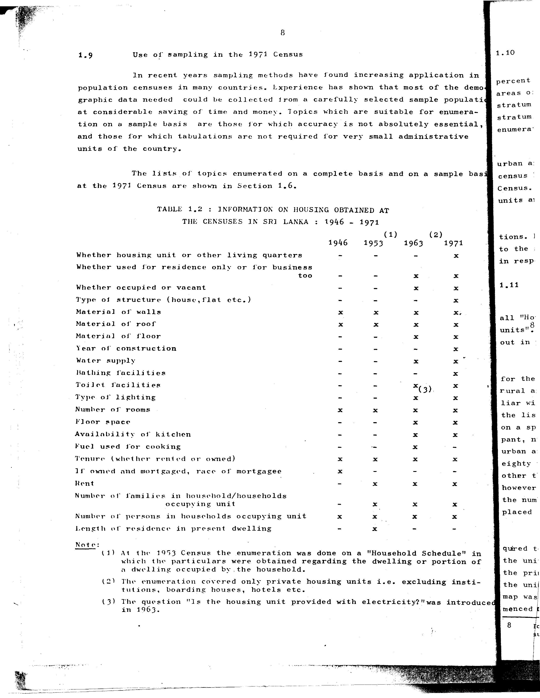

# 1.2: Information on housing obtained at the censuses in Sri Lanka: 1946-1971


- 📜 Original Table PDF - [data/tables/table-1/table-1-02/original.pdf (54.4 kB)](../../../../data/tables/table-1/table-1-02/original.pdf)
- 📜 Original Table Image - [data/tables/table-1/table-1-02/original.images/image-01.png (137.0 kB)](../../../../data/tables/table-1/table-1-02/original.images/image-01.png)
- 📄 Extracted JSON Data - [data/tables/table-1/table-1-02/data.json (4.6 kB)](../../../../data/tables/table-1/table-1-02/data.json)

## Extracted [JSON Data](../../../../data/tables/table-1/table-1-02/data.json)

```json
{
    "found": true,
    "table_no": "1.2",
    "table_name": "Information on housing obtained at the censuses in Sri Lanka: 1946-1971",
    "primary_keys": [
        "Topic"
    ],
    "field_keys": [
        "1946",
        "1953",
        "1963",
        "1971"
    ],
    "rows": [
        {
            "Topic": "Whether housing unit or other living quarters",
            "values": {
                "1946": false,
                "1953": false,
                "1963": false,
                "1971": true
            }
        },
        {
            "Topic": "Whether used for residence only or for business too",
            "values": {
                "1946": false,
                "1953": false,
                "1963": true,
                "1971": true
            }
        },
        {
            "Topic": "Whether occupied or vacant",
            "values": {
                "1946": false,
                "1953": false,
                "1963": true,
                "1971": true
            }
        },
        {
            "Topic": "Type of structure (house,flat etc.)",
            "values": {
                "1946": false,
                "1953": false,
                "1963": false,
                "1971": true
            }
        },
        {
            "Topic": "Material of walls",
            "values": {
                "1946": true,
                "1953": true,
                "1963": true,
                "1971": true
            }
        },
        {
            "Topic": "Material of roof",
            "values": {
                "1946": true,
                "1953": true,
                "1963": true,
                "1971": true
            }
        },
        {
            "Topic": "Material of floor",
            "values": {
                "1946": false,
                "1953": false,
                "1963": true,
                "1971": true
            }
        },
        {
            "Topic": "Year of construction",
            "values": {
                "1946": false,
                "1953": false,
                "1963": false,
                "1971": true
            }
        },
        {
            "Topic": "Water supply",
            "values": {
                "1946": false,
                "1953": false,
                "1963": true,
                "1971": true
            }
        },
        {
            "Topic": "Bathing facilities",
            "values": {
                "1946": false,
                "1953": false,
                "1963": false,
                "1971": true
            }
        },
        {
            "Topic": "Toilet facilities",
            "values": {
                "1946": false,
                "1953": false,
                "1963": true,
                "1971": true
            }
        },
        {
            "Topic": "Type of lighting",
            "values": {
                "1946": false,
                "1953": false,
                "1963": true,
                "1971": true
            }
        },
        {
            "Topic": "Number of rooms",
            "values": {
                "1946": true,
                "1953": true,
                "1963": true,
                "1971": true
            }
        },
        {
            "Topic": "Floor space",
            "values": {
                "1946": false,
                "1953": false,
                "1963": true,
                "1971": true
            }
        },
        {
            "Topic": "Availability of kitchen",
            "values": {
                "1946": false,
                "1953": false,
                "1963": true,
                "1971": true
            }
        },
        {
            "Topic": "Fuel used for cooking",
            "values": {
                "1946": false,
                "1953": false,
                "1963": false,
                "1971": true
            }
        },
        {
            "Topic": "Tenure (whether rented or owned)",
            "values": {
                "1946": true,
                "1953": true,
                "1963": true,
                "1971": true
            }
        },
        {
            "Topic": "If owned and mortgaged, race of mortgagee",
            "values": {
                "1946": true,
                "1953": false,
                "1963": false,
                "1971": false
            }
        },
        {
            "Topic": "Rent",
            "values": {
                "1946": false,
                "1953": true,
                "1963": true,
                "1971": true
            }
        },
        {
            "Topic": "Number of families in household/households occupying unit",
            "values": {
                "1946": false,
                "1953": true,
                "1963": true,
                "1971": true
            }
        },
        {
            "Topic": "Number of persons in households occupying unit",
            "values": {
                "1946": true,
                "1953": true,
                "1963": true,
                "1971": true
            }
        },
        {
            "Topic": "Length of residence in present dwelling",
            "values": {
                "1946": false,
                "1953": true,
                "1963": false,
                "1971": false
            }
        }
    ],
    "notes": [
        "(1) At the 1953 Census the enumeration was done on a \"Household Schedule\" in which the particulars were obtained regarding the dwelling or portion of a dwelling occupied by the household.",
        "(2) The enumeration covered only private housing units i.e. excluding institutions, boarding houses, hotels etc.",
        "(3) The question \"Is the housing unit provided with electricity?\" was introduced in 1963.",
        "Boolean columns: true = Yes (marked with x), false = No (marked with -)."
    ]
}
```

## Original Table [Image](../../../../data/tables/table-1/table-1-02/original.images/image-01.png)




[](https://opensource.org/licenses/MIT)
