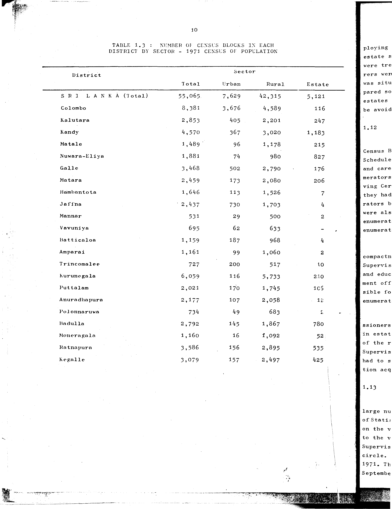

# 1.3: Number of census blocks in each district by sector - 1971 Census of Population


- 📜 Original Table PDF - [data/tables/table-1/table-1-03/original.pdf (39.4 kB)](../../../../data/tables/table-1/table-1-03/original.pdf)
- 📜 Original Table Image - [data/tables/table-1/table-1-03/original.images/image-01.png (102.2 kB)](../../../../data/tables/table-1/table-1-03/original.images/image-01.png)
- 📄 Extracted JSON Data - [data/tables/table-1/table-1-03/data.json (3.9 kB)](../../../../data/tables/table-1/table-1-03/data.json)
- 📄 Extracted TSV Data - [data/tables/table-1/table-1-03/data.tsv (671 B)](../../../../data/tables/table-1/table-1-03/data.tsv)

## Extracted [JSON Data](../../../../data/tables/table-1/table-1-03/data.json)

```json
{
    "found": true,
    "table_no": "1.3",
    "table_name": "Number of census blocks in each district by sector - 1971 Census of Population",
    "primary_keys": [
        "District"
    ],
    "field_keys": [
        "Total",
        "Urban",
        "Rural",
        "Estate"
    ],
    "rows": [
        {
            "District": "S R I  L A N K A (Total)",
            "values": {
                "Total": 55065,
                "Urban": 7629,
                "Rural": 42315,
                "Estate": 5121
            }
        },
        {
            "District": "Colombo",
            "values": {
                "Total": 8381,
                "Urban": 3676,
                "Rural": 4589,
                "Estate": 116
            }
        },
        {
            "District": "Kalutara",
            "values": {
                "Total": 2853,
                "Urban": 405,
                "Rural": 2201,
                "Estate": 247
            }
        },
        {
            "District": "Kandy",
            "values": {
                "Total": 4570,
                "Urban": 367,
                "Rural": 3020,
                "Estate": 1183
            }
        },
        {
            "District": "Matale",
            "values": {
                "Total": 1489,
                "Urban": 96,
                "Rural": 1178,
                "Estate": 215
            }
        },
        {
            "District": "Nuwara-Eliya",
            "values": {
                "Total": 1881,
                "Urban": 74,
                "Rural": 980,
                "Estate": 827
            }
        },
        {
            "District": "Galle",
            "values": {
                "Total": 3468,
                "Urban": 502,
                "Rural": 2790,
                "Estate": 176
            }
        },
        {
            "District": "Matara",
            "values": {
                "Total": 2459,
                "Urban": 173,
                "Rural": 2080,
                "Estate": 206
            }
        },
        {
            "District": "Hambantota",
            "values": {
                "Total": 1646,
                "Urban": 113,
                "Rural": 1526,
                "Estate": 7
            }
        },
        {
            "District": "Jaffna",
            "values": {
                "Total": 2437,
                "Urban": 730,
                "Rural": 1703,
                "Estate": 4
            }
        },
        {
            "District": "Mannar",
            "values": {
                "Total": 531,
                "Urban": 29,
                "Rural": 500,
                "Estate": 2
            }
        },
        {
            "District": "Vavuniya",
            "values": {
                "Total": 695,
                "Urban": 62,
                "Rural": 633,
                "Estate": null
            }
        },
        {
            "District": "Batticaloa",
            "values": {
                "Total": 1159,
                "Urban": 187,
                "Rural": 968,
                "Estate": 4
            }
        },
        {
            "District": "Amparai",
            "values": {
                "Total": 1161,
                "Urban": 99,
                "Rural": 1060,
                "Estate": 2
            }
        },
        {
            "District": "Trincomalee",
            "values": {
                "Total": 727,
                "Urban": 200,
                "Rural": 517,
                "Estate": 10
            }
        },
        {
            "District": "Kurunegala",
            "values": {
                "Total": 6059,
                "Urban": 116,
                "Rural": 5733,
                "Estate": 210
            }
        },
        {
            "District": "Puttalam",
            "values": {
                "Total": 2021,
                "Urban": 170,
                "Rural": 1745,
                "Estate": 106
            }
        },
        {
            "District": "Anuradhapura",
            "values": {
                "Total": 2177,
                "Urban": 107,
                "Rural": 2058,
                "Estate": 12
            }
        },
        {
            "District": "Polonnaruwa",
            "values": {
                "Total": 734,
                "Urban": 49,
                "Rural": 683,
                "Estate": 2
            }
        },
        {
            "District": "Badulla",
            "values": {
                "Total": 2792,
                "Urban": 145,
                "Rural": 1867,
                "Estate": 780
            }
        },
        {
            "District": "Moneragala",
            "values": {
                "Total": 1160,
                "Urban": 16,
                "Rural": 1092,
                "Estate": 52
            }
        },
        {
            "District": "Ratnapura",
            "values": {
                "Total": 3586,
                "Urban": 156,
                "Rural": 2895,
                "Estate": 535
            }
        },
        {
            "District": "Kegalle",
            "values": {
                "Total": 3079,
                "Urban": 157,
                "Rural": 2497,
                "Estate": 425
            }
        }
    ],
    "notes": []
}
```

## Original Table [Image](../../../../data/tables/table-1/table-1-03/original.images/image-01.png)




[](https://opensource.org/licenses/MIT)
