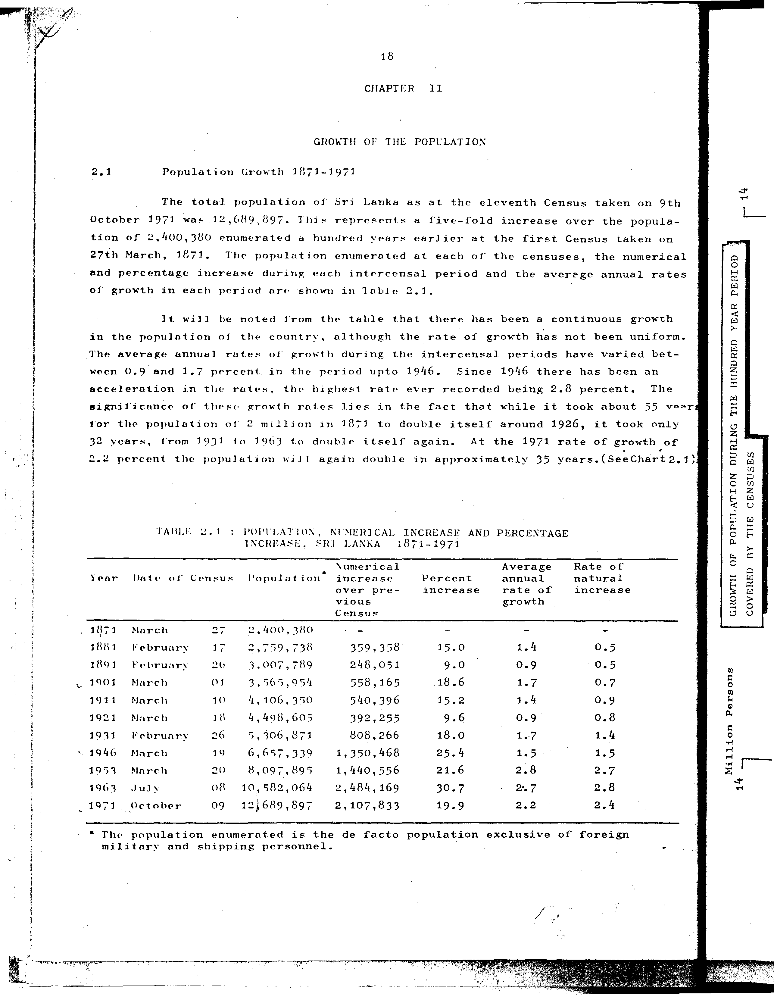

# 2.1: Population, numerical increase and percentage increase, Sri Lanka 1871-1971


- 📜 Original Table PDF - [data/tables/table-2/table-2-01/original.pdf (64.2 kB)](../../../../data/tables/table-2/table-2-01/original.pdf)
- 📜 Original Table Image - [data/tables/table-2/table-2-01/original.images/image-01.png (159.9 kB)](../../../../data/tables/table-2/table-2-01/original.images/image-01.png)
- 📄 Extracted JSON Data - [data/tables/table-2/table-2-01/data.json (3.9 kB)](../../../../data/tables/table-2/table-2-01/data.json)

## Extracted [JSON Data](../../../../data/tables/table-2/table-2-01/data.json)

```json
{
    "found": true,
    "table_no": "2.1",
    "table_name": "Population, numerical increase and percentage increase, Sri Lanka 1871-1971",
    "primary_keys": [
        "Year"
    ],
    "field_keys": [
        "Date of Census",
        "Population",
        "Numerical increase over previous Census",
        "Percent increase",
        "Average annual rate of growth",
        "Rate of natural increase"
    ],
    "rows": [
        {
            "Year": 1871,
            "values": {
                "Date of Census": "March 27",
                "Population": 2400380,
                "Numerical increase over previous Census": null,
                "Percent increase": null,
                "Average annual rate of growth": null,
                "Rate of natural increase": null
            }
        },
        {
            "Year": 1881,
            "values": {
                "Date of Census": "February 17",
                "Population": 2759738,
                "Numerical increase over previous Census": 359358,
                "Percent increase": 15.0,
                "Average annual rate of growth": 1.4,
                "Rate of natural increase": 0.5
            }
        },
        {
            "Year": 1891,
            "values": {
                "Date of Census": "February 26",
                "Population": 3007789,
                "Numerical increase over previous Census": 248051,
                "Percent increase": 9.0,
                "Average annual rate of growth": 0.9,
                "Rate of natural increase": 0.5
            }
        },
        {
            "Year": 1901,
            "values": {
                "Date of Census": "March 01",
                "Population": 3565954,
                "Numerical increase over previous Census": 558165,
                "Percent increase": 18.6,
                "Average annual rate of growth": 1.7,
                "Rate of natural increase": 0.7
            }
        },
        {
            "Year": 1911,
            "values": {
                "Date of Census": "March 10",
                "Population": 4106350,
                "Numerical increase over previous Census": 540396,
                "Percent increase": 15.2,
                "Average annual rate of growth": 1.4,
                "Rate of natural increase": 0.9
            }
        },
        {
            "Year": 1921,
            "values": {
                "Date of Census": "March 18",
                "Population": 4498605,
                "Numerical increase over previous Census": 392255,
                "Percent increase": 9.6,
                "Average annual rate of growth": 0.9,
                "Rate of natural increase": 0.8
            }
        },
        {
            "Year": 1931,
            "values": {
                "Date of Census": "February 26",
                "Population": 5306871,
                "Numerical increase over previous Census": 808266,
                "Percent increase": 18.0,
                "Average annual rate of growth": 1.7,
                "Rate of natural increase": 1.4
            }
        },
        {
            "Year": 1946,
            "values": {
                "Date of Census": "March 19",
                "Population": 6657339,
                "Numerical increase over previous Census": 1350468,
                "Percent increase": 25.4,
                "Average annual rate of growth": 1.5,
                "Rate of natural increase": 1.5
            }
        },
        {
            "Year": 1953,
            "values": {
                "Date of Census": "March 20",
                "Population": 8097895,
                "Numerical increase over previous Census": 1440556,
                "Percent increase": 21.6,
                "Average annual rate of growth": 2.8,
                "Rate of natural increase": 2.7
            }
        },
        {
            "Year": 1963,
            "values": {
                "Date of Census": "July 08",
                "Population": 10582064,
                "Numerical increase over previous Census": 2484169,
                "Percent increase": 30.7,
                "Average annual rate of growth": 2.7,
                "Rate of natural increase": 2.8
            }
        },
        {
            "Year": 1971,
            "values": {
                "Date of Census": "October 09",
                "Population": 12689897,
                "Numerical increase over previous Census": 2107833,
                "Percent increase": 19.9,
                "Average annual rate of growth": 2.2,
                "Rate of natural increase": 2.4
            }
        }
    ],
    "notes": [
        "The population enumerated is the de facto population exclusive of foreign military and shipping personnel."
    ]
}
```

## Original Table [Image](../../../../data/tables/table-2/table-2-01/original.images/image-01.png)




[](https://opensource.org/licenses/MIT)
