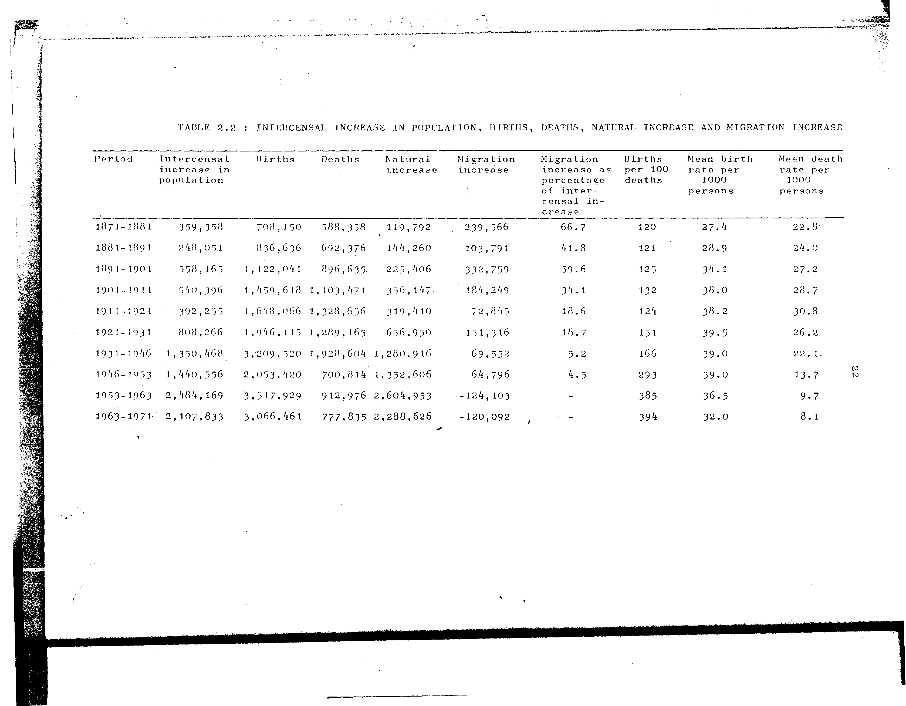

# 2.2: Intercensal increase in population, births, deaths, natural increase and migration increase


- 📜 Original Table PDF - [data/tables/table-2/table-2-02/original.pdf (48.9 kB)](../../../../data/tables/table-2/table-2-02/original.pdf)
- 📜 Original Table Image - [data/tables/table-2/table-2-02/original.image-01.png (116.4 kB)](../../../../data/tables/table-2/table-2-02/original.image-01.png)
- 📄 Extracted JSON Data - [data/tables/table-2/table-2-02/data.json (5.1 kB)](../../../../data/tables/table-2/table-2-02/data.json)

## Extracted [JSON Data](../../../../data/tables/table-2/table-2-02/data.json)

```json
{
    "found": true,
    "table_no": "2.2",
    "table_name": "Intercensal increase in population, births, deaths, natural increase and migration increase",
    "primary_keys": [
        "Period"
    ],
    "field_keys": [
        "Intercensal increase in population",
        "Births",
        "Deaths",
        "Natural increase",
        "Migration increase",
        "Migration increase as percentage of intercensal increase",
        "Births per 100 deaths",
        "Mean birth rate per 1000 persons",
        "Mean death rate per 1000 persons"
    ],
    "rows": [
        {
            "Period": "1871-1881",
            "values": {
                "Intercensal increase in population": 359358,
                "Births": 708150,
                "Deaths": 588358,
                "Natural increase": 119792,
                "Migration increase": 239566,
                "Migration increase as percentage of intercensal increase": 66.7,
                "Births per 100 deaths": 120,
                "Mean birth rate per 1000 persons": 27.4,
                "Mean death rate per 1000 persons": 22.8
            }
        },
        {
            "Period": "1881-1891",
            "values": {
                "Intercensal increase in population": 248051,
                "Births": 836636,
                "Deaths": 692376,
                "Natural increase": 144260,
                "Migration increase": 103791,
                "Migration increase as percentage of intercensal increase": 41.8,
                "Births per 100 deaths": 121,
                "Mean birth rate per 1000 persons": 28.9,
                "Mean death rate per 1000 persons": 24.0
            }
        },
        {
            "Period": "1891-1901",
            "values": {
                "Intercensal increase in population": 558165,
                "Births": 1122041,
                "Deaths": 896635,
                "Natural increase": 225406,
                "Migration increase": 332759,
                "Migration increase as percentage of intercensal increase": 59.6,
                "Births per 100 deaths": 125,
                "Mean birth rate per 1000 persons": 34.1,
                "Mean death rate per 1000 persons": 27.2
            }
        },
        {
            "Period": "1901-1911",
            "values": {
                "Intercensal increase in population": 540396,
                "Births": 1459618,
                "Deaths": 1103471,
                "Natural increase": 356147,
                "Migration increase": 184249,
                "Migration increase as percentage of intercensal increase": 34.1,
                "Births per 100 deaths": 132,
                "Mean birth rate per 1000 persons": 38.0,
                "Mean death rate per 1000 persons": 28.7
            }
        },
        {
            "Period": "1911-1921",
            "values": {
                "Intercensal increase in population": 392255,
                "Births": 1648066,
                "Deaths": 1328656,
                "Natural increase": 319410,
                "Migration increase": 72845,
                "Migration increase as percentage of intercensal increase": 18.6,
                "Births per 100 deaths": 124,
                "Mean birth rate per 1000 persons": 38.2,
                "Mean death rate per 1000 persons": 30.8
            }
        },
        {
            "Period": "1921-1931",
            "values": {
                "Intercensal increase in population": 808266,
                "Births": 1946115,
                "Deaths": 1289165,
                "Natural increase": 656950,
                "Migration increase": 151316,
                "Migration increase as percentage of intercensal increase": 18.7,
                "Births per 100 deaths": 151,
                "Mean birth rate per 1000 persons": 39.5,
                "Mean death rate per 1000 persons": 26.2
            }
        },
        {
            "Period": "1931-1946",
            "values": {
                "Intercensal increase in population": 1350468,
                "Births": 3209520,
                "Deaths": 1928604,
                "Natural increase": 1280916,
                "Migration increase": 69552,
                "Migration increase as percentage of intercensal increase": 5.2,
                "Births per 100 deaths": 166,
                "Mean birth rate per 1000 persons": 39.0,
                "Mean death rate per 1000 persons": 22.1
            }
        },
        {
            "Period": "1946-1953",
            "values": {
                "Intercensal increase in population": 1440556,
                "Births": 2053420,
                "Deaths": 700814,
                "Natural increase": 1352606,
                "Migration increase": 64796,
                "Migration increase as percentage of intercensal increase": 4.5,
                "Births per 100 deaths": 293,
                "Mean birth rate per 1000 persons": 39.0,
                "Mean death rate per 1000 persons": 13.7
            }
        },
        {
            "Period": "1953-1963",
            "values": {
                "Intercensal increase in population": 2484169,
                "Births": 3517929,
                "Deaths": 912976,
                "Natural increase": 2604953,
                "Migration increase": -124103,
                "Migration increase as percentage of intercensal increase": null,
                "Births per 100 deaths": 385,
                "Mean birth rate per 1000 persons": 36.5,
                "Mean death rate per 1000 persons": 9.7
            }
        },
        {
            "Period": "1963-1971",
            "values": {
                "Intercensal increase in population": 2107833,
                "Births": 3066461,
                "Deaths": 777835,
                "Natural increase": 2288626,
                "Migration increase": -120092,
                "Migration increase as percentage of intercensal increase": null,
                "Births per 100 deaths": 394,
                "Mean birth rate per 1000 persons": 32.0,
                "Mean death rate per 1000 persons": 8.1
            }
        }
    ],
    "notes": []
}
```

## Original Table [Image](../../../../data/tables/table-2/table-2-02/original.image-01.png)




[](https://opensource.org/licenses/MIT)
