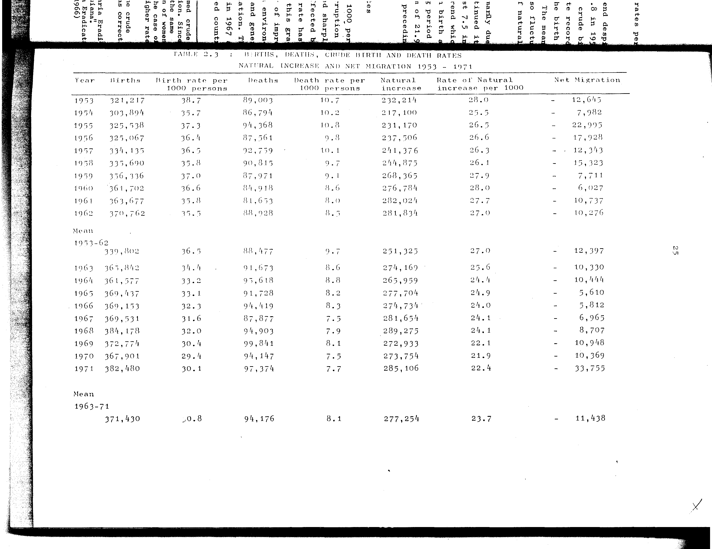

# 2.3: Births, deaths, crude birth and death rates, natural increase and net migration 1953-1971


- 📜 Original Table PDF - [data/tables/table-2/table-2-03/original.pdf (69.2 kB)](../../../../data/tables/table-2/table-2-03/original.pdf)
- 📜 Original Table Image - [data/tables/table-2/table-2-03/original.images/image-01.png (151.7 kB)](../../../../data/tables/table-2/table-2-03/original.images/image-01.png)
- 📄 Extracted JSON Data - [data/tables/table-2/table-2-03/data.json (7.1 kB)](../../../../data/tables/table-2/table-2-03/data.json)
- 📄 Extracted TSV Data - [data/tables/table-2/table-2-03/data.tsv (1.1 kB)](../../../../data/tables/table-2/table-2-03/data.tsv)

## Extracted [JSON Data](../../../../data/tables/table-2/table-2-03/data.json)

```json
{
    "found": true,
    "table_no": "2.3",
    "table_name": "Births, deaths, crude birth and death rates, natural increase and net migration 1953-1971",
    "primary_keys": [
        "Year"
    ],
    "field_keys": [
        "Births",
        "Birth rate per 1000 persons",
        "Deaths",
        "Death rate per 1000 persons",
        "Natural increase",
        "Rate of Natural increase per 1000",
        "Net Migration"
    ],
    "rows": [
        {
            "Year": "1953",
            "values": {
                "Births": 321217,
                "Birth rate per 1000 persons": 38.7,
                "Deaths": 89003,
                "Death rate per 1000 persons": 10.7,
                "Natural increase": 232214,
                "Rate of Natural increase per 1000": 28.0,
                "Net Migration": 12645
            }
        },
        {
            "Year": "1954",
            "values": {
                "Births": 303894,
                "Birth rate per 1000 persons": 35.7,
                "Deaths": 86794,
                "Death rate per 1000 persons": 10.2,
                "Natural increase": 217100,
                "Rate of Natural increase per 1000": 25.5,
                "Net Migration": 7982
            }
        },
        {
            "Year": "1955",
            "values": {
                "Births": 325538,
                "Birth rate per 1000 persons": 37.3,
                "Deaths": 94368,
                "Death rate per 1000 persons": 10.8,
                "Natural increase": 231170,
                "Rate of Natural increase per 1000": 26.5,
                "Net Migration": 22995
            }
        },
        {
            "Year": "1956",
            "values": {
                "Births": 325067,
                "Birth rate per 1000 persons": 36.4,
                "Deaths": 87561,
                "Death rate per 1000 persons": 9.8,
                "Natural increase": 237506,
                "Rate of Natural increase per 1000": 26.6,
                "Net Migration": 17928
            }
        },
        {
            "Year": "1957",
            "values": {
                "Births": 334135,
                "Birth rate per 1000 persons": 36.5,
                "Deaths": 92759,
                "Death rate per 1000 persons": 10.1,
                "Natural increase": 241376,
                "Rate of Natural increase per 1000": 26.3,
                "Net Migration": 12343
            }
        },
        {
            "Year": "1958",
            "values": {
                "Births": 335690,
                "Birth rate per 1000 persons": 35.8,
                "Deaths": 90815,
                "Death rate per 1000 persons": 9.7,
                "Natural increase": 244875,
                "Rate of Natural increase per 1000": 26.1,
                "Net Migration": 15323
            }
        },
        {
            "Year": "1959",
            "values": {
                "Births": 356336,
                "Birth rate per 1000 persons": 37.0,
                "Deaths": 87971,
                "Death rate per 1000 persons": 9.1,
                "Natural increase": 268365,
                "Rate of Natural increase per 1000": 27.9,
                "Net Migration": 7711
            }
        },
        {
            "Year": "1960",
            "values": {
                "Births": 361702,
                "Birth rate per 1000 persons": 36.6,
                "Deaths": 84918,
                "Death rate per 1000 persons": 8.6,
                "Natural increase": 276784,
                "Rate of Natural increase per 1000": 28.0,
                "Net Migration": 6027
            }
        },
        {
            "Year": "1961",
            "values": {
                "Births": 363677,
                "Birth rate per 1000 persons": 35.8,
                "Deaths": 81653,
                "Death rate per 1000 persons": 8.0,
                "Natural increase": 282024,
                "Rate of Natural increase per 1000": 27.7,
                "Net Migration": 10737
            }
        },
        {
            "Year": "1962",
            "values": {
                "Births": 370762,
                "Birth rate per 1000 persons": 35.5,
                "Deaths": 88928,
                "Death rate per 1000 persons": 8.5,
                "Natural increase": 281834,
                "Rate of Natural increase per 1000": 27.0,
                "Net Migration": 10276
            }
        },
        {
            "Year": "Mean 1953-62",
            "values": {
                "Births": 339802,
                "Birth rate per 1000 persons": 36.5,
                "Deaths": 88477,
                "Death rate per 1000 persons": 9.7,
                "Natural increase": 251325,
                "Rate of Natural increase per 1000": 27.0,
                "Net Migration": 12397
            }
        },
        {
            "Year": "1963",
            "values": {
                "Births": 365842,
                "Birth rate per 1000 persons": 34.4,
                "Deaths": 91673,
                "Death rate per 1000 persons": 8.6,
                "Natural increase": 274169,
                "Rate of Natural increase per 1000": 25.6,
                "Net Migration": 10330
            }
        },
        {
            "Year": "1964",
            "values": {
                "Births": 361577,
                "Birth rate per 1000 persons": 33.2,
                "Deaths": 95618,
                "Death rate per 1000 persons": 8.8,
                "Natural increase": 265959,
                "Rate of Natural increase per 1000": 24.4,
                "Net Migration": 10444
            }
        },
        {
            "Year": "1965",
            "values": {
                "Births": 369437,
                "Birth rate per 1000 persons": 33.1,
                "Deaths": 91728,
                "Death rate per 1000 persons": 8.2,
                "Natural increase": 277704,
                "Rate of Natural increase per 1000": 24.9,
                "Net Migration": 5610
            }
        },
        {
            "Year": "1966",
            "values": {
                "Births": 369153,
                "Birth rate per 1000 persons": 32.3,
                "Deaths": 94419,
                "Death rate per 1000 persons": 8.3,
                "Natural increase": 274734,
                "Rate of Natural increase per 1000": 24.0,
                "Net Migration": 5812
            }
        },
        {
            "Year": "1967",
            "values": {
                "Births": 369531,
                "Birth rate per 1000 persons": 31.6,
                "Deaths": 87877,
                "Death rate per 1000 persons": 7.5,
                "Natural increase": 281654,
                "Rate of Natural increase per 1000": 24.1,
                "Net Migration": 6965
            }
        },
        {
            "Year": "1968",
            "values": {
                "Births": 384178,
                "Birth rate per 1000 persons": 32.0,
                "Deaths": 94903,
                "Death rate per 1000 persons": 7.9,
                "Natural increase": 289275,
                "Rate of Natural increase per 1000": 24.1,
                "Net Migration": 8707
            }
        },
        {
            "Year": "1969",
            "values": {
                "Births": 372774,
                "Birth rate per 1000 persons": 30.4,
                "Deaths": 99841,
                "Death rate per 1000 persons": 8.1,
                "Natural increase": 272933,
                "Rate of Natural increase per 1000": 22.1,
                "Net Migration": 10948
            }
        },
        {
            "Year": "1970",
            "values": {
                "Births": 367901,
                "Birth rate per 1000 persons": 29.4,
                "Deaths": 94147,
                "Death rate per 1000 persons": 7.5,
                "Natural increase": 273754,
                "Rate of Natural increase per 1000": 21.9,
                "Net Migration": 10369
            }
        },
        {
            "Year": "1971",
            "values": {
                "Births": 382480,
                "Birth rate per 1000 persons": 30.1,
                "Deaths": 97374,
                "Death rate per 1000 persons": 7.7,
                "Natural increase": 285106,
                "Rate of Natural increase per 1000": 22.4,
                "Net Migration": 33755
            }
        },
        {
            "Year": "Mean 1963-71",
            "values": {
                "Births": 371430,
                "Birth rate per 1000 persons": 30.8,
                "Deaths": 94176,
                "Death rate per 1000 persons": 8.1,
                "Natural increase": 277254,
                "Rate of Natural increase per 1000": 23.7,
                "Net Migration": 11438
            }
        }
    ],
    "notes": []
}
```

## Original Table [Image](../../../../data/tables/table-2/table-2-03/original.images/image-01.png)




[](https://opensource.org/licenses/MIT)
