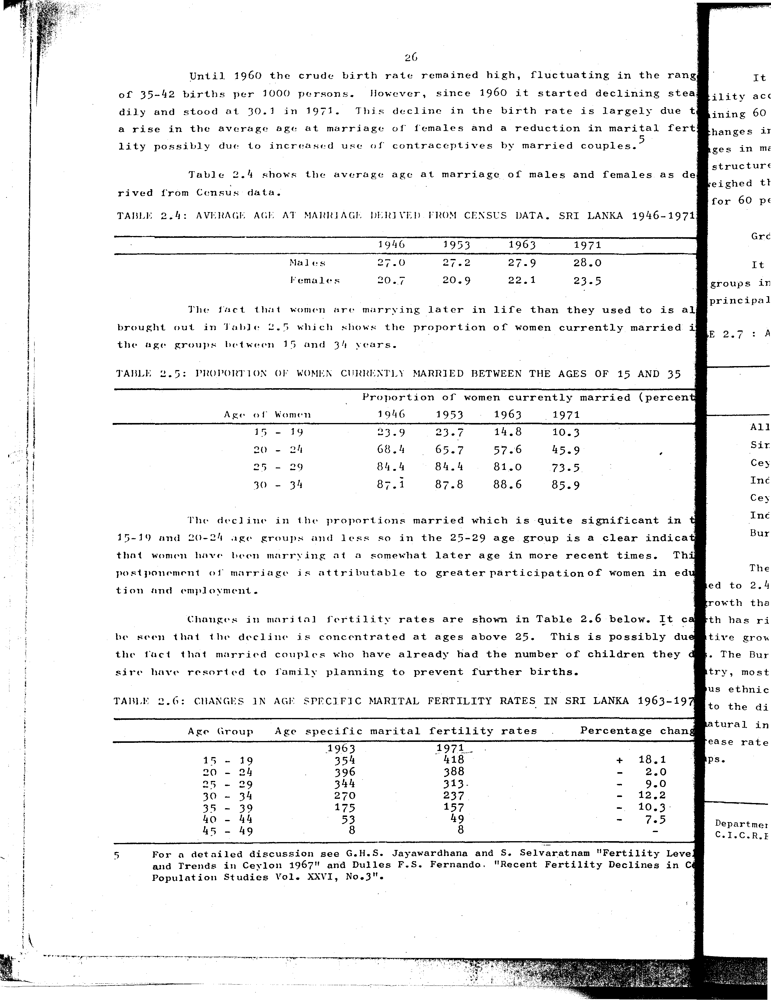

# 2.6: Changes in age specific marital fertility rates in Sri Lanka 1963-1971


- 📜 Original Table PDF - [data/tables/table-2/table-2-06/original.pdf (71.1 kB)](../../../../data/tables/table-2/table-2-06/original.pdf)
- 📜 Original Table Image - [data/tables/table-2/table-2-06/original.images/image-01.png (167.0 kB)](../../../../data/tables/table-2/table-2-06/original.images/image-01.png)
- 📄 Extracted JSON Data - [data/tables/table-2/table-2-06/data.json (2.1 kB)](../../../../data/tables/table-2/table-2-06/data.json)
- 📄 Extracted TSV Data - [data/tables/table-2/table-2-06/data.tsv (263 B)](../../../../data/tables/table-2/table-2-06/data.tsv)

## Original Table [Image](../../../../data/tables/table-2/table-2-06/original.images/image-01.png)



## Extracted [JSON Data](../../../../data/tables/table-2/table-2-06/data.json)

```json
{
    "found": true,
    "table_no": "2.6",
    "table_name": "Changes in age specific marital fertility rates in Sri Lanka 1963-1971",
    "primary_keys": [
        "Age Group"
    ],
    "field_keys": [
        "Age specific marital fertility rates - 1963",
        "Age specific marital fertility rates - 1971",
        "Percentage change"
    ],
    "rows": [
        {
            "Age Group": "15 - 19",
            "values": {
                "Age specific marital fertility rates - 1963": 354,
                "Age specific marital fertility rates - 1971": 418,
                "Percentage change": 18.1
            }
        },
        {
            "Age Group": "20 - 24",
            "values": {
                "Age specific marital fertility rates - 1963": 396,
                "Age specific marital fertility rates - 1971": 388,
                "Percentage change": -2.0
            }
        },
        {
            "Age Group": "25 - 29",
            "values": {
                "Age specific marital fertility rates - 1963": 344,
                "Age specific marital fertility rates - 1971": 313,
                "Percentage change": -9.0
            }
        },
        {
            "Age Group": "30 - 34",
            "values": {
                "Age specific marital fertility rates - 1963": 270,
                "Age specific marital fertility rates - 1971": 237,
                "Percentage change": -12.2
            }
        },
        {
            "Age Group": "35 - 39",
            "values": {
                "Age specific marital fertility rates - 1963": 175,
                "Age specific marital fertility rates - 1971": 157,
                "Percentage change": -10.3
            }
        },
        {
            "Age Group": "40 - 44",
            "values": {
                "Age specific marital fertility rates - 1963": 53,
                "Age specific marital fertility rates - 1971": 49,
                "Percentage change": -7.5
            }
        },
        {
            "Age Group": "45 - 49",
            "values": {
                "Age specific marital fertility rates - 1963": 8,
                "Age specific marital fertility rates - 1971": 8,
                "Percentage change": null
            }
        }
    ],
    "notes": [
        "For a detailed discussion see G.H.S. Jayawardhana and S. Selvaratnam \"Fertility Levels and Trends in Ceylon 1967\" and Dulles F.S. Fernando. \"Recent Fertility Declines in Ceylon\"",
        "Population Studies Vol. XXVI, No.3\"."
    ]
}
```

## Extracted [TSV Data](../../../../data/tables/table-2/table-2-06/data.tsv)

| Age Group | Age specific marital fertility rates - 1963 | Age specific marital fertility rates - 1971 | Percentage change |
| --- | --- | --- | --- |
| 15 - 19 | 354 | 418 | 18.1 |
| 20 - 24 | 396 | 388 | -2.0 |
| 25 - 29 | 344 | 313 | -9.0 |
| 30 - 34 | 270 | 237 | -12.2 |
| 35 - 39 | 175 | 157 | -10.3 |
| 40 - 44 | 53 | 49 | -7.5 |
| 45 - 49 | 8 | 8 |  |


[](https://opensource.org/licenses/MIT)
