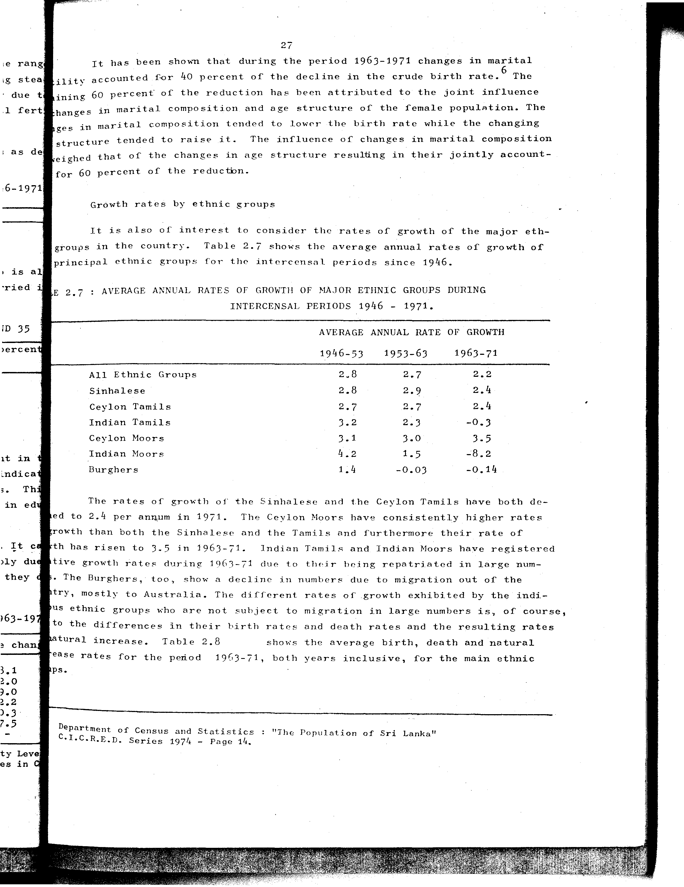

# 2.7: Average annual rates of growth of major ethnic groups during intercensal periods 1946-1971

---

- 📜 Original PDF - [data/tables/table-2/table-2-07/original.pdf (82.9 kB)](../../../../data/tables/table-2/table-2-07/original.pdf)
- 📜 Original Image - [data/tables/table-2/table-2-07/original.image-01.png (178.3 kB)](../../../../data/tables/table-2/table-2-07/original.image-01.png)
- 📄 README - [data/tables/table-2/table-2-07/README.md (954 B)](../../../../data/tables/table-2/table-2-07/README.md)

## Extracted [JSON Data](../../../../data/tables/table-2/table-2-07/data.json)

*⚠️ No data extracted yet.*
## Original Table [Image](../../../../data/tables/table-2/table-2-07/original.image-01.png)

---

