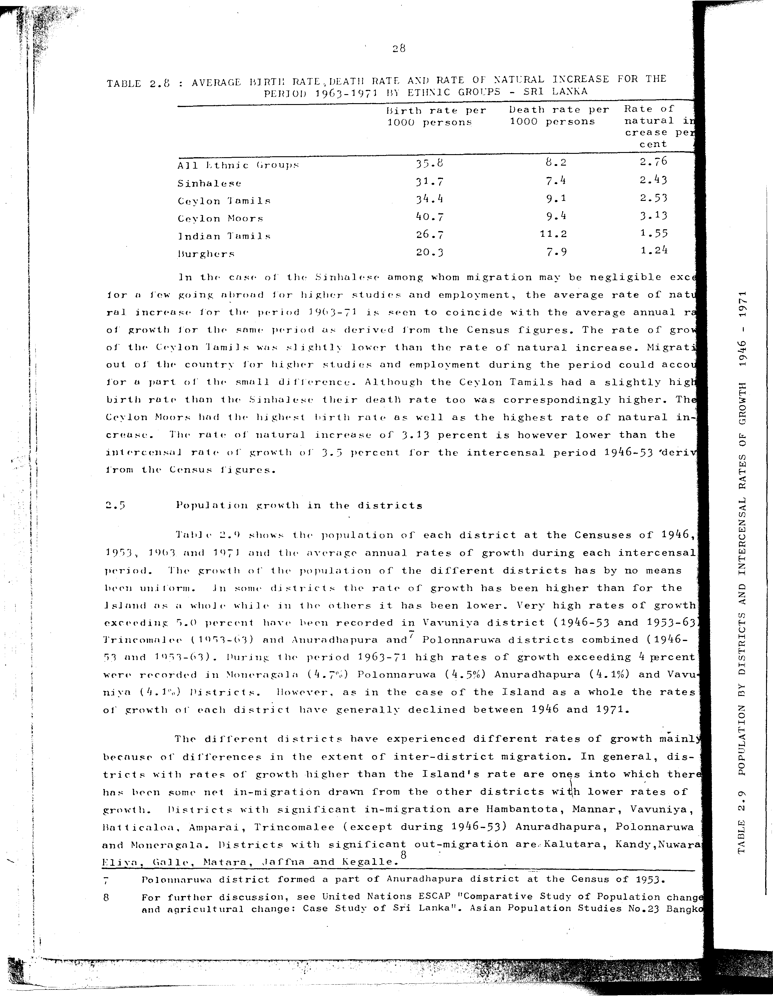

# 2.8: Average birth rate, death rate and rate of natural increase for the period 1963-1971 by ethnic groups - Sri Lanka


- 📜 Original Table PDF - [data/tables/table-2/table-2-08/original.pdf (79.5 kB)](../../../../data/tables/table-2/table-2-08/original.pdf)
- 📜 Original Table Image - [data/tables/table-2/table-2-08/original.images/image-01.png (189.0 kB)](../../../../data/tables/table-2/table-2-08/original.images/image-01.png)
- 📄 Extracted JSON Data - [data/tables/table-2/table-2-08/data.json (1.7 kB)](../../../../data/tables/table-2/table-2-08/data.json)

## Extracted [JSON Data](../../../../data/tables/table-2/table-2-08/data.json)

```json
{
    "found": true,
    "table_no": "2.8",
    "table_name": "Average birth rate, death rate and rate of natural increase for the period 1963-1971 by ethnic groups - Sri Lanka",
    "primary_keys": [
        "Ethnic Group"
    ],
    "field_keys": [
        "Birth rate per 1000 persons",
        "Death rate per 1000 persons",
        "Rate of natural increase per cent"
    ],
    "rows": [
        {
            "Ethnic Group": "All Ethnic Groups",
            "values": {
                "Birth rate per 1000 persons": 35.8,
                "Death rate per 1000 persons": 8.2,
                "Rate of natural increase per cent": 2.76
            }
        },
        {
            "Ethnic Group": "Sinhalese",
            "values": {
                "Birth rate per 1000 persons": 31.7,
                "Death rate per 1000 persons": 7.4,
                "Rate of natural increase per cent": 2.43
            }
        },
        {
            "Ethnic Group": "Ceylon Tamils",
            "values": {
                "Birth rate per 1000 persons": 34.4,
                "Death rate per 1000 persons": 9.1,
                "Rate of natural increase per cent": 2.53
            }
        },
        {
            "Ethnic Group": "Ceylon Moors",
            "values": {
                "Birth rate per 1000 persons": 40.7,
                "Death rate per 1000 persons": 9.4,
                "Rate of natural increase per cent": 3.13
            }
        },
        {
            "Ethnic Group": "Indian Tamils",
            "values": {
                "Birth rate per 1000 persons": 26.7,
                "Death rate per 1000 persons": 11.2,
                "Rate of natural increase per cent": 1.55
            }
        },
        {
            "Ethnic Group": "Burghers",
            "values": {
                "Birth rate per 1000 persons": 20.3,
                "Death rate per 1000 persons": 7.9,
                "Rate of natural increase per cent": 1.24
            }
        }
    ],
    "notes": []
}
```

## Original Table [Image](../../../../data/tables/table-2/table-2-08/original.images/image-01.png)




[](https://opensource.org/licenses/MIT)
