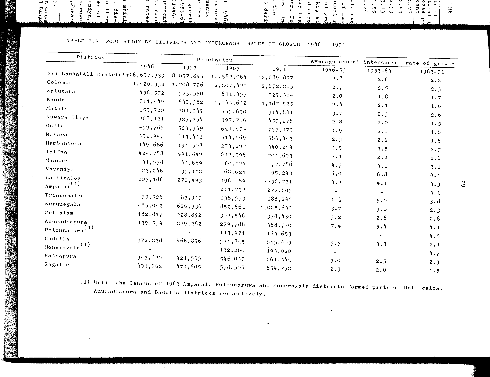

# 2.9: Population by districts and intercensal rates of growth 1946-1971


- 📜 Original Table PDF - [data/tables/table-2/table-2-09/original.pdf (75.1 kB)](../../../../data/tables/table-2/table-2-09/original.pdf)
- 📜 Original Table Image - [data/tables/table-2/table-2-09/original.images/image-01.png (173.5 kB)](../../../../data/tables/table-2/table-2-09/original.images/image-01.png)
- 📄 Extracted JSON Data - [data/tables/table-2/table-2-09/data.json (10.3 kB)](../../../../data/tables/table-2/table-2-09/data.json)

## Extracted [JSON Data](../../../../data/tables/table-2/table-2-09/data.json)

```json
{
    "found": true,
    "table_no": "2.9",
    "table_name": "Population by districts and intercensal rates of growth 1946-1971",
    "primary_keys": [
        "District"
    ],
    "field_keys": [
        "Population - 1946",
        "Population - 1953",
        "Population - 1963",
        "Population - 1971",
        "Average annual intercensal rate of growth - 1946-53",
        "Average annual intercensal rate of growth - 1953-63",
        "Average annual intercensal rate of growth - 1963-71"
    ],
    "rows": [
        {
            "District": "Sri Lanka(All Districts)",
            "values": {
                "Population - 1946": 6657339,
                "Population - 1953": 8097895,
                "Population - 1963": 10582064,
                "Population - 1971": 12689897,
                "Average annual intercensal rate of growth - 1946-53": 2.8,
                "Average annual intercensal rate of growth - 1953-63": 2.6,
                "Average annual intercensal rate of growth - 1963-71": 2.2
            }
        },
        {
            "District": "Colombo",
            "values": {
                "Population - 1946": 1420332,
                "Population - 1953": 1708726,
                "Population - 1963": 2207420,
                "Population - 1971": 2672265,
                "Average annual intercensal rate of growth - 1946-53": 2.7,
                "Average annual intercensal rate of growth - 1953-63": 2.5,
                "Average annual intercensal rate of growth - 1963-71": 2.3
            }
        },
        {
            "District": "Kalutara",
            "values": {
                "Population - 1946": 456572,
                "Population - 1953": 523550,
                "Population - 1963": 631457,
                "Population - 1971": 729514,
                "Average annual intercensal rate of growth - 1946-53": 2.0,
                "Average annual intercensal rate of growth - 1953-63": 1.8,
                "Average annual intercensal rate of growth - 1963-71": 1.7
            }
        },
        {
            "District": "Kandy",
            "values": {
                "Population - 1946": 711449,
                "Population - 1953": 840382,
                "Population - 1963": 1043632,
                "Population - 1971": 1187925,
                "Average annual intercensal rate of growth - 1946-53": 2.4,
                "Average annual intercensal rate of growth - 1953-63": 2.1,
                "Average annual intercensal rate of growth - 1963-71": 1.6
            }
        },
        {
            "District": "Matale",
            "values": {
                "Population - 1946": 155720,
                "Population - 1953": 201049,
                "Population - 1963": 255630,
                "Population - 1971": 314841,
                "Average annual intercensal rate of growth - 1946-53": 3.7,
                "Average annual intercensal rate of growth - 1953-63": 2.3,
                "Average annual intercensal rate of growth - 1963-71": 2.6
            }
        },
        {
            "District": "Nuwara Eliya",
            "values": {
                "Population - 1946": 268121,
                "Population - 1953": 325254,
                "Population - 1963": 397756,
                "Population - 1971": 450278,
                "Average annual intercensal rate of growth - 1946-53": 2.8,
                "Average annual intercensal rate of growth - 1953-63": 2.0,
                "Average annual intercensal rate of growth - 1963-71": 1.5
            }
        },
        {
            "District": "Galle",
            "values": {
                "Population - 1946": 459785,
                "Population - 1953": 524369,
                "Population - 1963": 641474,
                "Population - 1971": 735173,
                "Average annual intercensal rate of growth - 1946-53": 1.9,
                "Average annual intercensal rate of growth - 1953-63": 2.0,
                "Average annual intercensal rate of growth - 1963-71": 1.6
            }
        },
        {
            "District": "Matara",
            "values": {
                "Population - 1946": 351947,
                "Population - 1953": 413431,
                "Population - 1963": 514969,
                "Population - 1971": 586443,
                "Average annual intercensal rate of growth - 1946-53": 2.3,
                "Average annual intercensal rate of growth - 1953-63": 2.2,
                "Average annual intercensal rate of growth - 1963-71": 1.6
            }
        },
        {
            "District": "Hambantota",
            "values": {
                "Population - 1946": 149686,
                "Population - 1953": 191508,
                "Population - 1963": 274297,
                "Population - 1971": 340254,
                "Average annual intercensal rate of growth - 1946-53": 3.5,
                "Average annual intercensal rate of growth - 1953-63": 3.5,
                "Average annual intercensal rate of growth - 1963-71": 2.7
            }
        },
        {
            "District": "Jaffna",
            "values": {
                "Population - 1946": 424788,
                "Population - 1953": 491849,
                "Population - 1963": 612596,
                "Population - 1971": 701603,
                "Average annual intercensal rate of growth - 1946-53": 2.1,
                "Average annual intercensal rate of growth - 1953-63": 2.2,
                "Average annual intercensal rate of growth - 1963-71": 1.6
            }
        },
        {
            "District": "Mannar",
            "values": {
                "Population - 1946": 31538,
                "Population - 1953": 43689,
                "Population - 1963": 60124,
                "Population - 1971": 77780,
                "Average annual intercensal rate of growth - 1946-53": 4.7,
                "Average annual intercensal rate of growth - 1953-63": 3.1,
                "Average annual intercensal rate of growth - 1963-71": 3.1
            }
        },
        {
            "District": "Vavuniya",
            "values": {
                "Population - 1946": 23246,
                "Population - 1953": 35112,
                "Population - 1963": 68621,
                "Population - 1971": 95243,
                "Average annual intercensal rate of growth - 1946-53": 6.0,
                "Average annual intercensal rate of growth - 1953-63": 6.8,
                "Average annual intercensal rate of growth - 1963-71": 4.1
            }
        },
        {
            "District": "Batticaloa",
            "values": {
                "Population - 1946": 203186,
                "Population - 1953": 270493,
                "Population - 1963": 196189,
                "Population - 1971": 256721,
                "Average annual intercensal rate of growth - 1946-53": 4.2,
                "Average annual intercensal rate of growth - 1953-63": 4.1,
                "Average annual intercensal rate of growth - 1963-71": 3.3
            }
        },
        {
            "District": "Amparai(1)",
            "values": {
                "Population - 1946": null,
                "Population - 1953": null,
                "Population - 1963": 211732,
                "Population - 1971": 272605,
                "Average annual intercensal rate of growth - 1946-53": null,
                "Average annual intercensal rate of growth - 1953-63": null,
                "Average annual intercensal rate of growth - 1963-71": 3.1
            }
        },
        {
            "District": "Trincomalee",
            "values": {
                "Population - 1946": 75926,
                "Population - 1953": 83917,
                "Population - 1963": 138553,
                "Population - 1971": 188245,
                "Average annual intercensal rate of growth - 1946-53": 1.4,
                "Average annual intercensal rate of growth - 1953-63": 5.0,
                "Average annual intercensal rate of growth - 1963-71": 3.8
            }
        },
        {
            "District": "Kurunegala",
            "values": {
                "Population - 1946": 485042,
                "Population - 1953": 626336,
                "Population - 1963": 852661,
                "Population - 1971": 1025633,
                "Average annual intercensal rate of growth - 1946-53": 3.7,
                "Average annual intercensal rate of growth - 1953-63": 3.0,
                "Average annual intercensal rate of growth - 1963-71": 2.3
            }
        },
        {
            "District": "Puttalam",
            "values": {
                "Population - 1946": 182847,
                "Population - 1953": 228892,
                "Population - 1963": 302546,
                "Population - 1971": 378430,
                "Average annual intercensal rate of growth - 1946-53": 3.2,
                "Average annual intercensal rate of growth - 1953-63": 2.8,
                "Average annual intercensal rate of growth - 1963-71": 2.8
            }
        },
        {
            "District": "Anuradhapura",
            "values": {
                "Population - 1946": 139534,
                "Population - 1953": 229282,
                "Population - 1963": 279788,
                "Population - 1971": 388770,
                "Average annual intercensal rate of growth - 1946-53": 7.4,
                "Average annual intercensal rate of growth - 1953-63": 5.4,
                "Average annual intercensal rate of growth - 1963-71": 4.1
            }
        },
        {
            "District": "Polonnaruwa(1)",
            "values": {
                "Population - 1946": null,
                "Population - 1953": null,
                "Population - 1963": 113971,
                "Population - 1971": 163653,
                "Average annual intercensal rate of growth - 1946-53": null,
                "Average annual intercensal rate of growth - 1953-63": null,
                "Average annual intercensal rate of growth - 1963-71": 4.5
            }
        },
        {
            "District": "Badulla",
            "values": {
                "Population - 1946": 372238,
                "Population - 1953": 466896,
                "Population - 1963": 521845,
                "Population - 1971": 615405,
                "Average annual intercensal rate of growth - 1946-53": 3.3,
                "Average annual intercensal rate of growth - 1953-63": 3.3,
                "Average annual intercensal rate of growth - 1963-71": 2.1
            }
        },
        {
            "District": "Moneragala(1)",
            "values": {
                "Population - 1946": null,
                "Population - 1953": null,
                "Population - 1963": 132260,
                "Population - 1971": 193020,
                "Average annual intercensal rate of growth - 1946-53": null,
                "Average annual intercensal rate of growth - 1953-63": null,
                "Average annual intercensal rate of growth - 1963-71": 4.7
            }
        },
        {
            "District": "Ratnapura",
            "values": {
                "Population - 1946": 343620,
                "Population - 1953": 421555,
                "Population - 1963": 546037,
                "Population - 1971": 661344,
                "Average annual intercensal rate of growth - 1946-53": 3.0,
                "Average annual intercensal rate of growth - 1953-63": 2.5,
                "Average annual intercensal rate of growth - 1963-71": 2.3
            }
        },
        {
            "District": "Kegalle",
            "values": {
                "Population - 1946": 401762,
                "Population - 1953": 471605,
                "Population - 1963": 578506,
                "Population - 1971": 654752,
                "Average annual intercensal rate of growth - 1946-53": 2.3,
                "Average annual intercensal rate of growth - 1953-63": 2.0,
                "Average annual intercensal rate of growth - 1963-71": 1.5
            }
        }
    ],
    "notes": [
        "(1) Until the Census of 1963 Amparai, Polonnaruwa and Moneragala districts formed parts of Batticaloa, Anuradhapura and Badulla districts respectively."
    ]
}
```

## Original Table [Image](../../../../data/tables/table-2/table-2-09/original.images/image-01.png)




[](https://opensource.org/licenses/MIT)
