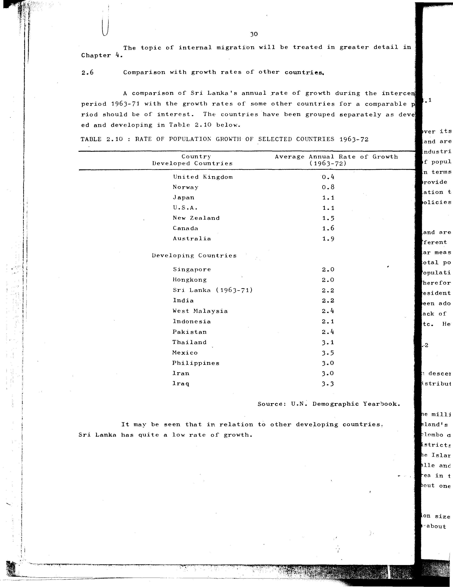

# 2.10: Rate of population growth of selected countries 1963-72


- 📜 Original Table PDF - [data/tables/table-2/table-2-10/original.pdf (45.0 kB)](../../../../data/tables/table-2/table-2-10/original.pdf)
- 📜 Original Table Image - [data/tables/table-2/table-2-10/original.images/image-01.png (114.1 kB)](../../../../data/tables/table-2/table-2-10/original.images/image-01.png)
- 📄 Extracted JSON Data - [data/tables/table-2/table-2-10/data.json (2.6 kB)](../../../../data/tables/table-2/table-2-10/data.json)
- 📄 Extracted TSV Data - [data/tables/table-2/table-2-10/data.tsv (324 B)](../../../../data/tables/table-2/table-2-10/data.tsv)

## Original Table [Image](../../../../data/tables/table-2/table-2-10/original.images/image-01.png)



## Extracted [JSON Data](../../../../data/tables/table-2/table-2-10/data.json)

```json
{
    "found": true,
    "table_no": "2.10",
    "table_name": "Rate of population growth of selected countries 1963-72",
    "primary_keys": [
        "Country"
    ],
    "field_keys": [
        "Average Annual Rate of Growth (1963-72)"
    ],
    "rows": [
        {
            "Country": "United Kingdom",
            "values": {
                "Average Annual Rate of Growth (1963-72)": 0.4
            }
        },
        {
            "Country": "Norway",
            "values": {
                "Average Annual Rate of Growth (1963-72)": 0.8
            }
        },
        {
            "Country": "Japan",
            "values": {
                "Average Annual Rate of Growth (1963-72)": 1.1
            }
        },
        {
            "Country": "U.S.A.",
            "values": {
                "Average Annual Rate of Growth (1963-72)": 1.1
            }
        },
        {
            "Country": "New Zealand",
            "values": {
                "Average Annual Rate of Growth (1963-72)": 1.5
            }
        },
        {
            "Country": "Canada",
            "values": {
                "Average Annual Rate of Growth (1963-72)": 1.6
            }
        },
        {
            "Country": "Australia",
            "values": {
                "Average Annual Rate of Growth (1963-72)": 1.9
            }
        },
        {
            "Country": "Singapore",
            "values": {
                "Average Annual Rate of Growth (1963-72)": 2.0
            }
        },
        {
            "Country": "Hongkong",
            "values": {
                "Average Annual Rate of Growth (1963-72)": 2.0
            }
        },
        {
            "Country": "Sri Lanka (1963-71)",
            "values": {
                "Average Annual Rate of Growth (1963-72)": 2.2
            }
        },
        {
            "Country": "India",
            "values": {
                "Average Annual Rate of Growth (1963-72)": 2.2
            }
        },
        {
            "Country": "West Malaysia",
            "values": {
                "Average Annual Rate of Growth (1963-72)": 2.4
            }
        },
        {
            "Country": "Indonesia",
            "values": {
                "Average Annual Rate of Growth (1963-72)": 2.1
            }
        },
        {
            "Country": "Pakistan",
            "values": {
                "Average Annual Rate of Growth (1963-72)": 2.4
            }
        },
        {
            "Country": "Thailand",
            "values": {
                "Average Annual Rate of Growth (1963-72)": 3.1
            }
        },
        {
            "Country": "Mexico",
            "values": {
                "Average Annual Rate of Growth (1963-72)": 3.5
            }
        },
        {
            "Country": "Philippines",
            "values": {
                "Average Annual Rate of Growth (1963-72)": 3.0
            }
        },
        {
            "Country": "Iran",
            "values": {
                "Average Annual Rate of Growth (1963-72)": 3.0
            }
        },
        {
            "Country": "Iraq",
            "values": {
                "Average Annual Rate of Growth (1963-72)": 3.3
            }
        }
    ],
    "notes": [
        "Source: U.N. Demographic Yearbook."
    ]
}
```

## Extracted [TSV Data](../../../../data/tables/table-2/table-2-10/data.tsv)

| Country | Average Annual Rate of Growth (1963-72) |
| --- | --- |
| United Kingdom | 0.4 |
| Norway | 0.8 |
| Japan | 1.1 |
| U.S.A. | 1.1 |
| New Zealand | 1.5 |
| Canada | 1.6 |
| Australia | 1.9 |
| Singapore | 2.0 |
| Hongkong | 2.0 |
| Sri Lanka (1963-71) | 2.2 |
| India | 2.2 |
| West Malaysia | 2.4 |
| Indonesia | 2.1 |
| Pakistan | 2.4 |
| Thailand | 3.1 |
| Mexico | 3.5 |
| Philippines | 3.0 |
| Iran | 3.0 |
| Iraq | 3.3 |


[](https://opensource.org/licenses/MIT)
