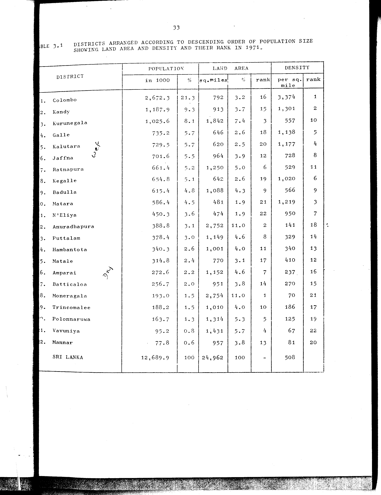

# 3.1: Districts arranged according to descending order of population size showing land area and density and their rank in 1971


- 📜 Original Table PDF - [data/tables/table-3/table-3-01/original.pdf (63.6 kB)](../../../../data/tables/table-3/table-3-01/original.pdf)
- 📜 Original Table Image - [data/tables/table-3/table-3-01/original.images/image-01.png (172.3 kB)](../../../../data/tables/table-3/table-3-01/original.images/image-01.png)
- 📄 Extracted JSON Data - [data/tables/table-3/table-3-01/data.json (7.5 kB)](../../../../data/tables/table-3/table-3-01/data.json)

## Extracted [JSON Data](../../../../data/tables/table-3/table-3-01/data.json)

```json
{
    "found": true,
    "table_no": "3.1",
    "table_name": "Districts arranged according to descending order of population size showing land area and density and their rank in 1971",
    "primary_keys": [
        "DISTRICT"
    ],
    "field_keys": [
        "POPULATION - in 1000",
        "POPULATION - %",
        "LAND AREA - sq.miles",
        "LAND AREA - %",
        "LAND AREA - rank",
        "DENSITY - per sq. mile",
        "DENSITY - rank"
    ],
    "rows": [
        {
            "DISTRICT": "Colombo",
            "values": {
                "POPULATION - in 1000": 2672.3,
                "POPULATION - %": 21.3,
                "LAND AREA - sq.miles": 792,
                "LAND AREA - %": 3.2,
                "LAND AREA - rank": 16,
                "DENSITY - per sq. mile": 3374,
                "DENSITY - rank": 1
            }
        },
        {
            "DISTRICT": "Kandy",
            "values": {
                "POPULATION - in 1000": 1187.9,
                "POPULATION - %": 9.3,
                "LAND AREA - sq.miles": 913,
                "LAND AREA - %": 3.7,
                "LAND AREA - rank": 15,
                "DENSITY - per sq. mile": 1301,
                "DENSITY - rank": 2
            }
        },
        {
            "DISTRICT": "Kurunegala",
            "values": {
                "POPULATION - in 1000": 1025.6,
                "POPULATION - %": 8.1,
                "LAND AREA - sq.miles": 1842,
                "LAND AREA - %": 7.4,
                "LAND AREA - rank": 3,
                "DENSITY - per sq. mile": 557,
                "DENSITY - rank": 10
            }
        },
        {
            "DISTRICT": "Galle",
            "values": {
                "POPULATION - in 1000": 735.2,
                "POPULATION - %": 5.7,
                "LAND AREA - sq.miles": 646,
                "LAND AREA - %": 2.6,
                "LAND AREA - rank": 18,
                "DENSITY - per sq. mile": 1138,
                "DENSITY - rank": 5
            }
        },
        {
            "DISTRICT": "Kalutara",
            "values": {
                "POPULATION - in 1000": 729.5,
                "POPULATION - %": 5.7,
                "LAND AREA - sq.miles": 620,
                "LAND AREA - %": 2.5,
                "LAND AREA - rank": 20,
                "DENSITY - per sq. mile": 1177,
                "DENSITY - rank": 4
            }
        },
        {
            "DISTRICT": "Jaffna",
            "values": {
                "POPULATION - in 1000": 701.6,
                "POPULATION - %": 5.5,
                "LAND AREA - sq.miles": 964,
                "LAND AREA - %": 3.9,
                "LAND AREA - rank": 12,
                "DENSITY - per sq. mile": 728,
                "DENSITY - rank": 8
            }
        },
        {
            "DISTRICT": "Ratnapura",
            "values": {
                "POPULATION - in 1000": 661.4,
                "POPULATION - %": 5.2,
                "LAND AREA - sq.miles": 1250,
                "LAND AREA - %": 5.0,
                "LAND AREA - rank": 6,
                "DENSITY - per sq. mile": 529,
                "DENSITY - rank": 11
            }
        },
        {
            "DISTRICT": "Kegalle",
            "values": {
                "POPULATION - in 1000": 654.8,
                "POPULATION - %": 5.1,
                "LAND AREA - sq.miles": 642,
                "LAND AREA - %": 2.6,
                "LAND AREA - rank": 19,
                "DENSITY - per sq. mile": 1020,
                "DENSITY - rank": 6
            }
        },
        {
            "DISTRICT": "Badulla",
            "values": {
                "POPULATION - in 1000": 615.4,
                "POPULATION - %": 4.8,
                "LAND AREA - sq.miles": 1088,
                "LAND AREA - %": 4.3,
                "LAND AREA - rank": 9,
                "DENSITY - per sq. mile": 566,
                "DENSITY - rank": 9
            }
        },
        {
            "DISTRICT": "Matara",
            "values": {
                "POPULATION - in 1000": 586.4,
                "POPULATION - %": 4.5,
                "LAND AREA - sq.miles": 481,
                "LAND AREA - %": 1.9,
                "LAND AREA - rank": 21,
                "DENSITY - per sq. mile": 1219,
                "DENSITY - rank": 3
            }
        },
        {
            "DISTRICT": "N'Eliya",
            "values": {
                "POPULATION - in 1000": 450.3,
                "POPULATION - %": 3.6,
                "LAND AREA - sq.miles": 474,
                "LAND AREA - %": 1.9,
                "LAND AREA - rank": 22,
                "DENSITY - per sq. mile": 950,
                "DENSITY - rank": 7
            }
        },
        {
            "DISTRICT": "Anuradhapura",
            "values": {
                "POPULATION - in 1000": 388.8,
                "POPULATION - %": 3.1,
                "LAND AREA - sq.miles": 2752,
                "LAND AREA - %": 11.0,
                "LAND AREA - rank": 2,
                "DENSITY - per sq. mile": 141,
                "DENSITY - rank": 18
            }
        },
        {
            "DISTRICT": "Puttalam",
            "values": {
                "POPULATION - in 1000": 378.4,
                "POPULATION - %": 3.0,
                "LAND AREA - sq.miles": 1149,
                "LAND AREA - %": 4.6,
                "LAND AREA - rank": 8,
                "DENSITY - per sq. mile": 329,
                "DENSITY - rank": 14
            }
        },
        {
            "DISTRICT": "Hambantota",
            "values": {
                "POPULATION - in 1000": 340.3,
                "POPULATION - %": 2.6,
                "LAND AREA - sq.miles": 1001,
                "LAND AREA - %": 4.0,
                "LAND AREA - rank": 11,
                "DENSITY - per sq. mile": 340,
                "DENSITY - rank": 13
            }
        },
        {
            "DISTRICT": "Matale",
            "values": {
                "POPULATION - in 1000": 314.8,
                "POPULATION - %": 2.4,
                "LAND AREA - sq.miles": 770,
                "LAND AREA - %": 3.1,
                "LAND AREA - rank": 17,
                "DENSITY - per sq. mile": 410,
                "DENSITY - rank": 12
            }
        },
        {
            "DISTRICT": "Amparai",
            "values": {
                "POPULATION - in 1000": 272.6,
                "POPULATION - %": 2.2,
                "LAND AREA - sq.miles": 1152,
                "LAND AREA - %": 4.6,
                "LAND AREA - rank": 7,
                "DENSITY - per sq. mile": 237,
                "DENSITY - rank": 16
            }
        },
        {
            "DISTRICT": "Batticaloa",
            "values": {
                "POPULATION - in 1000": 256.7,
                "POPULATION - %": 2.0,
                "LAND AREA - sq.miles": 951,
                "LAND AREA - %": 3.8,
                "LAND AREA - rank": 14,
                "DENSITY - per sq. mile": 270,
                "DENSITY - rank": 15
            }
        },
        {
            "DISTRICT": "Moneragala",
            "values": {
                "POPULATION - in 1000": 193.0,
                "POPULATION - %": 1.5,
                "LAND AREA - sq.miles": 2754,
                "LAND AREA - %": 11.0,
                "LAND AREA - rank": 1,
                "DENSITY - per sq. mile": 70,
                "DENSITY - rank": 21
            }
        },
        {
            "DISTRICT": "Trincomalee",
            "values": {
                "POPULATION - in 1000": 188.2,
                "POPULATION - %": 1.5,
                "LAND AREA - sq.miles": 1010,
                "LAND AREA - %": 4.0,
                "LAND AREA - rank": 10,
                "DENSITY - per sq. mile": 186,
                "DENSITY - rank": 17
            }
        },
        {
            "DISTRICT": "Polonnaruwa",
            "values": {
                "POPULATION - in 1000": 163.7,
                "POPULATION - %": 1.3,
                "LAND AREA - sq.miles": 1314,
                "LAND AREA - %": 5.3,
                "LAND AREA - rank": 5,
                "DENSITY - per sq. mile": 125,
                "DENSITY - rank": 19
            }
        },
        {
            "DISTRICT": "Vavuniya",
            "values": {
                "POPULATION - in 1000": 95.2,
                "POPULATION - %": 0.8,
                "LAND AREA - sq.miles": 1431,
                "LAND AREA - %": 5.7,
                "LAND AREA - rank": 4,
                "DENSITY - per sq. mile": 67,
                "DENSITY - rank": 22
            }
        },
        {
            "DISTRICT": "Mannar",
            "values": {
                "POPULATION - in 1000": 77.8,
                "POPULATION - %": 0.6,
                "LAND AREA - sq.miles": 957,
                "LAND AREA - %": 3.8,
                "LAND AREA - rank": 13,
                "DENSITY - per sq. mile": 81,
                "DENSITY - rank": 20
            }
        },
        {
            "DISTRICT": "SRI LANKA",
            "values": {
                "POPULATION - in 1000": 12689.9,
                "POPULATION - %": 100,
                "LAND AREA - sq.miles": 24962,
                "LAND AREA - %": 100,
                "LAND AREA - rank": null,
                "DENSITY - per sq. mile": 508,
                "DENSITY - rank": null
            }
        }
    ],
    "notes": []
}
```

## Original Table [Image](../../../../data/tables/table-3/table-3-01/original.images/image-01.png)




[](https://opensource.org/licenses/MIT)
