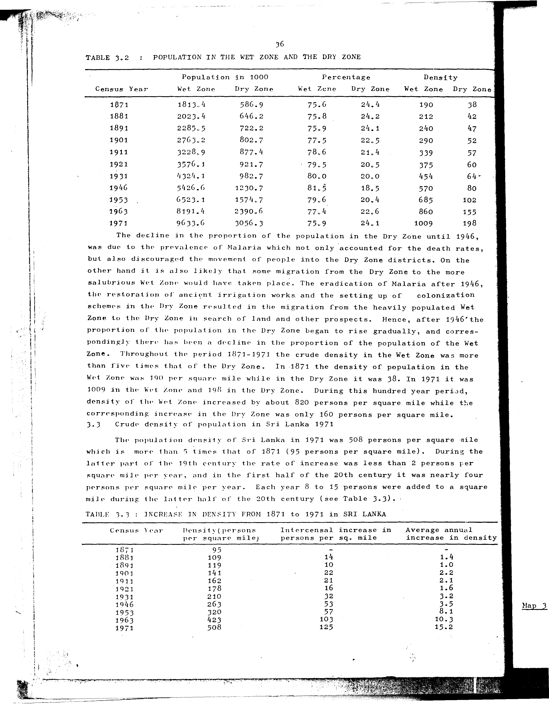

# 3.3: Increase in density from 1871 to 1971 in Sri Lanka


---

- 📜 Original PDF - [data/tables/table-3/table-3-03/original.pdf (71.9 kB)](../../../../data/tables/table-3/table-3-03/original.pdf)
- 📜 Original Image - [data/tables/table-3/table-3-03/original.image-01.png (177.1 kB)](../../../../data/tables/table-3/table-3-03/original.image-01.png)
- 📄 Extracted JSON Data - [data/tables/table-3/table-3-03/data.json (2.8 kB)](../../../../data/tables/table-3/table-3-03/data.json)
- 📄 README - [data/tables/table-3/table-3-03/README.md (1.0 kB)](../../../../data/tables/table-3/table-3-03/README.md)

## Extracted [JSON Data](../../../../data/tables/table-3/table-3-03/data.json)

```json
{
    "found": true,
    "table_no": "3.3",
    "table_name": "Increase in density from 1871 to 1971 in Sri Lanka",
    "primary_keys": [
        "Census Year"
    ],
    "field_keys": [
        "Density(persons per square mile)",
        "Intercensal increase in persons per sq. mile",
        "Average annual increase in density"
    ],
    "rows": [
        {
            "Census Year": 1871,
            "values": {
                "Density(persons per square mile)": 95,
                "Intercensal increase in persons per sq. mile": null,
                "Average annual increase in density": null
            }
        },
        {
            "Census Year": 1881,
            "values": {
                "Density(persons per square mile)": 109,
                "Intercensal increase in persons per sq. mile": 14,
                "Average annual increase in density": 1.4
            }
        },
        {
            "Census Year": 1891,
            "values": {
                "Density(persons per square mile)": 119,
                "Intercensal increase in persons per sq. mile": 10,
                "Average annual increase in density": 1.0
            }
        },
        {
            "Census Year": 1901,
            "values": {
                "Density(persons per square mile)": 141,
                "Intercensal increase in persons per sq. mile": 22,
                "Average annual increase in density": 2.2
            }
        },
        {
            "Census Year": 1911,
            "values": {
                "Density(persons per square mile)": 162,
                "Intercensal increase in persons per sq. mile": 21,
                "Average annual increase in density": 2.1
            }
        },
        {
            "Census Year": 1921,
            "values": {
                "Density(persons per square mile)": 178,
                "Intercensal increase in persons per sq. mile": 16,
                "Average annual increase in density": 1.6
            }
        },
        {
            "Census Year": 1931,
            "values": {
                "Density(persons per square mile)": 210,
                "Intercensal increase in persons per sq. mile": 32,
                "Average annual increase in density": 3.2
            }
        },
        {
            "Census Year": 1946,
            "values": {
                "Density(persons per square mile)": 263,
                "Intercensal increase in persons per sq. mile": 53,
                "Average annual increase in density": 3.5
            }
        },
        {
            "Census Year": 1953,
            "values": {
                "Density(persons per square mile)": 320,
                "Intercensal increase in persons per sq. mile": 57,
                "Average annual increase in density": 8.1
            }
        },
        {
            "Census Year": 1963,
            "values": {
                "Density(persons per square mile)": 423,
                "Intercensal increase in persons per sq. mile": 103,
                "Average annual increase in density": 10.3
            }
        },
        {
            "Census Year": 1971,
            "values": {
                "Density(persons per square mile)": 508,
                "Intercensal increase in persons per sq. mile": 125,
                "Average annual increase in density": 15.2
            }
        }
    ],
    "notes": []
}
```

## Original Table [Image](../../../../data/tables/table-3/table-3-03/original.image-01.png)



---


[](https://opensource.org/licenses/MIT)
