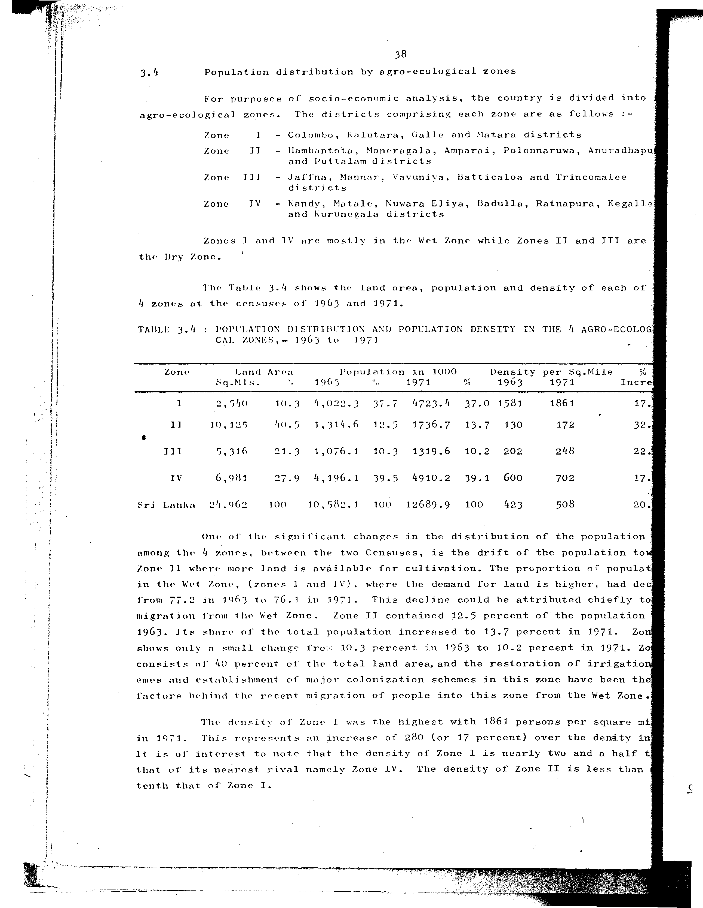

# 3.4: Population distribution and population density in 4 agro-ecological zones - 1963 to 1971


---

- 📜 Original PDF - [data/tables/table-3/table-3-04/original.pdf (65.5 kB)](../../../../data/tables/table-3/table-3-04/original.pdf)
- 📜 Original Image - [data/tables/table-3/table-3-04/original.image-01.png (160.8 kB)](../../../../data/tables/table-3/table-3-04/original.image-01.png)
- 📄 Extracted JSON Data - [data/tables/table-3/table-3-04/data.json (2.6 kB)](../../../../data/tables/table-3/table-3-04/data.json)
- 📄 README - [data/tables/table-3/table-3-04/README.md (1.1 kB)](../../../../data/tables/table-3/table-3-04/README.md)

## Extracted [JSON Data](../../../../data/tables/table-3/table-3-04/data.json)

```json
{
    "found": true,
    "table_no": "3.4",
    "table_name": "Population distribution and population density in 4 agro-ecological zones - 1963 to 1971",
    "primary_keys": [
        "Zone"
    ],
    "field_keys": [
        "Land Area - Sq.Mis.",
        "Land Area - %",
        "Population in 1000 - 1963",
        "Population in 1000 - %",
        "Population in 1000 - 1971",
        "Population in 1000 - % (1971)",
        "Density per Sq.Mile - 1963",
        "Density per Sq.Mile - 1971",
        "% Incre"
    ],
    "rows": [
        {
            "Zone": "I",
            "values": {
                "Land Area - Sq.Mis.": 2540,
                "Land Area - %": 10.3,
                "Population in 1000 - 1963": 4022.3,
                "Population in 1000 - %": 37.7,
                "Population in 1000 - 1971": 4723.4,
                "Population in 1000 - % (1971)": 37.0,
                "Density per Sq.Mile - 1963": 1581,
                "Density per Sq.Mile - 1971": 1861,
                "% Incre": 17.0
            }
        },
        {
            "Zone": "II",
            "values": {
                "Land Area - Sq.Mis.": 10125,
                "Land Area - %": 40.5,
                "Population in 1000 - 1963": 1314.6,
                "Population in 1000 - %": 12.5,
                "Population in 1000 - 1971": 1736.7,
                "Population in 1000 - % (1971)": 13.7,
                "Density per Sq.Mile - 1963": 130,
                "Density per Sq.Mile - 1971": 172,
                "% Incre": 32.0
            }
        },
        {
            "Zone": "III",
            "values": {
                "Land Area - Sq.Mis.": 5316,
                "Land Area - %": 21.3,
                "Population in 1000 - 1963": 1076.1,
                "Population in 1000 - %": 10.3,
                "Population in 1000 - 1971": 1319.6,
                "Population in 1000 - % (1971)": 10.2,
                "Density per Sq.Mile - 1963": 202,
                "Density per Sq.Mile - 1971": 248,
                "% Incre": 22.0
            }
        },
        {
            "Zone": "IV",
            "values": {
                "Land Area - Sq.Mis.": 6981,
                "Land Area - %": 27.9,
                "Population in 1000 - 1963": 4196.1,
                "Population in 1000 - %": 39.5,
                "Population in 1000 - 1971": 4910.2,
                "Population in 1000 - % (1971)": 39.1,
                "Density per Sq.Mile - 1963": 600,
                "Density per Sq.Mile - 1971": 702,
                "% Incre": 17.0
            }
        },
        {
            "Zone": "Sri Lanka",
            "values": {
                "Land Area - Sq.Mis.": 24962,
                "Land Area - %": 100,
                "Population in 1000 - 1963": 10582.1,
                "Population in 1000 - %": 100,
                "Population in 1000 - 1971": 12689.9,
                "Population in 1000 - % (1971)": 100,
                "Density per Sq.Mile - 1963": 423,
                "Density per Sq.Mile - 1971": 508,
                "% Incre": 20.0
            }
        }
    ],
    "notes": []
}
```

## Original Table [Image](../../../../data/tables/table-3/table-3-04/original.image-01.png)



---


[](https://opensource.org/licenses/MIT)
