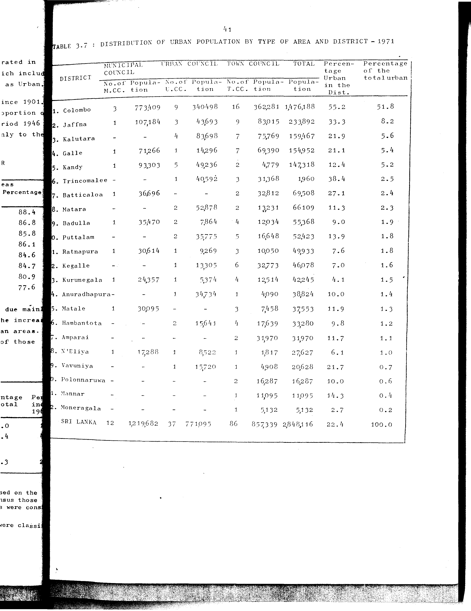

# 3.7: Distribution of urban population by type of area and district - 1971


- 📜 Original Table PDF - [data/tables/table-3/table-3-07/original.pdf (70.5 kB)](../../../../data/tables/table-3/table-3-07/original.pdf)
- 📜 Original Table Image - [data/tables/table-3/table-3-07/original.images/image-01.png (162.7 kB)](../../../../data/tables/table-3/table-3-07/original.images/image-01.png)
- 📄 Extracted JSON Data - [data/tables/table-3/table-3-07/data.json (11.3 kB)](../../../../data/tables/table-3/table-3-07/data.json)
- 📄 Extracted Normalized JSON Data - [data/tables/table-3/table-3-07/normalized_data.json (10.1 kB)](../../../../data/tables/table-3/table-3-07/normalized_data.json)
- 📄 Extracted TSV Data - [data/tables/table-3/table-3-07/data.tsv (1.3 kB)](../../../../data/tables/table-3/table-3-07/data.tsv)

## Original Table [Image](../../../../data/tables/table-3/table-3-07/original.images/image-01.png)



## Extracted [JSON Data](../../../../data/tables/table-3/table-3-07/data.json)

```json
{
    "found": true,
    "table_no": "3.7",
    "table_name": "Distribution of urban population by type of area and district - 1971",
    "primary_keys": [
        "DISTRICT"
    ],
    "field_keys": [
        "MUNICIPAL COUNCIL - No.of M.CC.",
        "MUNICIPAL COUNCIL - Population",
        "URBAN COUNCIL - No.of U.CC.",
        "URBAN COUNCIL - Population",
        "TOWN COUNCIL - No.of T.CC.",
        "TOWN COUNCIL - Population",
        "TOTAL - Population",
        "Percentage Urban in the Dist.",
        "Percentage of the total urban"
    ],
    "rows": [
        {
            "DISTRICT": "Colombo",
            "values": {
                "MUNICIPAL COUNCIL - No.of M.CC.": 3,
                "MUNICIPAL COUNCIL - Population": 773409,
                "URBAN COUNCIL - No.of U.CC.": 9,
                "URBAN COUNCIL - Population": 340498,
                "TOWN COUNCIL - No.of T.CC.": 16,
                "TOWN COUNCIL - Population": 362281,
                "TOTAL - Population": 1476188,
                "Percentage Urban in the Dist.": 55.2,
                "Percentage of the total urban": 51.8
            }
        },
        {
            "DISTRICT": "Jaffna",
            "values": {
                "MUNICIPAL COUNCIL - No.of M.CC.": 1,
                "MUNICIPAL COUNCIL - Population": 107184,
                "URBAN COUNCIL - No.of U.CC.": 3,
                "URBAN COUNCIL - Population": 43693,
                "TOWN COUNCIL - No.of T.CC.": 9,
                "TOWN COUNCIL - Population": 83015,
                "TOTAL - Population": 233892,
                "Percentage Urban in the Dist.": 33.3,
                "Percentage of the total urban": 8.2
            }
        },
        {
            "DISTRICT": "Kalutara",
            "values": {
                "MUNICIPAL COUNCIL - No.of M.CC.": null,
                "MUNICIPAL COUNCIL - Population": null,
                "URBAN COUNCIL - No.of U.CC.": 4,
                "URBAN COUNCIL - Population": 83698,
                "TOWN COUNCIL - No.of T.CC.": 7,
                "TOWN COUNCIL - Population": 75769,
                "TOTAL - Population": 159467,
                "Percentage Urban in the Dist.": 21.9,
                "Percentage of the total urban": 5.6
            }
        },
        {
            "DISTRICT": "Galle",
            "values": {
                "MUNICIPAL COUNCIL - No.of M.CC.": 1,
                "MUNICIPAL COUNCIL - Population": 71266,
                "URBAN COUNCIL - No.of U.CC.": 1,
                "URBAN COUNCIL - Population": 14296,
                "TOWN COUNCIL - No.of T.CC.": 7,
                "TOWN COUNCIL - Population": 69390,
                "TOTAL - Population": 154952,
                "Percentage Urban in the Dist.": 21.1,
                "Percentage of the total urban": 5.4
            }
        },
        {
            "DISTRICT": "Kandy",
            "values": {
                "MUNICIPAL COUNCIL - No.of M.CC.": 1,
                "MUNICIPAL COUNCIL - Population": 93303,
                "URBAN COUNCIL - No.of U.CC.": 5,
                "URBAN COUNCIL - Population": 49236,
                "TOWN COUNCIL - No.of T.CC.": 2,
                "TOWN COUNCIL - Population": 4779,
                "TOTAL - Population": 147318,
                "Percentage Urban in the Dist.": 12.4,
                "Percentage of the total urban": 5.2
            }
        },
        {
            "DISTRICT": "Trincomalee",
            "values": {
                "MUNICIPAL COUNCIL - No.of M.CC.": null,
                "MUNICIPAL COUNCIL - Population": null,
                "URBAN COUNCIL - No.of U.CC.": 1,
                "URBAN COUNCIL - Population": 40592,
                "TOWN COUNCIL - No.of T.CC.": 3,
                "TOWN COUNCIL - Population": 31368,
                "TOTAL - Population": 1960,
                "Percentage Urban in the Dist.": 38.4,
                "Percentage of the total urban": 2.5
            }
        },
        {
            "DISTRICT": "Batticaloa",
            "values": {
                "MUNICIPAL COUNCIL - No.of M.CC.": 1,
                "MUNICIPAL COUNCIL - Population": 36696,
                "URBAN COUNCIL - No.of U.CC.": null,
                "URBAN COUNCIL - Population": null,
                "TOWN COUNCIL - No.of T.CC.": 2,
                "TOWN COUNCIL - Population": 32812,
                "TOTAL - Population": 69508,
                "Percentage Urban in the Dist.": 27.1,
                "Percentage of the total urban": 2.4
            }
        },
        {
            "DISTRICT": "Matara",
            "values": {
                "MUNICIPAL COUNCIL - No.of M.CC.": null,
                "MUNICIPAL COUNCIL - Population": null,
                "URBAN COUNCIL - No.of U.CC.": 2,
                "URBAN COUNCIL - Population": 52878,
                "TOWN COUNCIL - No.of T.CC.": 2,
                "TOWN COUNCIL - Population": 13231,
                "TOTAL - Population": 66109,
                "Percentage Urban in the Dist.": 11.3,
                "Percentage of the total urban": 2.3
            }
        },
        {
            "DISTRICT": "Badulla",
            "values": {
                "MUNICIPAL COUNCIL - No.of M.CC.": 1,
                "MUNICIPAL COUNCIL - Population": 35470,
                "URBAN COUNCIL - No.of U.CC.": 2,
                "URBAN COUNCIL - Population": 7864,
                "TOWN COUNCIL - No.of T.CC.": 4,
                "TOWN COUNCIL - Population": 12034,
                "TOTAL - Population": 55368,
                "Percentage Urban in the Dist.": 9.0,
                "Percentage of the total urban": 1.9
            }
        },
        {
            "DISTRICT": "Puttalam",
            "values": {
                "MUNICIPAL COUNCIL - No.of M.CC.": null,
                "MUNICIPAL COUNCIL - Population": null,
                "URBAN COUNCIL - No.of U.CC.": 2,
                "URBAN COUNCIL - Population": 35775,
                "TOWN COUNCIL - No.of T.CC.": 5,
                "TOWN COUNCIL - Population": 16648,
                "TOTAL - Population": 52423,
                "Percentage Urban in the Dist.": 13.9,
                "Percentage of the total urban": 1.8
            }
        },
        {
            "DISTRICT": "Ratnapura",
            "values": {
                "MUNICIPAL COUNCIL - No.of M.CC.": 1,
                "MUNICIPAL COUNCIL - Population": 30614,
                "URBAN COUNCIL - No.of U.CC.": 1,
                "URBAN COUNCIL - Population": 9269,
                "TOWN COUNCIL - No.of T.CC.": 3,
                "TOWN COUNCIL - Population": 10050,
                "TOTAL - Population": 49933,
                "Percentage Urban in the Dist.": 7.6,
                "Percentage of the total urban": 1.8
            }
        },
        {
            "DISTRICT": "Kegalle",
            "values": {
                "MUNICIPAL COUNCIL - No.of M.CC.": null,
                "MUNICIPAL COUNCIL - Population": null,
                "URBAN COUNCIL - No.of U.CC.": 1,
                "URBAN COUNCIL - Population": 13305,
                "TOWN COUNCIL - No.of T.CC.": 6,
                "TOWN COUNCIL - Population": 32773,
                "TOTAL - Population": 46078,
                "Percentage Urban in the Dist.": 7.0,
                "Percentage of the total urban": 1.6
            }
        },
        {
            "DISTRICT": "Kurunegala",
            "values": {
                "MUNICIPAL COUNCIL - No.of M.CC.": 1,
                "MUNICIPAL COUNCIL - Population": 24357,
                "URBAN COUNCIL - No.of U.CC.": 1,
                "URBAN COUNCIL - Population": 5374,
                "TOWN COUNCIL - No.of T.CC.": 4,
                "TOWN COUNCIL - Population": 12514,
                "TOTAL - Population": 42245,
                "Percentage Urban in the Dist.": 4.1,
                "Percentage of the total urban": 1.5
            }
        },
        {
            "DISTRICT": "Anuradhapura",
            "values": {
                "MUNICIPAL COUNCIL - No.of M.CC.": null,
                "MUNICIPAL COUNCIL - Population": null,
                "URBAN COUNCIL - No.of U.CC.": 1,
                "URBAN COUNCIL - Population": 34734,
                "TOWN COUNCIL - No.of T.CC.": 1,
                "TOWN COUNCIL - Population": 4090,
                "TOTAL - Population": 38824,
                "Percentage Urban in the Dist.": 10.0,
                "Percentage of the total urban": 1.4
            }
        },
        {
            "DISTRICT": "Matale",
            "values": {
                "MUNICIPAL COUNCIL - No.of M.CC.": 1,
                "MUNICIPAL COUNCIL - Population": 30095,
                "URBAN COUNCIL - No.of U.CC.": null,
                "URBAN COUNCIL - Population": null,
                "TOWN COUNCIL - No.of T.CC.": 3,
                "TOWN COUNCIL - Population": 7458,
                "TOTAL - Population": 37553,
                "Percentage Urban in the Dist.": 11.9,
                "Percentage of the total urban": 1.3
            }
        },
        {
            "DISTRICT": "Hambantota",
            "values": {
                "MUNICIPAL COUNCIL - No.of M.CC.": null,
                "MUNICIPAL COUNCIL - Population": null,
                "URBAN COUNCIL - No.of U.CC.": 2,
                "URBAN COUNCIL - Population": 15641,
                "TOWN COUNCIL - No.of T.CC.": 4,
                "TOWN COUNCIL - Population": 17639,
                "TOTAL - Population": 33280,
                "Percentage Urban in the Dist.": 9.8,
                "Percentage of the total urban": 1.2
            }
        },
        {
            "DISTRICT": "Amparai",
            "values": {
                "MUNICIPAL COUNCIL - No.of M.CC.": null,
                "MUNICIPAL COUNCIL - Population": null,
                "URBAN COUNCIL - No.of U.CC.": null,
                "URBAN COUNCIL - Population": null,
                "TOWN COUNCIL - No.of T.CC.": 2,
                "TOWN COUNCIL - Population": 31970,
                "TOTAL - Population": 31970,
                "Percentage Urban in the Dist.": 11.7,
                "Percentage of the total urban": 1.1
            }
        },
        {
            "DISTRICT": "N'Eliya",
            "values": {
                "MUNICIPAL COUNCIL - No.of M.CC.": 1,
                "MUNICIPAL COUNCIL - Population": 17288,
                "URBAN COUNCIL - No.of U.CC.": 1,
                "URBAN COUNCIL - Population": 8522,
                "TOWN COUNCIL - No.of T.CC.": 1,
                "TOWN COUNCIL - Population": 1817,
                "TOTAL - Population": 27627,
                "Percentage Urban in the Dist.": 6.1,
                "Percentage of the total urban": 1.0
            }
        },
        {
            "DISTRICT": "Vavuniya",
            "values": {
                "MUNICIPAL COUNCIL - No.of M.CC.": null,
                "MUNICIPAL COUNCIL - Population": null,
                "URBAN COUNCIL - No.of U.CC.": 1,
                "URBAN COUNCIL - Population": 15720,
                "TOWN COUNCIL - No.of T.CC.": 1,
                "TOWN COUNCIL - Population": 4908,
                "TOTAL - Population": 20628,
                "Percentage Urban in the Dist.": 21.7,
                "Percentage of the total urban": 0.7
            }
        },
        {
            "DISTRICT": "Polonnaruwa",
            "values": {
                "MUNICIPAL COUNCIL - No.of M.CC.": null,
                "MUNICIPAL COUNCIL - Population": null,
                "URBAN COUNCIL - No.of U.CC.": null,
                "URBAN COUNCIL - Population": null,
                "TOWN COUNCIL - No.of T.CC.": 2,
                "TOWN COUNCIL - Population": 16287,
                "TOTAL - Population": 16287,
                "Percentage Urban in the Dist.": 10.0,
                "Percentage of the total urban": 0.6
            }
        },
        {
            "DISTRICT": "Mannar",
            "values": {
                "MUNICIPAL COUNCIL - No.of M.CC.": null,
                "MUNICIPAL COUNCIL - Population": null,
                "URBAN COUNCIL - No.of U.CC.": null,
                "URBAN COUNCIL - Population": null,
                "TOWN COUNCIL - No.of T.CC.": 1,
                "TOWN COUNCIL - Population": 11095,
                "TOTAL - Population": 11095,
                "Percentage Urban in the Dist.": 14.3,
                "Percentage of the total urban": 0.4
            }
        },
        {
            "DISTRICT": "Moneragala",
            "values": {
                "MUNICIPAL COUNCIL - No.of M.CC.": null,
                "MUNICIPAL COUNCIL - Population": null,
                "URBAN COUNCIL - No.of U.CC.": null,
                "URBAN COUNCIL - Population": null,
                "TOWN COUNCIL - No.of T.CC.": 1,
                "TOWN COUNCIL - Population": 5132,
                "TOTAL - Population": 5132,
                "Percentage Urban in the Dist.": 2.7,
                "Percentage of the total urban": 0.2
            }
        },
        {
            "DISTRICT": "SRI LANKA",
            "values": {
                "MUNICIPAL COUNCIL - No.of M.CC.": 12,
                "MUNICIPAL COUNCIL - Population": 1219682,
                "URBAN COUNCIL - No.of U.CC.": 37,
                "URBAN COUNCIL - Population": 771095,
                "TOWN COUNCIL - No.of T.CC.": 86,
                "TOWN COUNCIL - Population": 857339,
                "TOTAL - Population": 2848116,
                "Percentage Urban in the Dist.": 22.4,
                "Percentage of the total urban": 100.0
            }
        }
    ],
    "notes": []
}
```

## Extracted [Normalized JSON Data](../../../../data/tables/table-3/table-3-07/normalized_data.json)

```json
[
    {
        "DISTRICT": "Colombo",
        "values": {
            "MUNICIPAL COUNCIL - No.of M.CC.": 3,
            "MUNICIPAL COUNCIL - Population": 773409,
            "URBAN COUNCIL - No.of U.CC.": 9,
            "URBAN COUNCIL - Population": 340498,
            "TOWN COUNCIL - No.of T.CC.": 16,
            "TOWN COUNCIL - Population": 362281,
            "TOTAL - Population": 1476188,
            "Percentage Urban in the Dist.": 55.2,
            "Percentage of the total urban": 51.8
        }
    },
    {
        "DISTRICT": "Jaffna",
        "values": {
            "MUNICIPAL COUNCIL - No.of M.CC.": 1,
            "MUNICIPAL COUNCIL - Population": 107184,
            "URBAN COUNCIL - No.of U.CC.": 3,
            "URBAN COUNCIL - Population": 43693,
            "TOWN COUNCIL - No.of T.CC.": 9,
            "TOWN COUNCIL - Population": 83015,
            "TOTAL - Population": 233892,
            "Percentage Urban in the Dist.": 33.3,
            "Percentage of the total urban": 8.2
        }
    },
    {
        "DISTRICT": "Kalutara",
        "values": {
            "MUNICIPAL COUNCIL - No.of M.CC.": null,
            "MUNICIPAL COUNCIL - Population": null,
            "URBAN COUNCIL - No.of U.CC.": 4,
            "URBAN COUNCIL - Population": 83698,
            "TOWN COUNCIL - No.of T.CC.": 7,
            "TOWN COUNCIL - Population": 75769,
            "TOTAL - Population": 159467,
            "Percentage Urban in the Dist.": 21.9,
            "Percentage of the total urban": 5.6
        }
    },
    {
        "DISTRICT": "Galle",
        "values": {
            "MUNICIPAL COUNCIL - No.of M.CC.": 1,
            "MUNICIPAL COUNCIL - Population": 71266,
            "URBAN COUNCIL - No.of U.CC.": 1,
            "URBAN COUNCIL - Population": 14296,
            "TOWN COUNCIL - No.of T.CC.": 7,
            "TOWN COUNCIL - Population": 69390,
            "TOTAL - Population": 154952,
            "Percentage Urban in the Dist.": 21.1,
            "Percentage of the total urban": 5.4
        }
    },
    {
        "DISTRICT": "Kandy",
        "values": {
            "MUNICIPAL COUNCIL - No.of M.CC.": 1,
            "MUNICIPAL COUNCIL - Population": 93303,
            "URBAN COUNCIL - No.of U.CC.": 5,
            "URBAN COUNCIL - Population": 49236,
            "TOWN COUNCIL - No.of T.CC.": 2,
            "TOWN COUNCIL - Population": 4779,
            "TOTAL - Population": 147318,
            "Percentage Urban in the Dist.": 12.4,
            "Percentage of the total urban": 5.2
        }
    },
    {
        "DISTRICT": "Trincomalee",
        "values": {
            "MUNICIPAL COUNCIL - No.of M.CC.": null,
            "MUNICIPAL COUNCIL - Population": null,
            "URBAN COUNCIL - No.of U.CC.": 1,
            "URBAN COUNCIL - Population": 40592,
            "TOWN COUNCIL - No.of T.CC.": 3,
            "TOWN COUNCIL - Population": 31368,
            "TOTAL - Population": 1960,
            "Percentage Urban in the Dist.": 38.4,
            "Percentage of the total urban": 2.5
        }
    },
    {
        "DISTRICT": "Batticaloa",
        "values": {
            "MUNICIPAL COUNCIL - No.of M.CC.": 1,
            "MUNICIPAL COUNCIL - Population": 36696,
            "URBAN COUNCIL - No.of U.CC.": null,
            "URBAN COUNCIL - Population": null,
            "TOWN COUNCIL - No.of T.CC.": 2,
            "TOWN COUNCIL - Population": 32812,
            "TOTAL - Population": 69508,
            "Percentage Urban in the Dist.": 27.1,
            "Percentage of the total urban": 2.4
        }
    },
    {
        "DISTRICT": "Matara",
        "values": {
            "MUNICIPAL COUNCIL - No.of M.CC.": null,
            "MUNICIPAL COUNCIL - Population": null,
            "URBAN COUNCIL - No.of U.CC.": 2,
            "URBAN COUNCIL - Population": 52878,
            "TOWN COUNCIL - No.of T.CC.": 2,
            "TOWN COUNCIL - Population": 13231,
            "TOTAL - Population": 66109,
            "Percentage Urban in the Dist.": 11.3,
            "Percentage of the total urban": 2.3
        }
    },
    {
        "DISTRICT": "Badulla",
        "values": {
            "MUNICIPAL COUNCIL - No.of M.CC.": 1,
            "MUNICIPAL COUNCIL - Population": 35470,
            "URBAN COUNCIL - No.of U.CC.": 2,
            "URBAN COUNCIL - Population": 7864,
            "TOWN COUNCIL - No.of T.CC.": 4,
            "TOWN COUNCIL - Population": 12034,
            "TOTAL - Population": 55368,
            "Percentage Urban in the Dist.": 9.0,
            "Percentage of the total urban": 1.9
        }
    },
    {
        "DISTRICT": "Puttalam",
        "values": {
            "MUNICIPAL COUNCIL - No.of M.CC.": null,
            "MUNICIPAL COUNCIL - Population": null,
            "URBAN COUNCIL - No.of U.CC.": 2,
            "URBAN COUNCIL - Population": 35775,
            "TOWN COUNCIL - No.of T.CC.": 5,
            "TOWN COUNCIL - Population": 16648,
            "TOTAL - Population": 52423,
            "Percentage Urban in the Dist.": 13.9,
            "Percentage of the total urban": 1.8
        }
    },
    {
        "DISTRICT": "Ratnapura",
        "values": {
            "MUNICIPAL COUNCIL - No.of M.CC.": 1,
            "MUNICIPAL COUNCIL - Population": 30614,
            "URBAN COUNCIL - No.of U.CC.": 1,
            "URBAN COUNCIL - Population": 9269,
            "TOWN COUNCIL - No.of T.CC.": 3,
            "TOWN COUNCIL - Population": 10050,
            "TOTAL - Population": 49933,
            "Percentage Urban in the Dist.": 7.6,
            "Percentage of the total urban": 1.8
        }
    },
    {
        "DISTRICT": "Kegalle",
        "values": {
            "MUNICIPAL COUNCIL - No.of M.CC.": null,
            "MUNICIPAL COUNCIL - Population": null,
            "URBAN COUNCIL - No.of U.CC.": 1,
            "URBAN COUNCIL - Population": 13305,
            "TOWN COUNCIL - No.of T.CC.": 6,
            "TOWN COUNCIL - Population": 32773,
            "TOTAL - Population": 46078,
            "Percentage Urban in the Dist.": 7.0,
            "Percentage of the total urban": 1.6
        }
    },
    {
        "DISTRICT": "Kurunegala",
        "values": {
            "MUNICIPAL COUNCIL - No.of M.CC.": 1,
            "MUNICIPAL COUNCIL - Population": 24357,
            "URBAN COUNCIL - No.of U.CC.": 1,
            "URBAN COUNCIL - Population": 5374,
            "TOWN COUNCIL - No.of T.CC.": 4,
            "TOWN COUNCIL - Population": 12514,
            "TOTAL - Population": 42245,
            "Percentage Urban in the Dist.": 4.1,
            "Percentage of the total urban": 1.5
        }
    },
    {
        "DISTRICT": "Anuradhapura",
        "values": {
            "MUNICIPAL COUNCIL - No.of M.CC.": null,
            "MUNICIPAL COUNCIL - Population": null,
            "URBAN COUNCIL - No.of U.CC.": 1,
            "URBAN COUNCIL - Population": 34734,
            "TOWN COUNCIL - No.of T.CC.": 1,
            "TOWN COUNCIL - Population": 4090,
            "TOTAL - Population": 38824,
            "Percentage Urban in the Dist.": 10.0,
            "Percentage of the total urban": 1.4
        }
    },
    {
        "DISTRICT": "Matale",
        "values": {
            "MUNICIPAL COUNCIL - No.of M.CC.": 1,
            "MUNICIPAL COUNCIL - Population": 30095,
            "URBAN COUNCIL - No.of U.CC.": null,
            "URBAN COUNCIL - Population": null,
            "TOWN COUNCIL - No.of T.CC.": 3,
            "TOWN COUNCIL - Population": 7458,
            "TOTAL - Population": 37553,
            "Percentage Urban in the Dist.": 11.9,
            "Percentage of the total urban": 1.3
        }
    },
    {
        "DISTRICT": "Hambantota",
        "values": {
            "MUNICIPAL COUNCIL - No.of M.CC.": null,
            "MUNICIPAL COUNCIL - Population": null,
            "URBAN COUNCIL - No.of U.CC.": 2,
            "URBAN COUNCIL - Population": 15641,
            "TOWN COUNCIL - No.of T.CC.": 4,
            "TOWN COUNCIL - Population": 17639,
            "TOTAL - Population": 33280,
            "Percentage Urban in the Dist.": 9.8,
            "Percentage of the total urban": 1.2
        }
    },
    {
        "DISTRICT": "Amparai",
        "values": {
            "MUNICIPAL COUNCIL - No.of M.CC.": null,
            "MUNICIPAL COUNCIL - Population": null,
            "URBAN COUNCIL - No.of U.CC.": null,
            "URBAN COUNCIL - Population": null,
            "TOWN COUNCIL - No.of T.CC.": 2,
            "TOWN COUNCIL - Population": 31970,
            "TOTAL - Population": 31970,
            "Percentage Urban in the Dist.": 11.7,
            "Percentage of the total urban": 1.1
        }
    },
    {
        "DISTRICT": "N'Eliya",
        "values": {
            "MUNICIPAL COUNCIL - No.of M.CC.": 1,
            "MUNICIPAL COUNCIL - Population": 17288,
            "URBAN COUNCIL - No.of U.CC.": 1,
            "URBAN COUNCIL - Population": 8522,
            "TOWN COUNCIL - No.of T.CC.": 1,
            "TOWN COUNCIL - Population": 1817,
            "TOTAL - Population": 27627,
            "Percentage Urban in the Dist.": 6.1,
            "Percentage of the total urban": 1.0
        }
    },
    {
        "DISTRICT": "Vavuniya",
        "values": {
            "MUNICIPAL COUNCIL - No.of M.CC.": null,
            "MUNICIPAL COUNCIL - Population": null,
            "URBAN COUNCIL - No.of U.CC.": 1,
            "URBAN COUNCIL - Population": 15720,
            "TOWN COUNCIL - No.of T.CC.": 1,
            "TOWN COUNCIL - Population": 4908,
            "TOTAL - Population": 20628,
            "Percentage Urban in the Dist.": 21.7,
            "Percentage of the total urban": 0.7
        }
    },
    {
        "DISTRICT": "Polonnaruwa",
        "values": {
            "MUNICIPAL COUNCIL - No.of M.CC.": null,
            "MUNICIPAL COUNCIL - Population": null,
            "URBAN COUNCIL - No.of U.CC.": null,
            "URBAN COUNCIL - Population": null,
            "TOWN COUNCIL - No.of T.CC.": 2,
            "TOWN COUNCIL - Population": 16287,
            "TOTAL - Population": 16287,
            "Percentage Urban in the Dist.": 10.0,
            "Percentage of the total urban": 0.6
        }
    },
    {
        "DISTRICT": "Mannar",
        "values": {
            "MUNICIPAL COUNCIL - No.of M.CC.": null,
            "MUNICIPAL COUNCIL - Population": null,
            "URBAN COUNCIL - No.of U.CC.": null,
            "URBAN COUNCIL - Population": null,
            "TOWN COUNCIL - No.of T.CC.": 1,
            "TOWN COUNCIL - Population": 11095,
            "TOTAL - Population": 11095,
            "Percentage Urban in the Dist.": 14.3,
            "Percentage of the total urban": 0.4
        }
    },
    {
        "DISTRICT": "Moneragala",
        "values": {
            "MUNICIPAL COUNCIL - No.of M.CC.": null,
            "MUNICIPAL COUNCIL - Population": null,
            "URBAN COUNCIL - No.of U.CC.": null,
            "URBAN COUNCIL - Population": null,
            "TOWN COUNCIL - No.of T.CC.": 1,
            "TOWN COUNCIL - Population": 5132,
            "TOTAL - Population": 5132,
            "Percentage Urban in the Dist.": 2.7,
            "Percentage of the total urban": 0.2
        }
    },
    {
        "DISTRICT": "SRI LANKA",
        "values": {
            "MUNICIPAL COUNCIL - No.of M.CC.": 12,
            "MUNICIPAL COUNCIL - Population": 1219682,
            "URBAN COUNCIL - No.of U.CC.": 37,
            "URBAN COUNCIL - Population": 771095,
            "TOWN COUNCIL - No.of T.CC.": 86,
            "TOWN COUNCIL - Population": 857339,
            "TOTAL - Population": 2848116,
            "Percentage Urban in the Dist.": 22.4,
            "Percentage of the total urban": 100.0
        }
    }
]
```

## Extracted [TSV Data](../../../../data/tables/table-3/table-3-07/data.tsv)

| DISTRICT | MUNICIPAL COUNCIL - No.of M.CC. | MUNICIPAL COUNCIL - Population | URBAN COUNCIL - No.of U.CC. | URBAN COUNCIL - Population | TOWN COUNCIL - No.of T.CC. | TOWN COUNCIL - Population | TOTAL - Population | Percentage Urban in the Dist. | Percentage of the total urban |
| --- | --- | --- | --- | --- | --- | --- | --- | --- | --- |
| Colombo | 3 | 773409 | 9 | 340498 | 16 | 362281 | 1476188 | 55.2 | 51.8 |
| Jaffna | 1 | 107184 | 3 | 43693 | 9 | 83015 | 233892 | 33.3 | 8.2 |
| Kalutara |  |  | 4 | 83698 | 7 | 75769 | 159467 | 21.9 | 5.6 |
| Galle | 1 | 71266 | 1 | 14296 | 7 | 69390 | 154952 | 21.1 | 5.4 |
| Kandy | 1 | 93303 | 5 | 49236 | 2 | 4779 | 147318 | 12.4 | 5.2 |
| Trincomalee |  |  | 1 | 40592 | 3 | 31368 | 1960 | 38.4 | 2.5 |
| Batticaloa | 1 | 36696 |  |  | 2 | 32812 | 69508 | 27.1 | 2.4 |
| Matara |  |  | 2 | 52878 | 2 | 13231 | 66109 | 11.3 | 2.3 |
| Badulla | 1 | 35470 | 2 | 7864 | 4 | 12034 | 55368 | 9.0 | 1.9 |
| Puttalam |  |  | 2 | 35775 | 5 | 16648 | 52423 | 13.9 | 1.8 |
| Ratnapura | 1 | 30614 | 1 | 9269 | 3 | 10050 | 49933 | 7.6 | 1.8 |
| Kegalle |  |  | 1 | 13305 | 6 | 32773 | 46078 | 7.0 | 1.6 |
| Kurunegala | 1 | 24357 | 1 | 5374 | 4 | 12514 | 42245 | 4.1 | 1.5 |
| Anuradhapura |  |  | 1 | 34734 | 1 | 4090 | 38824 | 10.0 | 1.4 |
| Matale | 1 | 30095 |  |  | 3 | 7458 | 37553 | 11.9 | 1.3 |
| Hambantota |  |  | 2 | 15641 | 4 | 17639 | 33280 | 9.8 | 1.2 |
| Amparai |  |  |  |  | 2 | 31970 | 31970 | 11.7 | 1.1 |
| N'Eliya | 1 | 17288 | 1 | 8522 | 1 | 1817 | 27627 | 6.1 | 1.0 |
| Vavuniya |  |  | 1 | 15720 | 1 | 4908 | 20628 | 21.7 | 0.7 |
| Polonnaruwa |  |  |  |  | 2 | 16287 | 16287 | 10.0 | 0.6 |
| Mannar |  |  |  |  | 1 | 11095 | 11095 | 14.3 | 0.4 |
| Moneragala |  |  |  |  | 1 | 5132 | 5132 | 2.7 | 0.2 |
| SRI LANKA | 12 | 1219682 | 37 | 771095 | 86 | 857339 | 2848116 | 22.4 | 100.0 |


[](https://opensource.org/licenses/MIT)
