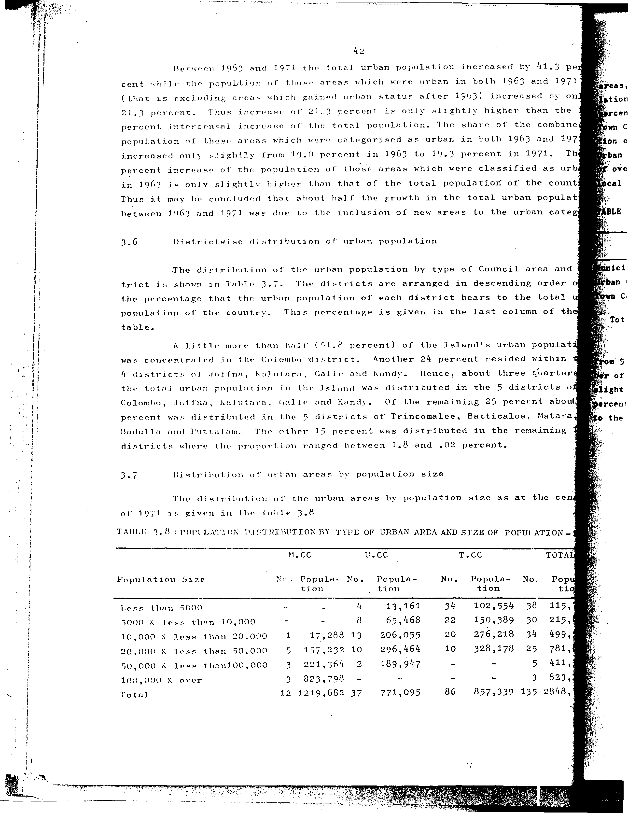

# 3.8: Population distribution by type of urban area and size of population - 1971


---

- 📜 Original PDF - [data/tables/table-3/table-3-08/original.pdf (85.5 kB)](../../../../data/tables/table-3/table-3-08/original.pdf)
- 📜 Original Image - [data/tables/table-3/table-3-08/original.image-01.png (202.1 kB)](../../../../data/tables/table-3/table-3-08/original.image-01.png)
- 📄 Extracted JSON Data - [data/tables/table-3/table-3-08/data.json (2.8 kB)](../../../../data/tables/table-3/table-3-08/data.json)
- 📄 README - [data/tables/table-3/table-3-08/README.md (1.1 kB)](../../../../data/tables/table-3/table-3-08/README.md)

## Extracted [JSON Data](../../../../data/tables/table-3/table-3-08/data.json)

```json
{
    "found": true,
    "table_no": "3.8",
    "table_name": "Population distribution by type of urban area and size of population - 1971",
    "primary_keys": [
        "Population Size"
    ],
    "field_keys": [
        "M.CC - No.",
        "M.CC - Population",
        "U.CC - No.",
        "U.CC - Population",
        "T.CC - No.",
        "T.CC - Population",
        "TOTAL - No.",
        "TOTAL - Population"
    ],
    "rows": [
        {
            "Population Size": "Less than 5000",
            "values": {
                "M.CC - No.": null,
                "M.CC - Population": null,
                "U.CC - No.": 4,
                "U.CC - Population": 13161,
                "T.CC - No.": 34,
                "T.CC - Population": 102554,
                "TOTAL - No.": 38,
                "TOTAL - Population": 115715
            }
        },
        {
            "Population Size": "5000 & less than 10,000",
            "values": {
                "M.CC - No.": null,
                "M.CC - Population": null,
                "U.CC - No.": 8,
                "U.CC - Population": 65468,
                "T.CC - No.": 22,
                "T.CC - Population": 150389,
                "TOTAL - No.": 30,
                "TOTAL - Population": 215857
            }
        },
        {
            "Population Size": "10,000 & less than 20,000",
            "values": {
                "M.CC - No.": 1,
                "M.CC - Population": 17288,
                "U.CC - No.": 13,
                "U.CC - Population": 206055,
                "T.CC - No.": 20,
                "T.CC - Population": 276218,
                "TOTAL - No.": 34,
                "TOTAL - Population": 499561
            }
        },
        {
            "Population Size": "20,000 & less than 50,000",
            "values": {
                "M.CC - No.": 5,
                "M.CC - Population": 157232,
                "U.CC - No.": 10,
                "U.CC - Population": 296464,
                "T.CC - No.": 10,
                "T.CC - Population": 328178,
                "TOTAL - No.": 25,
                "TOTAL - Population": 781874
            }
        },
        {
            "Population Size": "50,000 & less than100,000",
            "values": {
                "M.CC - No.": 3,
                "M.CC - Population": 221364,
                "U.CC - No.": 2,
                "U.CC - Population": 189947,
                "T.CC - No.": null,
                "T.CC - Population": null,
                "TOTAL - No.": 5,
                "TOTAL - Population": 411311
            }
        },
        {
            "Population Size": "100,000 & over",
            "values": {
                "M.CC - No.": 3,
                "M.CC - Population": 823798,
                "U.CC - No.": null,
                "U.CC - Population": null,
                "T.CC - No.": null,
                "T.CC - Population": null,
                "TOTAL - No.": 3,
                "TOTAL - Population": 823798
            }
        },
        {
            "Population Size": "Total",
            "values": {
                "M.CC - No.": 12,
                "M.CC - Population": 1219682,
                "U.CC - No.": 37,
                "U.CC - Population": 771095,
                "T.CC - No.": 86,
                "T.CC - Population": 857339,
                "TOTAL - No.": 135,
                "TOTAL - Population": 2848116
            }
        }
    ],
    "notes": []
}
```

## Original Table [Image](../../../../data/tables/table-3/table-3-08/original.image-01.png)



---


[](https://opensource.org/licenses/MIT)
