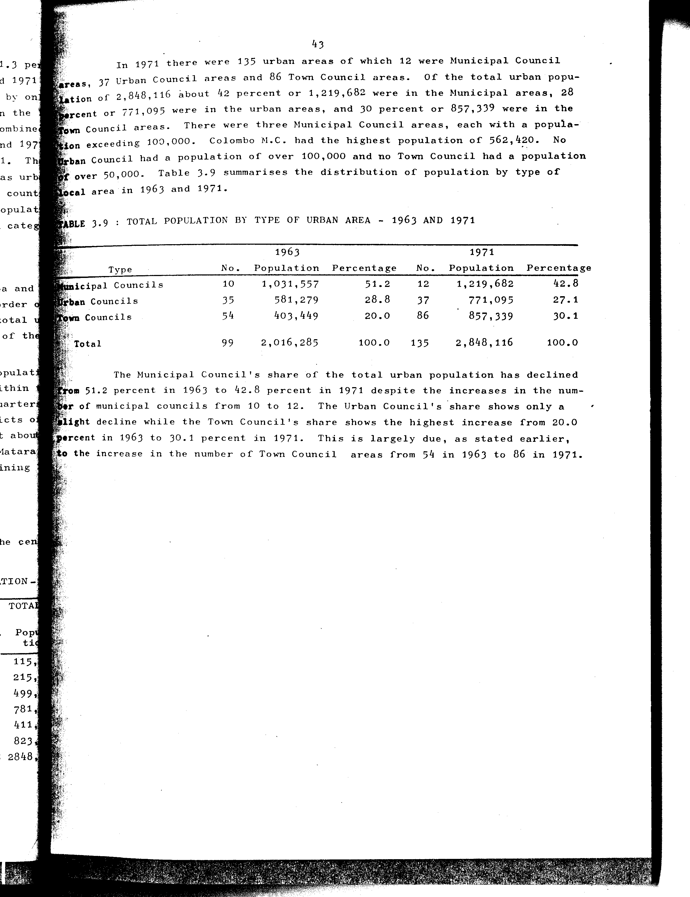

# 3.9: Total population by type of urban area - 1963 and 1971

---

- 📜 Original PDF - [data/tables/table-3/table-3-09/original.pdf (74.5 kB)](../../../../data/tables/table-3/table-3-09/original.pdf)
- 📜 Original Image - [data/tables/table-3/table-3-09/original.image-01.png (176.2 kB)](../../../../data/tables/table-3/table-3-09/original.image-01.png)
- 📄 README - [data/tables/table-3/table-3-09/README.md (918 B)](../../../../data/tables/table-3/table-3-09/README.md)

## Extracted [JSON Data](../../../../data/tables/table-3/table-3-09/data.json)

*⚠️ No data extracted yet.*
## Original Table [Image](../../../../data/tables/table-3/table-3-09/original.image-01.png)

---

