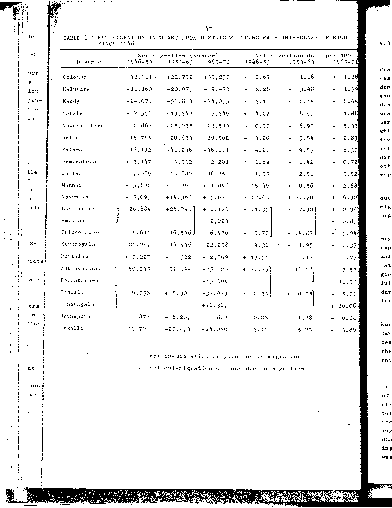

# 4.1: Net migration into and from districts during each intercensal period since 1946

---

- 📜 Original PDF - [data/tables/table-4/table-4-01/original.pdf (68.9 kB)](../../../../data/tables/table-4/table-4-01/original.pdf)
- 📜 Original Image - [data/tables/table-4/table-4-01/original.image-01.png (164.1 kB)](../../../../data/tables/table-4/table-4-01/original.image-01.png)
- 📄 README - [data/tables/table-4/table-4-01/README.md (943 B)](../../../../data/tables/table-4/table-4-01/README.md)

## Extracted [JSON Data](../../../../data/tables/table-4/table-4-01/data.json)

*⚠️ No data extracted yet.*
## Original Table [Image](../../../../data/tables/table-4/table-4-01/original.image-01.png)

---

