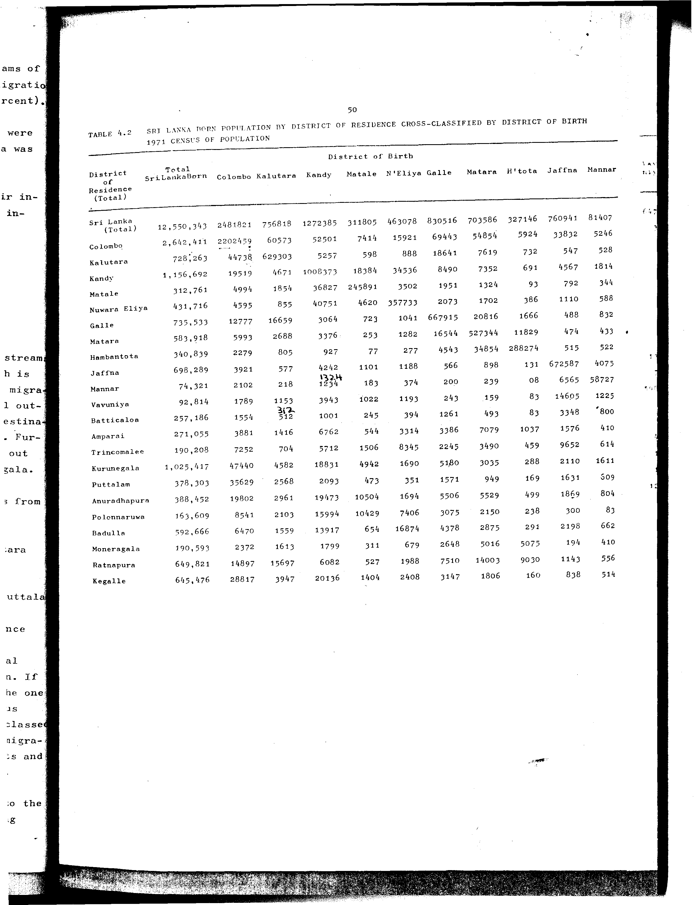

# 4.2: Sri Lanka born population by district of residence cross-classified by district of birth, 1971 census of population

---

- 📜 Original PDF - [data/tables/table-4/table-4-02/original.pdf (65.5 kB)](../../../../data/tables/table-4/table-4-02/original.pdf)
- 📜 Original Image - [data/tables/table-4/table-4-02/original.image-01.png (156.4 kB)](../../../../data/tables/table-4/table-4-02/original.image-01.png)
- 📄 README - [data/tables/table-4/table-4-02/README.md (979 B)](../../../../data/tables/table-4/table-4-02/README.md)

## Extracted [JSON Data](../../../../data/tables/table-4/table-4-02/data.json)

*⚠️ No data extracted yet.*
## Original Table [Image](../../../../data/tables/table-4/table-4-02/original.image-01.png)

---

