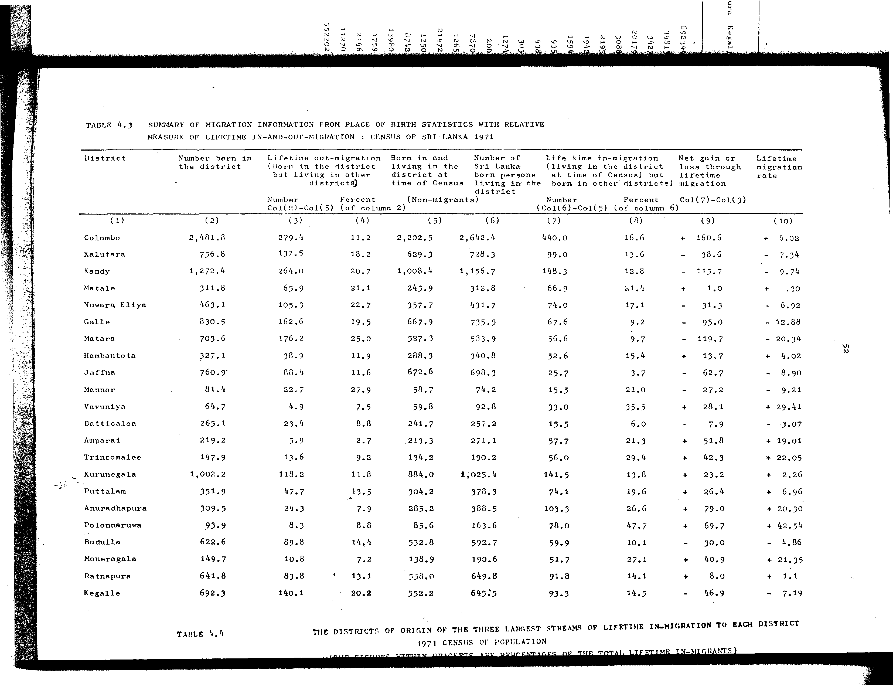

# 4.3: Summary of migration information from place of birth statistics with relative measure of lifetime in-and-out migration: census of Sri Lanka 1971


- 📜 Original Table PDF - [data/tables/table-4/table-4-03/original.pdf (65.6 kB)](../../../../data/tables/table-4/table-4-03/original.pdf)
- 📜 Original Table Image - [data/tables/table-4/table-4-03/original.images/image-01.png (158.4 kB)](../../../../data/tables/table-4/table-4-03/original.images/image-01.png)
- 📄 Extracted JSON Data - [data/tables/table-4/table-4-03/data.json (15.0 kB)](../../../../data/tables/table-4/table-4-03/data.json)
- 📄 Extracted TSV Data - [data/tables/table-4/table-4-03/data.tsv (1.7 kB)](../../../../data/tables/table-4/table-4-03/data.tsv)

## Original Table [Image](../../../../data/tables/table-4/table-4-03/original.images/image-01.png)



## Extracted [JSON Data](../../../../data/tables/table-4/table-4-03/data.json)

```json
{
    "found": true,
    "table_no": "4.3",
    "table_name": "Summary of migration information from place of birth statistics with relative measure of lifetime in-and-out migration: census of Sri Lanka 1971",
    "primary_keys": [
        "District"
    ],
    "field_keys": [
        "Number born in the district",
        "Lifetime out-migration - Number Col(2)-Col(5)",
        "Lifetime out-migration - Percent (of column 2)",
        "Born in and living in the district at time of Census (Non-migrants)",
        "Number of Sri Lanka born persons living in the district",
        "Life time in-migration - Number (Col(6)-Col(5))",
        "Life time in-migration - Percent (of column 6)",
        "Net gain or loss through lifetime migration Col(7)-Col(3)",
        "Lifetime migration rate"
    ],
    "rows": [
        {
            "District": "Colombo",
            "values": {
                "Number born in the district": 2481.8,
                "Lifetime out-migration - Number Col(2)-Col(5)": 279.4,
                "Lifetime out-migration - Percent (of column 2)": 11.2,
                "Born in and living in the district at time of Census (Non-migrants)": 2202.5,
                "Number of Sri Lanka born persons living in the district": 2642.4,
                "Life time in-migration - Number (Col(6)-Col(5))": 440.0,
                "Life time in-migration - Percent (of column 6)": 16.6,
                "Net gain or loss through lifetime migration Col(7)-Col(3)": 160.6,
                "Lifetime migration rate": 6.02
            }
        },
        {
            "District": "Kalutara",
            "values": {
                "Number born in the district": 756.8,
                "Lifetime out-migration - Number Col(2)-Col(5)": 137.5,
                "Lifetime out-migration - Percent (of column 2)": 18.2,
                "Born in and living in the district at time of Census (Non-migrants)": 629.3,
                "Number of Sri Lanka born persons living in the district": 728.3,
                "Life time in-migration - Number (Col(6)-Col(5))": 99.0,
                "Life time in-migration - Percent (of column 6)": 13.6,
                "Net gain or loss through lifetime migration Col(7)-Col(3)": -38.6,
                "Lifetime migration rate": -7.34
            }
        },
        {
            "District": "Kandy",
            "values": {
                "Number born in the district": 1272.4,
                "Lifetime out-migration - Number Col(2)-Col(5)": 264.0,
                "Lifetime out-migration - Percent (of column 2)": 20.7,
                "Born in and living in the district at time of Census (Non-migrants)": 1008.4,
                "Number of Sri Lanka born persons living in the district": 1156.7,
                "Life time in-migration - Number (Col(6)-Col(5))": 148.3,
                "Life time in-migration - Percent (of column 6)": 12.8,
                "Net gain or loss through lifetime migration Col(7)-Col(3)": -115.7,
                "Lifetime migration rate": -9.74
            }
        },
        {
            "District": "Matale",
            "values": {
                "Number born in the district": 311.8,
                "Lifetime out-migration - Number Col(2)-Col(5)": 65.9,
                "Lifetime out-migration - Percent (of column 2)": 21.1,
                "Born in and living in the district at time of Census (Non-migrants)": 245.9,
                "Number of Sri Lanka born persons living in the district": 312.8,
                "Life time in-migration - Number (Col(6)-Col(5))": 66.9,
                "Life time in-migration - Percent (of column 6)": 21.4,
                "Net gain or loss through lifetime migration Col(7)-Col(3)": 1.0,
                "Lifetime migration rate": 0.3
            }
        },
        {
            "District": "Nuwara Eliya",
            "values": {
                "Number born in the district": 463.1,
                "Lifetime out-migration - Number Col(2)-Col(5)": 105.3,
                "Lifetime out-migration - Percent (of column 2)": 22.7,
                "Born in and living in the district at time of Census (Non-migrants)": 357.7,
                "Number of Sri Lanka born persons living in the district": 431.7,
                "Life time in-migration - Number (Col(6)-Col(5))": 74.0,
                "Life time in-migration - Percent (of column 6)": 17.1,
                "Net gain or loss through lifetime migration Col(7)-Col(3)": -31.3,
                "Lifetime migration rate": -6.92
            }
        },
        {
            "District": "Galle",
            "values": {
                "Number born in the district": 830.5,
                "Lifetime out-migration - Number Col(2)-Col(5)": 162.6,
                "Lifetime out-migration - Percent (of column 2)": 19.5,
                "Born in and living in the district at time of Census (Non-migrants)": 667.9,
                "Number of Sri Lanka born persons living in the district": 735.5,
                "Life time in-migration - Number (Col(6)-Col(5))": 67.6,
                "Life time in-migration - Percent (of column 6)": 9.2,
                "Net gain or loss through lifetime migration Col(7)-Col(3)": -95.0,
                "Lifetime migration rate": -12.88
            }
        },
        {
            "District": "Matara",
            "values": {
                "Number born in the district": 703.6,
                "Lifetime out-migration - Number Col(2)-Col(5)": 176.2,
                "Lifetime out-migration - Percent (of column 2)": 25.0,
                "Born in and living in the district at time of Census (Non-migrants)": 527.3,
                "Number of Sri Lanka born persons living in the district": 583.9,
                "Life time in-migration - Number (Col(6)-Col(5))": 56.6,
                "Life time in-migration - Percent (of column 6)": 9.7,
                "Net gain or loss through lifetime migration Col(7)-Col(3)": -119.7,
                "Lifetime migration rate": -20.34
            }
        },
        {
            "District": "Hambantota",
            "values": {
                "Number born in the district": 327.1,
                "Lifetime out-migration - Number Col(2)-Col(5)": 38.9,
                "Lifetime out-migration - Percent (of column 2)": 11.9,
                "Born in and living in the district at time of Census (Non-migrants)": 288.3,
                "Number of Sri Lanka born persons living in the district": 340.8,
                "Life time in-migration - Number (Col(6)-Col(5))": 52.6,
                "Life time in-migration - Percent (of column 6)": 15.4,
                "Net gain or loss through lifetime migration Col(7)-Col(3)": 13.7,
                "Lifetime migration rate": 4.02
            }
        },
        {
            "District": "Jaffna",
            "values": {
                "Number born in the district": 760.9,
                "Lifetime out-migration - Number Col(2)-Col(5)": 88.4,
                "Lifetime out-migration - Percent (of column 2)": 11.6,
                "Born in and living in the district at time of Census (Non-migrants)": 672.6,
                "Number of Sri Lanka born persons living in the district": 698.3,
                "Life time in-migration - Number (Col(6)-Col(5))": 25.7,
                "Life time in-migration - Percent (of column 6)": 3.7,
                "Net gain or loss through lifetime migration Col(7)-Col(3)": -62.7,
                "Lifetime migration rate": -8.9
            }
        },
        {
            "District": "Mannar",
            "values": {
                "Number born in the district": 81.4,
                "Lifetime out-migration - Number Col(2)-Col(5)": 22.7,
                "Lifetime out-migration - Percent (of column 2)": 27.9,
                "Born in and living in the district at time of Census (Non-migrants)": 58.7,
                "Number of Sri Lanka born persons living in the district": 74.2,
                "Life time in-migration - Number (Col(6)-Col(5))": 15.5,
                "Life time in-migration - Percent (of column 6)": 21.0,
                "Net gain or loss through lifetime migration Col(7)-Col(3)": -27.2,
                "Lifetime migration rate": -9.21
            }
        },
        {
            "District": "Vavuniya",
            "values": {
                "Number born in the district": 64.7,
                "Lifetime out-migration - Number Col(2)-Col(5)": 4.9,
                "Lifetime out-migration - Percent (of column 2)": 7.5,
                "Born in and living in the district at time of Census (Non-migrants)": 59.8,
                "Number of Sri Lanka born persons living in the district": 92.8,
                "Life time in-migration - Number (Col(6)-Col(5))": 33.0,
                "Life time in-migration - Percent (of column 6)": 35.5,
                "Net gain or loss through lifetime migration Col(7)-Col(3)": 28.1,
                "Lifetime migration rate": 29.41
            }
        },
        {
            "District": "Batticaloa",
            "values": {
                "Number born in the district": 265.1,
                "Lifetime out-migration - Number Col(2)-Col(5)": 23.4,
                "Lifetime out-migration - Percent (of column 2)": 8.8,
                "Born in and living in the district at time of Census (Non-migrants)": 241.7,
                "Number of Sri Lanka born persons living in the district": 257.2,
                "Life time in-migration - Number (Col(6)-Col(5))": 15.5,
                "Life time in-migration - Percent (of column 6)": 6.0,
                "Net gain or loss through lifetime migration Col(7)-Col(3)": -7.9,
                "Lifetime migration rate": -3.07
            }
        },
        {
            "District": "Amparai",
            "values": {
                "Number born in the district": 219.2,
                "Lifetime out-migration - Number Col(2)-Col(5)": 5.9,
                "Lifetime out-migration - Percent (of column 2)": 2.7,
                "Born in and living in the district at time of Census (Non-migrants)": 213.3,
                "Number of Sri Lanka born persons living in the district": 271.1,
                "Life time in-migration - Number (Col(6)-Col(5))": 57.7,
                "Life time in-migration - Percent (of column 6)": 21.3,
                "Net gain or loss through lifetime migration Col(7)-Col(3)": 51.8,
                "Lifetime migration rate": 19.01
            }
        },
        {
            "District": "Trincomalee",
            "values": {
                "Number born in the district": 147.9,
                "Lifetime out-migration - Number Col(2)-Col(5)": 13.6,
                "Lifetime out-migration - Percent (of column 2)": 9.2,
                "Born in and living in the district at time of Census (Non-migrants)": 134.2,
                "Number of Sri Lanka born persons living in the district": 190.2,
                "Life time in-migration - Number (Col(6)-Col(5))": 56.0,
                "Life time in-migration - Percent (of column 6)": 29.4,
                "Net gain or loss through lifetime migration Col(7)-Col(3)": 42.3,
                "Lifetime migration rate": 22.05
            }
        },
        {
            "District": "Kurunegala",
            "values": {
                "Number born in the district": 1002.2,
                "Lifetime out-migration - Number Col(2)-Col(5)": 118.2,
                "Lifetime out-migration - Percent (of column 2)": 11.8,
                "Born in and living in the district at time of Census (Non-migrants)": 884.0,
                "Number of Sri Lanka born persons living in the district": 1025.4,
                "Life time in-migration - Number (Col(6)-Col(5))": 141.5,
                "Life time in-migration - Percent (of column 6)": 13.8,
                "Net gain or loss through lifetime migration Col(7)-Col(3)": 23.2,
                "Lifetime migration rate": 2.26
            }
        },
        {
            "District": "Puttalam",
            "values": {
                "Number born in the district": 351.9,
                "Lifetime out-migration - Number Col(2)-Col(5)": 47.7,
                "Lifetime out-migration - Percent (of column 2)": 13.5,
                "Born in and living in the district at time of Census (Non-migrants)": 304.2,
                "Number of Sri Lanka born persons living in the district": 378.3,
                "Life time in-migration - Number (Col(6)-Col(5))": 74.1,
                "Life time in-migration - Percent (of column 6)": 19.6,
                "Net gain or loss through lifetime migration Col(7)-Col(3)": 26.4,
                "Lifetime migration rate": 6.96
            }
        },
        {
            "District": "Anuradhapura",
            "values": {
                "Number born in the district": 309.5,
                "Lifetime out-migration - Number Col(2)-Col(5)": 24.3,
                "Lifetime out-migration - Percent (of column 2)": 7.9,
                "Born in and living in the district at time of Census (Non-migrants)": 285.2,
                "Number of Sri Lanka born persons living in the district": 388.5,
                "Life time in-migration - Number (Col(6)-Col(5))": 103.3,
                "Life time in-migration - Percent (of column 6)": 26.6,
                "Net gain or loss through lifetime migration Col(7)-Col(3)": 79.0,
                "Lifetime migration rate": 20.3
            }
        },
        {
            "District": "Polonnaruwa",
            "values": {
                "Number born in the district": 93.9,
                "Lifetime out-migration - Number Col(2)-Col(5)": 8.3,
                "Lifetime out-migration - Percent (of column 2)": 8.8,
                "Born in and living in the district at time of Census (Non-migrants)": 85.6,
                "Number of Sri Lanka born persons living in the district": 163.6,
                "Life time in-migration - Number (Col(6)-Col(5))": 78.0,
                "Life time in-migration - Percent (of column 6)": 47.7,
                "Net gain or loss through lifetime migration Col(7)-Col(3)": 69.7,
                "Lifetime migration rate": 42.54
            }
        },
        {
            "District": "Badulla",
            "values": {
                "Number born in the district": 622.6,
                "Lifetime out-migration - Number Col(2)-Col(5)": 89.8,
                "Lifetime out-migration - Percent (of column 2)": 14.4,
                "Born in and living in the district at time of Census (Non-migrants)": 532.8,
                "Number of Sri Lanka born persons living in the district": 592.7,
                "Life time in-migration - Number (Col(6)-Col(5))": 59.9,
                "Life time in-migration - Percent (of column 6)": 10.1,
                "Net gain or loss through lifetime migration Col(7)-Col(3)": -30.0,
                "Lifetime migration rate": -4.86
            }
        },
        {
            "District": "Moneragala",
            "values": {
                "Number born in the district": 149.7,
                "Lifetime out-migration - Number Col(2)-Col(5)": 10.8,
                "Lifetime out-migration - Percent (of column 2)": 7.2,
                "Born in and living in the district at time of Census (Non-migrants)": 138.9,
                "Number of Sri Lanka born persons living in the district": 190.6,
                "Life time in-migration - Number (Col(6)-Col(5))": 51.7,
                "Life time in-migration - Percent (of column 6)": 27.1,
                "Net gain or loss through lifetime migration Col(7)-Col(3)": 40.9,
                "Lifetime migration rate": 21.35
            }
        },
        {
            "District": "Ratnapura",
            "values": {
                "Number born in the district": 641.8,
                "Lifetime out-migration - Number Col(2)-Col(5)": 83.8,
                "Lifetime out-migration - Percent (of column 2)": 13.1,
                "Born in and living in the district at time of Census (Non-migrants)": 558.0,
                "Number of Sri Lanka born persons living in the district": 649.8,
                "Life time in-migration - Number (Col(6)-Col(5))": 91.8,
                "Life time in-migration - Percent (of column 6)": 14.1,
                "Net gain or loss through lifetime migration Col(7)-Col(3)": 8.0,
                "Lifetime migration rate": 1.1
            }
        },
        {
            "District": "Kegalle",
            "values": {
                "Number born in the district": 692.3,
                "Lifetime out-migration - Number Col(2)-Col(5)": 140.1,
                "Lifetime out-migration - Percent (of column 2)": 20.2,
                "Born in and living in the district at time of Census (Non-migrants)": 552.2,
                "Number of Sri Lanka born persons living in the district": 645.5,
                "Life time in-migration - Number (Col(6)-Col(5))": 93.3,
                "Life time in-migration - Percent (of column 6)": 14.5,
                "Net gain or loss through lifetime migration Col(7)-Col(3)": -46.9,
                "Lifetime migration rate": -7.19
            }
        }
    ],
    "notes": []
}
```

## Extracted [TSV Data](../../../../data/tables/table-4/table-4-03/data.tsv)

| District | Number born in the district | Lifetime out-migration - Number Col(2)-Col(5) | Lifetime out-migration - Percent (of column 2) | Born in and living in the district at time of Census (Non-migrants) | Number of Sri Lanka born persons living in the district | Life time in-migration - Number (Col(6)-Col(5)) | Life time in-migration - Percent (of column 6) | Net gain or loss through lifetime migration Col(7)-Col(3) | Lifetime migration rate |
| --- | --- | --- | --- | --- | --- | --- | --- | --- | --- |
| Colombo | 2481.8 | 279.4 | 11.2 | 2202.5 | 2642.4 | 440.0 | 16.6 | 160.6 | 6.02 |
| Kalutara | 756.8 | 137.5 | 18.2 | 629.3 | 728.3 | 99.0 | 13.6 | -38.6 | -7.34 |
| Kandy | 1272.4 | 264.0 | 20.7 | 1008.4 | 1156.7 | 148.3 | 12.8 | -115.7 | -9.74 |
| Matale | 311.8 | 65.9 | 21.1 | 245.9 | 312.8 | 66.9 | 21.4 | 1.0 | 0.3 |
| Nuwara Eliya | 463.1 | 105.3 | 22.7 | 357.7 | 431.7 | 74.0 | 17.1 | -31.3 | -6.92 |
| Galle | 830.5 | 162.6 | 19.5 | 667.9 | 735.5 | 67.6 | 9.2 | -95.0 | -12.88 |
| Matara | 703.6 | 176.2 | 25.0 | 527.3 | 583.9 | 56.6 | 9.7 | -119.7 | -20.34 |
| Hambantota | 327.1 | 38.9 | 11.9 | 288.3 | 340.8 | 52.6 | 15.4 | 13.7 | 4.02 |
| Jaffna | 760.9 | 88.4 | 11.6 | 672.6 | 698.3 | 25.7 | 3.7 | -62.7 | -8.9 |
| Mannar | 81.4 | 22.7 | 27.9 | 58.7 | 74.2 | 15.5 | 21.0 | -27.2 | -9.21 |
| Vavuniya | 64.7 | 4.9 | 7.5 | 59.8 | 92.8 | 33.0 | 35.5 | 28.1 | 29.41 |
| Batticaloa | 265.1 | 23.4 | 8.8 | 241.7 | 257.2 | 15.5 | 6.0 | -7.9 | -3.07 |
| Amparai | 219.2 | 5.9 | 2.7 | 213.3 | 271.1 | 57.7 | 21.3 | 51.8 | 19.01 |
| Trincomalee | 147.9 | 13.6 | 9.2 | 134.2 | 190.2 | 56.0 | 29.4 | 42.3 | 22.05 |
| Kurunegala | 1002.2 | 118.2 | 11.8 | 884.0 | 1025.4 | 141.5 | 13.8 | 23.2 | 2.26 |
| Puttalam | 351.9 | 47.7 | 13.5 | 304.2 | 378.3 | 74.1 | 19.6 | 26.4 | 6.96 |
| Anuradhapura | 309.5 | 24.3 | 7.9 | 285.2 | 388.5 | 103.3 | 26.6 | 79.0 | 20.3 |
| Polonnaruwa | 93.9 | 8.3 | 8.8 | 85.6 | 163.6 | 78.0 | 47.7 | 69.7 | 42.54 |
| Badulla | 622.6 | 89.8 | 14.4 | 532.8 | 592.7 | 59.9 | 10.1 | -30.0 | -4.86 |
| Moneragala | 149.7 | 10.8 | 7.2 | 138.9 | 190.6 | 51.7 | 27.1 | 40.9 | 21.35 |
| Ratnapura | 641.8 | 83.8 | 13.1 | 558.0 | 649.8 | 91.8 | 14.1 | 8.0 | 1.1 |
| Kegalle | 692.3 | 140.1 | 20.2 | 552.2 | 645.5 | 93.3 | 14.5 | -46.9 | -7.19 |


[](https://opensource.org/licenses/MIT)
