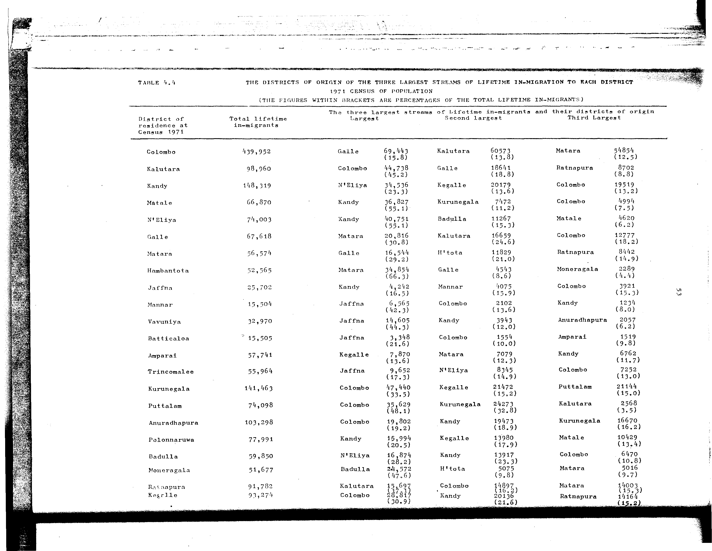

# 4.4: The districts of origin of the three largest streams of lifetime in-migration to each district, 1971 census of population

---

- 📜 Original PDF - [data/tables/table-4/table-4-04/original.pdf (83.2 kB)](../../../../data/tables/table-4/table-4-04/original.pdf)
- 📜 Original Image - [data/tables/table-4/table-4-04/original.image-01.png (182.6 kB)](../../../../data/tables/table-4/table-4-04/original.image-01.png)
- 📄 README - [data/tables/table-4/table-4-04/README.md (985 B)](../../../../data/tables/table-4/table-4-04/README.md)

## Extracted [JSON Data](../../../../data/tables/table-4/table-4-04/data.json)

*⚠️ No data extracted yet.*
## Original Table [Image](../../../../data/tables/table-4/table-4-04/original.image-01.png)

---

