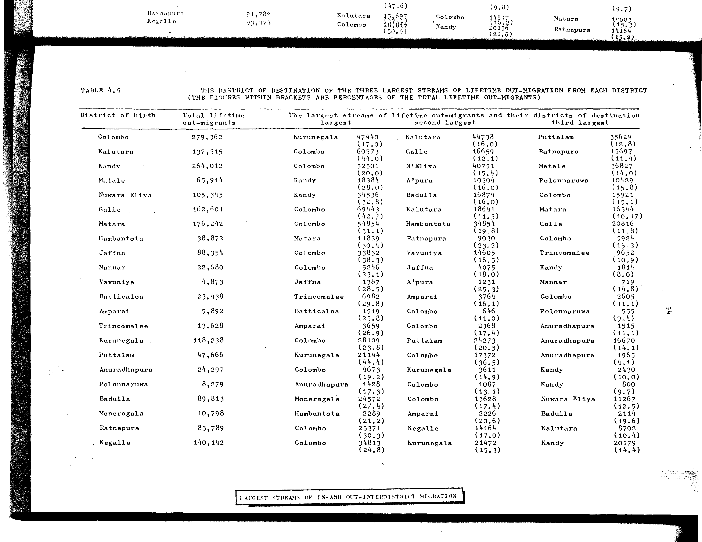

# 4.5: The district of destination of the three largest streams of lifetime out-migration from each district


- 📜 Original Table PDF - [data/tables/table-4/table-4-05/original.pdf (73.3 kB)](../../../../data/tables/table-4/table-4-05/original.pdf)
- 📜 Original Table Image - [data/tables/table-4/table-4-05/original.images/image-01.png (181.1 kB)](../../../../data/tables/table-4/table-4-05/original.images/image-01.png)
- 📄 Extracted JSON Data - [data/tables/table-4/table-4-05/data.json (10.9 kB)](../../../../data/tables/table-4/table-4-05/data.json)
- 📄 Extracted Normalized JSON Data - [data/tables/table-4/table-4-05/normalized_data.json (9.7 kB)](../../../../data/tables/table-4/table-4-05/normalized_data.json)
- 📄 Extracted TSV Data - [data/tables/table-4/table-4-05/data.tsv (1.9 kB)](../../../../data/tables/table-4/table-4-05/data.tsv)

## Original Table [Image](../../../../data/tables/table-4/table-4-05/original.images/image-01.png)



## Extracted [TSV Data](../../../../data/tables/table-4/table-4-05/data.tsv)

| District of birth | Total lifetime out-migrants | largest | largest - value | largest - percentage | second largest | second largest - value | second largest - percentage | third largest | third largest - value | third largest - percentage |
| --- | --- | --- | --- | --- | --- | --- | --- | --- | --- | --- |
| Colombo | 279362 | Kurunegala | 47440 | 17.0 | Kalutara | 44738 | 16.0 | Puttalam | 35629 | 12.8 |
| Kalutara | 137515 | Colombo | 60573 | 44.0 | Galle | 16659 | 12.1 | Ratnapura | 15697 | 11.4 |
| Kandy | 264012 | Colombo | 52501 | 20.0 | N'Eliya | 40751 | 15.4 | Matale | 36827 | 14.0 |
| Matale | 65914 | Kandy | 18384 | 28.0 | A'pura | 10504 | 16.0 | Polonnaruwa | 10429 | 15.8 |
| Nuwara Eliya | 105345 | Kandy | 34536 | 32.8 | Badulla | 16874 | 16.0 | Colombo | 15921 | 15.1 |
| Galle | 162601 | Colombo | 69443 | 42.7 | Kalutara | 18641 | 11.5 | Matara | 16544 | 10.17 |
| Matara | 176242 | Colombo | 54854 | 31.1 | Hambantota | 34854 | 19.8 | Galle | 20816 | 11.8 |
| Hambantota | 38872 | Matara | 11829 | 30.4 | Ratnapura | 9030 | 23.2 | Colombo | 5924 | 15.2 |
| Jaffna | 88354 | Colombo | 33832 | 38.3 | Vavuniya | 14605 | 16.5 | Trincomalee | 9652 | 10.9 |
| Mannar | 22680 | Colombo | 5246 | 23.1 | Jaffna | 4075 | 18.0 | Kandy | 1814 | 8.0 |
| Vavuniya | 4873 | Jaffna | 1387 | 28.5 | A'pura | 1231 | 25.3 | Mannar | 719 | 14.8 |
| Batticaloa | 23438 | Trincomalee | 6982 | 29.8 | Amparai | 3764 | 16.1 | Colombo | 2605 | 11.1 |
| Amparai | 5892 | Batticaloa | 1519 | 25.8 | Colombo | 646 | 11.0 | Polonnaruwa | 555 | 9.4 |
| Trincomalee | 13628 | Amparai | 3659 | 26.9 | Colombo | 2368 | 17.4 | Anuradhapura | 1515 | 11.1 |
| Kurunegala | 118238 | Colombo | 28109 | 23.8 | Puttalam | 24273 | 20.5 | Anuradhapura | 16670 | 14.1 |
| Puttalam | 47666 | Kurunegala | 21144 | 44.4 | Colombo | 17372 | 36.5 | Anuradhapura | 1965 | 4.1 |
| Anuradhapura | 24297 | Colombo | 4673 | 19.2 | Kurunegala | 3611 | 14.9 | Kandy | 2430 | 10.0 |
| Polonnaruwa | 8279 | Anuradhapura | 1428 | 17.3 | Colombo | 1087 | 13.1 | Kandy | 800 | 9.7 |
| Badulla | 89813 | Moneragala | 24572 | 27.4 | Colombo | 15628 | 17.4 | Nuwara Eliya | 11267 | 12.5 |
| Moneragala | 10798 | Hambantota | 2289 | 21.2 | Amparai | 2226 | 20.6 | Badulla | 2114 | 19.6 |
| Ratnapura | 83789 | Colombo | 25371 | 30.3 | Kegalle | 14164 | 17.0 | Kalutara | 8702 | 10.4 |
| Kegalle | 140142 | Colombo | 34813 | 24.8 | Kurunegala | 21472 | 15.3 | Kandy | 20179 | 14.4 |

## Extracted [JSON Data](../../../../data/tables/table-4/table-4-05/data.json)

```json
{
    "found": true,
    "table_no": "4.5",
    "table_name": "The district of destination of the three largest streams of lifetime out-migration from each district",
    "primary_keys": [
        "District of birth"
    ],
    "field_keys": [
        "Total lifetime out-migrants",
        "largest",
        "largest - value",
        "largest - percentage",
        "second largest",
        "second largest - value",
        "second largest - percentage",
        "third largest",
        "third largest - value",
        "third largest - percentage"
    ],
    "rows": [
        {
            "District of birth": "Colombo",
            "values": {
                "Total lifetime out-migrants": 279362,
                "largest": "Kurunegala",
                "largest - value": 47440,
                "largest - percentage": 17.0,
                "second largest": "Kalutara",
                "second largest - value": 44738,
                "second largest - percentage": 16.0,
                "third largest": "Puttalam",
                "third largest - value": 35629,
                "third largest - percentage": 12.8
            }
        },
        {
            "District of birth": "Kalutara",
            "values": {
                "Total lifetime out-migrants": 137515,
                "largest": "Colombo",
                "largest - value": 60573,
                "largest - percentage": 44.0,
                "second largest": "Galle",
                "second largest - value": 16659,
                "second largest - percentage": 12.1,
                "third largest": "Ratnapura",
                "third largest - value": 15697,
                "third largest - percentage": 11.4
            }
        },
        {
            "District of birth": "Kandy",
            "values": {
                "Total lifetime out-migrants": 264012,
                "largest": "Colombo",
                "largest - value": 52501,
                "largest - percentage": 20.0,
                "second largest": "N'Eliya",
                "second largest - value": 40751,
                "second largest - percentage": 15.4,
                "third largest": "Matale",
                "third largest - value": 36827,
                "third largest - percentage": 14.0
            }
        },
        {
            "District of birth": "Matale",
            "values": {
                "Total lifetime out-migrants": 65914,
                "largest": "Kandy",
                "largest - value": 18384,
                "largest - percentage": 28.0,
                "second largest": "A'pura",
                "second largest - value": 10504,
                "second largest - percentage": 16.0,
                "third largest": "Polonnaruwa",
                "third largest - value": 10429,
                "third largest - percentage": 15.8
            }
        },
        {
            "District of birth": "Nuwara Eliya",
            "values": {
                "Total lifetime out-migrants": 105345,
                "largest": "Kandy",
                "largest - value": 34536,
                "largest - percentage": 32.8,
                "second largest": "Badulla",
                "second largest - value": 16874,
                "second largest - percentage": 16.0,
                "third largest": "Colombo",
                "third largest - value": 15921,
                "third largest - percentage": 15.1
            }
        },
        {
            "District of birth": "Galle",
            "values": {
                "Total lifetime out-migrants": 162601,
                "largest": "Colombo",
                "largest - value": 69443,
                "largest - percentage": 42.7,
                "second largest": "Kalutara",
                "second largest - value": 18641,
                "second largest - percentage": 11.5,
                "third largest": "Matara",
                "third largest - value": 16544,
                "third largest - percentage": 10.17
            }
        },
        {
            "District of birth": "Matara",
            "values": {
                "Total lifetime out-migrants": 176242,
                "largest": "Colombo",
                "largest - value": 54854,
                "largest - percentage": 31.1,
                "second largest": "Hambantota",
                "second largest - value": 34854,
                "second largest - percentage": 19.8,
                "third largest": "Galle",
                "third largest - value": 20816,
                "third largest - percentage": 11.8
            }
        },
        {
            "District of birth": "Hambantota",
            "values": {
                "Total lifetime out-migrants": 38872,
                "largest": "Matara",
                "largest - value": 11829,
                "largest - percentage": 30.4,
                "second largest": "Ratnapura",
                "second largest - value": 9030,
                "second largest - percentage": 23.2,
                "third largest": "Colombo",
                "third largest - value": 5924,
                "third largest - percentage": 15.2
            }
        },
        {
            "District of birth": "Jaffna",
            "values": {
                "Total lifetime out-migrants": 88354,
                "largest": "Colombo",
                "largest - value": 33832,
                "largest - percentage": 38.3,
                "second largest": "Vavuniya",
                "second largest - value": 14605,
                "second largest - percentage": 16.5,
                "third largest": "Trincomalee",
                "third largest - value": 9652,
                "third largest - percentage": 10.9
            }
        },
        {
            "District of birth": "Mannar",
            "values": {
                "Total lifetime out-migrants": 22680,
                "largest": "Colombo",
                "largest - value": 5246,
                "largest - percentage": 23.1,
                "second largest": "Jaffna",
                "second largest - value": 4075,
                "second largest - percentage": 18.0,
                "third largest": "Kandy",
                "third largest - value": 1814,
                "third largest - percentage": 8.0
            }
        },
        {
            "District of birth": "Vavuniya",
            "values": {
                "Total lifetime out-migrants": 4873,
                "largest": "Jaffna",
                "largest - value": 1387,
                "largest - percentage": 28.5,
                "second largest": "A'pura",
                "second largest - value": 1231,
                "second largest - percentage": 25.3,
                "third largest": "Mannar",
                "third largest - value": 719,
                "third largest - percentage": 14.8
            }
        },
        {
            "District of birth": "Batticaloa",
            "values": {
                "Total lifetime out-migrants": 23438,
                "largest": "Trincomalee",
                "largest - value": 6982,
                "largest - percentage": 29.8,
                "second largest": "Amparai",
                "second largest - value": 3764,
                "second largest - percentage": 16.1,
                "third largest": "Colombo",
                "third largest - value": 2605,
                "third largest - percentage": 11.1
            }
        },
        {
            "District of birth": "Amparai",
            "values": {
                "Total lifetime out-migrants": 5892,
                "largest": "Batticaloa",
                "largest - value": 1519,
                "largest - percentage": 25.8,
                "second largest": "Colombo",
                "second largest - value": 646,
                "second largest - percentage": 11.0,
                "third largest": "Polonnaruwa",
                "third largest - value": 555,
                "third largest - percentage": 9.4
            }
        },
        {
            "District of birth": "Trincomalee",
            "values": {
                "Total lifetime out-migrants": 13628,
                "largest": "Amparai",
                "largest - value": 3659,
                "largest - percentage": 26.9,
                "second largest": "Colombo",
                "second largest - value": 2368,
                "second largest - percentage": 17.4,
                "third largest": "Anuradhapura",
                "third largest - value": 1515,
                "third largest - percentage": 11.1
            }
        },
        {
            "District of birth": "Kurunegala",
            "values": {
                "Total lifetime out-migrants": 118238,
                "largest": "Colombo",
                "largest - value": 28109,
                "largest - percentage": 23.8,
                "second largest": "Puttalam",
                "second largest - value": 24273,
                "second largest - percentage": 20.5,
                "third largest": "Anuradhapura",
                "third largest - value": 16670,
                "third largest - percentage": 14.1
            }
        },
        {
            "District of birth": "Puttalam",
            "values": {
                "Total lifetime out-migrants": 47666,
                "largest": "Kurunegala",
                "largest - value": 21144,
                "largest - percentage": 44.4,
                "second largest": "Colombo",
                "second largest - value": 17372,
                "second largest - percentage": 36.5,
                "third largest": "Anuradhapura",
                "third largest - value": 1965,
                "third largest - percentage": 4.1
            }
        },
        {
            "District of birth": "Anuradhapura",
            "values": {
                "Total lifetime out-migrants": 24297,
                "largest": "Colombo",
                "largest - value": 4673,
                "largest - percentage": 19.2,
                "second largest": "Kurunegala",
                "second largest - value": 3611,
                "second largest - percentage": 14.9,
                "third largest": "Kandy",
                "third largest - value": 2430,
                "third largest - percentage": 10.0
            }
        },
        {
            "District of birth": "Polonnaruwa",
            "values": {
                "Total lifetime out-migrants": 8279,
                "largest": "Anuradhapura",
                "largest - value": 1428,
                "largest - percentage": 17.3,
                "second largest": "Colombo",
                "second largest - value": 1087,
                "second largest - percentage": 13.1,
                "third largest": "Kandy",
                "third largest - value": 800,
                "third largest - percentage": 9.7
            }
        },
        {
            "District of birth": "Badulla",
            "values": {
                "Total lifetime out-migrants": 89813,
                "largest": "Moneragala",
                "largest - value": 24572,
                "largest - percentage": 27.4,
                "second largest": "Colombo",
                "second largest - value": 15628,
                "second largest - percentage": 17.4,
                "third largest": "Nuwara Eliya",
                "third largest - value": 11267,
                "third largest - percentage": 12.5
            }
        },
        {
            "District of birth": "Moneragala",
            "values": {
                "Total lifetime out-migrants": 10798,
                "largest": "Hambantota",
                "largest - value": 2289,
                "largest - percentage": 21.2,
                "second largest": "Amparai",
                "second largest - value": 2226,
                "second largest - percentage": 20.6,
                "third largest": "Badulla",
                "third largest - value": 2114,
                "third largest - percentage": 19.6
            }
        },
        {
            "District of birth": "Ratnapura",
            "values": {
                "Total lifetime out-migrants": 83789,
                "largest": "Colombo",
                "largest - value": 25371,
                "largest - percentage": 30.3,
                "second largest": "Kegalle",
                "second largest - value": 14164,
                "second largest - percentage": 17.0,
                "third largest": "Kalutara",
                "third largest - value": 8702,
                "third largest - percentage": 10.4
            }
        },
        {
            "District of birth": "Kegalle",
            "values": {
                "Total lifetime out-migrants": 140142,
                "largest": "Colombo",
                "largest - value": 34813,
                "largest - percentage": 24.8,
                "second largest": "Kurunegala",
                "second largest - value": 21472,
                "second largest - percentage": 15.3,
                "third largest": "Kandy",
                "third largest - value": 20179,
                "third largest - percentage": 14.4
            }
        }
    ],
    "notes": [
        "THE FIGURES WITHIN BRACKETS ARE PERCENTAGES OF THE TOTAL LIFETIME OUT-MIGRANTS"
    ]
}
```

## Extracted [Normalized JSON Data](../../../../data/tables/table-4/table-4-05/normalized_data.json)

```json
[
    {
        "District of birth": "Colombo",
        "values": {
            "Total lifetime out-migrants": 279362,
            "largest": "Kurunegala",
            "largest - value": 47440,
            "largest - percentage": 17.0,
            "second largest": "Kalutara",
            "second largest - value": 44738,
            "second largest - percentage": 16.0,
            "third largest": "Puttalam",
            "third largest - value": 35629,
            "third largest - percentage": 12.8
        }
    },
    {
        "District of birth": "Kalutara",
        "values": {
            "Total lifetime out-migrants": 137515,
            "largest": "Colombo",
            "largest - value": 60573,
            "largest - percentage": 44.0,
            "second largest": "Galle",
            "second largest - value": 16659,
            "second largest - percentage": 12.1,
            "third largest": "Ratnapura",
            "third largest - value": 15697,
            "third largest - percentage": 11.4
        }
    },
    {
        "District of birth": "Kandy",
        "values": {
            "Total lifetime out-migrants": 264012,
            "largest": "Colombo",
            "largest - value": 52501,
            "largest - percentage": 20.0,
            "second largest": "N'Eliya",
            "second largest - value": 40751,
            "second largest - percentage": 15.4,
            "third largest": "Matale",
            "third largest - value": 36827,
            "third largest - percentage": 14.0
        }
    },
    {
        "District of birth": "Matale",
        "values": {
            "Total lifetime out-migrants": 65914,
            "largest": "Kandy",
            "largest - value": 18384,
            "largest - percentage": 28.0,
            "second largest": "A'pura",
            "second largest - value": 10504,
            "second largest - percentage": 16.0,
            "third largest": "Polonnaruwa",
            "third largest - value": 10429,
            "third largest - percentage": 15.8
        }
    },
    {
        "District of birth": "Nuwara Eliya",
        "values": {
            "Total lifetime out-migrants": 105345,
            "largest": "Kandy",
            "largest - value": 34536,
            "largest - percentage": 32.8,
            "second largest": "Badulla",
            "second largest - value": 16874,
            "second largest - percentage": 16.0,
            "third largest": "Colombo",
            "third largest - value": 15921,
            "third largest - percentage": 15.1
        }
    },
    {
        "District of birth": "Galle",
        "values": {
            "Total lifetime out-migrants": 162601,
            "largest": "Colombo",
            "largest - value": 69443,
            "largest - percentage": 42.7,
            "second largest": "Kalutara",
            "second largest - value": 18641,
            "second largest - percentage": 11.5,
            "third largest": "Matara",
            "third largest - value": 16544,
            "third largest - percentage": 10.17
        }
    },
    {
        "District of birth": "Matara",
        "values": {
            "Total lifetime out-migrants": 176242,
            "largest": "Colombo",
            "largest - value": 54854,
            "largest - percentage": 31.1,
            "second largest": "Hambantota",
            "second largest - value": 34854,
            "second largest - percentage": 19.8,
            "third largest": "Galle",
            "third largest - value": 20816,
            "third largest - percentage": 11.8
        }
    },
    {
        "District of birth": "Hambantota",
        "values": {
            "Total lifetime out-migrants": 38872,
            "largest": "Matara",
            "largest - value": 11829,
            "largest - percentage": 30.4,
            "second largest": "Ratnapura",
            "second largest - value": 9030,
            "second largest - percentage": 23.2,
            "third largest": "Colombo",
            "third largest - value": 5924,
            "third largest - percentage": 15.2
        }
    },
    {
        "District of birth": "Jaffna",
        "values": {
            "Total lifetime out-migrants": 88354,
            "largest": "Colombo",
            "largest - value": 33832,
            "largest - percentage": 38.3,
            "second largest": "Vavuniya",
            "second largest - value": 14605,
            "second largest - percentage": 16.5,
            "third largest": "Trincomalee",
            "third largest - value": 9652,
            "third largest - percentage": 10.9
        }
    },
    {
        "District of birth": "Mannar",
        "values": {
            "Total lifetime out-migrants": 22680,
            "largest": "Colombo",
            "largest - value": 5246,
            "largest - percentage": 23.1,
            "second largest": "Jaffna",
            "second largest - value": 4075,
            "second largest - percentage": 18.0,
            "third largest": "Kandy",
            "third largest - value": 1814,
            "third largest - percentage": 8.0
        }
    },
    {
        "District of birth": "Vavuniya",
        "values": {
            "Total lifetime out-migrants": 4873,
            "largest": "Jaffna",
            "largest - value": 1387,
            "largest - percentage": 28.5,
            "second largest": "A'pura",
            "second largest - value": 1231,
            "second largest - percentage": 25.3,
            "third largest": "Mannar",
            "third largest - value": 719,
            "third largest - percentage": 14.8
        }
    },
    {
        "District of birth": "Batticaloa",
        "values": {
            "Total lifetime out-migrants": 23438,
            "largest": "Trincomalee",
            "largest - value": 6982,
            "largest - percentage": 29.8,
            "second largest": "Amparai",
            "second largest - value": 3764,
            "second largest - percentage": 16.1,
            "third largest": "Colombo",
            "third largest - value": 2605,
            "third largest - percentage": 11.1
        }
    },
    {
        "District of birth": "Amparai",
        "values": {
            "Total lifetime out-migrants": 5892,
            "largest": "Batticaloa",
            "largest - value": 1519,
            "largest - percentage": 25.8,
            "second largest": "Colombo",
            "second largest - value": 646,
            "second largest - percentage": 11.0,
            "third largest": "Polonnaruwa",
            "third largest - value": 555,
            "third largest - percentage": 9.4
        }
    },
    {
        "District of birth": "Trincomalee",
        "values": {
            "Total lifetime out-migrants": 13628,
            "largest": "Amparai",
            "largest - value": 3659,
            "largest - percentage": 26.9,
            "second largest": "Colombo",
            "second largest - value": 2368,
            "second largest - percentage": 17.4,
            "third largest": "Anuradhapura",
            "third largest - value": 1515,
            "third largest - percentage": 11.1
        }
    },
    {
        "District of birth": "Kurunegala",
        "values": {
            "Total lifetime out-migrants": 118238,
            "largest": "Colombo",
            "largest - value": 28109,
            "largest - percentage": 23.8,
            "second largest": "Puttalam",
            "second largest - value": 24273,
            "second largest - percentage": 20.5,
            "third largest": "Anuradhapura",
            "third largest - value": 16670,
            "third largest - percentage": 14.1
        }
    },
    {
        "District of birth": "Puttalam",
        "values": {
            "Total lifetime out-migrants": 47666,
            "largest": "Kurunegala",
            "largest - value": 21144,
            "largest - percentage": 44.4,
            "second largest": "Colombo",
            "second largest - value": 17372,
            "second largest - percentage": 36.5,
            "third largest": "Anuradhapura",
            "third largest - value": 1965,
            "third largest - percentage": 4.1
        }
    },
    {
        "District of birth": "Anuradhapura",
        "values": {
            "Total lifetime out-migrants": 24297,
            "largest": "Colombo",
            "largest - value": 4673,
            "largest - percentage": 19.2,
            "second largest": "Kurunegala",
            "second largest - value": 3611,
            "second largest - percentage": 14.9,
            "third largest": "Kandy",
            "third largest - value": 2430,
            "third largest - percentage": 10.0
        }
    },
    {
        "District of birth": "Polonnaruwa",
        "values": {
            "Total lifetime out-migrants": 8279,
            "largest": "Anuradhapura",
            "largest - value": 1428,
            "largest - percentage": 17.3,
            "second largest": "Colombo",
            "second largest - value": 1087,
            "second largest - percentage": 13.1,
            "third largest": "Kandy",
            "third largest - value": 800,
            "third largest - percentage": 9.7
        }
    },
    {
        "District of birth": "Badulla",
        "values": {
            "Total lifetime out-migrants": 89813,
            "largest": "Moneragala",
            "largest - value": 24572,
            "largest - percentage": 27.4,
            "second largest": "Colombo",
            "second largest - value": 15628,
            "second largest - percentage": 17.4,
            "third largest": "Nuwara Eliya",
            "third largest - value": 11267,
            "third largest - percentage": 12.5
        }
    },
    {
        "District of birth": "Moneragala",
        "values": {
            "Total lifetime out-migrants": 10798,
            "largest": "Hambantota",
            "largest - value": 2289,
            "largest - percentage": 21.2,
            "second largest": "Amparai",
            "second largest - value": 2226,
            "second largest - percentage": 20.6,
            "third largest": "Badulla",
            "third largest - value": 2114,
            "third largest - percentage": 19.6
        }
    },
    {
        "District of birth": "Ratnapura",
        "values": {
            "Total lifetime out-migrants": 83789,
            "largest": "Colombo",
            "largest - value": 25371,
            "largest - percentage": 30.3,
            "second largest": "Kegalle",
            "second largest - value": 14164,
            "second largest - percentage": 17.0,
            "third largest": "Kalutara",
            "third largest - value": 8702,
            "third largest - percentage": 10.4
        }
    },
    {
        "District of birth": "Kegalle",
        "values": {
            "Total lifetime out-migrants": 140142,
            "largest": "Colombo",
            "largest - value": 34813,
            "largest - percentage": 24.8,
            "second largest": "Kurunegala",
            "second largest - value": 21472,
            "second largest - percentage": 15.3,
            "third largest": "Kandy",
            "third largest - value": 20179,
            "third largest - percentage": 14.4
        }
    }
]
```


[](https://opensource.org/licenses/MIT)
