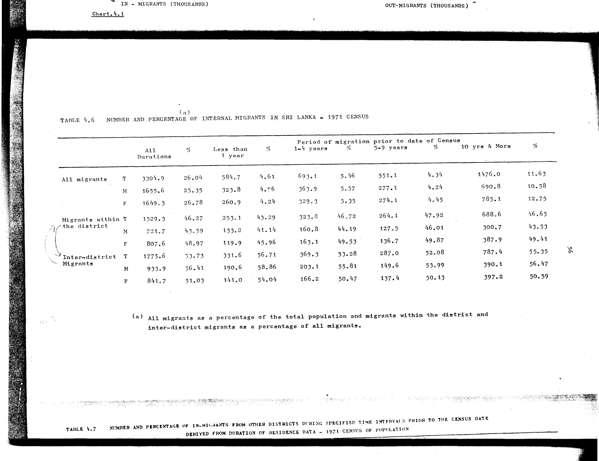

# 4.6: Number and percentage of internal migrants in Sri Lanka - 1971 census


- 📜 Original Table PDF - [data/tables/table-4/table-4-06/original.pdf (62.8 kB)](../../../../data/tables/table-4/table-4-06/original.pdf)
- 📜 Original Table Image - [data/tables/table-4/table-4-06/original.images/image-01.png (141.0 kB)](../../../../data/tables/table-4/table-4-06/original.images/image-01.png)
- 📄 Extracted JSON Data - [data/tables/table-4/table-4-06/data.json (4.3 kB)](../../../../data/tables/table-4/table-4-06/data.json)
- 📄 Extracted Normalized JSON Data - [data/tables/table-4/table-4-06/normalized_data.json (3.4 kB)](../../../../data/tables/table-4/table-4-06/normalized_data.json)
- 📄 Extracted TSV Data - [data/tables/table-4/table-4-06/data.tsv (910 B)](../../../../data/tables/table-4/table-4-06/data.tsv)

## Original Table [Image](../../../../data/tables/table-4/table-4-06/original.images/image-01.png)



## Extracted [JSON Data](../../../../data/tables/table-4/table-4-06/data.json)

```json
{
    "found": true,
    "table_no": "4.6",
    "table_name": "Number and percentage of internal migrants in Sri Lanka - 1971 census",
    "primary_keys": [
        "Category",
        "Sex"
    ],
    "field_keys": [
        "All Durations",
        "%",
        "Less than 1 year",
        "Less than 1 year - %",
        "1-4 years",
        "1-4 years - %",
        "5-9 years",
        "5-9 years - %",
        "10 yrs & More",
        "10 yrs & More - %"
    ],
    "rows": [
        {
            "Category": "All migrants",
            "Sex": "T",
            "values": {
                "All Durations": 3304.9,
                "%": 26.04,
                "Less than 1 year": 584.7,
                "Less than 1 year - %": 4.61,
                "1-4 years": 693.1,
                "1-4 years - %": 5.46,
                "5-9 years": 551.1,
                "5-9 years - %": 4.34,
                "10 yrs & More": 1476.0,
                "10 yrs & More - %": 11.63
            }
        },
        {
            "Category": "All migrants",
            "Sex": "M",
            "values": {
                "All Durations": 1655.6,
                "%": 25.35,
                "Less than 1 year": 323.8,
                "Less than 1 year - %": 4.96,
                "1-4 years": 363.9,
                "1-4 years - %": 5.57,
                "5-9 years": 277.1,
                "5-9 years - %": 4.24,
                "10 yrs & More": 690.8,
                "10 yrs & More - %": 10.58
            }
        },
        {
            "Category": "All migrants",
            "Sex": "F",
            "values": {
                "All Durations": 1649.3,
                "%": 26.78,
                "Less than 1 year": 260.9,
                "Less than 1 year - %": 4.24,
                "1-4 years": 329.3,
                "1-4 years - %": 5.35,
                "5-9 years": 274.1,
                "5-9 years - %": 4.45,
                "10 yrs & More": 785.1,
                "10 yrs & More - %": 12.75
            }
        },
        {
            "Category": "Migrants within the district",
            "Sex": "T",
            "values": {
                "All Durations": 1529.3,
                "%": 46.27,
                "Less than 1 year": 253.1,
                "Less than 1 year - %": 43.29,
                "1-4 years": 323.8,
                "1-4 years - %": 46.72,
                "5-9 years": 264.1,
                "5-9 years - %": 47.92,
                "10 yrs & More": 688.6,
                "10 yrs & More - %": 46.65
            }
        },
        {
            "Category": "Migrants within the district",
            "Sex": "M",
            "values": {
                "All Durations": 721.7,
                "%": 43.59,
                "Less than 1 year": 133.2,
                "Less than 1 year - %": 41.14,
                "1-4 years": 160.8,
                "1-4 years - %": 44.19,
                "5-9 years": 127.5,
                "5-9 years - %": 46.01,
                "10 yrs & More": 300.7,
                "10 yrs & More - %": 43.53
            }
        },
        {
            "Category": "Migrants within the district",
            "Sex": "F",
            "values": {
                "All Durations": 807.6,
                "%": 48.97,
                "Less than 1 year": 119.9,
                "Less than 1 year - %": 45.96,
                "1-4 years": 163.1,
                "1-4 years - %": 49.53,
                "5-9 years": 136.7,
                "5-9 years - %": 49.87,
                "10 yrs & More": 387.9,
                "10 yrs & More - %": 49.41
            }
        },
        {
            "Category": "Inter-district Migrants",
            "Sex": "T",
            "values": {
                "All Durations": 1775.6,
                "%": 53.73,
                "Less than 1 year": 331.6,
                "Less than 1 year - %": 56.71,
                "1-4 years": 369.3,
                "1-4 years - %": 53.28,
                "5-9 years": 287.0,
                "5-9 years - %": 52.08,
                "10 yrs & More": 787.4,
                "10 yrs & More - %": 55.35
            }
        },
        {
            "Category": "Inter-district Migrants",
            "Sex": "M",
            "values": {
                "All Durations": 933.9,
                "%": 56.41,
                "Less than 1 year": 190.6,
                "Less than 1 year - %": 58.86,
                "1-4 years": 203.1,
                "1-4 years - %": 55.81,
                "5-9 years": 149.6,
                "5-9 years - %": 53.99,
                "10 yrs & More": 390.1,
                "10 yrs & More - %": 56.47
            }
        },
        {
            "Category": "Inter-district Migrants",
            "Sex": "F",
            "values": {
                "All Durations": 841.7,
                "%": 51.03,
                "Less than 1 year": 141.0,
                "Less than 1 year - %": 54.04,
                "1-4 years": 166.2,
                "1-4 years - %": 50.47,
                "5-9 years": 137.4,
                "5-9 years - %": 50.13,
                "10 yrs & More": 397.2,
                "10 yrs & More - %": 50.59
            }
        }
    ],
    "notes": [
        "All migrants as a percentage of the total population and migrants within the district and inter-district migrants as a percentage of all migrants."
    ]
}
```

## Extracted [Normalized JSON Data](../../../../data/tables/table-4/table-4-06/normalized_data.json)

```json
[
    {
        "Category": "All migrants",
        "Sex": "T",
        "values": {
            "All Durations": 3304.9,
            "%": 26.04,
            "Less than 1 year": 584.7,
            "Less than 1 year - %": 4.61,
            "1-4 years": 693.1,
            "1-4 years - %": 5.46,
            "5-9 years": 551.1,
            "5-9 years - %": 4.34,
            "10 yrs & More": 1476.0,
            "10 yrs & More - %": 11.63
        }
    },
    {
        "Category": "All migrants",
        "Sex": "M",
        "values": {
            "All Durations": 1655.6,
            "%": 25.35,
            "Less than 1 year": 323.8,
            "Less than 1 year - %": 4.96,
            "1-4 years": 363.9,
            "1-4 years - %": 5.57,
            "5-9 years": 277.1,
            "5-9 years - %": 4.24,
            "10 yrs & More": 690.8,
            "10 yrs & More - %": 10.58
        }
    },
    {
        "Category": "All migrants",
        "Sex": "F",
        "values": {
            "All Durations": 1649.3,
            "%": 26.78,
            "Less than 1 year": 260.9,
            "Less than 1 year - %": 4.24,
            "1-4 years": 329.3,
            "1-4 years - %": 5.35,
            "5-9 years": 274.1,
            "5-9 years - %": 4.45,
            "10 yrs & More": 785.1,
            "10 yrs & More - %": 12.75
        }
    },
    {
        "Category": "Migrants within the district",
        "Sex": "T",
        "values": {
            "All Durations": 1529.3,
            "%": 46.27,
            "Less than 1 year": 253.1,
            "Less than 1 year - %": 43.29,
            "1-4 years": 323.8,
            "1-4 years - %": 46.72,
            "5-9 years": 264.1,
            "5-9 years - %": 47.92,
            "10 yrs & More": 688.6,
            "10 yrs & More - %": 46.65
        }
    },
    {
        "Category": "Migrants within the district",
        "Sex": "M",
        "values": {
            "All Durations": 721.7,
            "%": 43.59,
            "Less than 1 year": 133.2,
            "Less than 1 year - %": 41.14,
            "1-4 years": 160.8,
            "1-4 years - %": 44.19,
            "5-9 years": 127.5,
            "5-9 years - %": 46.01,
            "10 yrs & More": 300.7,
            "10 yrs & More - %": 43.53
        }
    },
    {
        "Category": "Migrants within the district",
        "Sex": "F",
        "values": {
            "All Durations": 807.6,
            "%": 48.97,
            "Less than 1 year": 119.9,
            "Less than 1 year - %": 45.96,
            "1-4 years": 163.1,
            "1-4 years - %": 49.53,
            "5-9 years": 136.7,
            "5-9 years - %": 49.87,
            "10 yrs & More": 387.9,
            "10 yrs & More - %": 49.41
        }
    },
    {
        "Category": "Inter-district Migrants",
        "Sex": "T",
        "values": {
            "All Durations": 1775.6,
            "%": 53.73,
            "Less than 1 year": 331.6,
            "Less than 1 year - %": 56.71,
            "1-4 years": 369.3,
            "1-4 years - %": 53.28,
            "5-9 years": 287.0,
            "5-9 years - %": 52.08,
            "10 yrs & More": 787.4,
            "10 yrs & More - %": 55.35
        }
    },
    {
        "Category": "Inter-district Migrants",
        "Sex": "M",
        "values": {
            "All Durations": 933.9,
            "%": 56.41,
            "Less than 1 year": 190.6,
            "Less than 1 year - %": 58.86,
            "1-4 years": 203.1,
            "1-4 years - %": 55.81,
            "5-9 years": 149.6,
            "5-9 years - %": 53.99,
            "10 yrs & More": 390.1,
            "10 yrs & More - %": 56.47
        }
    },
    {
        "Category": "Inter-district Migrants",
        "Sex": "F",
        "values": {
            "All Durations": 841.7,
            "%": 51.03,
            "Less than 1 year": 141.0,
            "Less than 1 year - %": 54.04,
            "1-4 years": 166.2,
            "1-4 years - %": 50.47,
            "5-9 years": 137.4,
            "5-9 years - %": 50.13,
            "10 yrs & More": 397.2,
            "10 yrs & More - %": 50.59
        }
    }
]
```

## Extracted [TSV Data](../../../../data/tables/table-4/table-4-06/data.tsv)

| Category | Sex | All Durations | % | Less than 1 year | Less than 1 year - % | 1-4 years | 1-4 years - % | 5-9 years | 5-9 years - % | 10 yrs & More | 10 yrs & More - % |
| --- | --- | --- | --- | --- | --- | --- | --- | --- | --- | --- | --- |
| All migrants | T | 3304.9 | 26.04 | 584.7 | 4.61 | 693.1 | 5.46 | 551.1 | 4.34 | 1476.0 | 11.63 |
| All migrants | M | 1655.6 | 25.35 | 323.8 | 4.96 | 363.9 | 5.57 | 277.1 | 4.24 | 690.8 | 10.58 |
| All migrants | F | 1649.3 | 26.78 | 260.9 | 4.24 | 329.3 | 5.35 | 274.1 | 4.45 | 785.1 | 12.75 |
| Migrants within the district | T | 1529.3 | 46.27 | 253.1 | 43.29 | 323.8 | 46.72 | 264.1 | 47.92 | 688.6 | 46.65 |
| Migrants within the district | M | 721.7 | 43.59 | 133.2 | 41.14 | 160.8 | 44.19 | 127.5 | 46.01 | 300.7 | 43.53 |
| Migrants within the district | F | 807.6 | 48.97 | 119.9 | 45.96 | 163.1 | 49.53 | 136.7 | 49.87 | 387.9 | 49.41 |
| Inter-district Migrants | T | 1775.6 | 53.73 | 331.6 | 56.71 | 369.3 | 53.28 | 287.0 | 52.08 | 787.4 | 55.35 |
| Inter-district Migrants | M | 933.9 | 56.41 | 190.6 | 58.86 | 203.1 | 55.81 | 149.6 | 53.99 | 390.1 | 56.47 |
| Inter-district Migrants | F | 841.7 | 51.03 | 141.0 | 54.04 | 166.2 | 50.47 | 137.4 | 50.13 | 397.2 | 50.59 |


[](https://opensource.org/licenses/MIT)
