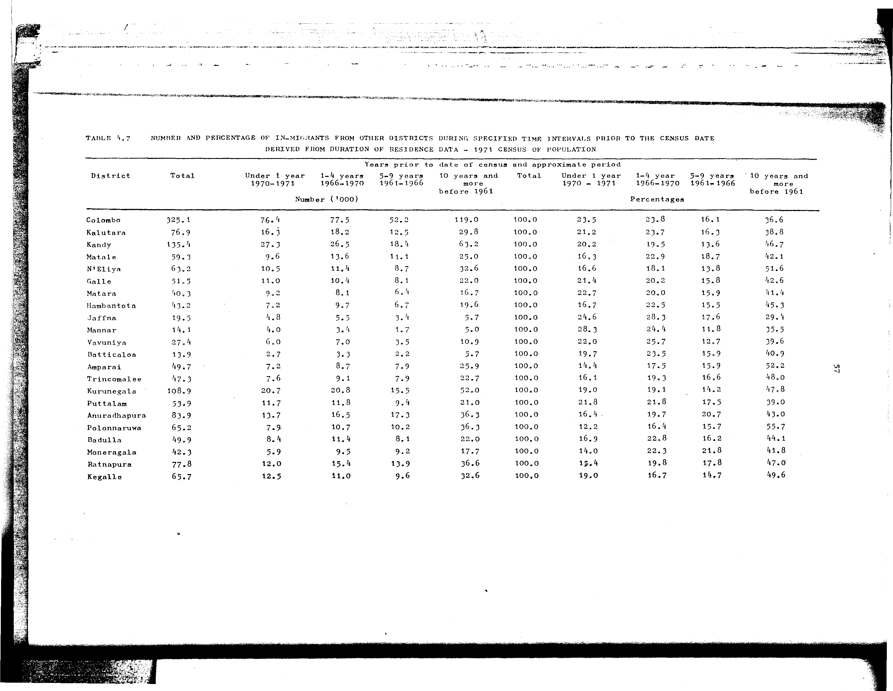

# 4.7: Number and percentage of in-migrants from other districts during specified time intervals prior to the census date derived from duration of residence data - 1971 census of population


- 📜 Original Table PDF - [data/tables/table-4/table-4-07/original.pdf (67.0 kB)](../../../../data/tables/table-4/table-4-07/original.pdf)
- 📜 Original Table Image - [data/tables/table-4/table-4-07/original.images/image-01.png (147.3 kB)](../../../../data/tables/table-4/table-4-07/original.images/image-01.png)
- 📄 Extracted JSON Data - [data/tables/table-4/table-4-07/data.json (13.3 kB)](../../../../data/tables/table-4/table-4-07/data.json)
- 📄 Extracted Normalized JSON Data - [data/tables/table-4/table-4-07/normalized_data.json (11.9 kB)](../../../../data/tables/table-4/table-4-07/normalized_data.json)
- 📄 Extracted TSV Data - [data/tables/table-4/table-4-07/data.tsv (1.7 kB)](../../../../data/tables/table-4/table-4-07/data.tsv)

## Original Table [Image](../../../../data/tables/table-4/table-4-07/original.images/image-01.png)



## Extracted [JSON Data](../../../../data/tables/table-4/table-4-07/data.json)

```json
{
    "found": true,
    "table_no": "4.7",
    "table_name": "Number and percentage of in-migrants from other districts during specified time intervals prior to the census date derived from duration of residence data - 1971 census of population",
    "primary_keys": [
        "District"
    ],
    "field_keys": [
        "Total",
        "Under 1 year 1970-1971 - Number ('000)",
        "1-4 years 1966-1970 - Number ('000)",
        "5-9 years 1961-1966 - Number ('000)",
        "10 years and more before 1961 - Number ('000)",
        "Total - Percentages",
        "Under 1 year 1970 - 1971 - Percentages",
        "1-4 year 1966-1970 - Percentages",
        "5-9 years 1961-1966 - Percentages",
        "10 years and more before 1961 - Percentages"
    ],
    "rows": [
        {
            "District": "Colombo",
            "values": {
                "Total": 325.1,
                "Under 1 year 1970-1971 - Number ('000)": 76.4,
                "1-4 years 1966-1970 - Number ('000)": 77.5,
                "5-9 years 1961-1966 - Number ('000)": 52.2,
                "10 years and more before 1961 - Number ('000)": 119.0,
                "Total - Percentages": 100.0,
                "Under 1 year 1970 - 1971 - Percentages": 23.5,
                "1-4 year 1966-1970 - Percentages": 23.8,
                "5-9 years 1961-1966 - Percentages": 16.1,
                "10 years and more before 1961 - Percentages": 36.6
            }
        },
        {
            "District": "Kalutara",
            "values": {
                "Total": 76.9,
                "Under 1 year 1970-1971 - Number ('000)": 16.3,
                "1-4 years 1966-1970 - Number ('000)": 18.2,
                "5-9 years 1961-1966 - Number ('000)": 12.5,
                "10 years and more before 1961 - Number ('000)": 29.8,
                "Total - Percentages": 100.0,
                "Under 1 year 1970 - 1971 - Percentages": 21.2,
                "1-4 year 1966-1970 - Percentages": 23.7,
                "5-9 years 1961-1966 - Percentages": 16.3,
                "10 years and more before 1961 - Percentages": 38.8
            }
        },
        {
            "District": "Kandy",
            "values": {
                "Total": 135.4,
                "Under 1 year 1970-1971 - Number ('000)": 27.3,
                "1-4 years 1966-1970 - Number ('000)": 26.5,
                "5-9 years 1961-1966 - Number ('000)": 18.4,
                "10 years and more before 1961 - Number ('000)": 63.2,
                "Total - Percentages": 100.0,
                "Under 1 year 1970 - 1971 - Percentages": 20.2,
                "1-4 year 1966-1970 - Percentages": 19.5,
                "5-9 years 1961-1966 - Percentages": 13.6,
                "10 years and more before 1961 - Percentages": 46.7
            }
        },
        {
            "District": "Matale",
            "values": {
                "Total": 59.3,
                "Under 1 year 1970-1971 - Number ('000)": 9.6,
                "1-4 years 1966-1970 - Number ('000)": 13.6,
                "5-9 years 1961-1966 - Number ('000)": 11.1,
                "10 years and more before 1961 - Number ('000)": 25.0,
                "Total - Percentages": 100.0,
                "Under 1 year 1970 - 1971 - Percentages": 16.3,
                "1-4 year 1966-1970 - Percentages": 22.9,
                "5-9 years 1961-1966 - Percentages": 18.7,
                "10 years and more before 1961 - Percentages": 42.1
            }
        },
        {
            "District": "N'Eliya",
            "values": {
                "Total": 63.2,
                "Under 1 year 1970-1971 - Number ('000)": 10.5,
                "1-4 years 1966-1970 - Number ('000)": 11.4,
                "5-9 years 1961-1966 - Number ('000)": 8.7,
                "10 years and more before 1961 - Number ('000)": 32.6,
                "Total - Percentages": 100.0,
                "Under 1 year 1970 - 1971 - Percentages": 16.6,
                "1-4 year 1966-1970 - Percentages": 18.1,
                "5-9 years 1961-1966 - Percentages": 13.8,
                "10 years and more before 1961 - Percentages": 51.6
            }
        },
        {
            "District": "Galle",
            "values": {
                "Total": 51.5,
                "Under 1 year 1970-1971 - Number ('000)": 11.0,
                "1-4 years 1966-1970 - Number ('000)": 10.4,
                "5-9 years 1961-1966 - Number ('000)": 8.1,
                "10 years and more before 1961 - Number ('000)": 22.0,
                "Total - Percentages": 100.0,
                "Under 1 year 1970 - 1971 - Percentages": 21.4,
                "1-4 year 1966-1970 - Percentages": 20.2,
                "5-9 years 1961-1966 - Percentages": 15.8,
                "10 years and more before 1961 - Percentages": 42.6
            }
        },
        {
            "District": "Matara",
            "values": {
                "Total": 40.3,
                "Under 1 year 1970-1971 - Number ('000)": 9.2,
                "1-4 years 1966-1970 - Number ('000)": 8.1,
                "5-9 years 1961-1966 - Number ('000)": 6.4,
                "10 years and more before 1961 - Number ('000)": 16.7,
                "Total - Percentages": 100.0,
                "Under 1 year 1970 - 1971 - Percentages": 22.7,
                "1-4 year 1966-1970 - Percentages": 20.0,
                "5-9 years 1961-1966 - Percentages": 15.9,
                "10 years and more before 1961 - Percentages": 41.4
            }
        },
        {
            "District": "Hambantota",
            "values": {
                "Total": 43.2,
                "Under 1 year 1970-1971 - Number ('000)": 7.2,
                "1-4 years 1966-1970 - Number ('000)": 9.7,
                "5-9 years 1961-1966 - Number ('000)": 6.7,
                "10 years and more before 1961 - Number ('000)": 19.6,
                "Total - Percentages": 100.0,
                "Under 1 year 1970 - 1971 - Percentages": 16.7,
                "1-4 year 1966-1970 - Percentages": 22.5,
                "5-9 years 1961-1966 - Percentages": 15.5,
                "10 years and more before 1961 - Percentages": 45.3
            }
        },
        {
            "District": "Jaffna",
            "values": {
                "Total": 19.5,
                "Under 1 year 1970-1971 - Number ('000)": 4.8,
                "1-4 years 1966-1970 - Number ('000)": 5.5,
                "5-9 years 1961-1966 - Number ('000)": 3.4,
                "10 years and more before 1961 - Number ('000)": 5.7,
                "Total - Percentages": 100.0,
                "Under 1 year 1970 - 1971 - Percentages": 24.6,
                "1-4 year 1966-1970 - Percentages": 28.3,
                "5-9 years 1961-1966 - Percentages": 17.6,
                "10 years and more before 1961 - Percentages": 29.4
            }
        },
        {
            "District": "Mannar",
            "values": {
                "Total": 14.1,
                "Under 1 year 1970-1971 - Number ('000)": 4.0,
                "1-4 years 1966-1970 - Number ('000)": 3.4,
                "5-9 years 1961-1966 - Number ('000)": 1.7,
                "10 years and more before 1961 - Number ('000)": 5.0,
                "Total - Percentages": 100.0,
                "Under 1 year 1970 - 1971 - Percentages": 28.3,
                "1-4 year 1966-1970 - Percentages": 24.4,
                "5-9 years 1961-1966 - Percentages": 11.8,
                "10 years and more before 1961 - Percentages": 35.5
            }
        },
        {
            "District": "Vavuniya",
            "values": {
                "Total": 27.4,
                "Under 1 year 1970-1971 - Number ('000)": 6.0,
                "1-4 years 1966-1970 - Number ('000)": 7.0,
                "5-9 years 1961-1966 - Number ('000)": 3.5,
                "10 years and more before 1961 - Number ('000)": 10.9,
                "Total - Percentages": 100.0,
                "Under 1 year 1970 - 1971 - Percentages": 22.0,
                "1-4 year 1966-1970 - Percentages": 25.7,
                "5-9 years 1961-1966 - Percentages": 12.7,
                "10 years and more before 1961 - Percentages": 39.6
            }
        },
        {
            "District": "Batticaloa",
            "values": {
                "Total": 13.9,
                "Under 1 year 1970-1971 - Number ('000)": 2.7,
                "1-4 years 1966-1970 - Number ('000)": 3.3,
                "5-9 years 1961-1966 - Number ('000)": 2.2,
                "10 years and more before 1961 - Number ('000)": 5.7,
                "Total - Percentages": 100.0,
                "Under 1 year 1970 - 1971 - Percentages": 19.7,
                "1-4 year 1966-1970 - Percentages": 23.5,
                "5-9 years 1961-1966 - Percentages": 15.9,
                "10 years and more before 1961 - Percentages": 40.9
            }
        },
        {
            "District": "Amparai",
            "values": {
                "Total": 49.7,
                "Under 1 year 1970-1971 - Number ('000)": 7.2,
                "1-4 years 1966-1970 - Number ('000)": 8.7,
                "5-9 years 1961-1966 - Number ('000)": 7.9,
                "10 years and more before 1961 - Number ('000)": 25.9,
                "Total - Percentages": 100.0,
                "Under 1 year 1970 - 1971 - Percentages": 14.4,
                "1-4 year 1966-1970 - Percentages": 17.5,
                "5-9 years 1961-1966 - Percentages": 15.9,
                "10 years and more before 1961 - Percentages": 52.2
            }
        },
        {
            "District": "Trincomalee",
            "values": {
                "Total": 47.3,
                "Under 1 year 1970-1971 - Number ('000)": 7.6,
                "1-4 years 1966-1970 - Number ('000)": 9.1,
                "5-9 years 1961-1966 - Number ('000)": 7.9,
                "10 years and more before 1961 - Number ('000)": 22.7,
                "Total - Percentages": 100.0,
                "Under 1 year 1970 - 1971 - Percentages": 16.1,
                "1-4 year 1966-1970 - Percentages": 19.3,
                "5-9 years 1961-1966 - Percentages": 16.6,
                "10 years and more before 1961 - Percentages": 48.0
            }
        },
        {
            "District": "Kurunegala",
            "values": {
                "Total": 108.9,
                "Under 1 year 1970-1971 - Number ('000)": 20.7,
                "1-4 years 1966-1970 - Number ('000)": 20.8,
                "5-9 years 1961-1966 - Number ('000)": 15.5,
                "10 years and more before 1961 - Number ('000)": 52.0,
                "Total - Percentages": 100.0,
                "Under 1 year 1970 - 1971 - Percentages": 19.0,
                "1-4 year 1966-1970 - Percentages": 19.1,
                "5-9 years 1961-1966 - Percentages": 14.2,
                "10 years and more before 1961 - Percentages": 47.8
            }
        },
        {
            "District": "Puttalam",
            "values": {
                "Total": 53.9,
                "Under 1 year 1970-1971 - Number ('000)": 11.7,
                "1-4 years 1966-1970 - Number ('000)": 11.8,
                "5-9 years 1961-1966 - Number ('000)": 9.4,
                "10 years and more before 1961 - Number ('000)": 21.0,
                "Total - Percentages": 100.0,
                "Under 1 year 1970 - 1971 - Percentages": 21.8,
                "1-4 year 1966-1970 - Percentages": 21.8,
                "5-9 years 1961-1966 - Percentages": 17.5,
                "10 years and more before 1961 - Percentages": 39.0
            }
        },
        {
            "District": "Anuradhapura",
            "values": {
                "Total": 83.9,
                "Under 1 year 1970-1971 - Number ('000)": 13.7,
                "1-4 years 1966-1970 - Number ('000)": 16.5,
                "5-9 years 1961-1966 - Number ('000)": 17.3,
                "10 years and more before 1961 - Number ('000)": 36.3,
                "Total - Percentages": 100.0,
                "Under 1 year 1970 - 1971 - Percentages": 16.4,
                "1-4 year 1966-1970 - Percentages": 19.7,
                "5-9 years 1961-1966 - Percentages": 20.7,
                "10 years and more before 1961 - Percentages": 43.0
            }
        },
        {
            "District": "Polonnaruwa",
            "values": {
                "Total": 65.2,
                "Under 1 year 1970-1971 - Number ('000)": 7.9,
                "1-4 years 1966-1970 - Number ('000)": 10.7,
                "5-9 years 1961-1966 - Number ('000)": 10.2,
                "10 years and more before 1961 - Number ('000)": 36.3,
                "Total - Percentages": 100.0,
                "Under 1 year 1970 - 1971 - Percentages": 12.2,
                "1-4 year 1966-1970 - Percentages": 16.4,
                "5-9 years 1961-1966 - Percentages": 15.7,
                "10 years and more before 1961 - Percentages": 55.7
            }
        },
        {
            "District": "Badulla",
            "values": {
                "Total": 49.9,
                "Under 1 year 1970-1971 - Number ('000)": 8.4,
                "1-4 years 1966-1970 - Number ('000)": 11.4,
                "5-9 years 1961-1966 - Number ('000)": 8.1,
                "10 years and more before 1961 - Number ('000)": 22.0,
                "Total - Percentages": 100.0,
                "Under 1 year 1970 - 1971 - Percentages": 16.9,
                "1-4 year 1966-1970 - Percentages": 22.8,
                "5-9 years 1961-1966 - Percentages": 16.2,
                "10 years and more before 1961 - Percentages": 44.1
            }
        },
        {
            "District": "Moneragala",
            "values": {
                "Total": 42.3,
                "Under 1 year 1970-1971 - Number ('000)": 5.9,
                "1-4 years 1966-1970 - Number ('000)": 9.5,
                "5-9 years 1961-1966 - Number ('000)": 9.2,
                "10 years and more before 1961 - Number ('000)": 17.7,
                "Total - Percentages": 100.0,
                "Under 1 year 1970 - 1971 - Percentages": 14.0,
                "1-4 year 1966-1970 - Percentages": 22.3,
                "5-9 years 1961-1966 - Percentages": 21.8,
                "10 years and more before 1961 - Percentages": 41.8
            }
        },
        {
            "District": "Ratnapura",
            "values": {
                "Total": 77.8,
                "Under 1 year 1970-1971 - Number ('000)": 12.0,
                "1-4 years 1966-1970 - Number ('000)": 15.4,
                "5-9 years 1961-1966 - Number ('000)": 13.9,
                "10 years and more before 1961 - Number ('000)": 36.6,
                "Total - Percentages": 100.0,
                "Under 1 year 1970 - 1971 - Percentages": 15.4,
                "1-4 year 1966-1970 - Percentages": 19.8,
                "5-9 years 1961-1966 - Percentages": 17.8,
                "10 years and more before 1961 - Percentages": 47.0
            }
        },
        {
            "District": "Kegalle",
            "values": {
                "Total": 65.7,
                "Under 1 year 1970-1971 - Number ('000)": 12.5,
                "1-4 years 1966-1970 - Number ('000)": 11.0,
                "5-9 years 1961-1966 - Number ('000)": 9.6,
                "10 years and more before 1961 - Number ('000)": 32.6,
                "Total - Percentages": 100.0,
                "Under 1 year 1970 - 1971 - Percentages": 19.0,
                "1-4 year 1966-1970 - Percentages": 16.7,
                "5-9 years 1961-1966 - Percentages": 14.7,
                "10 years and more before 1961 - Percentages": 49.6
            }
        }
    ],
    "notes": []
}
```

## Extracted [Normalized JSON Data](../../../../data/tables/table-4/table-4-07/normalized_data.json)

```json
[
    {
        "District": "Colombo",
        "values": {
            "Total": 325.1,
            "Under 1 year 1970-1971 - Number ('000)": 76.4,
            "1-4 years 1966-1970 - Number ('000)": 77.5,
            "5-9 years 1961-1966 - Number ('000)": 52.2,
            "10 years and more before 1961 - Number ('000)": 119.0,
            "Total - Percentages": 100.0,
            "Under 1 year 1970 - 1971 - Percentages": 23.5,
            "1-4 year 1966-1970 - Percentages": 23.8,
            "5-9 years 1961-1966 - Percentages": 16.1,
            "10 years and more before 1961 - Percentages": 36.6
        }
    },
    {
        "District": "Kalutara",
        "values": {
            "Total": 76.9,
            "Under 1 year 1970-1971 - Number ('000)": 16.3,
            "1-4 years 1966-1970 - Number ('000)": 18.2,
            "5-9 years 1961-1966 - Number ('000)": 12.5,
            "10 years and more before 1961 - Number ('000)": 29.8,
            "Total - Percentages": 100.0,
            "Under 1 year 1970 - 1971 - Percentages": 21.2,
            "1-4 year 1966-1970 - Percentages": 23.7,
            "5-9 years 1961-1966 - Percentages": 16.3,
            "10 years and more before 1961 - Percentages": 38.8
        }
    },
    {
        "District": "Kandy",
        "values": {
            "Total": 135.4,
            "Under 1 year 1970-1971 - Number ('000)": 27.3,
            "1-4 years 1966-1970 - Number ('000)": 26.5,
            "5-9 years 1961-1966 - Number ('000)": 18.4,
            "10 years and more before 1961 - Number ('000)": 63.2,
            "Total - Percentages": 100.0,
            "Under 1 year 1970 - 1971 - Percentages": 20.2,
            "1-4 year 1966-1970 - Percentages": 19.5,
            "5-9 years 1961-1966 - Percentages": 13.6,
            "10 years and more before 1961 - Percentages": 46.7
        }
    },
    {
        "District": "Matale",
        "values": {
            "Total": 59.3,
            "Under 1 year 1970-1971 - Number ('000)": 9.6,
            "1-4 years 1966-1970 - Number ('000)": 13.6,
            "5-9 years 1961-1966 - Number ('000)": 11.1,
            "10 years and more before 1961 - Number ('000)": 25.0,
            "Total - Percentages": 100.0,
            "Under 1 year 1970 - 1971 - Percentages": 16.3,
            "1-4 year 1966-1970 - Percentages": 22.9,
            "5-9 years 1961-1966 - Percentages": 18.7,
            "10 years and more before 1961 - Percentages": 42.1
        }
    },
    {
        "District": "N'Eliya",
        "values": {
            "Total": 63.2,
            "Under 1 year 1970-1971 - Number ('000)": 10.5,
            "1-4 years 1966-1970 - Number ('000)": 11.4,
            "5-9 years 1961-1966 - Number ('000)": 8.7,
            "10 years and more before 1961 - Number ('000)": 32.6,
            "Total - Percentages": 100.0,
            "Under 1 year 1970 - 1971 - Percentages": 16.6,
            "1-4 year 1966-1970 - Percentages": 18.1,
            "5-9 years 1961-1966 - Percentages": 13.8,
            "10 years and more before 1961 - Percentages": 51.6
        }
    },
    {
        "District": "Galle",
        "values": {
            "Total": 51.5,
            "Under 1 year 1970-1971 - Number ('000)": 11.0,
            "1-4 years 1966-1970 - Number ('000)": 10.4,
            "5-9 years 1961-1966 - Number ('000)": 8.1,
            "10 years and more before 1961 - Number ('000)": 22.0,
            "Total - Percentages": 100.0,
            "Under 1 year 1970 - 1971 - Percentages": 21.4,
            "1-4 year 1966-1970 - Percentages": 20.2,
            "5-9 years 1961-1966 - Percentages": 15.8,
            "10 years and more before 1961 - Percentages": 42.6
        }
    },
    {
        "District": "Matara",
        "values": {
            "Total": 40.3,
            "Under 1 year 1970-1971 - Number ('000)": 9.2,
            "1-4 years 1966-1970 - Number ('000)": 8.1,
            "5-9 years 1961-1966 - Number ('000)": 6.4,
            "10 years and more before 1961 - Number ('000)": 16.7,
            "Total - Percentages": 100.0,
            "Under 1 year 1970 - 1971 - Percentages": 22.7,
            "1-4 year 1966-1970 - Percentages": 20.0,
            "5-9 years 1961-1966 - Percentages": 15.9,
            "10 years and more before 1961 - Percentages": 41.4
        }
    },
    {
        "District": "Hambantota",
        "values": {
            "Total": 43.2,
            "Under 1 year 1970-1971 - Number ('000)": 7.2,
            "1-4 years 1966-1970 - Number ('000)": 9.7,
            "5-9 years 1961-1966 - Number ('000)": 6.7,
            "10 years and more before 1961 - Number ('000)": 19.6,
            "Total - Percentages": 100.0,
            "Under 1 year 1970 - 1971 - Percentages": 16.7,
            "1-4 year 1966-1970 - Percentages": 22.5,
            "5-9 years 1961-1966 - Percentages": 15.5,
            "10 years and more before 1961 - Percentages": 45.3
        }
    },
    {
        "District": "Jaffna",
        "values": {
            "Total": 19.5,
            "Under 1 year 1970-1971 - Number ('000)": 4.8,
            "1-4 years 1966-1970 - Number ('000)": 5.5,
            "5-9 years 1961-1966 - Number ('000)": 3.4,
            "10 years and more before 1961 - Number ('000)": 5.7,
            "Total - Percentages": 100.0,
            "Under 1 year 1970 - 1971 - Percentages": 24.6,
            "1-4 year 1966-1970 - Percentages": 28.3,
            "5-9 years 1961-1966 - Percentages": 17.6,
            "10 years and more before 1961 - Percentages": 29.4
        }
    },
    {
        "District": "Mannar",
        "values": {
            "Total": 14.1,
            "Under 1 year 1970-1971 - Number ('000)": 4.0,
            "1-4 years 1966-1970 - Number ('000)": 3.4,
            "5-9 years 1961-1966 - Number ('000)": 1.7,
            "10 years and more before 1961 - Number ('000)": 5.0,
            "Total - Percentages": 100.0,
            "Under 1 year 1970 - 1971 - Percentages": 28.3,
            "1-4 year 1966-1970 - Percentages": 24.4,
            "5-9 years 1961-1966 - Percentages": 11.8,
            "10 years and more before 1961 - Percentages": 35.5
        }
    },
    {
        "District": "Vavuniya",
        "values": {
            "Total": 27.4,
            "Under 1 year 1970-1971 - Number ('000)": 6.0,
            "1-4 years 1966-1970 - Number ('000)": 7.0,
            "5-9 years 1961-1966 - Number ('000)": 3.5,
            "10 years and more before 1961 - Number ('000)": 10.9,
            "Total - Percentages": 100.0,
            "Under 1 year 1970 - 1971 - Percentages": 22.0,
            "1-4 year 1966-1970 - Percentages": 25.7,
            "5-9 years 1961-1966 - Percentages": 12.7,
            "10 years and more before 1961 - Percentages": 39.6
        }
    },
    {
        "District": "Batticaloa",
        "values": {
            "Total": 13.9,
            "Under 1 year 1970-1971 - Number ('000)": 2.7,
            "1-4 years 1966-1970 - Number ('000)": 3.3,
            "5-9 years 1961-1966 - Number ('000)": 2.2,
            "10 years and more before 1961 - Number ('000)": 5.7,
            "Total - Percentages": 100.0,
            "Under 1 year 1970 - 1971 - Percentages": 19.7,
            "1-4 year 1966-1970 - Percentages": 23.5,
            "5-9 years 1961-1966 - Percentages": 15.9,
            "10 years and more before 1961 - Percentages": 40.9
        }
    },
    {
        "District": "Amparai",
        "values": {
            "Total": 49.7,
            "Under 1 year 1970-1971 - Number ('000)": 7.2,
            "1-4 years 1966-1970 - Number ('000)": 8.7,
            "5-9 years 1961-1966 - Number ('000)": 7.9,
            "10 years and more before 1961 - Number ('000)": 25.9,
            "Total - Percentages": 100.0,
            "Under 1 year 1970 - 1971 - Percentages": 14.4,
            "1-4 year 1966-1970 - Percentages": 17.5,
            "5-9 years 1961-1966 - Percentages": 15.9,
            "10 years and more before 1961 - Percentages": 52.2
        }
    },
    {
        "District": "Trincomalee",
        "values": {
            "Total": 47.3,
            "Under 1 year 1970-1971 - Number ('000)": 7.6,
            "1-4 years 1966-1970 - Number ('000)": 9.1,
            "5-9 years 1961-1966 - Number ('000)": 7.9,
            "10 years and more before 1961 - Number ('000)": 22.7,
            "Total - Percentages": 100.0,
            "Under 1 year 1970 - 1971 - Percentages": 16.1,
            "1-4 year 1966-1970 - Percentages": 19.3,
            "5-9 years 1961-1966 - Percentages": 16.6,
            "10 years and more before 1961 - Percentages": 48.0
        }
    },
    {
        "District": "Kurunegala",
        "values": {
            "Total": 108.9,
            "Under 1 year 1970-1971 - Number ('000)": 20.7,
            "1-4 years 1966-1970 - Number ('000)": 20.8,
            "5-9 years 1961-1966 - Number ('000)": 15.5,
            "10 years and more before 1961 - Number ('000)": 52.0,
            "Total - Percentages": 100.0,
            "Under 1 year 1970 - 1971 - Percentages": 19.0,
            "1-4 year 1966-1970 - Percentages": 19.1,
            "5-9 years 1961-1966 - Percentages": 14.2,
            "10 years and more before 1961 - Percentages": 47.8
        }
    },
    {
        "District": "Puttalam",
        "values": {
            "Total": 53.9,
            "Under 1 year 1970-1971 - Number ('000)": 11.7,
            "1-4 years 1966-1970 - Number ('000)": 11.8,
            "5-9 years 1961-1966 - Number ('000)": 9.4,
            "10 years and more before 1961 - Number ('000)": 21.0,
            "Total - Percentages": 100.0,
            "Under 1 year 1970 - 1971 - Percentages": 21.8,
            "1-4 year 1966-1970 - Percentages": 21.8,
            "5-9 years 1961-1966 - Percentages": 17.5,
            "10 years and more before 1961 - Percentages": 39.0
        }
    },
    {
        "District": "Anuradhapura",
        "values": {
            "Total": 83.9,
            "Under 1 year 1970-1971 - Number ('000)": 13.7,
            "1-4 years 1966-1970 - Number ('000)": 16.5,
            "5-9 years 1961-1966 - Number ('000)": 17.3,
            "10 years and more before 1961 - Number ('000)": 36.3,
            "Total - Percentages": 100.0,
            "Under 1 year 1970 - 1971 - Percentages": 16.4,
            "1-4 year 1966-1970 - Percentages": 19.7,
            "5-9 years 1961-1966 - Percentages": 20.7,
            "10 years and more before 1961 - Percentages": 43.0
        }
    },
    {
        "District": "Polonnaruwa",
        "values": {
            "Total": 65.2,
            "Under 1 year 1970-1971 - Number ('000)": 7.9,
            "1-4 years 1966-1970 - Number ('000)": 10.7,
            "5-9 years 1961-1966 - Number ('000)": 10.2,
            "10 years and more before 1961 - Number ('000)": 36.3,
            "Total - Percentages": 100.0,
            "Under 1 year 1970 - 1971 - Percentages": 12.2,
            "1-4 year 1966-1970 - Percentages": 16.4,
            "5-9 years 1961-1966 - Percentages": 15.7,
            "10 years and more before 1961 - Percentages": 55.7
        }
    },
    {
        "District": "Badulla",
        "values": {
            "Total": 49.9,
            "Under 1 year 1970-1971 - Number ('000)": 8.4,
            "1-4 years 1966-1970 - Number ('000)": 11.4,
            "5-9 years 1961-1966 - Number ('000)": 8.1,
            "10 years and more before 1961 - Number ('000)": 22.0,
            "Total - Percentages": 100.0,
            "Under 1 year 1970 - 1971 - Percentages": 16.9,
            "1-4 year 1966-1970 - Percentages": 22.8,
            "5-9 years 1961-1966 - Percentages": 16.2,
            "10 years and more before 1961 - Percentages": 44.1
        }
    },
    {
        "District": "Moneragala",
        "values": {
            "Total": 42.3,
            "Under 1 year 1970-1971 - Number ('000)": 5.9,
            "1-4 years 1966-1970 - Number ('000)": 9.5,
            "5-9 years 1961-1966 - Number ('000)": 9.2,
            "10 years and more before 1961 - Number ('000)": 17.7,
            "Total - Percentages": 100.0,
            "Under 1 year 1970 - 1971 - Percentages": 14.0,
            "1-4 year 1966-1970 - Percentages": 22.3,
            "5-9 years 1961-1966 - Percentages": 21.8,
            "10 years and more before 1961 - Percentages": 41.8
        }
    },
    {
        "District": "Ratnapura",
        "values": {
            "Total": 77.8,
            "Under 1 year 1970-1971 - Number ('000)": 12.0,
            "1-4 years 1966-1970 - Number ('000)": 15.4,
            "5-9 years 1961-1966 - Number ('000)": 13.9,
            "10 years and more before 1961 - Number ('000)": 36.6,
            "Total - Percentages": 100.0,
            "Under 1 year 1970 - 1971 - Percentages": 15.4,
            "1-4 year 1966-1970 - Percentages": 19.8,
            "5-9 years 1961-1966 - Percentages": 17.8,
            "10 years and more before 1961 - Percentages": 47.0
        }
    },
    {
        "District": "Kegalle",
        "values": {
            "Total": 65.7,
            "Under 1 year 1970-1971 - Number ('000)": 12.5,
            "1-4 years 1966-1970 - Number ('000)": 11.0,
            "5-9 years 1961-1966 - Number ('000)": 9.6,
            "10 years and more before 1961 - Number ('000)": 32.6,
            "Total - Percentages": 100.0,
            "Under 1 year 1970 - 1971 - Percentages": 19.0,
            "1-4 year 1966-1970 - Percentages": 16.7,
            "5-9 years 1961-1966 - Percentages": 14.7,
            "10 years and more before 1961 - Percentages": 49.6
        }
    }
]
```

## Extracted [TSV Data](../../../../data/tables/table-4/table-4-07/data.tsv)

| District | Total | Under 1 year 1970-1971 - Number ('000) | 1-4 years 1966-1970 - Number ('000) | 5-9 years 1961-1966 - Number ('000) | 10 years and more before 1961 - Number ('000) | Total - Percentages | Under 1 year 1970 - 1971 - Percentages | 1-4 year 1966-1970 - Percentages | 5-9 years 1961-1966 - Percentages | 10 years and more before 1961 - Percentages |
| --- | --- | --- | --- | --- | --- | --- | --- | --- | --- | --- |
| Colombo | 325.1 | 76.4 | 77.5 | 52.2 | 119.0 | 100.0 | 23.5 | 23.8 | 16.1 | 36.6 |
| Kalutara | 76.9 | 16.3 | 18.2 | 12.5 | 29.8 | 100.0 | 21.2 | 23.7 | 16.3 | 38.8 |
| Kandy | 135.4 | 27.3 | 26.5 | 18.4 | 63.2 | 100.0 | 20.2 | 19.5 | 13.6 | 46.7 |
| Matale | 59.3 | 9.6 | 13.6 | 11.1 | 25.0 | 100.0 | 16.3 | 22.9 | 18.7 | 42.1 |
| N'Eliya | 63.2 | 10.5 | 11.4 | 8.7 | 32.6 | 100.0 | 16.6 | 18.1 | 13.8 | 51.6 |
| Galle | 51.5 | 11.0 | 10.4 | 8.1 | 22.0 | 100.0 | 21.4 | 20.2 | 15.8 | 42.6 |
| Matara | 40.3 | 9.2 | 8.1 | 6.4 | 16.7 | 100.0 | 22.7 | 20.0 | 15.9 | 41.4 |
| Hambantota | 43.2 | 7.2 | 9.7 | 6.7 | 19.6 | 100.0 | 16.7 | 22.5 | 15.5 | 45.3 |
| Jaffna | 19.5 | 4.8 | 5.5 | 3.4 | 5.7 | 100.0 | 24.6 | 28.3 | 17.6 | 29.4 |
| Mannar | 14.1 | 4.0 | 3.4 | 1.7 | 5.0 | 100.0 | 28.3 | 24.4 | 11.8 | 35.5 |
| Vavuniya | 27.4 | 6.0 | 7.0 | 3.5 | 10.9 | 100.0 | 22.0 | 25.7 | 12.7 | 39.6 |
| Batticaloa | 13.9 | 2.7 | 3.3 | 2.2 | 5.7 | 100.0 | 19.7 | 23.5 | 15.9 | 40.9 |
| Amparai | 49.7 | 7.2 | 8.7 | 7.9 | 25.9 | 100.0 | 14.4 | 17.5 | 15.9 | 52.2 |
| Trincomalee | 47.3 | 7.6 | 9.1 | 7.9 | 22.7 | 100.0 | 16.1 | 19.3 | 16.6 | 48.0 |
| Kurunegala | 108.9 | 20.7 | 20.8 | 15.5 | 52.0 | 100.0 | 19.0 | 19.1 | 14.2 | 47.8 |
| Puttalam | 53.9 | 11.7 | 11.8 | 9.4 | 21.0 | 100.0 | 21.8 | 21.8 | 17.5 | 39.0 |
| Anuradhapura | 83.9 | 13.7 | 16.5 | 17.3 | 36.3 | 100.0 | 16.4 | 19.7 | 20.7 | 43.0 |
| Polonnaruwa | 65.2 | 7.9 | 10.7 | 10.2 | 36.3 | 100.0 | 12.2 | 16.4 | 15.7 | 55.7 |
| Badulla | 49.9 | 8.4 | 11.4 | 8.1 | 22.0 | 100.0 | 16.9 | 22.8 | 16.2 | 44.1 |
| Moneragala | 42.3 | 5.9 | 9.5 | 9.2 | 17.7 | 100.0 | 14.0 | 22.3 | 21.8 | 41.8 |
| Ratnapura | 77.8 | 12.0 | 15.4 | 13.9 | 36.6 | 100.0 | 15.4 | 19.8 | 17.8 | 47.0 |
| Kegalle | 65.7 | 12.5 | 11.0 | 9.6 | 32.6 | 100.0 | 19.0 | 16.7 | 14.7 | 49.6 |


[](https://opensource.org/licenses/MIT)
