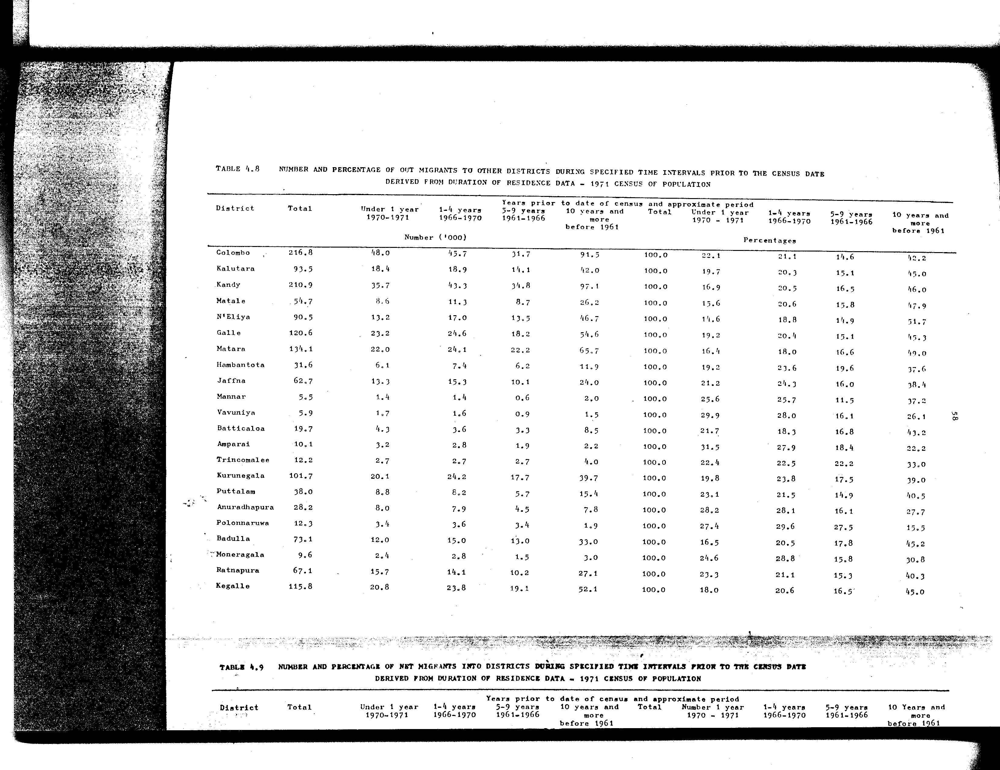

# 4.8: Number and percentage of out-migrants to other districts during specified time intervals prior to the census date derived from duration of residence data - 1971 census of population


- 📜 Original Table PDF - [data/tables/table-4/table-4-08/original.pdf (134.0 kB)](../../../../data/tables/table-4/table-4-08/original.pdf)
- 📜 Original Table Image - [data/tables/table-4/table-4-08/original.image-01.png (255.0 kB)](../../../../data/tables/table-4/table-4-08/original.image-01.png)
- 📄 Extracted JSON Data - [data/tables/table-4/table-4-08/data.json (11.8 kB)](../../../../data/tables/table-4/table-4-08/data.json)

## Extracted [JSON Data](../../../../data/tables/table-4/table-4-08/data.json)

```json
{
    "found": true,
    "table_no": "4.8",
    "table_name": "Number and percentage of out-migrants to other districts during specified time intervals prior to the census date derived from duration of residence data - 1971 census of population",
    "primary_keys": [
        "District"
    ],
    "field_keys": [
        "Total",
        "Under 1 year 1970-1971",
        "1-4 years 1966-1970",
        "5-9 years 1961-1966",
        "10 years and more before 1961",
        "Total - Percentages",
        "Under 1 year 1970 - 1971 - Percentages",
        "1-4 years 1966-1970 - Percentages",
        "5-9 years 1961-1966 - Percentages",
        "10 years and more before 1961 - Percentages"
    ],
    "rows": [
        {
            "District": "Colombo",
            "values": {
                "Total": 216.8,
                "Under 1 year 1970-1971": 48.0,
                "1-4 years 1966-1970": 45.7,
                "5-9 years 1961-1966": 31.7,
                "10 years and more before 1961": 91.5,
                "Total - Percentages": 100.0,
                "Under 1 year 1970 - 1971 - Percentages": 22.1,
                "1-4 years 1966-1970 - Percentages": 21.1,
                "5-9 years 1961-1966 - Percentages": 14.6,
                "10 years and more before 1961 - Percentages": 42.2
            }
        },
        {
            "District": "Kalutara",
            "values": {
                "Total": 93.5,
                "Under 1 year 1970-1971": 18.4,
                "1-4 years 1966-1970": 18.9,
                "5-9 years 1961-1966": 14.1,
                "10 years and more before 1961": 42.0,
                "Total - Percentages": 100.0,
                "Under 1 year 1970 - 1971 - Percentages": 19.7,
                "1-4 years 1966-1970 - Percentages": 20.3,
                "5-9 years 1961-1966 - Percentages": 15.1,
                "10 years and more before 1961 - Percentages": 45.0
            }
        },
        {
            "District": "Kandy",
            "values": {
                "Total": 210.9,
                "Under 1 year 1970-1971": 35.7,
                "1-4 years 1966-1970": 43.3,
                "5-9 years 1961-1966": 34.8,
                "10 years and more before 1961": 97.1,
                "Total - Percentages": 100.0,
                "Under 1 year 1970 - 1971 - Percentages": 16.9,
                "1-4 years 1966-1970 - Percentages": 20.5,
                "5-9 years 1961-1966 - Percentages": 16.5,
                "10 years and more before 1961 - Percentages": 46.0
            }
        },
        {
            "District": "Matale",
            "values": {
                "Total": 54.7,
                "Under 1 year 1970-1971": 8.6,
                "1-4 years 1966-1970": 11.3,
                "5-9 years 1961-1966": 8.7,
                "10 years and more before 1961": 26.2,
                "Total - Percentages": 100.0,
                "Under 1 year 1970 - 1971 - Percentages": 15.6,
                "1-4 years 1966-1970 - Percentages": 20.6,
                "5-9 years 1961-1966 - Percentages": 15.8,
                "10 years and more before 1961 - Percentages": 47.9
            }
        },
        {
            "District": "N'Eliya",
            "values": {
                "Total": 90.5,
                "Under 1 year 1970-1971": 13.2,
                "1-4 years 1966-1970": 17.0,
                "5-9 years 1961-1966": 13.5,
                "10 years and more before 1961": 46.7,
                "Total - Percentages": 100.0,
                "Under 1 year 1970 - 1971 - Percentages": 14.6,
                "1-4 years 1966-1970 - Percentages": 18.8,
                "5-9 years 1961-1966 - Percentages": 14.9,
                "10 years and more before 1961 - Percentages": 51.7
            }
        },
        {
            "District": "Galle",
            "values": {
                "Total": 120.6,
                "Under 1 year 1970-1971": 23.2,
                "1-4 years 1966-1970": 24.6,
                "5-9 years 1961-1966": 18.2,
                "10 years and more before 1961": 54.6,
                "Total - Percentages": 100.0,
                "Under 1 year 1970 - 1971 - Percentages": 19.2,
                "1-4 years 1966-1970 - Percentages": 20.4,
                "5-9 years 1961-1966 - Percentages": 15.1,
                "10 years and more before 1961 - Percentages": 45.3
            }
        },
        {
            "District": "Matara",
            "values": {
                "Total": 134.1,
                "Under 1 year 1970-1971": 22.0,
                "1-4 years 1966-1970": 24.1,
                "5-9 years 1961-1966": 22.2,
                "10 years and more before 1961": 65.7,
                "Total - Percentages": 100.0,
                "Under 1 year 1970 - 1971 - Percentages": 16.4,
                "1-4 years 1966-1970 - Percentages": 18.0,
                "5-9 years 1961-1966 - Percentages": 16.6,
                "10 years and more before 1961 - Percentages": 49.0
            }
        },
        {
            "District": "Hambantota",
            "values": {
                "Total": 31.6,
                "Under 1 year 1970-1971": 6.1,
                "1-4 years 1966-1970": 7.4,
                "5-9 years 1961-1966": 6.2,
                "10 years and more before 1961": 11.9,
                "Total - Percentages": 100.0,
                "Under 1 year 1970 - 1971 - Percentages": 19.2,
                "1-4 years 1966-1970 - Percentages": 23.6,
                "5-9 years 1961-1966 - Percentages": 19.6,
                "10 years and more before 1961 - Percentages": 37.6
            }
        },
        {
            "District": "Jaffna",
            "values": {
                "Total": 62.7,
                "Under 1 year 1970-1971": 13.3,
                "1-4 years 1966-1970": 15.3,
                "5-9 years 1961-1966": 10.1,
                "10 years and more before 1961": 24.0,
                "Total - Percentages": 100.0,
                "Under 1 year 1970 - 1971 - Percentages": 21.2,
                "1-4 years 1966-1970 - Percentages": 24.3,
                "5-9 years 1961-1966 - Percentages": 16.0,
                "10 years and more before 1961 - Percentages": 38.4
            }
        },
        {
            "District": "Mannar",
            "values": {
                "Total": 5.5,
                "Under 1 year 1970-1971": 1.4,
                "1-4 years 1966-1970": 1.4,
                "5-9 years 1961-1966": 0.6,
                "10 years and more before 1961": 2.0,
                "Total - Percentages": 100.0,
                "Under 1 year 1970 - 1971 - Percentages": 25.6,
                "1-4 years 1966-1970 - Percentages": 25.7,
                "5-9 years 1961-1966 - Percentages": 11.5,
                "10 years and more before 1961 - Percentages": 37.2
            }
        },
        {
            "District": "Vavuniya",
            "values": {
                "Total": 5.9,
                "Under 1 year 1970-1971": 1.7,
                "1-4 years 1966-1970": 1.6,
                "5-9 years 1961-1966": 0.9,
                "10 years and more before 1961": 1.5,
                "Total - Percentages": 100.0,
                "Under 1 year 1970 - 1971 - Percentages": 29.9,
                "1-4 years 1966-1970 - Percentages": 28.0,
                "5-9 years 1961-1966 - Percentages": 16.1,
                "10 years and more before 1961 - Percentages": 26.1
            }
        },
        {
            "District": "Batticaloa",
            "values": {
                "Total": 19.7,
                "Under 1 year 1970-1971": 4.3,
                "1-4 years 1966-1970": 3.6,
                "5-9 years 1961-1966": 3.3,
                "10 years and more before 1961": 8.5,
                "Total - Percentages": 100.0,
                "Under 1 year 1970 - 1971 - Percentages": 21.7,
                "1-4 years 1966-1970 - Percentages": 18.3,
                "5-9 years 1961-1966 - Percentages": 16.8,
                "10 years and more before 1961 - Percentages": 43.2
            }
        },
        {
            "District": "Amparai",
            "values": {
                "Total": 10.1,
                "Under 1 year 1970-1971": 3.2,
                "1-4 years 1966-1970": 2.8,
                "5-9 years 1961-1966": 1.9,
                "10 years and more before 1961": 2.2,
                "Total - Percentages": 100.0,
                "Under 1 year 1970 - 1971 - Percentages": 31.5,
                "1-4 years 1966-1970 - Percentages": 27.9,
                "5-9 years 1961-1966 - Percentages": 18.4,
                "10 years and more before 1961 - Percentages": 22.2
            }
        },
        {
            "District": "Trincomalee",
            "values": {
                "Total": 12.2,
                "Under 1 year 1970-1971": 2.7,
                "1-4 years 1966-1970": 2.7,
                "5-9 years 1961-1966": 2.7,
                "10 years and more before 1961": 4.0,
                "Total - Percentages": 100.0,
                "Under 1 year 1970 - 1971 - Percentages": 22.4,
                "1-4 years 1966-1970 - Percentages": 22.5,
                "5-9 years 1961-1966 - Percentages": 22.2,
                "10 years and more before 1961 - Percentages": 33.0
            }
        },
        {
            "District": "Kurunegala",
            "values": {
                "Total": 101.7,
                "Under 1 year 1970-1971": 20.1,
                "1-4 years 1966-1970": 24.2,
                "5-9 years 1961-1966": 17.7,
                "10 years and more before 1961": 39.7,
                "Total - Percentages": 100.0,
                "Under 1 year 1970 - 1971 - Percentages": 19.8,
                "1-4 years 1966-1970 - Percentages": 23.8,
                "5-9 years 1961-1966 - Percentages": 17.5,
                "10 years and more before 1961 - Percentages": 39.0
            }
        },
        {
            "District": "Puttalam",
            "values": {
                "Total": 38.0,
                "Under 1 year 1970-1971": 8.8,
                "1-4 years 1966-1970": 8.2,
                "5-9 years 1961-1966": 5.7,
                "10 years and more before 1961": 15.4,
                "Total - Percentages": 100.0,
                "Under 1 year 1970 - 1971 - Percentages": 23.1,
                "1-4 years 1966-1970 - Percentages": 21.5,
                "5-9 years 1961-1966 - Percentages": 14.9,
                "10 years and more before 1961 - Percentages": 40.5
            }
        },
        {
            "District": "Anuradhapura",
            "values": {
                "Total": 28.2,
                "Under 1 year 1970-1971": 8.0,
                "1-4 years 1966-1970": 7.9,
                "5-9 years 1961-1966": 4.5,
                "10 years and more before 1961": 7.8,
                "Total - Percentages": 100.0,
                "Under 1 year 1970 - 1971 - Percentages": 28.2,
                "1-4 years 1966-1970 - Percentages": 28.1,
                "5-9 years 1961-1966 - Percentages": 16.1,
                "10 years and more before 1961 - Percentages": 27.7
            }
        },
        {
            "District": "Polonnaruwa",
            "values": {
                "Total": 12.3,
                "Under 1 year 1970-1971": 3.4,
                "1-4 years 1966-1970": 3.6,
                "5-9 years 1961-1966": 3.4,
                "10 years and more before 1961": 1.9,
                "Total - Percentages": 100.0,
                "Under 1 year 1970 - 1971 - Percentages": 27.4,
                "1-4 years 1966-1970 - Percentages": 29.6,
                "5-9 years 1961-1966 - Percentages": 27.5,
                "10 years and more before 1961 - Percentages": 15.5
            }
        },
        {
            "District": "Badulla",
            "values": {
                "Total": 73.1,
                "Under 1 year 1970-1971": 12.0,
                "1-4 years 1966-1970": 15.0,
                "5-9 years 1961-1966": 13.0,
                "10 years and more before 1961": 33.0,
                "Total - Percentages": 100.0,
                "Under 1 year 1970 - 1971 - Percentages": 16.5,
                "1-4 years 1966-1970 - Percentages": 20.5,
                "5-9 years 1961-1966 - Percentages": 17.8,
                "10 years and more before 1961 - Percentages": 45.2
            }
        },
        {
            "District": "Moneragala",
            "values": {
                "Total": 9.6,
                "Under 1 year 1970-1971": 2.4,
                "1-4 years 1966-1970": 2.8,
                "5-9 years 1961-1966": 1.5,
                "10 years and more before 1961": 3.0,
                "Total - Percentages": 100.0,
                "Under 1 year 1970 - 1971 - Percentages": 24.6,
                "1-4 years 1966-1970 - Percentages": 28.8,
                "5-9 years 1961-1966 - Percentages": 15.8,
                "10 years and more before 1961 - Percentages": 30.8
            }
        },
        {
            "District": "Ratnapura",
            "values": {
                "Total": 67.1,
                "Under 1 year 1970-1971": 15.7,
                "1-4 years 1966-1970": 14.1,
                "5-9 years 1961-1966": 10.2,
                "10 years and more before 1961": 27.1,
                "Total - Percentages": 100.0,
                "Under 1 year 1970 - 1971 - Percentages": 23.3,
                "1-4 years 1966-1970 - Percentages": 21.1,
                "5-9 years 1961-1966 - Percentages": 15.3,
                "10 years and more before 1961 - Percentages": 40.3
            }
        },
        {
            "District": "Kegalle",
            "values": {
                "Total": 115.8,
                "Under 1 year 1970-1971": 20.8,
                "1-4 years 1966-1970": 23.8,
                "5-9 years 1961-1966": 19.1,
                "10 years and more before 1961": 52.1,
                "Total - Percentages": 100.0,
                "Under 1 year 1970 - 1971 - Percentages": 18.0,
                "1-4 years 1966-1970 - Percentages": 20.6,
                "5-9 years 1961-1966 - Percentages": 16.5,
                "10 years and more before 1961 - Percentages": 45.0
            }
        }
    ],
    "notes": []
}
```

## Original Table [Image](../../../../data/tables/table-4/table-4-08/original.image-01.png)




[](https://opensource.org/licenses/MIT)
