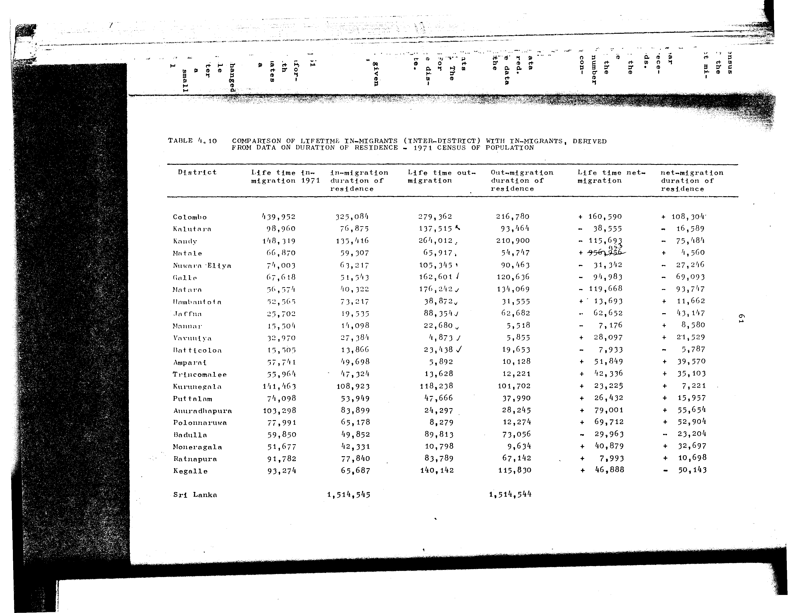

# 4.10: Comparison of lifetime in-migrants (inter-district) with in-migrants, derived from data on duration of residence - 1971 census of population


- 📜 Original Table PDF - [data/tables/table-4/table-4-10/original.pdf (101.1 kB)](../../../../data/tables/table-4/table-4-10/original.pdf)
- 📜 Original Table Image - [data/tables/table-4/table-4-10/original.images/image-01.png (218.5 kB)](../../../../data/tables/table-4/table-4-10/original.images/image-01.png)
- 📄 Extracted JSON Data - [data/tables/table-4/table-4-10/data.json (8.5 kB)](../../../../data/tables/table-4/table-4-10/data.json)
- 📄 Extracted TSV Data - [data/tables/table-4/table-4-10/data.tsv (1.2 kB)](../../../../data/tables/table-4/table-4-10/data.tsv)

## Original Table [Image](../../../../data/tables/table-4/table-4-10/original.images/image-01.png)



## Extracted [JSON Data](../../../../data/tables/table-4/table-4-10/data.json)

```json
{
    "found": true,
    "table_no": "4.10",
    "table_name": "Comparison of lifetime in-migrants (inter-district) with in-migrants, derived from data on duration of residence - 1971 census of population",
    "primary_keys": [
        "District"
    ],
    "field_keys": [
        "Life time in-migration 1971",
        "in-migration duration of residence",
        "Life time out-migration",
        "Out-migration duration of residence",
        "Life time net-migration",
        "net-migration duration of residence"
    ],
    "rows": [
        {
            "District": "Colombo",
            "values": {
                "Life time in-migration 1971": 439952,
                "in-migration duration of residence": 325084,
                "Life time out-migration": 279362,
                "Out-migration duration of residence": 216780,
                "Life time net-migration": 160590,
                "net-migration duration of residence": 108304
            }
        },
        {
            "District": "Kalutara",
            "values": {
                "Life time in-migration 1971": 98960,
                "in-migration duration of residence": 76875,
                "Life time out-migration": 137515,
                "Out-migration duration of residence": 93464,
                "Life time net-migration": -38555,
                "net-migration duration of residence": -16589
            }
        },
        {
            "District": "Kandy",
            "values": {
                "Life time in-migration 1971": 148319,
                "in-migration duration of residence": 135416,
                "Life time out-migration": 264012,
                "Out-migration duration of residence": 210900,
                "Life time net-migration": -115693,
                "net-migration duration of residence": -75484
            }
        },
        {
            "District": "Matale",
            "values": {
                "Life time in-migration 1971": 66870,
                "in-migration duration of residence": 59307,
                "Life time out-migration": 65917,
                "Out-migration duration of residence": 54747,
                "Life time net-migration": 953,
                "net-migration duration of residence": 4560
            }
        },
        {
            "District": "Nuwara Eliya",
            "values": {
                "Life time in-migration 1971": 74003,
                "in-migration duration of residence": 63217,
                "Life time out-migration": 105345,
                "Out-migration duration of residence": 90463,
                "Life time net-migration": -31342,
                "net-migration duration of residence": -27246
            }
        },
        {
            "District": "Galle",
            "values": {
                "Life time in-migration 1971": 67618,
                "in-migration duration of residence": 51543,
                "Life time out-migration": 162601,
                "Out-migration duration of residence": 120636,
                "Life time net-migration": -94983,
                "net-migration duration of residence": -69093
            }
        },
        {
            "District": "Matara",
            "values": {
                "Life time in-migration 1971": 56574,
                "in-migration duration of residence": 40322,
                "Life time out-migration": 176242,
                "Out-migration duration of residence": 134069,
                "Life time net-migration": -119668,
                "net-migration duration of residence": -93747
            }
        },
        {
            "District": "Hambantota",
            "values": {
                "Life time in-migration 1971": 52565,
                "in-migration duration of residence": 73217,
                "Life time out-migration": 38872,
                "Out-migration duration of residence": 31555,
                "Life time net-migration": 13693,
                "net-migration duration of residence": 11662
            }
        },
        {
            "District": "Jaffna",
            "values": {
                "Life time in-migration 1971": 25702,
                "in-migration duration of residence": 19535,
                "Life time out-migration": 88354,
                "Out-migration duration of residence": 62682,
                "Life time net-migration": -62652,
                "net-migration duration of residence": -43147
            }
        },
        {
            "District": "Mannar",
            "values": {
                "Life time in-migration 1971": 15504,
                "in-migration duration of residence": 14098,
                "Life time out-migration": 22680,
                "Out-migration duration of residence": 5518,
                "Life time net-migration": -7176,
                "net-migration duration of residence": 8580
            }
        },
        {
            "District": "Vavuniya",
            "values": {
                "Life time in-migration 1971": 32970,
                "in-migration duration of residence": 27384,
                "Life time out-migration": 4873,
                "Out-migration duration of residence": 5855,
                "Life time net-migration": 28097,
                "net-migration duration of residence": 21529
            }
        },
        {
            "District": "Batticaloa",
            "values": {
                "Life time in-migration 1971": 15505,
                "in-migration duration of residence": 13866,
                "Life time out-migration": 23438,
                "Out-migration duration of residence": 19653,
                "Life time net-migration": -7933,
                "net-migration duration of residence": -5787
            }
        },
        {
            "District": "Amparai",
            "values": {
                "Life time in-migration 1971": 57741,
                "in-migration duration of residence": 49698,
                "Life time out-migration": 5892,
                "Out-migration duration of residence": 10128,
                "Life time net-migration": 51849,
                "net-migration duration of residence": 39570
            }
        },
        {
            "District": "Trincomalee",
            "values": {
                "Life time in-migration 1971": 55964,
                "in-migration duration of residence": 47324,
                "Life time out-migration": 13628,
                "Out-migration duration of residence": 12221,
                "Life time net-migration": 42336,
                "net-migration duration of residence": 35103
            }
        },
        {
            "District": "Kurunegala",
            "values": {
                "Life time in-migration 1971": 141463,
                "in-migration duration of residence": 108923,
                "Life time out-migration": 118238,
                "Out-migration duration of residence": 101702,
                "Life time net-migration": 23225,
                "net-migration duration of residence": 7221
            }
        },
        {
            "District": "Puttalam",
            "values": {
                "Life time in-migration 1971": 74098,
                "in-migration duration of residence": 53949,
                "Life time out-migration": 47666,
                "Out-migration duration of residence": 37990,
                "Life time net-migration": 26432,
                "net-migration duration of residence": 15957
            }
        },
        {
            "District": "Anuradhapura",
            "values": {
                "Life time in-migration 1971": 103298,
                "in-migration duration of residence": 83899,
                "Life time out-migration": 24297,
                "Out-migration duration of residence": 28245,
                "Life time net-migration": 79001,
                "net-migration duration of residence": 55654
            }
        },
        {
            "District": "Polonnaruwa",
            "values": {
                "Life time in-migration 1971": 77991,
                "in-migration duration of residence": 65178,
                "Life time out-migration": 8279,
                "Out-migration duration of residence": 12274,
                "Life time net-migration": 69712,
                "net-migration duration of residence": 52904
            }
        },
        {
            "District": "Badulla",
            "values": {
                "Life time in-migration 1971": 59850,
                "in-migration duration of residence": 49852,
                "Life time out-migration": 89813,
                "Out-migration duration of residence": 73056,
                "Life time net-migration": -29963,
                "net-migration duration of residence": -23204
            }
        },
        {
            "District": "Moneragala",
            "values": {
                "Life time in-migration 1971": 51677,
                "in-migration duration of residence": 42331,
                "Life time out-migration": 10798,
                "Out-migration duration of residence": 9634,
                "Life time net-migration": 40879,
                "net-migration duration of residence": 32697
            }
        },
        {
            "District": "Ratnapura",
            "values": {
                "Life time in-migration 1971": 91782,
                "in-migration duration of residence": 77840,
                "Life time out-migration": 83789,
                "Out-migration duration of residence": 67142,
                "Life time net-migration": 7993,
                "net-migration duration of residence": 10698
            }
        },
        {
            "District": "Kegalle",
            "values": {
                "Life time in-migration 1971": 93274,
                "in-migration duration of residence": 65687,
                "Life time out-migration": 140142,
                "Out-migration duration of residence": 115830,
                "Life time net-migration": -46888,
                "net-migration duration of residence": -50143
            }
        }
    ],
    "notes": []
}
```

## Extracted [TSV Data](../../../../data/tables/table-4/table-4-10/data.tsv)

| District | Life time in-migration 1971 | in-migration duration of residence | Life time out-migration | Out-migration duration of residence | Life time net-migration | net-migration duration of residence |
| --- | --- | --- | --- | --- | --- | --- |
| Colombo | 439952 | 325084 | 279362 | 216780 | 160590 | 108304 |
| Kalutara | 98960 | 76875 | 137515 | 93464 | -38555 | -16589 |
| Kandy | 148319 | 135416 | 264012 | 210900 | -115693 | -75484 |
| Matale | 66870 | 59307 | 65917 | 54747 | 953 | 4560 |
| Nuwara Eliya | 74003 | 63217 | 105345 | 90463 | -31342 | -27246 |
| Galle | 67618 | 51543 | 162601 | 120636 | -94983 | -69093 |
| Matara | 56574 | 40322 | 176242 | 134069 | -119668 | -93747 |
| Hambantota | 52565 | 73217 | 38872 | 31555 | 13693 | 11662 |
| Jaffna | 25702 | 19535 | 88354 | 62682 | -62652 | -43147 |
| Mannar | 15504 | 14098 | 22680 | 5518 | -7176 | 8580 |
| Vavuniya | 32970 | 27384 | 4873 | 5855 | 28097 | 21529 |
| Batticaloa | 15505 | 13866 | 23438 | 19653 | -7933 | -5787 |
| Amparai | 57741 | 49698 | 5892 | 10128 | 51849 | 39570 |
| Trincomalee | 55964 | 47324 | 13628 | 12221 | 42336 | 35103 |
| Kurunegala | 141463 | 108923 | 118238 | 101702 | 23225 | 7221 |
| Puttalam | 74098 | 53949 | 47666 | 37990 | 26432 | 15957 |
| Anuradhapura | 103298 | 83899 | 24297 | 28245 | 79001 | 55654 |
| Polonnaruwa | 77991 | 65178 | 8279 | 12274 | 69712 | 52904 |
| Badulla | 59850 | 49852 | 89813 | 73056 | -29963 | -23204 |
| Moneragala | 51677 | 42331 | 10798 | 9634 | 40879 | 32697 |
| Ratnapura | 91782 | 77840 | 83789 | 67142 | 7993 | 10698 |
| Kegalle | 93274 | 65687 | 140142 | 115830 | -46888 | -50143 |


[](https://opensource.org/licenses/MIT)
