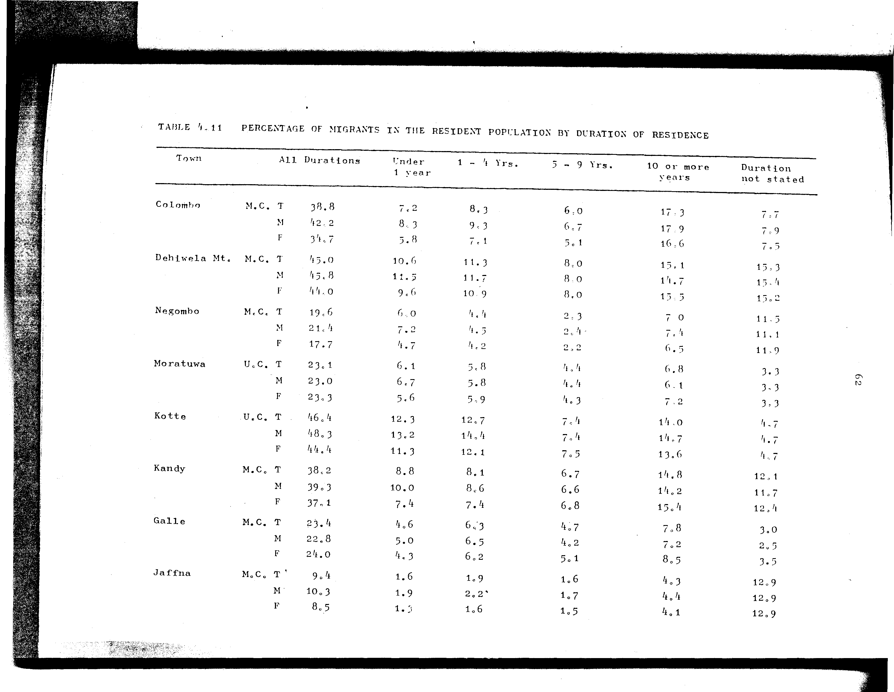

# 4.11: Percentage of migrants in the resident population by duration of residence

---

- 📜 Original PDF - [data/tables/table-4/table-4-11/original.pdf (61.0 kB)](../../../../data/tables/table-4/table-4-11/original.pdf)
- 📜 Original Image - [data/tables/table-4/table-4-11/original.image-01.png (135.4 kB)](../../../../data/tables/table-4/table-4-11/original.image-01.png)
- 📄 README - [data/tables/table-4/table-4-11/README.md (939 B)](../../../../data/tables/table-4/table-4-11/README.md)

## Extracted [JSON Data](../../../../data/tables/table-4/table-4-11/data.json)

*⚠️ No data extracted yet.*
## Original Table [Image](../../../../data/tables/table-4/table-4-11/original.image-01.png)

---

