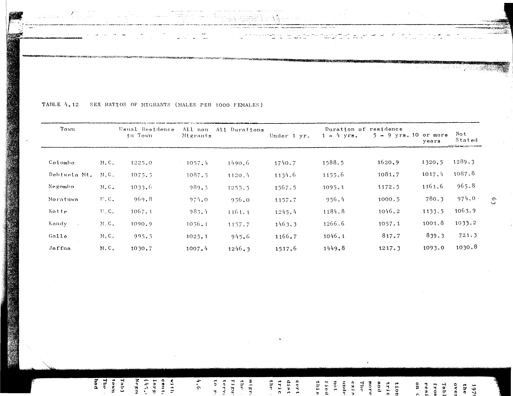

# 4.12: Sex ratios of migrants (males per 1000 females)


- 📜 Original Table PDF - [data/tables/table-4/table-4-12/original.pdf (63.1 kB)](../../../../data/tables/table-4/table-4-12/original.pdf)
- 📜 Original Table Image - [data/tables/table-4/table-4-12/original.images/image-01.png (137.6 kB)](../../../../data/tables/table-4/table-4-12/original.images/image-01.png)
- 📄 Extracted JSON Data - [data/tables/table-4/table-4-12/data.json (4.1 kB)](../../../../data/tables/table-4/table-4-12/data.json)

## Extracted [JSON Data](../../../../data/tables/table-4/table-4-12/data.json)

```json
{
    "found": true,
    "table_no": "4.12",
    "table_name": "Sex ratios of migrants (males per 1000 females)",
    "primary_keys": [
        "Town"
    ],
    "field_keys": [
        "Usual Residence in Town",
        "All non Migrants",
        "All Durations",
        "Duration of residence - Under 1 yr.",
        "Duration of residence - 1 - 4 yrs.",
        "Duration of residence - 5 - 9 yrs.",
        "Duration of residence - 10 or more years",
        "Duration of residence - Not Stated"
    ],
    "rows": [
        {
            "Town": "Colombo",
            "values": {
                "Usual Residence in Town": "M.C. 1225.0",
                "All non Migrants": 1057.4,
                "All Durations": 1490.6,
                "Duration of residence - Under 1 yr.": 1740.7,
                "Duration of residence - 1 - 4 yrs.": 1588.5,
                "Duration of residence - 5 - 9 yrs.": 1620.9,
                "Duration of residence - 10 or more years": 1320.5,
                "Duration of residence - Not Stated": 1289.3
            }
        },
        {
            "Town": "Dehiwela Mt.",
            "values": {
                "Usual Residence in Town": "M.C. 1075.5",
                "All non Migrants": 1087.5,
                "All Durations": 1120.4,
                "Duration of residence - Under 1 yr.": 1134.6,
                "Duration of residence - 1 - 4 yrs.": 1155.6,
                "Duration of residence - 5 - 9 yrs.": 1081.7,
                "Duration of residence - 10 or more years": 1017.4,
                "Duration of residence - Not Stated": 1087.8
            }
        },
        {
            "Town": "Negombo",
            "values": {
                "Usual Residence in Town": "M.C. 1033.6",
                "All non Migrants": 989.5,
                "All Durations": 1255.5,
                "Duration of residence - Under 1 yr.": 1567.5,
                "Duration of residence - 1 - 4 yrs.": 1095.1,
                "Duration of residence - 5 - 9 yrs.": 1172.5,
                "Duration of residence - 10 or more years": 1161.6,
                "Duration of residence - Not Stated": 965.8
            }
        },
        {
            "Town": "Moratuwa",
            "values": {
                "Usual Residence in Town": "U.C. 969.8",
                "All non Migrants": 974.0,
                "All Durations": 956.0,
                "Duration of residence - Under 1 yr.": 1157.7,
                "Duration of residence - 1 - 4 yrs.": 956.4,
                "Duration of residence - 5 - 9 yrs.": 1000.5,
                "Duration of residence - 10 or more years": 780.3,
                "Duration of residence - Not Stated": 974.0
            }
        },
        {
            "Town": "Kotte",
            "values": {
                "Usual Residence in Town": "U.C. 1067.1",
                "All non Migrants": 985.4,
                "All Durations": 1161.1,
                "Duration of residence - Under 1 yr.": 1245.4,
                "Duration of residence - 1 - 4 yrs.": 1184.8,
                "Duration of residence - 5 - 9 yrs.": 1046.2,
                "Duration of residence - 10 or more years": 1133.5,
                "Duration of residence - Not Stated": 1063.9
            }
        },
        {
            "Town": "Kandy",
            "values": {
                "Usual Residence in Town": "M.C. 1090.9",
                "All non Migrants": 1036.1,
                "All Durations": 1157.7,
                "Duration of residence - Under 1 yr.": 1463.3,
                "Duration of residence - 1 - 4 yrs.": 1266.6,
                "Duration of residence - 5 - 9 yrs.": 1057.1,
                "Duration of residence - 10 or more years": 1001.8,
                "Duration of residence - Not Stated": 1033.2
            }
        },
        {
            "Town": "Galle",
            "values": {
                "Usual Residence in Town": "M.C. 995.5",
                "All non Migrants": 1025.1,
                "All Durations": 945.6,
                "Duration of residence - Under 1 yr.": 1166.7,
                "Duration of residence - 1 - 4 yrs.": 1046.1,
                "Duration of residence - 5 - 9 yrs.": 817.7,
                "Duration of residence - 10 or more years": 839.3,
                "Duration of residence - Not Stated": 721.3
            }
        },
        {
            "Town": "Jaffna",
            "values": {
                "Usual Residence in Town": "M.C. 1030.7",
                "All non Migrants": 1007.4,
                "All Durations": 1246.3,
                "Duration of residence - Under 1 yr.": 1517.6,
                "Duration of residence - 1 - 4 yrs.": 1449.8,
                "Duration of residence - 5 - 9 yrs.": 1217.3,
                "Duration of residence - 10 or more years": 1093.0,
                "Duration of residence - Not Stated": 1030.8
            }
        }
    ],
    "notes": []
}
```

## Original Table [Image](../../../../data/tables/table-4/table-4-12/original.images/image-01.png)




[](https://opensource.org/licenses/MIT)
