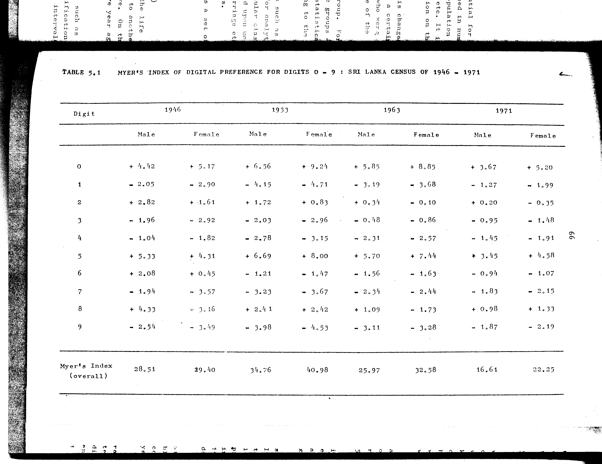

# 5.1: Myer's index of digital preference for digits 0-9: Sri Lanka census of 1946-1971

---

- 📜 Original PDF - [data/tables/table-5/table-5-01/original.pdf (67.5 kB)](../../../../data/tables/table-5/table-5-01/original.pdf)
- 📜 Original Image - [data/tables/table-5/table-5-01/original.image-01.png (144.0 kB)](../../../../data/tables/table-5/table-5-01/original.image-01.png)
- 📄 README - [data/tables/table-5/table-5-01/README.md (944 B)](../../../../data/tables/table-5/table-5-01/README.md)

## Extracted [JSON Data](../../../../data/tables/table-5/table-5-01/data.json)

*⚠️ No data extracted yet.*
## Original Table [Image](../../../../data/tables/table-5/table-5-01/original.image-01.png)

---

