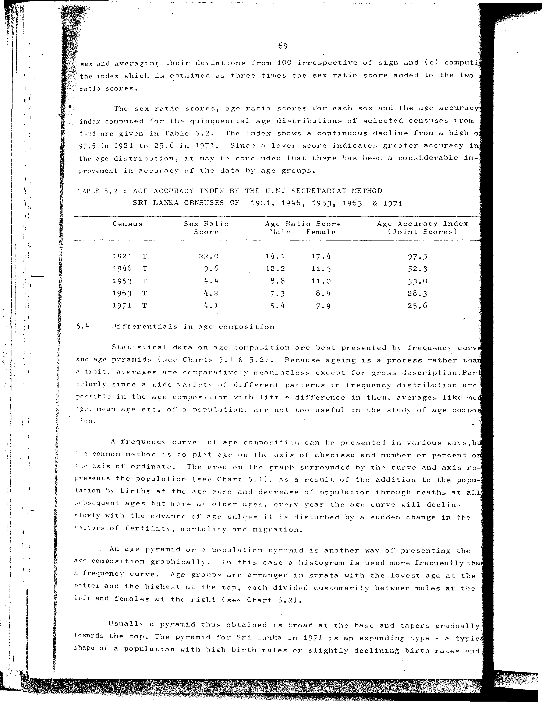

# 5.2: Age accuracy index by the U.N. Secretariat method Sri Lanka censuses of 1921, 1946, 1953, 1963 and 1971


- 📜 Original Table PDF - [data/tables/table-5/table-5-02/original.pdf (96.8 kB)](../../../../data/tables/table-5/table-5-02/original.pdf)
- 📜 Original Table Image - [data/tables/table-5/table-5-02/original.images/image-01.png (211.6 kB)](../../../../data/tables/table-5/table-5-02/original.images/image-01.png)
- 📄 Extracted JSON Data - [data/tables/table-5/table-5-02/data.json (1.5 kB)](../../../../data/tables/table-5/table-5-02/data.json)

## Extracted [JSON Data](../../../../data/tables/table-5/table-5-02/data.json)

```json
{
    "found": true,
    "table_no": "5.2",
    "table_name": "Age accuracy index by the U.N. Secretariat method Sri Lanka censuses of 1921, 1946, 1953, 1963 and 1971",
    "primary_keys": [
        "Census"
    ],
    "field_keys": [
        "Sex Ratio Score",
        "Age Ratio Score - Male",
        "Age Ratio Score - Female",
        "Age Accuracy Index (Joint Scores)"
    ],
    "rows": [
        {
            "Census": "1921 T",
            "values": {
                "Sex Ratio Score": 22.0,
                "Age Ratio Score - Male": 14.1,
                "Age Ratio Score - Female": 17.4,
                "Age Accuracy Index (Joint Scores)": 97.5
            }
        },
        {
            "Census": "1946 T",
            "values": {
                "Sex Ratio Score": 9.6,
                "Age Ratio Score - Male": 12.2,
                "Age Ratio Score - Female": 11.3,
                "Age Accuracy Index (Joint Scores)": 52.3
            }
        },
        {
            "Census": "1953 T",
            "values": {
                "Sex Ratio Score": 4.4,
                "Age Ratio Score - Male": 8.8,
                "Age Ratio Score - Female": 11.0,
                "Age Accuracy Index (Joint Scores)": 33.0
            }
        },
        {
            "Census": "1963 T",
            "values": {
                "Sex Ratio Score": 4.2,
                "Age Ratio Score - Male": 7.3,
                "Age Ratio Score - Female": 8.4,
                "Age Accuracy Index (Joint Scores)": 28.3
            }
        },
        {
            "Census": "1971 T",
            "values": {
                "Sex Ratio Score": 4.1,
                "Age Ratio Score - Male": 5.4,
                "Age Ratio Score - Female": 7.9,
                "Age Accuracy Index (Joint Scores)": 25.6
            }
        }
    ],
    "notes": []
}
```

## Original Table [Image](../../../../data/tables/table-5/table-5-02/original.images/image-01.png)




[](https://opensource.org/licenses/MIT)
