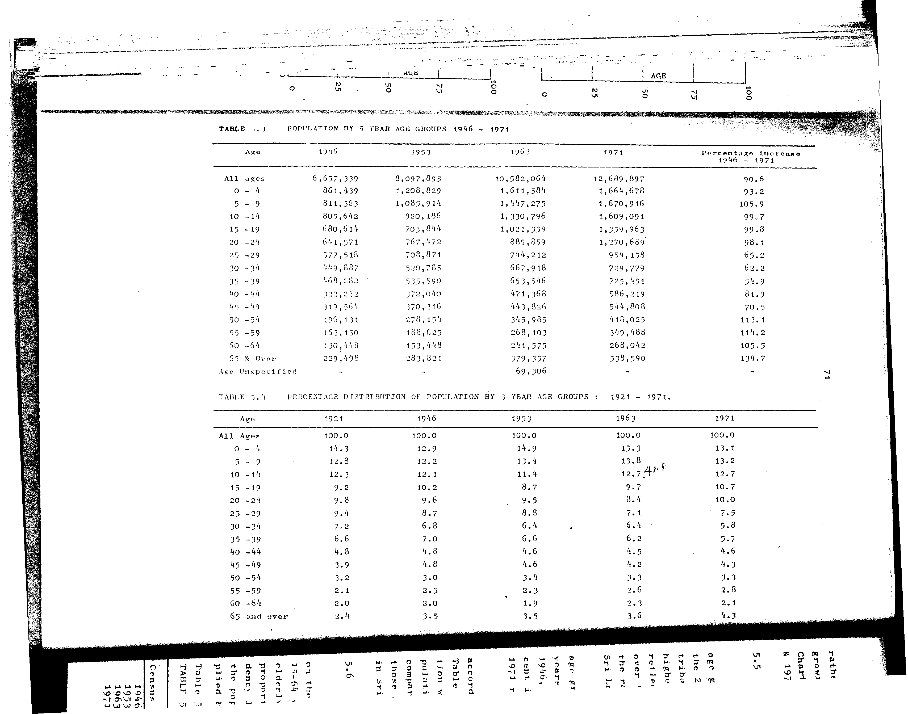

# 5.4: Percentage distribution of population by 5 year age groups - 1921-1971


- 📜 Original Table PDF - [data/tables/table-5/table-5-04/original.pdf (80.0 kB)](../../../../data/tables/table-5/table-5-04/original.pdf)
- 📜 Original Table Image - [data/tables/table-5/table-5-04/original.images/image-01.png (170.8 kB)](../../../../data/tables/table-5/table-5-04/original.images/image-01.png)
- 📄 Extracted JSON Data - [data/tables/table-5/table-5-04/data.json (2.8 kB)](../../../../data/tables/table-5/table-5-04/data.json)
- 📄 Extracted TSV Data - [data/tables/table-5/table-5-04/data.tsv (494 B)](../../../../data/tables/table-5/table-5-04/data.tsv)

## Original Table [Image](../../../../data/tables/table-5/table-5-04/original.images/image-01.png)



## Extracted [JSON Data](../../../../data/tables/table-5/table-5-04/data.json)

```json
{
    "found": true,
    "table_no": "5.4",
    "table_name": "Percentage distribution of population by 5 year age groups - 1921-1971",
    "primary_keys": [
        "Age"
    ],
    "field_keys": [
        "1921",
        "1946",
        "1953",
        "1963",
        "1971"
    ],
    "rows": [
        {
            "Age": "All Ages",
            "values": {
                "1921": 100.0,
                "1946": 100.0,
                "1953": 100.0,
                "1963": 100.0,
                "1971": 100.0
            }
        },
        {
            "Age": "0 - 4",
            "values": {
                "1921": 14.3,
                "1946": 12.9,
                "1953": 14.9,
                "1963": 15.3,
                "1971": 13.1
            }
        },
        {
            "Age": "5 - 9",
            "values": {
                "1921": 12.8,
                "1946": 12.2,
                "1953": 13.4,
                "1963": 13.8,
                "1971": 13.2
            }
        },
        {
            "Age": "10 - 14",
            "values": {
                "1921": 12.3,
                "1946": 12.1,
                "1953": 11.4,
                "1963": 12.7,
                "1971": 12.7
            }
        },
        {
            "Age": "15 - 19",
            "values": {
                "1921": 9.2,
                "1946": 10.2,
                "1953": 8.7,
                "1963": 9.7,
                "1971": 10.7
            }
        },
        {
            "Age": "20 - 24",
            "values": {
                "1921": 9.8,
                "1946": 9.6,
                "1953": 9.5,
                "1963": 8.4,
                "1971": 10.0
            }
        },
        {
            "Age": "25 - 29",
            "values": {
                "1921": 9.4,
                "1946": 8.7,
                "1953": 8.8,
                "1963": 7.1,
                "1971": 7.5
            }
        },
        {
            "Age": "30 - 34",
            "values": {
                "1921": 7.2,
                "1946": 6.8,
                "1953": 6.4,
                "1963": 6.4,
                "1971": 5.8
            }
        },
        {
            "Age": "35 - 39",
            "values": {
                "1921": 6.6,
                "1946": 7.0,
                "1953": 6.6,
                "1963": 6.2,
                "1971": 5.7
            }
        },
        {
            "Age": "40 - 44",
            "values": {
                "1921": 4.8,
                "1946": 4.8,
                "1953": 4.6,
                "1963": 4.5,
                "1971": 4.6
            }
        },
        {
            "Age": "45 - 49",
            "values": {
                "1921": 3.9,
                "1946": 4.8,
                "1953": 4.6,
                "1963": 4.2,
                "1971": 4.3
            }
        },
        {
            "Age": "50 - 54",
            "values": {
                "1921": 3.2,
                "1946": 3.0,
                "1953": 3.4,
                "1963": 3.3,
                "1971": 3.3
            }
        },
        {
            "Age": "55 - 59",
            "values": {
                "1921": 2.1,
                "1946": 2.5,
                "1953": 2.3,
                "1963": 2.6,
                "1971": 2.8
            }
        },
        {
            "Age": "60 - 64",
            "values": {
                "1921": 2.0,
                "1946": 2.0,
                "1953": 1.9,
                "1963": 2.3,
                "1971": 2.1
            }
        },
        {
            "Age": "65 and over",
            "values": {
                "1921": 2.4,
                "1946": 3.5,
                "1953": 3.5,
                "1963": 3.6,
                "1971": 4.3
            }
        }
    ],
    "notes": []
}
```

## Extracted [TSV Data](../../../../data/tables/table-5/table-5-04/data.tsv)

| Age | 1921 | 1946 | 1953 | 1963 | 1971 |
| --- | --- | --- | --- | --- | --- |
| All Ages | 100.0 | 100.0 | 100.0 | 100.0 | 100.0 |
| 0 - 4 | 14.3 | 12.9 | 14.9 | 15.3 | 13.1 |
| 5 - 9 | 12.8 | 12.2 | 13.4 | 13.8 | 13.2 |
| 10 - 14 | 12.3 | 12.1 | 11.4 | 12.7 | 12.7 |
| 15 - 19 | 9.2 | 10.2 | 8.7 | 9.7 | 10.7 |
| 20 - 24 | 9.8 | 9.6 | 9.5 | 8.4 | 10.0 |
| 25 - 29 | 9.4 | 8.7 | 8.8 | 7.1 | 7.5 |
| 30 - 34 | 7.2 | 6.8 | 6.4 | 6.4 | 5.8 |
| 35 - 39 | 6.6 | 7.0 | 6.6 | 6.2 | 5.7 |
| 40 - 44 | 4.8 | 4.8 | 4.6 | 4.5 | 4.6 |
| 45 - 49 | 3.9 | 4.8 | 4.6 | 4.2 | 4.3 |
| 50 - 54 | 3.2 | 3.0 | 3.4 | 3.3 | 3.3 |
| 55 - 59 | 2.1 | 2.5 | 2.3 | 2.6 | 2.8 |
| 60 - 64 | 2.0 | 2.0 | 1.9 | 2.3 | 2.1 |
| 65 and over | 2.4 | 3.5 | 3.5 | 3.6 | 4.3 |


[](https://opensource.org/licenses/MIT)
