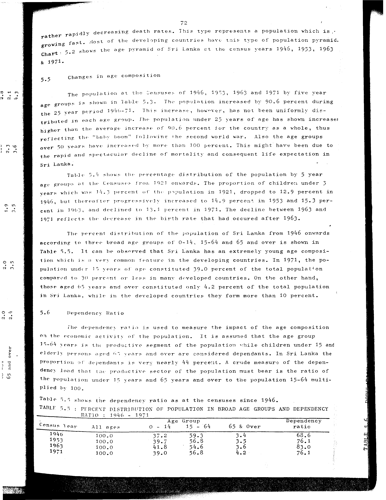

# 5.5: Percent distribution of population in broad age groups and dependency


- 📜 Original Table PDF - [data/tables/table-5/table-5-05/original.pdf (77.7 kB)](../../../../data/tables/table-5/table-5-05/original.pdf)
- 📜 Original Table Image - [data/tables/table-5/table-5-05/original.images/image-01.png (189.9 kB)](../../../../data/tables/table-5/table-5-05/original.images/image-01.png)
- 📄 Extracted JSON Data - [data/tables/table-5/table-5-05/data.json (1.3 kB)](../../../../data/tables/table-5/table-5-05/data.json)
- 📄 Extracted Normalized JSON Data - [data/tables/table-5/table-5-05/normalized_data.json (822 B)](../../../../data/tables/table-5/table-5-05/normalized_data.json)
- 📄 Extracted TSV Data - [data/tables/table-5/table-5-05/data.tsv (212 B)](../../../../data/tables/table-5/table-5-05/data.tsv)

## Original Table [Image](../../../../data/tables/table-5/table-5-05/original.images/image-01.png)



## Extracted [TSV Data](../../../../data/tables/table-5/table-5-05/data.tsv)

| Census Year | All ages | Age Group - 0 - 14 | Age Group - 15 - 64 | 65 & Over | Dependency ratio |
| --- | --- | --- | --- | --- | --- |
| 1946 | 100.0 | 37.2 | 59.3 | 3.4 | 68.6 |
| 1953 | 100.0 | 39.7 | 56.8 | 3.5 | 76.1 |
| 1963 | 100.0 | 41.8 | 54.6 | 3.6 | 83.0 |
| 1971 | 100.0 | 39.0 | 56.8 | 4.2 | 76.1 |

## Extracted [JSON Data](../../../../data/tables/table-5/table-5-05/data.json)

```json
{
    "found": true,
    "table_no": "5.5",
    "table_name": "Percent distribution of population in broad age groups and dependency",
    "primary_keys": [
        "Census Year"
    ],
    "field_keys": [
        "All ages",
        "Age Group - 0 - 14",
        "Age Group - 15 - 64",
        "65 & Over",
        "Dependency ratio"
    ],
    "rows": [
        {
            "Census Year": 1946,
            "values": {
                "All ages": 100.0,
                "Age Group - 0 - 14": 37.2,
                "Age Group - 15 - 64": 59.3,
                "65 & Over": 3.4,
                "Dependency ratio": 68.6
            }
        },
        {
            "Census Year": 1953,
            "values": {
                "All ages": 100.0,
                "Age Group - 0 - 14": 39.7,
                "Age Group - 15 - 64": 56.8,
                "65 & Over": 3.5,
                "Dependency ratio": 76.1
            }
        },
        {
            "Census Year": 1963,
            "values": {
                "All ages": 100.0,
                "Age Group - 0 - 14": 41.8,
                "Age Group - 15 - 64": 54.6,
                "65 & Over": 3.6,
                "Dependency ratio": 83.0
            }
        },
        {
            "Census Year": 1971,
            "values": {
                "All ages": 100.0,
                "Age Group - 0 - 14": 39.0,
                "Age Group - 15 - 64": 56.8,
                "65 & Over": 4.2,
                "Dependency ratio": 76.1
            }
        }
    ],
    "notes": [
        "RATIO : 1946 - 1971"
    ]
}
```

## Extracted [Normalized JSON Data](../../../../data/tables/table-5/table-5-05/normalized_data.json)

```json
[
    {
        "Census Year": 1946,
        "values": {
            "All ages": 100.0,
            "Age Group - 0 - 14": 37.2,
            "Age Group - 15 - 64": 59.3,
            "65 & Over": 3.4,
            "Dependency ratio": 68.6
        }
    },
    {
        "Census Year": 1953,
        "values": {
            "All ages": 100.0,
            "Age Group - 0 - 14": 39.7,
            "Age Group - 15 - 64": 56.8,
            "65 & Over": 3.5,
            "Dependency ratio": 76.1
        }
    },
    {
        "Census Year": 1963,
        "values": {
            "All ages": 100.0,
            "Age Group - 0 - 14": 41.8,
            "Age Group - 15 - 64": 54.6,
            "65 & Over": 3.6,
            "Dependency ratio": 83.0
        }
    },
    {
        "Census Year": 1971,
        "values": {
            "All ages": 100.0,
            "Age Group - 0 - 14": 39.0,
            "Age Group - 15 - 64": 56.8,
            "65 & Over": 4.2,
            "Dependency ratio": 76.1
        }
    }
]
```


[](https://opensource.org/licenses/MIT)
