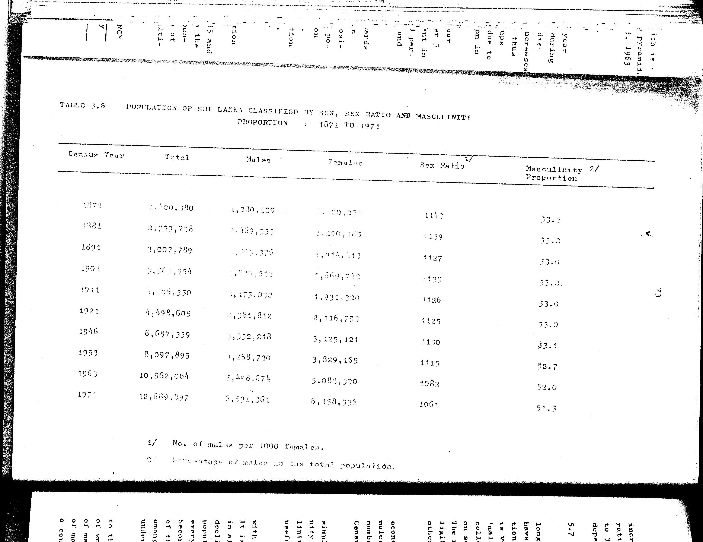

# 5.6: Population of Sri Lanka classified by sex, sex ratio and masculinity proportion - 1871 to 1971


- 📜 Original Table PDF - [data/tables/table-5/table-5-06/original.pdf (71.9 kB)](../../../../data/tables/table-5/table-5-06/original.pdf)
- 📜 Original Table Image - [data/tables/table-5/table-5-06/original.images/image-01.png (143.9 kB)](../../../../data/tables/table-5/table-5-06/original.images/image-01.png)
- 📄 Extracted JSON Data - [data/tables/table-5/table-5-06/data.json (2.6 kB)](../../../../data/tables/table-5/table-5-06/data.json)
- 📄 Extracted Normalized JSON Data - [data/tables/table-5/table-5-06/normalized_data.json (1.9 kB)](../../../../data/tables/table-5/table-5-06/normalized_data.json)
- 📄 Extracted TSV Data - [data/tables/table-5/table-5-06/data.tsv (468 B)](../../../../data/tables/table-5/table-5-06/data.tsv)

## Original Table [Image](../../../../data/tables/table-5/table-5-06/original.images/image-01.png)



## Extracted [TSV Data](../../../../data/tables/table-5/table-5-06/data.tsv)

| Census Year | Total | Males | Females | Sex Ratio | Masculinity Proportion |
| --- | --- | --- | --- | --- | --- |
| 1871 | 2400380 | 1230129 | 1170251 | 1142 | 53.3 |
| 1881 | 2759738 | 1469553 | 1290185 | 1139 | 53.2 |
| 1891 | 3007789 | 1593376 | 1414413 | 1127 | 53.0 |
| 1901 | 3565954 | 1896212 | 1669742 | 1135 | 53.2 |
| 1911 | 4106350 | 2175030 | 1931320 | 1126 | 53.0 |
| 1921 | 4498605 | 2381812 | 2116793 | 1125 | 53.0 |
| 1946 | 6657339 | 3532218 | 3125121 | 1130 | 53.1 |
| 1953 | 8097895 | 4268730 | 3829165 | 1115 | 52.7 |
| 1963 | 10582064 | 5498674 | 5083390 | 1082 | 52.0 |
| 1971 | 12689897 | 6531361 | 6158536 | 1061 | 51.5 |

## Extracted [JSON Data](../../../../data/tables/table-5/table-5-06/data.json)

```json
{
    "found": true,
    "table_no": "5.6",
    "table_name": "Population of Sri Lanka classified by sex, sex ratio and masculinity proportion - 1871 to 1971",
    "primary_keys": [
        "Census Year"
    ],
    "field_keys": [
        "Total",
        "Males",
        "Females",
        "Sex Ratio",
        "Masculinity Proportion"
    ],
    "rows": [
        {
            "Census Year": 1871,
            "values": {
                "Total": 2400380,
                "Males": 1230129,
                "Females": 1170251,
                "Sex Ratio": 1142,
                "Masculinity Proportion": 53.3
            }
        },
        {
            "Census Year": 1881,
            "values": {
                "Total": 2759738,
                "Males": 1469553,
                "Females": 1290185,
                "Sex Ratio": 1139,
                "Masculinity Proportion": 53.2
            }
        },
        {
            "Census Year": 1891,
            "values": {
                "Total": 3007789,
                "Males": 1593376,
                "Females": 1414413,
                "Sex Ratio": 1127,
                "Masculinity Proportion": 53.0
            }
        },
        {
            "Census Year": 1901,
            "values": {
                "Total": 3565954,
                "Males": 1896212,
                "Females": 1669742,
                "Sex Ratio": 1135,
                "Masculinity Proportion": 53.2
            }
        },
        {
            "Census Year": 1911,
            "values": {
                "Total": 4106350,
                "Males": 2175030,
                "Females": 1931320,
                "Sex Ratio": 1126,
                "Masculinity Proportion": 53.0
            }
        },
        {
            "Census Year": 1921,
            "values": {
                "Total": 4498605,
                "Males": 2381812,
                "Females": 2116793,
                "Sex Ratio": 1125,
                "Masculinity Proportion": 53.0
            }
        },
        {
            "Census Year": 1946,
            "values": {
                "Total": 6657339,
                "Males": 3532218,
                "Females": 3125121,
                "Sex Ratio": 1130,
                "Masculinity Proportion": 53.1
            }
        },
        {
            "Census Year": 1953,
            "values": {
                "Total": 8097895,
                "Males": 4268730,
                "Females": 3829165,
                "Sex Ratio": 1115,
                "Masculinity Proportion": 52.7
            }
        },
        {
            "Census Year": 1963,
            "values": {
                "Total": 10582064,
                "Males": 5498674,
                "Females": 5083390,
                "Sex Ratio": 1082,
                "Masculinity Proportion": 52.0
            }
        },
        {
            "Census Year": 1971,
            "values": {
                "Total": 12689897,
                "Males": 6531361,
                "Females": 6158536,
                "Sex Ratio": 1061,
                "Masculinity Proportion": 51.5
            }
        }
    ],
    "notes": [
        "1/ No. of males per 1000 females.",
        "2/ Percentage of males in the total population."
    ]
}
```

## Extracted [Normalized JSON Data](../../../../data/tables/table-5/table-5-06/normalized_data.json)

```json
[
    {
        "Census Year": 1871,
        "values": {
            "Total": 2400380,
            "Males": 1230129,
            "Females": 1170251,
            "Sex Ratio": 1142,
            "Masculinity Proportion": 53.3
        }
    },
    {
        "Census Year": 1881,
        "values": {
            "Total": 2759738,
            "Males": 1469553,
            "Females": 1290185,
            "Sex Ratio": 1139,
            "Masculinity Proportion": 53.2
        }
    },
    {
        "Census Year": 1891,
        "values": {
            "Total": 3007789,
            "Males": 1593376,
            "Females": 1414413,
            "Sex Ratio": 1127,
            "Masculinity Proportion": 53.0
        }
    },
    {
        "Census Year": 1901,
        "values": {
            "Total": 3565954,
            "Males": 1896212,
            "Females": 1669742,
            "Sex Ratio": 1135,
            "Masculinity Proportion": 53.2
        }
    },
    {
        "Census Year": 1911,
        "values": {
            "Total": 4106350,
            "Males": 2175030,
            "Females": 1931320,
            "Sex Ratio": 1126,
            "Masculinity Proportion": 53.0
        }
    },
    {
        "Census Year": 1921,
        "values": {
            "Total": 4498605,
            "Males": 2381812,
            "Females": 2116793,
            "Sex Ratio": 1125,
            "Masculinity Proportion": 53.0
        }
    },
    {
        "Census Year": 1946,
        "values": {
            "Total": 6657339,
            "Males": 3532218,
            "Females": 3125121,
            "Sex Ratio": 1130,
            "Masculinity Proportion": 53.1
        }
    },
    {
        "Census Year": 1953,
        "values": {
            "Total": 8097895,
            "Males": 4268730,
            "Females": 3829165,
            "Sex Ratio": 1115,
            "Masculinity Proportion": 52.7
        }
    },
    {
        "Census Year": 1963,
        "values": {
            "Total": 10582064,
            "Males": 5498674,
            "Females": 5083390,
            "Sex Ratio": 1082,
            "Masculinity Proportion": 52.0
        }
    },
    {
        "Census Year": 1971,
        "values": {
            "Total": 12689897,
            "Males": 6531361,
            "Females": 6158536,
            "Sex Ratio": 1061,
            "Masculinity Proportion": 51.5
        }
    }
]
```


[](https://opensource.org/licenses/MIT)
