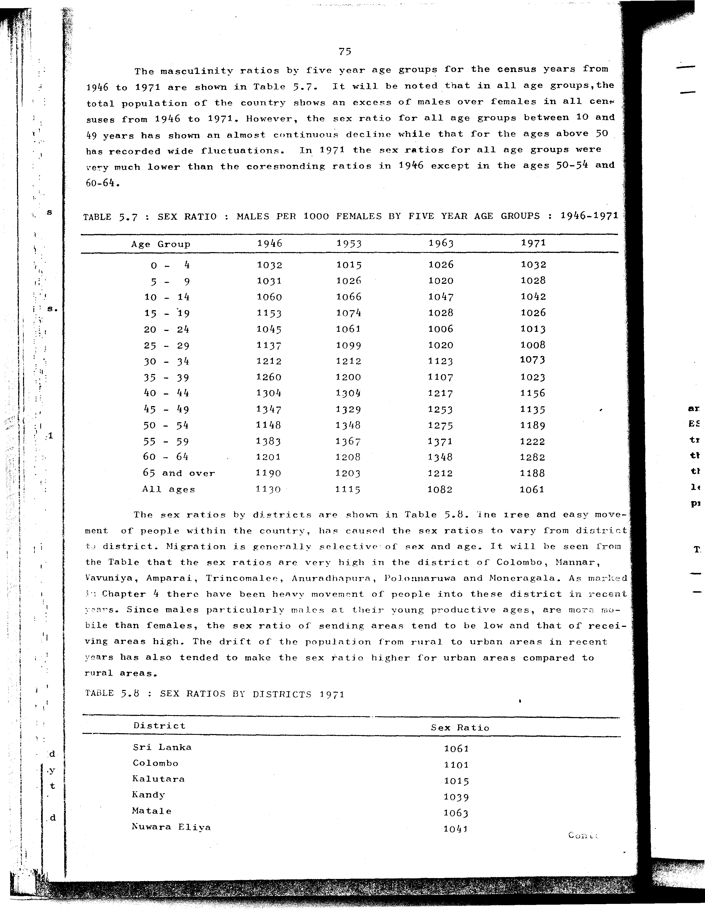

# 5.7: Sex ratio: males per 1000 females by five year age groups - 1946-1971


- 📜 Original Table PDF - [data/tables/table-5/table-5-07/original.pdf (81.2 kB)](../../../../data/tables/table-5/table-5-07/original.pdf)
- 📜 Original Table Image - [data/tables/table-5/table-5-07/original.images/image-01.png (186.5 kB)](../../../../data/tables/table-5/table-5-07/original.images/image-01.png)
- 📄 Extracted JSON Data - [data/tables/table-5/table-5-07/data.json (2.6 kB)](../../../../data/tables/table-5/table-5-07/data.json)
- 📄 Extracted Normalized JSON Data - [data/tables/table-5/table-5-07/normalized_data.json (2.1 kB)](../../../../data/tables/table-5/table-5-07/normalized_data.json)
- 📄 Extracted TSV Data - [data/tables/table-5/table-5-07/data.tsv (467 B)](../../../../data/tables/table-5/table-5-07/data.tsv)

## Original Table [Image](../../../../data/tables/table-5/table-5-07/original.images/image-01.png)



## Extracted [JSON Data](../../../../data/tables/table-5/table-5-07/data.json)

```json
{
    "found": true,
    "table_no": "5.7",
    "table_name": "Sex ratio: males per 1000 females by five year age groups - 1946-1971",
    "primary_keys": [
        "Age Group"
    ],
    "field_keys": [
        "1946",
        "1953",
        "1963",
        "1971"
    ],
    "rows": [
        {
            "Age Group": "0 - 4",
            "values": {
                "1946": 1032,
                "1953": 1015,
                "1963": 1026,
                "1971": 1032
            }
        },
        {
            "Age Group": "5 - 9",
            "values": {
                "1946": 1031,
                "1953": 1026,
                "1963": 1020,
                "1971": 1028
            }
        },
        {
            "Age Group": "10 - 14",
            "values": {
                "1946": 1060,
                "1953": 1066,
                "1963": 1047,
                "1971": 1042
            }
        },
        {
            "Age Group": "15 - 19",
            "values": {
                "1946": 1153,
                "1953": 1074,
                "1963": 1028,
                "1971": 1026
            }
        },
        {
            "Age Group": "20 - 24",
            "values": {
                "1946": 1045,
                "1953": 1061,
                "1963": 1006,
                "1971": 1013
            }
        },
        {
            "Age Group": "25 - 29",
            "values": {
                "1946": 1137,
                "1953": 1099,
                "1963": 1020,
                "1971": 1008
            }
        },
        {
            "Age Group": "30 - 34",
            "values": {
                "1946": 1212,
                "1953": 1212,
                "1963": 1123,
                "1971": 1073
            }
        },
        {
            "Age Group": "35 - 39",
            "values": {
                "1946": 1260,
                "1953": 1200,
                "1963": 1107,
                "1971": 1023
            }
        },
        {
            "Age Group": "40 - 44",
            "values": {
                "1946": 1304,
                "1953": 1304,
                "1963": 1217,
                "1971": 1156
            }
        },
        {
            "Age Group": "45 - 49",
            "values": {
                "1946": 1347,
                "1953": 1329,
                "1963": 1253,
                "1971": 1135
            }
        },
        {
            "Age Group": "50 - 54",
            "values": {
                "1946": 1148,
                "1953": 1348,
                "1963": 1275,
                "1971": 1189
            }
        },
        {
            "Age Group": "55 - 59",
            "values": {
                "1946": 1383,
                "1953": 1367,
                "1963": 1371,
                "1971": 1222
            }
        },
        {
            "Age Group": "60 - 64",
            "values": {
                "1946": 1201,
                "1953": 1208,
                "1963": 1348,
                "1971": 1282
            }
        },
        {
            "Age Group": "65 and over",
            "values": {
                "1946": 1190,
                "1953": 1203,
                "1963": 1212,
                "1971": 1188
            }
        },
        {
            "Age Group": "All ages",
            "values": {
                "1946": 1130,
                "1953": 1115,
                "1963": 1082,
                "1971": 1061
            }
        }
    ],
    "notes": []
}
```

## Extracted [Normalized JSON Data](../../../../data/tables/table-5/table-5-07/normalized_data.json)

```json
[
    {
        "Age Group": "0 - 4",
        "values": {
            "1946": 1032,
            "1953": 1015,
            "1963": 1026,
            "1971": 1032
        }
    },
    {
        "Age Group": "5 - 9",
        "values": {
            "1946": 1031,
            "1953": 1026,
            "1963": 1020,
            "1971": 1028
        }
    },
    {
        "Age Group": "10 - 14",
        "values": {
            "1946": 1060,
            "1953": 1066,
            "1963": 1047,
            "1971": 1042
        }
    },
    {
        "Age Group": "15 - 19",
        "values": {
            "1946": 1153,
            "1953": 1074,
            "1963": 1028,
            "1971": 1026
        }
    },
    {
        "Age Group": "20 - 24",
        "values": {
            "1946": 1045,
            "1953": 1061,
            "1963": 1006,
            "1971": 1013
        }
    },
    {
        "Age Group": "25 - 29",
        "values": {
            "1946": 1137,
            "1953": 1099,
            "1963": 1020,
            "1971": 1008
        }
    },
    {
        "Age Group": "30 - 34",
        "values": {
            "1946": 1212,
            "1953": 1212,
            "1963": 1123,
            "1971": 1073
        }
    },
    {
        "Age Group": "35 - 39",
        "values": {
            "1946": 1260,
            "1953": 1200,
            "1963": 1107,
            "1971": 1023
        }
    },
    {
        "Age Group": "40 - 44",
        "values": {
            "1946": 1304,
            "1953": 1304,
            "1963": 1217,
            "1971": 1156
        }
    },
    {
        "Age Group": "45 - 49",
        "values": {
            "1946": 1347,
            "1953": 1329,
            "1963": 1253,
            "1971": 1135
        }
    },
    {
        "Age Group": "50 - 54",
        "values": {
            "1946": 1148,
            "1953": 1348,
            "1963": 1275,
            "1971": 1189
        }
    },
    {
        "Age Group": "55 - 59",
        "values": {
            "1946": 1383,
            "1953": 1367,
            "1963": 1371,
            "1971": 1222
        }
    },
    {
        "Age Group": "60 - 64",
        "values": {
            "1946": 1201,
            "1953": 1208,
            "1963": 1348,
            "1971": 1282
        }
    },
    {
        "Age Group": "65 and over",
        "values": {
            "1946": 1190,
            "1953": 1203,
            "1963": 1212,
            "1971": 1188
        }
    },
    {
        "Age Group": "All ages",
        "values": {
            "1946": 1130,
            "1953": 1115,
            "1963": 1082,
            "1971": 1061
        }
    }
]
```

## Extracted [TSV Data](../../../../data/tables/table-5/table-5-07/data.tsv)

| Age Group | 1946 | 1953 | 1963 | 1971 |
| --- | --- | --- | --- | --- |
| 0 - 4 | 1032 | 1015 | 1026 | 1032 |
| 5 - 9 | 1031 | 1026 | 1020 | 1028 |
| 10 - 14 | 1060 | 1066 | 1047 | 1042 |
| 15 - 19 | 1153 | 1074 | 1028 | 1026 |
| 20 - 24 | 1045 | 1061 | 1006 | 1013 |
| 25 - 29 | 1137 | 1099 | 1020 | 1008 |
| 30 - 34 | 1212 | 1212 | 1123 | 1073 |
| 35 - 39 | 1260 | 1200 | 1107 | 1023 |
| 40 - 44 | 1304 | 1304 | 1217 | 1156 |
| 45 - 49 | 1347 | 1329 | 1253 | 1135 |
| 50 - 54 | 1148 | 1348 | 1275 | 1189 |
| 55 - 59 | 1383 | 1367 | 1371 | 1222 |
| 60 - 64 | 1201 | 1208 | 1348 | 1282 |
| 65 and over | 1190 | 1203 | 1212 | 1188 |
| All ages | 1130 | 1115 | 1082 | 1061 |


[](https://opensource.org/licenses/MIT)
