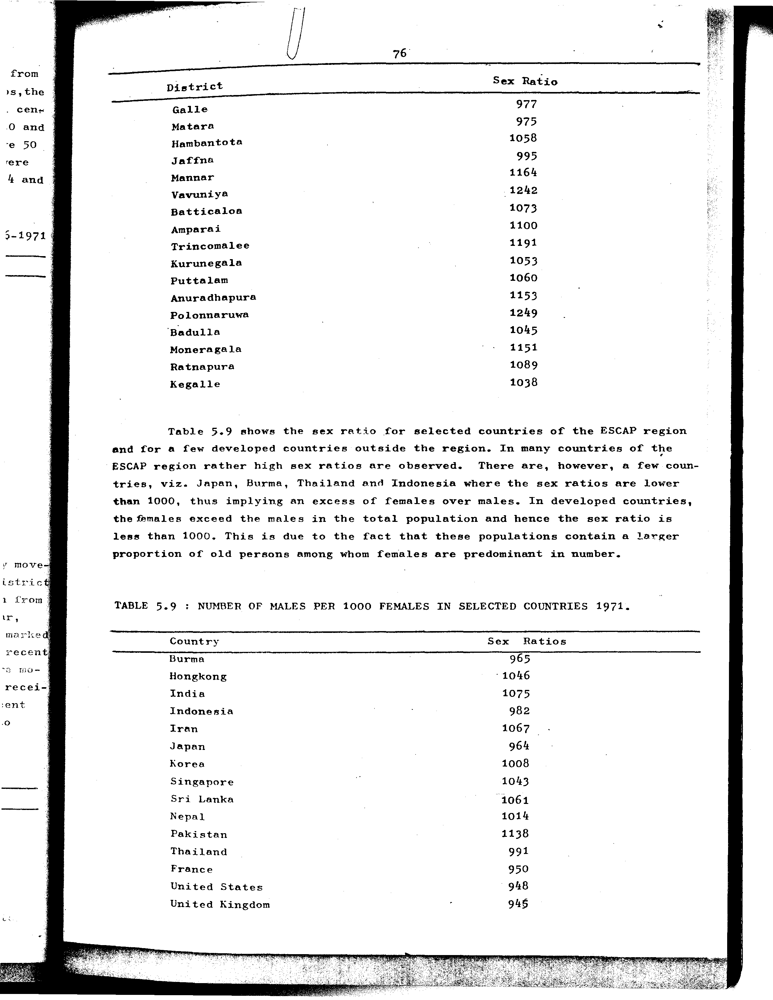

# 5.9: Number of males per 1000 females in selected countries 1971

- 📜 Original Table PDF - [data/tables/table-5/table-5-09/original.pdf (62.1 kB)](../../../../data/tables/table-5/table-5-09/original.pdf)
- 📜 Original Table Image - [data/tables/table-5/table-5-09/original.image-01.png (148.6 kB)](../../../../data/tables/table-5/table-5-09/original.image-01.png)

## Extracted [JSON Data](../../../../data/tables/table-5/table-5-09/data.json)

*⚠️ No data extracted yet.*
## Original Table [Image](../../../../data/tables/table-5/table-5-09/original.image-01.png)

