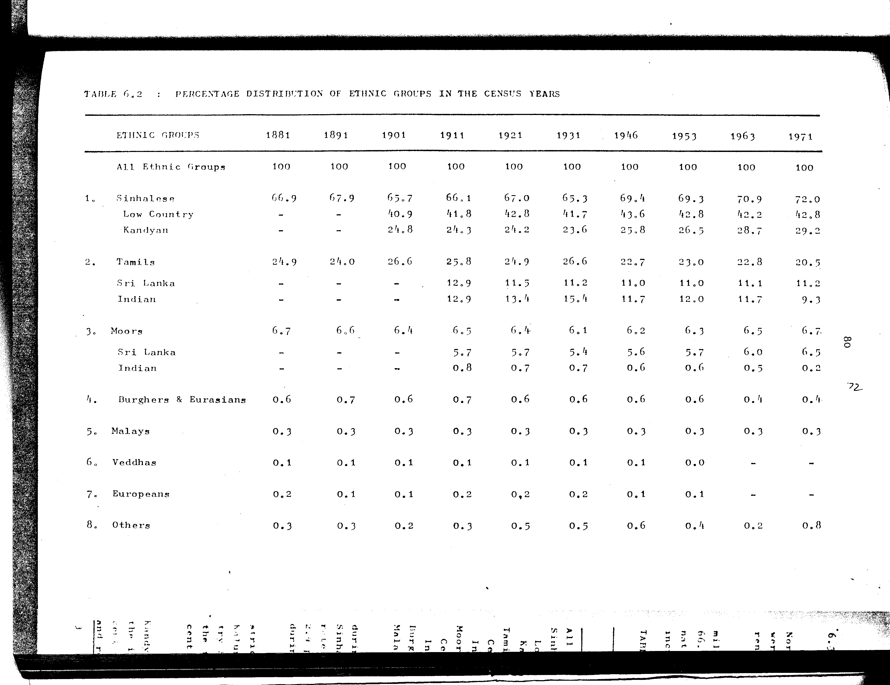

# 6.2: Percentage distribution of ethnic groups in the census years

---

- 📜 Original PDF - [data/tables/table-6/table-6-02/original.pdf (58.5 kB)](../../../../data/tables/table-6/table-6-02/original.pdf)
- 📜 Original Image - [data/tables/table-6/table-6-02/original.image-01.png (133.8 kB)](../../../../data/tables/table-6/table-6-02/original.image-01.png)
- 📄 README - [data/tables/table-6/table-6-02/README.md (924 B)](../../../../data/tables/table-6/table-6-02/README.md)

## Extracted [JSON Data](../../../../data/tables/table-6/table-6-02/data.json)

*⚠️ No data extracted yet.*
## Original Table [Image](../../../../data/tables/table-6/table-6-02/original.image-01.png)

---

