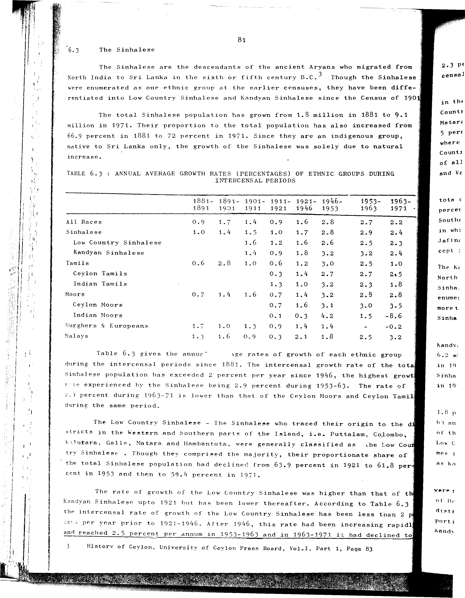

# 6.3: Annual average growth rates (percentages) of ethnic groups during intercensal periods


- 📜 Original Table PDF - [data/tables/table-6/table-6-03/original.pdf (95.9 kB)](../../../../data/tables/table-6/table-6-03/original.pdf)
- 📜 Original Table Image - [data/tables/table-6/table-6-03/original.images/image-01.png (222.6 kB)](../../../../data/tables/table-6/table-6-03/original.images/image-01.png)
- 📄 Extracted JSON Data - [data/tables/table-6/table-6-03/data.json (3.8 kB)](../../../../data/tables/table-6/table-6-03/data.json)

## Extracted [JSON Data](../../../../data/tables/table-6/table-6-03/data.json)

```json
{
    "found": true,
    "table_no": "6.3",
    "table_name": "Annual average growth rates (percentages) of ethnic groups during intercensal periods",
    "primary_keys": [
        "Ethnic Group"
    ],
    "field_keys": [
        "1881-1891",
        "1891-1901",
        "1901-1911",
        "1911-1921",
        "1921-1946",
        "1946-1953",
        "1953-1963",
        "1963-1971"
    ],
    "rows": [
        {
            "Ethnic Group": "All Races",
            "values": {
                "1881-1891": 0.9,
                "1891-1901": 1.7,
                "1901-1911": 1.4,
                "1911-1921": 0.9,
                "1921-1946": 1.6,
                "1946-1953": 2.8,
                "1953-1963": 2.7,
                "1963-1971": 2.2
            }
        },
        {
            "Ethnic Group": "Sinhalese",
            "values": {
                "1881-1891": 1.0,
                "1891-1901": 1.4,
                "1901-1911": 1.5,
                "1911-1921": 1.0,
                "1921-1946": 1.7,
                "1946-1953": 2.8,
                "1953-1963": 2.9,
                "1963-1971": 2.4
            }
        },
        {
            "Ethnic Group": "Low Country Sinhalese",
            "values": {
                "1881-1891": null,
                "1891-1901": null,
                "1901-1911": 1.6,
                "1911-1921": 1.2,
                "1921-1946": 1.6,
                "1946-1953": 2.6,
                "1953-1963": 2.5,
                "1963-1971": 2.3
            }
        },
        {
            "Ethnic Group": "Kandyan Sinhalese",
            "values": {
                "1881-1891": null,
                "1891-1901": null,
                "1901-1911": 1.4,
                "1911-1921": 0.9,
                "1921-1946": 1.8,
                "1946-1953": 3.2,
                "1953-1963": 3.2,
                "1963-1971": 2.4
            }
        },
        {
            "Ethnic Group": "Tamils",
            "values": {
                "1881-1891": 0.6,
                "1891-1901": 2.8,
                "1901-1911": 1.0,
                "1911-1921": 0.6,
                "1921-1946": 1.2,
                "1946-1953": 3.0,
                "1953-1963": 2.5,
                "1963-1971": 1.0
            }
        },
        {
            "Ethnic Group": "Ceylon Tamils",
            "values": {
                "1881-1891": null,
                "1891-1901": null,
                "1901-1911": null,
                "1911-1921": 0.3,
                "1921-1946": 1.4,
                "1946-1953": 2.7,
                "1953-1963": 2.7,
                "1963-1971": 2.5
            }
        },
        {
            "Ethnic Group": "Indian Tamils",
            "values": {
                "1881-1891": null,
                "1891-1901": null,
                "1901-1911": null,
                "1911-1921": 1.3,
                "1921-1946": 1.0,
                "1946-1953": 3.2,
                "1953-1963": 2.3,
                "1963-1971": 1.8
            }
        },
        {
            "Ethnic Group": "Moors",
            "values": {
                "1881-1891": 0.7,
                "1891-1901": 1.4,
                "1901-1911": 1.6,
                "1911-1921": 0.7,
                "1921-1946": 1.4,
                "1946-1953": 3.2,
                "1953-1963": 2.8,
                "1963-1971": 2.8
            }
        },
        {
            "Ethnic Group": "Ceylon Moors",
            "values": {
                "1881-1891": null,
                "1891-1901": null,
                "1901-1911": null,
                "1911-1921": 0.7,
                "1921-1946": 1.6,
                "1946-1953": 3.1,
                "1953-1963": 3.0,
                "1963-1971": 3.5
            }
        },
        {
            "Ethnic Group": "Indian Moors",
            "values": {
                "1881-1891": null,
                "1891-1901": null,
                "1901-1911": null,
                "1911-1921": 0.1,
                "1921-1946": 0.3,
                "1946-1953": 4.2,
                "1953-1963": 1.5,
                "1963-1971": -8.6
            }
        },
        {
            "Ethnic Group": "Burghers & Europeans",
            "values": {
                "1881-1891": 1.7,
                "1891-1901": 1.0,
                "1901-1911": 1.3,
                "1911-1921": 0.9,
                "1921-1946": 1.4,
                "1946-1953": 1.4,
                "1953-1963": null,
                "1963-1971": -0.2
            }
        },
        {
            "Ethnic Group": "Malays",
            "values": {
                "1881-1891": 1.3,
                "1891-1901": 1.6,
                "1901-1911": 0.9,
                "1911-1921": 0.3,
                "1921-1946": 2.1,
                "1946-1953": 1.8,
                "1953-1963": 2.5,
                "1963-1971": 3.2
            }
        }
    ],
    "notes": []
}
```

## Original Table [Image](../../../../data/tables/table-6/table-6-03/original.images/image-01.png)




[](https://opensource.org/licenses/MIT)
