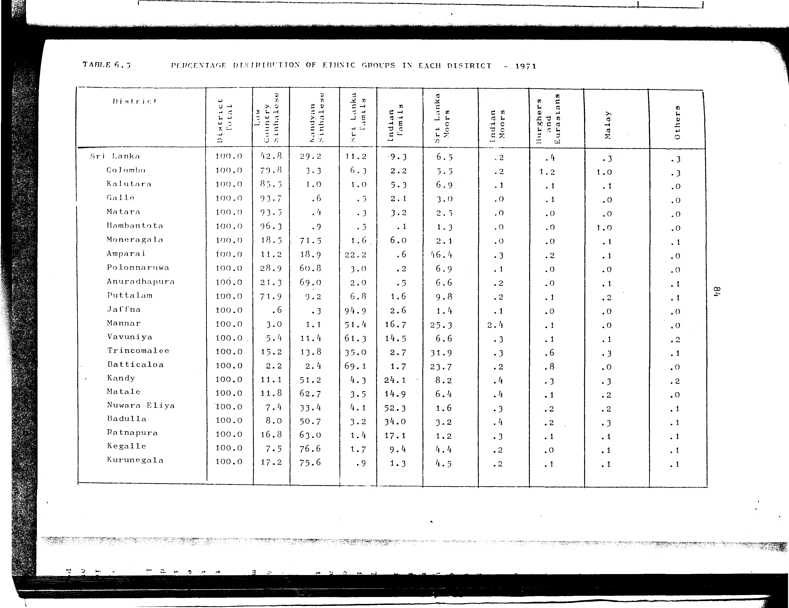

# 6.5: Percentage distribution of ethnic groups in each district - 1971


- 📜 Original Table PDF - [data/tables/table-6/table-6-05/original.pdf (74.2 kB)](../../../../data/tables/table-6/table-6-05/original.pdf)
- 📜 Original Table Image - [data/tables/table-6/table-6-05/original.image-01.png (198.2 kB)](../../../../data/tables/table-6/table-6-05/original.image-01.png)
- 📄 Extracted JSON Data - [data/tables/table-6/table-6-05/data.json (9.3 kB)](../../../../data/tables/table-6/table-6-05/data.json)

## Extracted [JSON Data](../../../../data/tables/table-6/table-6-05/data.json)

```json
{
    "found": true,
    "table_no": "6.5",
    "table_name": "Percentage distribution of ethnic groups in each district - 1971",
    "primary_keys": [
        "District"
    ],
    "field_keys": [
        "District Total",
        "Low Country Sinhalese",
        "Kandyan Sinhalese",
        "Sri Lanka Tamils",
        "Indian Tamils",
        "Sri Lanka Moors",
        "Indian Moors",
        "Burghers and Eurasians",
        "Malay",
        "Others"
    ],
    "rows": [
        {
            "District": "Sri Lanka",
            "values": {
                "District Total": 100.0,
                "Low Country Sinhalese": 42.8,
                "Kandyan Sinhalese": 29.2,
                "Sri Lanka Tamils": 11.2,
                "Indian Tamils": 9.3,
                "Sri Lanka Moors": 6.5,
                "Indian Moors": 0.2,
                "Burghers and Eurasians": 0.4,
                "Malay": 0.3,
                "Others": 0.3
            }
        },
        {
            "District": "Colombo",
            "values": {
                "District Total": 100.0,
                "Low Country Sinhalese": 79.8,
                "Kandyan Sinhalese": 3.3,
                "Sri Lanka Tamils": 6.3,
                "Indian Tamils": 2.2,
                "Sri Lanka Moors": 5.5,
                "Indian Moors": 0.2,
                "Burghers and Eurasians": 1.2,
                "Malay": 1.0,
                "Others": 0.3
            }
        },
        {
            "District": "Kalutara",
            "values": {
                "District Total": 100.0,
                "Low Country Sinhalese": 85.5,
                "Kandyan Sinhalese": 1.0,
                "Sri Lanka Tamils": 1.0,
                "Indian Tamils": 5.3,
                "Sri Lanka Moors": 6.9,
                "Indian Moors": 0.1,
                "Burghers and Eurasians": 0.1,
                "Malay": 0.1,
                "Others": 0.0
            }
        },
        {
            "District": "Galle",
            "values": {
                "District Total": 100.0,
                "Low Country Sinhalese": 93.7,
                "Kandyan Sinhalese": 0.6,
                "Sri Lanka Tamils": 0.5,
                "Indian Tamils": 2.1,
                "Sri Lanka Moors": 3.0,
                "Indian Moors": 0.0,
                "Burghers and Eurasians": 0.1,
                "Malay": 0.0,
                "Others": 0.0
            }
        },
        {
            "District": "Matara",
            "values": {
                "District Total": 100.0,
                "Low Country Sinhalese": 93.5,
                "Kandyan Sinhalese": 0.4,
                "Sri Lanka Tamils": 0.3,
                "Indian Tamils": 3.2,
                "Sri Lanka Moors": 2.5,
                "Indian Moors": 0.0,
                "Burghers and Eurasians": 0.0,
                "Malay": 0.0,
                "Others": 0.0
            }
        },
        {
            "District": "Hambantota",
            "values": {
                "District Total": 100.0,
                "Low Country Sinhalese": 96.3,
                "Kandyan Sinhalese": 0.9,
                "Sri Lanka Tamils": 0.5,
                "Indian Tamils": 0.1,
                "Sri Lanka Moors": 1.3,
                "Indian Moors": 0.0,
                "Burghers and Eurasians": 0.0,
                "Malay": 1.0,
                "Others": 0.0
            }
        },
        {
            "District": "Moneragala",
            "values": {
                "District Total": 100.0,
                "Low Country Sinhalese": 18.5,
                "Kandyan Sinhalese": 71.5,
                "Sri Lanka Tamils": 1.6,
                "Indian Tamils": 6.0,
                "Sri Lanka Moors": 2.1,
                "Indian Moors": 0.0,
                "Burghers and Eurasians": 0.0,
                "Malay": 0.1,
                "Others": 0.1
            }
        },
        {
            "District": "Amparai",
            "values": {
                "District Total": 100.0,
                "Low Country Sinhalese": 11.2,
                "Kandyan Sinhalese": 18.9,
                "Sri Lanka Tamils": 22.2,
                "Indian Tamils": 0.6,
                "Sri Lanka Moors": 46.4,
                "Indian Moors": 0.3,
                "Burghers and Eurasians": 0.2,
                "Malay": 0.1,
                "Others": 0.0
            }
        },
        {
            "District": "Polonnaruwa",
            "values": {
                "District Total": 100.0,
                "Low Country Sinhalese": 28.9,
                "Kandyan Sinhalese": 60.8,
                "Sri Lanka Tamils": 3.0,
                "Indian Tamils": 0.2,
                "Sri Lanka Moors": 6.9,
                "Indian Moors": 0.1,
                "Burghers and Eurasians": 0.0,
                "Malay": 0.0,
                "Others": 0.0
            }
        },
        {
            "District": "Anuradhapura",
            "values": {
                "District Total": 100.0,
                "Low Country Sinhalese": 21.3,
                "Kandyan Sinhalese": 69.0,
                "Sri Lanka Tamils": 2.0,
                "Indian Tamils": 0.5,
                "Sri Lanka Moors": 6.6,
                "Indian Moors": 0.2,
                "Burghers and Eurasians": 0.0,
                "Malay": 0.1,
                "Others": 0.1
            }
        },
        {
            "District": "Puttalam",
            "values": {
                "District Total": 100.0,
                "Low Country Sinhalese": 71.9,
                "Kandyan Sinhalese": 9.2,
                "Sri Lanka Tamils": 6.8,
                "Indian Tamils": 1.6,
                "Sri Lanka Moors": 9.8,
                "Indian Moors": 0.2,
                "Burghers and Eurasians": 0.1,
                "Malay": 0.2,
                "Others": 0.1
            }
        },
        {
            "District": "Jaffna",
            "values": {
                "District Total": 100.0,
                "Low Country Sinhalese": 0.6,
                "Kandyan Sinhalese": 0.3,
                "Sri Lanka Tamils": 94.9,
                "Indian Tamils": 2.6,
                "Sri Lanka Moors": 1.4,
                "Indian Moors": 0.1,
                "Burghers and Eurasians": 0.0,
                "Malay": 0.0,
                "Others": 0.0
            }
        },
        {
            "District": "Mannar",
            "values": {
                "District Total": 100.0,
                "Low Country Sinhalese": 3.0,
                "Kandyan Sinhalese": 1.1,
                "Sri Lanka Tamils": 51.4,
                "Indian Tamils": 16.7,
                "Sri Lanka Moors": 25.3,
                "Indian Moors": 2.4,
                "Burghers and Eurasians": 0.1,
                "Malay": 0.0,
                "Others": 0.0
            }
        },
        {
            "District": "Vavuniya",
            "values": {
                "District Total": 100.0,
                "Low Country Sinhalese": 5.4,
                "Kandyan Sinhalese": 11.4,
                "Sri Lanka Tamils": 61.3,
                "Indian Tamils": 14.5,
                "Sri Lanka Moors": 6.6,
                "Indian Moors": 0.3,
                "Burghers and Eurasians": 0.1,
                "Malay": 0.1,
                "Others": 0.2
            }
        },
        {
            "District": "Trincomalee",
            "values": {
                "District Total": 100.0,
                "Low Country Sinhalese": 15.2,
                "Kandyan Sinhalese": 13.8,
                "Sri Lanka Tamils": 35.0,
                "Indian Tamils": 2.7,
                "Sri Lanka Moors": 31.9,
                "Indian Moors": 0.3,
                "Burghers and Eurasians": 0.6,
                "Malay": 0.3,
                "Others": 0.1
            }
        },
        {
            "District": "Batticaloa",
            "values": {
                "District Total": 100.0,
                "Low Country Sinhalese": 2.2,
                "Kandyan Sinhalese": 2.4,
                "Sri Lanka Tamils": 69.1,
                "Indian Tamils": 1.7,
                "Sri Lanka Moors": 23.7,
                "Indian Moors": 0.2,
                "Burghers and Eurasians": 0.8,
                "Malay": 0.0,
                "Others": 0.0
            }
        },
        {
            "District": "Kandy",
            "values": {
                "District Total": 100.0,
                "Low Country Sinhalese": 11.1,
                "Kandyan Sinhalese": 51.2,
                "Sri Lanka Tamils": 4.3,
                "Indian Tamils": 24.1,
                "Sri Lanka Moors": 8.2,
                "Indian Moors": 0.4,
                "Burghers and Eurasians": 0.3,
                "Malay": 0.3,
                "Others": 0.2
            }
        },
        {
            "District": "Matale",
            "values": {
                "District Total": 100.0,
                "Low Country Sinhalese": 11.8,
                "Kandyan Sinhalese": 62.7,
                "Sri Lanka Tamils": 3.5,
                "Indian Tamils": 14.9,
                "Sri Lanka Moors": 6.4,
                "Indian Moors": 0.4,
                "Burghers and Eurasians": 0.1,
                "Malay": 0.2,
                "Others": 0.0
            }
        },
        {
            "District": "Nuwara Eliya",
            "values": {
                "District Total": 100.0,
                "Low Country Sinhalese": 7.4,
                "Kandyan Sinhalese": 33.4,
                "Sri Lanka Tamils": 4.1,
                "Indian Tamils": 52.3,
                "Sri Lanka Moors": 1.6,
                "Indian Moors": 0.3,
                "Burghers and Eurasians": 0.2,
                "Malay": 0.2,
                "Others": 0.1
            }
        },
        {
            "District": "Badulla",
            "values": {
                "District Total": 100.0,
                "Low Country Sinhalese": 8.0,
                "Kandyan Sinhalese": 50.7,
                "Sri Lanka Tamils": 3.2,
                "Indian Tamils": 34.0,
                "Sri Lanka Moors": 3.2,
                "Indian Moors": 0.4,
                "Burghers and Eurasians": 0.2,
                "Malay": 0.3,
                "Others": 0.1
            }
        },
        {
            "District": "Ratnapura",
            "values": {
                "District Total": 100.0,
                "Low Country Sinhalese": 16.8,
                "Kandyan Sinhalese": 63.0,
                "Sri Lanka Tamils": 1.4,
                "Indian Tamils": 17.1,
                "Sri Lanka Moors": 1.2,
                "Indian Moors": 0.3,
                "Burghers and Eurasians": 0.1,
                "Malay": 0.1,
                "Others": 0.1
            }
        },
        {
            "District": "Kegalle",
            "values": {
                "District Total": 100.0,
                "Low Country Sinhalese": 7.5,
                "Kandyan Sinhalese": 76.6,
                "Sri Lanka Tamils": 1.7,
                "Indian Tamils": 9.4,
                "Sri Lanka Moors": 4.4,
                "Indian Moors": 0.2,
                "Burghers and Eurasians": 0.0,
                "Malay": 0.1,
                "Others": 0.1
            }
        },
        {
            "District": "Kurunegala",
            "values": {
                "District Total": 100.0,
                "Low Country Sinhalese": 17.2,
                "Kandyan Sinhalese": 75.6,
                "Sri Lanka Tamils": 0.9,
                "Indian Tamils": 1.3,
                "Sri Lanka Moors": 4.5,
                "Indian Moors": 0.2,
                "Burghers and Eurasians": 0.1,
                "Malay": 0.1,
                "Others": 0.1
            }
        }
    ],
    "notes": []
}
```

## Original Table [Image](../../../../data/tables/table-6/table-6-05/original.image-01.png)




[](https://opensource.org/licenses/MIT)
