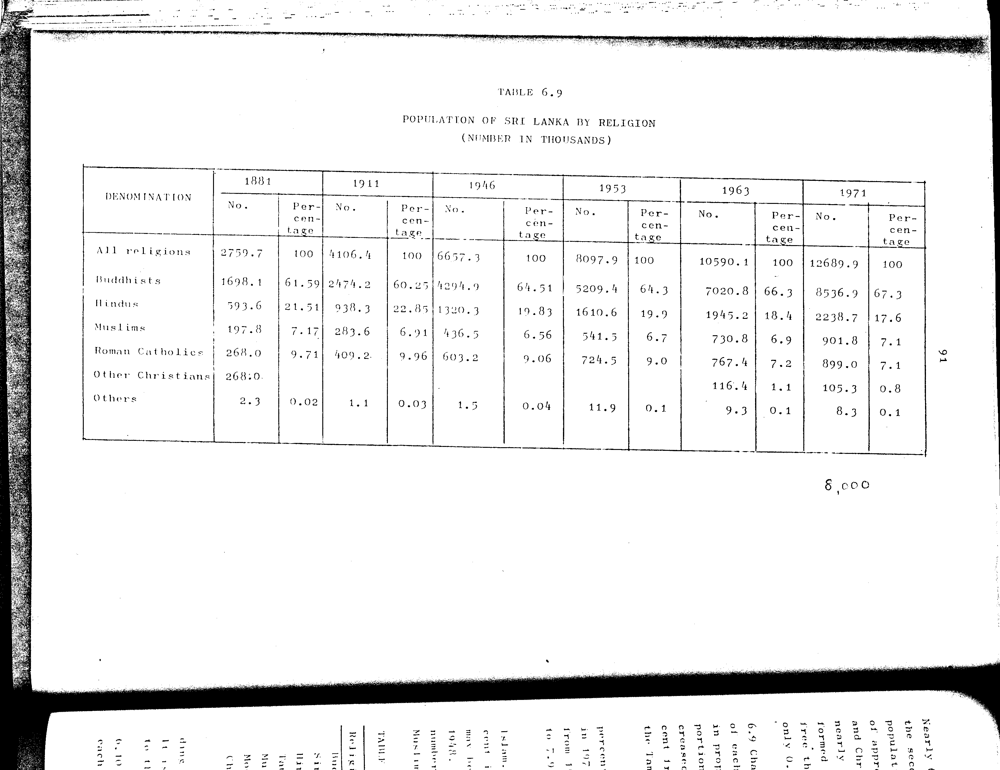

# 6.8: Number and percentage of total population of each religion - 1971


- 📜 Original Table PDF - [data/tables/table-6/table-6-08/original.pdf (73.2 kB)](../../../../data/tables/table-6/table-6-08/original.pdf)
- 📜 Original Table Image - [data/tables/table-6/table-6-08/original.image-01.png (169.1 kB)](../../../../data/tables/table-6/table-6-08/original.image-01.png)
- 📄 Extracted JSON Data - [data/tables/table-6/table-6-08/data.json (197 B)](../../../../data/tables/table-6/table-6-08/data.json)

## Extracted [JSON Data](../../../../data/tables/table-6/table-6-08/data.json)

```json
{
    "found": false,
    "table_no": "6.8",
    "table_name": "Number and percentage of total population of each religion - 1971",
    "primary_keys": [],
    "field_keys": [],
    "rows": [],
    "notes": []
}
```

## Original Table [Image](../../../../data/tables/table-6/table-6-08/original.image-01.png)




[](https://opensource.org/licenses/MIT)
