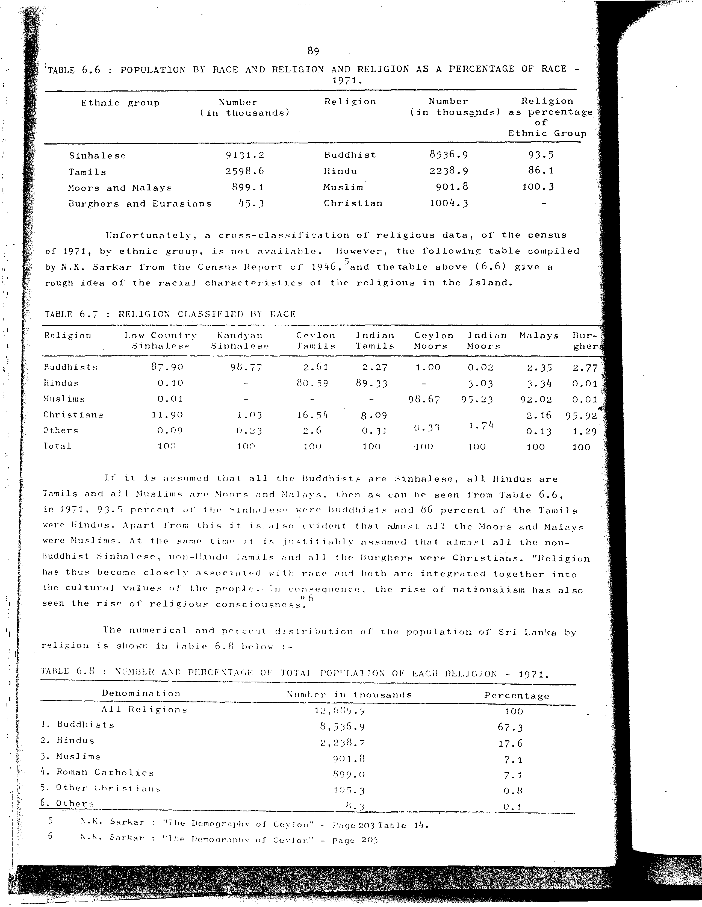

# 6.8: Number and percentage of total population of each religion - 1971


- 📜 Original Table PDF - [data/tables/table-6/table-6-08/original.pdf (92.4 kB)](../../../../data/tables/table-6/table-6-08/original.pdf)
- 📜 Original Table Image - [data/tables/table-6/table-6-08/original.images/image-01.png (199.2 kB)](../../../../data/tables/table-6/table-6-08/original.images/image-01.png)
- 📄 Extracted JSON Data - [data/tables/table-6/table-6-08/data.json (1.3 kB)](../../../../data/tables/table-6/table-6-08/data.json)

## Extracted [JSON Data](../../../../data/tables/table-6/table-6-08/data.json)

```json
{
    "found": true,
    "table_no": "6.8",
    "table_name": "Number and percentage of total population of each religion - 1971",
    "primary_keys": [
        "Denomination"
    ],
    "field_keys": [
        "Number in thousands",
        "Percentage"
    ],
    "rows": [
        {
            "Denomination": "All Religions",
            "values": {
                "Number in thousands": 12689.9,
                "Percentage": 100
            }
        },
        {
            "Denomination": "1. Buddhists",
            "values": {
                "Number in thousands": 8536.9,
                "Percentage": 67.3
            }
        },
        {
            "Denomination": "2. Hindus",
            "values": {
                "Number in thousands": 2238.7,
                "Percentage": 17.6
            }
        },
        {
            "Denomination": "3. Muslims",
            "values": {
                "Number in thousands": 901.8,
                "Percentage": 7.1
            }
        },
        {
            "Denomination": "4. Roman Catholics",
            "values": {
                "Number in thousands": 899.0,
                "Percentage": 7.1
            }
        },
        {
            "Denomination": "5. Other Christians",
            "values": {
                "Number in thousands": 105.3,
                "Percentage": 0.8
            }
        },
        {
            "Denomination": "6. Others",
            "values": {
                "Number in thousands": 8.2,
                "Percentage": 0.1
            }
        }
    ],
    "notes": []
}
```

## Original Table [Image](../../../../data/tables/table-6/table-6-08/original.images/image-01.png)




[](https://opensource.org/licenses/MIT)
