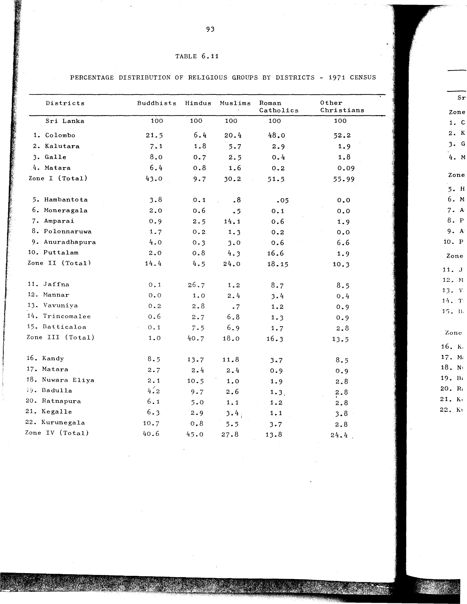

# 6.11: Percentage distribution of religious groups by districts - 1971 census

---

- 📜 Original PDF - [data/tables/table-6/table-6-11/original.pdf (61.6 kB)](../../../../data/tables/table-6/table-6-11/original.pdf)
- 📜 Original Image - [data/tables/table-6/table-6-11/original.image-01.png (145.0 kB)](../../../../data/tables/table-6/table-6-11/original.image-01.png)
- 📄 README - [data/tables/table-6/table-6-11/README.md (935 B)](../../../../data/tables/table-6/table-6-11/README.md)

## Extracted [JSON Data](../../../../data/tables/table-6/table-6-11/data.json)

*⚠️ No data extracted yet.*
## Original Table [Image](../../../../data/tables/table-6/table-6-11/original.image-01.png)

---

