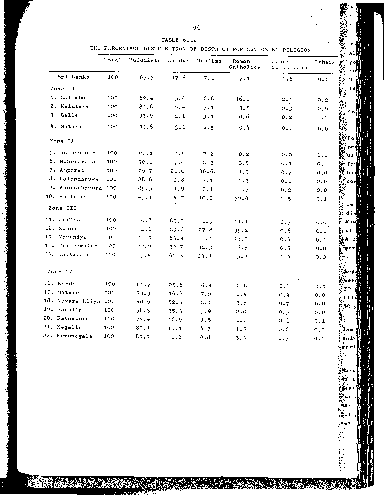

# 6.12: Percentage distribution of district population by religion


- 📜 Original Table PDF - [data/tables/table-6/table-6-12/original.pdf (89.2 kB)](../../../../data/tables/table-6/table-6-12/original.pdf)
- 📜 Original Table Image - [data/tables/table-6/table-6-12/original.images/image-01.png (214.6 kB)](../../../../data/tables/table-6/table-6-12/original.images/image-01.png)
- 📄 Extracted JSON Data - [data/tables/table-6/table-6-12/data.json (6.2 kB)](../../../../data/tables/table-6/table-6-12/data.json)
- 📄 Extracted Normalized JSON Data - [data/tables/table-6/table-6-12/normalized_data.json (5.4 kB)](../../../../data/tables/table-6/table-6-12/normalized_data.json)
- 📄 Extracted TSV Data - [data/tables/table-6/table-6-12/data.tsv (1.1 kB)](../../../../data/tables/table-6/table-6-12/data.tsv)

## Original Table [Image](../../../../data/tables/table-6/table-6-12/original.images/image-01.png)



## Extracted [TSV Data](../../../../data/tables/table-6/table-6-12/data.tsv)

| District | Total | Buddhists | Hindus | Muslims | Roman Catholics | Other Christians | Others |
| --- | --- | --- | --- | --- | --- | --- | --- |
| Sri Lanka | 100 | 67.3 | 17.6 | 7.1 | 7.1 | 0.8 | 0.1 |
| 1. Colombo | 100 | 69.4 | 5.4 | 6.8 | 16.1 | 2.1 | 0.2 |
| 2. Kalutara | 100 | 83.6 | 5.4 | 7.1 | 3.5 | 0.3 | 0.0 |
| 3. Galle | 100 | 93.9 | 2.1 | 3.1 | 0.6 | 0.2 | 0.0 |
| 4. Matara | 100 | 93.8 | 3.1 | 2.5 | 0.4 | 0.1 | 0.0 |
| 5. Hambantota | 100 | 97.1 | 0.4 | 2.2 | 0.2 | 0.0 | 0.0 |
| 6. Moneragala | 100 | 90.1 | 7.0 | 2.2 | 0.5 | 0.1 | 0.1 |
| 7. Amparai | 100 | 29.7 | 21.0 | 46.6 | 1.9 | 0.7 | 0.0 |
| 8. Polonnaruwa | 100 | 88.6 | 2.8 | 7.1 | 1.3 | 0.1 | 0.0 |
| 9. Anuradhapura | 100 | 89.5 | 1.9 | 7.1 | 1.3 | 0.2 | 0.0 |
| 10. Puttalam | 100 | 45.1 | 4.7 | 10.2 | 39.4 | 0.5 | 0.1 |
| 11. Jaffna | 100 | 0.8 | 85.2 | 1.5 | 11.1 | 1.3 | 0.0 |
| 12. Mannar | 100 | 2.6 | 29.6 | 27.8 | 39.2 | 0.6 | 0.1 |
| 13. Vavuniya | 100 | 14.5 | 65.9 | 7.1 | 11.9 | 0.6 | 0.1 |
| 14. Trincomalee | 100 | 27.9 | 32.7 | 32.3 | 6.5 | 0.5 | 0.0 |
| 15. Batticaloa | 100 | 3.4 | 65.3 | 24.1 | 5.9 | 1.3 | 0.0 |
| 16. Kandy | 100 | 61.7 | 25.8 | 8.9 | 2.8 | 0.7 | 0.1 |
| 17. Matale | 100 | 73.3 | 16.8 | 7.0 | 2.4 | 0.4 | 0.0 |
| 18. Nuwara Eliya | 100 | 40.9 | 52.5 | 2.1 | 3.8 | 0.7 | 0.0 |
| 19. Badulla | 100 | 58.3 | 35.3 | 3.9 | 2.0 | 0.5 | 0.0 |
| 20. Ratnapura | 100 | 79.4 | 16.9 | 1.5 | 1.7 | 0.4 | 0.1 |
| 21. Kegalle | 100 | 83.1 | 10.1 | 4.7 | 1.5 | 0.6 | 0.0 |
| 22. Kurunegala | 100 | 89.9 | 1.6 | 4.8 | 3.3 | 0.3 | 0.1 |

## Extracted [JSON Data](../../../../data/tables/table-6/table-6-12/data.json)

```json
{
    "found": true,
    "table_no": "6.12",
    "table_name": "Percentage distribution of district population by religion",
    "primary_keys": [
        "District"
    ],
    "field_keys": [
        "Total",
        "Buddhists",
        "Hindus",
        "Muslims",
        "Roman Catholics",
        "Other Christians",
        "Others"
    ],
    "rows": [
        {
            "District": "Sri Lanka",
            "values": {
                "Total": 100,
                "Buddhists": 67.3,
                "Hindus": 17.6,
                "Muslims": 7.1,
                "Roman Catholics": 7.1,
                "Other Christians": 0.8,
                "Others": 0.1
            }
        },
        {
            "District": "1. Colombo",
            "values": {
                "Total": 100,
                "Buddhists": 69.4,
                "Hindus": 5.4,
                "Muslims": 6.8,
                "Roman Catholics": 16.1,
                "Other Christians": 2.1,
                "Others": 0.2
            }
        },
        {
            "District": "2. Kalutara",
            "values": {
                "Total": 100,
                "Buddhists": 83.6,
                "Hindus": 5.4,
                "Muslims": 7.1,
                "Roman Catholics": 3.5,
                "Other Christians": 0.3,
                "Others": 0.0
            }
        },
        {
            "District": "3. Galle",
            "values": {
                "Total": 100,
                "Buddhists": 93.9,
                "Hindus": 2.1,
                "Muslims": 3.1,
                "Roman Catholics": 0.6,
                "Other Christians": 0.2,
                "Others": 0.0
            }
        },
        {
            "District": "4. Matara",
            "values": {
                "Total": 100,
                "Buddhists": 93.8,
                "Hindus": 3.1,
                "Muslims": 2.5,
                "Roman Catholics": 0.4,
                "Other Christians": 0.1,
                "Others": 0.0
            }
        },
        {
            "District": "5. Hambantota",
            "values": {
                "Total": 100,
                "Buddhists": 97.1,
                "Hindus": 0.4,
                "Muslims": 2.2,
                "Roman Catholics": 0.2,
                "Other Christians": 0.0,
                "Others": 0.0
            }
        },
        {
            "District": "6. Moneragala",
            "values": {
                "Total": 100,
                "Buddhists": 90.1,
                "Hindus": 7.0,
                "Muslims": 2.2,
                "Roman Catholics": 0.5,
                "Other Christians": 0.1,
                "Others": 0.1
            }
        },
        {
            "District": "7. Amparai",
            "values": {
                "Total": 100,
                "Buddhists": 29.7,
                "Hindus": 21.0,
                "Muslims": 46.6,
                "Roman Catholics": 1.9,
                "Other Christians": 0.7,
                "Others": 0.0
            }
        },
        {
            "District": "8. Polonnaruwa",
            "values": {
                "Total": 100,
                "Buddhists": 88.6,
                "Hindus": 2.8,
                "Muslims": 7.1,
                "Roman Catholics": 1.3,
                "Other Christians": 0.1,
                "Others": 0.0
            }
        },
        {
            "District": "9. Anuradhapura",
            "values": {
                "Total": 100,
                "Buddhists": 89.5,
                "Hindus": 1.9,
                "Muslims": 7.1,
                "Roman Catholics": 1.3,
                "Other Christians": 0.2,
                "Others": 0.0
            }
        },
        {
            "District": "10. Puttalam",
            "values": {
                "Total": 100,
                "Buddhists": 45.1,
                "Hindus": 4.7,
                "Muslims": 10.2,
                "Roman Catholics": 39.4,
                "Other Christians": 0.5,
                "Others": 0.1
            }
        },
        {
            "District": "11. Jaffna",
            "values": {
                "Total": 100,
                "Buddhists": 0.8,
                "Hindus": 85.2,
                "Muslims": 1.5,
                "Roman Catholics": 11.1,
                "Other Christians": 1.3,
                "Others": 0.0
            }
        },
        {
            "District": "12. Mannar",
            "values": {
                "Total": 100,
                "Buddhists": 2.6,
                "Hindus": 29.6,
                "Muslims": 27.8,
                "Roman Catholics": 39.2,
                "Other Christians": 0.6,
                "Others": 0.1
            }
        },
        {
            "District": "13. Vavuniya",
            "values": {
                "Total": 100,
                "Buddhists": 14.5,
                "Hindus": 65.9,
                "Muslims": 7.1,
                "Roman Catholics": 11.9,
                "Other Christians": 0.6,
                "Others": 0.1
            }
        },
        {
            "District": "14. Trincomalee",
            "values": {
                "Total": 100,
                "Buddhists": 27.9,
                "Hindus": 32.7,
                "Muslims": 32.3,
                "Roman Catholics": 6.5,
                "Other Christians": 0.5,
                "Others": 0.0
            }
        },
        {
            "District": "15. Batticaloa",
            "values": {
                "Total": 100,
                "Buddhists": 3.4,
                "Hindus": 65.3,
                "Muslims": 24.1,
                "Roman Catholics": 5.9,
                "Other Christians": 1.3,
                "Others": 0.0
            }
        },
        {
            "District": "16. Kandy",
            "values": {
                "Total": 100,
                "Buddhists": 61.7,
                "Hindus": 25.8,
                "Muslims": 8.9,
                "Roman Catholics": 2.8,
                "Other Christians": 0.7,
                "Others": 0.1
            }
        },
        {
            "District": "17. Matale",
            "values": {
                "Total": 100,
                "Buddhists": 73.3,
                "Hindus": 16.8,
                "Muslims": 7.0,
                "Roman Catholics": 2.4,
                "Other Christians": 0.4,
                "Others": 0.0
            }
        },
        {
            "District": "18. Nuwara Eliya",
            "values": {
                "Total": 100,
                "Buddhists": 40.9,
                "Hindus": 52.5,
                "Muslims": 2.1,
                "Roman Catholics": 3.8,
                "Other Christians": 0.7,
                "Others": 0.0
            }
        },
        {
            "District": "19. Badulla",
            "values": {
                "Total": 100,
                "Buddhists": 58.3,
                "Hindus": 35.3,
                "Muslims": 3.9,
                "Roman Catholics": 2.0,
                "Other Christians": 0.5,
                "Others": 0.0
            }
        },
        {
            "District": "20. Ratnapura",
            "values": {
                "Total": 100,
                "Buddhists": 79.4,
                "Hindus": 16.9,
                "Muslims": 1.5,
                "Roman Catholics": 1.7,
                "Other Christians": 0.4,
                "Others": 0.1
            }
        },
        {
            "District": "21. Kegalle",
            "values": {
                "Total": 100,
                "Buddhists": 83.1,
                "Hindus": 10.1,
                "Muslims": 4.7,
                "Roman Catholics": 1.5,
                "Other Christians": 0.6,
                "Others": 0.0
            }
        },
        {
            "District": "22. Kurunegala",
            "values": {
                "Total": 100,
                "Buddhists": 89.9,
                "Hindus": 1.6,
                "Muslims": 4.8,
                "Roman Catholics": 3.3,
                "Other Christians": 0.3,
                "Others": 0.1
            }
        }
    ],
    "notes": []
}
```

## Extracted [Normalized JSON Data](../../../../data/tables/table-6/table-6-12/normalized_data.json)

```json
[
    {
        "District": "Sri Lanka",
        "values": {
            "Total": 100,
            "Buddhists": 67.3,
            "Hindus": 17.6,
            "Muslims": 7.1,
            "Roman Catholics": 7.1,
            "Other Christians": 0.8,
            "Others": 0.1
        }
    },
    {
        "District": "1. Colombo",
        "values": {
            "Total": 100,
            "Buddhists": 69.4,
            "Hindus": 5.4,
            "Muslims": 6.8,
            "Roman Catholics": 16.1,
            "Other Christians": 2.1,
            "Others": 0.2
        }
    },
    {
        "District": "2. Kalutara",
        "values": {
            "Total": 100,
            "Buddhists": 83.6,
            "Hindus": 5.4,
            "Muslims": 7.1,
            "Roman Catholics": 3.5,
            "Other Christians": 0.3,
            "Others": 0.0
        }
    },
    {
        "District": "3. Galle",
        "values": {
            "Total": 100,
            "Buddhists": 93.9,
            "Hindus": 2.1,
            "Muslims": 3.1,
            "Roman Catholics": 0.6,
            "Other Christians": 0.2,
            "Others": 0.0
        }
    },
    {
        "District": "4. Matara",
        "values": {
            "Total": 100,
            "Buddhists": 93.8,
            "Hindus": 3.1,
            "Muslims": 2.5,
            "Roman Catholics": 0.4,
            "Other Christians": 0.1,
            "Others": 0.0
        }
    },
    {
        "District": "5. Hambantota",
        "values": {
            "Total": 100,
            "Buddhists": 97.1,
            "Hindus": 0.4,
            "Muslims": 2.2,
            "Roman Catholics": 0.2,
            "Other Christians": 0.0,
            "Others": 0.0
        }
    },
    {
        "District": "6. Moneragala",
        "values": {
            "Total": 100,
            "Buddhists": 90.1,
            "Hindus": 7.0,
            "Muslims": 2.2,
            "Roman Catholics": 0.5,
            "Other Christians": 0.1,
            "Others": 0.1
        }
    },
    {
        "District": "7. Amparai",
        "values": {
            "Total": 100,
            "Buddhists": 29.7,
            "Hindus": 21.0,
            "Muslims": 46.6,
            "Roman Catholics": 1.9,
            "Other Christians": 0.7,
            "Others": 0.0
        }
    },
    {
        "District": "8. Polonnaruwa",
        "values": {
            "Total": 100,
            "Buddhists": 88.6,
            "Hindus": 2.8,
            "Muslims": 7.1,
            "Roman Catholics": 1.3,
            "Other Christians": 0.1,
            "Others": 0.0
        }
    },
    {
        "District": "9. Anuradhapura",
        "values": {
            "Total": 100,
            "Buddhists": 89.5,
            "Hindus": 1.9,
            "Muslims": 7.1,
            "Roman Catholics": 1.3,
            "Other Christians": 0.2,
            "Others": 0.0
        }
    },
    {
        "District": "10. Puttalam",
        "values": {
            "Total": 100,
            "Buddhists": 45.1,
            "Hindus": 4.7,
            "Muslims": 10.2,
            "Roman Catholics": 39.4,
            "Other Christians": 0.5,
            "Others": 0.1
        }
    },
    {
        "District": "11. Jaffna",
        "values": {
            "Total": 100,
            "Buddhists": 0.8,
            "Hindus": 85.2,
            "Muslims": 1.5,
            "Roman Catholics": 11.1,
            "Other Christians": 1.3,
            "Others": 0.0
        }
    },
    {
        "District": "12. Mannar",
        "values": {
            "Total": 100,
            "Buddhists": 2.6,
            "Hindus": 29.6,
            "Muslims": 27.8,
            "Roman Catholics": 39.2,
            "Other Christians": 0.6,
            "Others": 0.1
        }
    },
    {
        "District": "13. Vavuniya",
        "values": {
            "Total": 100,
            "Buddhists": 14.5,
            "Hindus": 65.9,
            "Muslims": 7.1,
            "Roman Catholics": 11.9,
            "Other Christians": 0.6,
            "Others": 0.1
        }
    },
    {
        "District": "14. Trincomalee",
        "values": {
            "Total": 100,
            "Buddhists": 27.9,
            "Hindus": 32.7,
            "Muslims": 32.3,
            "Roman Catholics": 6.5,
            "Other Christians": 0.5,
            "Others": 0.0
        }
    },
    {
        "District": "15. Batticaloa",
        "values": {
            "Total": 100,
            "Buddhists": 3.4,
            "Hindus": 65.3,
            "Muslims": 24.1,
            "Roman Catholics": 5.9,
            "Other Christians": 1.3,
            "Others": 0.0
        }
    },
    {
        "District": "16. Kandy",
        "values": {
            "Total": 100,
            "Buddhists": 61.7,
            "Hindus": 25.8,
            "Muslims": 8.9,
            "Roman Catholics": 2.8,
            "Other Christians": 0.7,
            "Others": 0.1
        }
    },
    {
        "District": "17. Matale",
        "values": {
            "Total": 100,
            "Buddhists": 73.3,
            "Hindus": 16.8,
            "Muslims": 7.0,
            "Roman Catholics": 2.4,
            "Other Christians": 0.4,
            "Others": 0.0
        }
    },
    {
        "District": "18. Nuwara Eliya",
        "values": {
            "Total": 100,
            "Buddhists": 40.9,
            "Hindus": 52.5,
            "Muslims": 2.1,
            "Roman Catholics": 3.8,
            "Other Christians": 0.7,
            "Others": 0.0
        }
    },
    {
        "District": "19. Badulla",
        "values": {
            "Total": 100,
            "Buddhists": 58.3,
            "Hindus": 35.3,
            "Muslims": 3.9,
            "Roman Catholics": 2.0,
            "Other Christians": 0.5,
            "Others": 0.0
        }
    },
    {
        "District": "20. Ratnapura",
        "values": {
            "Total": 100,
            "Buddhists": 79.4,
            "Hindus": 16.9,
            "Muslims": 1.5,
            "Roman Catholics": 1.7,
            "Other Christians": 0.4,
            "Others": 0.1
        }
    },
    {
        "District": "21. Kegalle",
        "values": {
            "Total": 100,
            "Buddhists": 83.1,
            "Hindus": 10.1,
            "Muslims": 4.7,
            "Roman Catholics": 1.5,
            "Other Christians": 0.6,
            "Others": 0.0
        }
    },
    {
        "District": "22. Kurunegala",
        "values": {
            "Total": 100,
            "Buddhists": 89.9,
            "Hindus": 1.6,
            "Muslims": 4.8,
            "Roman Catholics": 3.3,
            "Other Christians": 0.3,
            "Others": 0.1
        }
    }
]
```


[](https://opensource.org/licenses/MIT)
