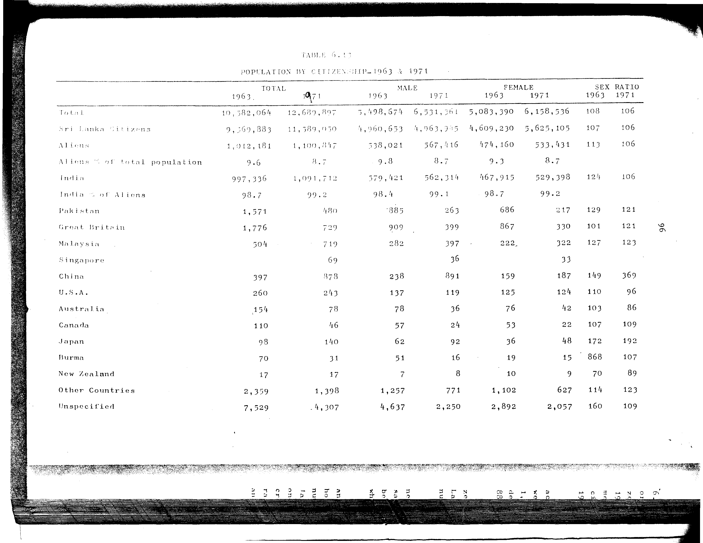

# 6.13: Population by citizenship - 1963 and 1971


- 📜 Original Table PDF - [data/tables/table-6/table-6-13/original.pdf (78.3 kB)](../../../../data/tables/table-6/table-6-13/original.pdf)
- 📜 Original Table Image - [data/tables/table-6/table-6-13/original.images/image-01.png (160.2 kB)](../../../../data/tables/table-6/table-6-13/original.images/image-01.png)
- 📄 Extracted JSON Data - [data/tables/table-6/table-6-13/data.json (6.4 kB)](../../../../data/tables/table-6/table-6-13/data.json)
- 📄 Extracted TSV Data - [data/tables/table-6/table-6-13/data.tsv (1.0 kB)](../../../../data/tables/table-6/table-6-13/data.tsv)

## Original Table [Image](../../../../data/tables/table-6/table-6-13/original.images/image-01.png)



## Extracted [JSON Data](../../../../data/tables/table-6/table-6-13/data.json)

```json
{
    "found": true,
    "table_no": "6.13",
    "table_name": "Population by citizenship - 1963 and 1971",
    "primary_keys": [
        "Citizenship"
    ],
    "field_keys": [
        "TOTAL - 1963",
        "TOTAL - 1971",
        "MALE - 1963",
        "MALE - 1971",
        "FEMALE - 1963",
        "FEMALE - 1971",
        "SEX RATIO - 1963",
        "SEX RATIO - 1971"
    ],
    "rows": [
        {
            "Citizenship": "Total",
            "values": {
                "TOTAL - 1963": 10582064,
                "TOTAL - 1971": 12689897,
                "MALE - 1963": 5498674,
                "MALE - 1971": 6531361,
                "FEMALE - 1963": 5083390,
                "FEMALE - 1971": 6158536,
                "SEX RATIO - 1963": 108,
                "SEX RATIO - 1971": 106
            }
        },
        {
            "Citizenship": "Sri Lanka Citizens",
            "values": {
                "TOTAL - 1963": 9569883,
                "TOTAL - 1971": 11589050,
                "MALE - 1963": 4960653,
                "MALE - 1971": 4963945,
                "FEMALE - 1963": 4609230,
                "FEMALE - 1971": 5625105,
                "SEX RATIO - 1963": 107,
                "SEX RATIO - 1971": 106
            }
        },
        {
            "Citizenship": "Aliens",
            "values": {
                "TOTAL - 1963": 1012181,
                "TOTAL - 1971": 1100847,
                "MALE - 1963": 538021,
                "MALE - 1971": 567416,
                "FEMALE - 1963": 474160,
                "FEMALE - 1971": 533431,
                "SEX RATIO - 1963": 113,
                "SEX RATIO - 1971": 106
            }
        },
        {
            "Citizenship": "Aliens % of total population",
            "values": {
                "TOTAL - 1963": 9.6,
                "TOTAL - 1971": 8.7,
                "MALE - 1963": 9.8,
                "MALE - 1971": 8.7,
                "FEMALE - 1963": 9.3,
                "FEMALE - 1971": 8.7,
                "SEX RATIO - 1963": null,
                "SEX RATIO - 1971": null
            }
        },
        {
            "Citizenship": "India",
            "values": {
                "TOTAL - 1963": 997336,
                "TOTAL - 1971": 1091712,
                "MALE - 1963": 579421,
                "MALE - 1971": 562314,
                "FEMALE - 1963": 467915,
                "FEMALE - 1971": 529398,
                "SEX RATIO - 1963": 124,
                "SEX RATIO - 1971": 106
            }
        },
        {
            "Citizenship": "India % of Aliens",
            "values": {
                "TOTAL - 1963": 98.7,
                "TOTAL - 1971": 99.2,
                "MALE - 1963": 98.4,
                "MALE - 1971": 99.1,
                "FEMALE - 1963": 98.7,
                "FEMALE - 1971": 99.2,
                "SEX RATIO - 1963": null,
                "SEX RATIO - 1971": null
            }
        },
        {
            "Citizenship": "Pakistan",
            "values": {
                "TOTAL - 1963": 1571,
                "TOTAL - 1971": 480,
                "MALE - 1963": 885,
                "MALE - 1971": 263,
                "FEMALE - 1963": 686,
                "FEMALE - 1971": 217,
                "SEX RATIO - 1963": 129,
                "SEX RATIO - 1971": 121
            }
        },
        {
            "Citizenship": "Great Britain",
            "values": {
                "TOTAL - 1963": 1776,
                "TOTAL - 1971": 729,
                "MALE - 1963": 909,
                "MALE - 1971": 399,
                "FEMALE - 1963": 867,
                "FEMALE - 1971": 330,
                "SEX RATIO - 1963": 101,
                "SEX RATIO - 1971": 121
            }
        },
        {
            "Citizenship": "Malaysia",
            "values": {
                "TOTAL - 1963": 504,
                "TOTAL - 1971": 719,
                "MALE - 1963": 282,
                "MALE - 1971": 397,
                "FEMALE - 1963": 222,
                "FEMALE - 1971": 322,
                "SEX RATIO - 1963": 127,
                "SEX RATIO - 1971": 123
            }
        },
        {
            "Citizenship": "Singapore",
            "values": {
                "TOTAL - 1963": null,
                "TOTAL - 1971": 69,
                "MALE - 1963": null,
                "MALE - 1971": 36,
                "FEMALE - 1963": null,
                "FEMALE - 1971": 33,
                "SEX RATIO - 1963": null,
                "SEX RATIO - 1971": null
            }
        },
        {
            "Citizenship": "China",
            "values": {
                "TOTAL - 1963": 397,
                "TOTAL - 1971": 878,
                "MALE - 1963": 238,
                "MALE - 1971": 891,
                "FEMALE - 1963": 159,
                "FEMALE - 1971": 187,
                "SEX RATIO - 1963": 149,
                "SEX RATIO - 1971": 369
            }
        },
        {
            "Citizenship": "U.S.A.",
            "values": {
                "TOTAL - 1963": 260,
                "TOTAL - 1971": 243,
                "MALE - 1963": 137,
                "MALE - 1971": 119,
                "FEMALE - 1963": 125,
                "FEMALE - 1971": 124,
                "SEX RATIO - 1963": 110,
                "SEX RATIO - 1971": 96
            }
        },
        {
            "Citizenship": "Australia",
            "values": {
                "TOTAL - 1963": 154,
                "TOTAL - 1971": 78,
                "MALE - 1963": 78,
                "MALE - 1971": 36,
                "FEMALE - 1963": 76,
                "FEMALE - 1971": 42,
                "SEX RATIO - 1963": 103,
                "SEX RATIO - 1971": 86
            }
        },
        {
            "Citizenship": "Canada",
            "values": {
                "TOTAL - 1963": 110,
                "TOTAL - 1971": 46,
                "MALE - 1963": 57,
                "MALE - 1971": 24,
                "FEMALE - 1963": 53,
                "FEMALE - 1971": 22,
                "SEX RATIO - 1963": 107,
                "SEX RATIO - 1971": 109
            }
        },
        {
            "Citizenship": "Japan",
            "values": {
                "TOTAL - 1963": 98,
                "TOTAL - 1971": 140,
                "MALE - 1963": 62,
                "MALE - 1971": 92,
                "FEMALE - 1963": 36,
                "FEMALE - 1971": 48,
                "SEX RATIO - 1963": 172,
                "SEX RATIO - 1971": 192
            }
        },
        {
            "Citizenship": "Burma",
            "values": {
                "TOTAL - 1963": 70,
                "TOTAL - 1971": 31,
                "MALE - 1963": 51,
                "MALE - 1971": 16,
                "FEMALE - 1963": 19,
                "FEMALE - 1971": 15,
                "SEX RATIO - 1963": 868,
                "SEX RATIO - 1971": 107
            }
        },
        {
            "Citizenship": "New Zealand",
            "values": {
                "TOTAL - 1963": 17,
                "TOTAL - 1971": 17,
                "MALE - 1963": 7,
                "MALE - 1971": 8,
                "FEMALE - 1963": 10,
                "FEMALE - 1971": 9,
                "SEX RATIO - 1963": 70,
                "SEX RATIO - 1971": 89
            }
        },
        {
            "Citizenship": "Other Countries",
            "values": {
                "TOTAL - 1963": 2359,
                "TOTAL - 1971": 1398,
                "MALE - 1963": 1257,
                "MALE - 1971": 771,
                "FEMALE - 1963": 1102,
                "FEMALE - 1971": 627,
                "SEX RATIO - 1963": 114,
                "SEX RATIO - 1971": 123
            }
        },
        {
            "Citizenship": "Unspecified",
            "values": {
                "TOTAL - 1963": 7529,
                "TOTAL - 1971": 4307,
                "MALE - 1963": 4637,
                "MALE - 1971": 2250,
                "FEMALE - 1963": 2892,
                "FEMALE - 1971": 2057,
                "SEX RATIO - 1963": 160,
                "SEX RATIO - 1971": 109
            }
        }
    ],
    "notes": []
}
```

## Extracted [TSV Data](../../../../data/tables/table-6/table-6-13/data.tsv)

| Citizenship | TOTAL - 1963 | TOTAL - 1971 | MALE - 1963 | MALE - 1971 | FEMALE - 1963 | FEMALE - 1971 | SEX RATIO - 1963 | SEX RATIO - 1971 |
| --- | --- | --- | --- | --- | --- | --- | --- | --- |
| Total | 10582064 | 12689897 | 5498674 | 6531361 | 5083390 | 6158536 | 108 | 106 |
| Sri Lanka Citizens | 9569883 | 11589050 | 4960653 | 4963945 | 4609230 | 5625105 | 107 | 106 |
| Aliens | 1012181 | 1100847 | 538021 | 567416 | 474160 | 533431 | 113 | 106 |
| Aliens % of total population | 9.6 | 8.7 | 9.8 | 8.7 | 9.3 | 8.7 |  |  |
| India | 997336 | 1091712 | 579421 | 562314 | 467915 | 529398 | 124 | 106 |
| India % of Aliens | 98.7 | 99.2 | 98.4 | 99.1 | 98.7 | 99.2 |  |  |
| Pakistan | 1571 | 480 | 885 | 263 | 686 | 217 | 129 | 121 |
| Great Britain | 1776 | 729 | 909 | 399 | 867 | 330 | 101 | 121 |
| Malaysia | 504 | 719 | 282 | 397 | 222 | 322 | 127 | 123 |
| Singapore |  | 69 |  | 36 |  | 33 |  |  |
| China | 397 | 878 | 238 | 891 | 159 | 187 | 149 | 369 |
| U.S.A. | 260 | 243 | 137 | 119 | 125 | 124 | 110 | 96 |
| Australia | 154 | 78 | 78 | 36 | 76 | 42 | 103 | 86 |
| Canada | 110 | 46 | 57 | 24 | 53 | 22 | 107 | 109 |
| Japan | 98 | 140 | 62 | 92 | 36 | 48 | 172 | 192 |
| Burma | 70 | 31 | 51 | 16 | 19 | 15 | 868 | 107 |
| New Zealand | 17 | 17 | 7 | 8 | 10 | 9 | 70 | 89 |
| Other Countries | 2359 | 1398 | 1257 | 771 | 1102 | 627 | 114 | 123 |
| Unspecified | 7529 | 4307 | 4637 | 2250 | 2892 | 2057 | 160 | 109 |


[](https://opensource.org/licenses/MIT)
