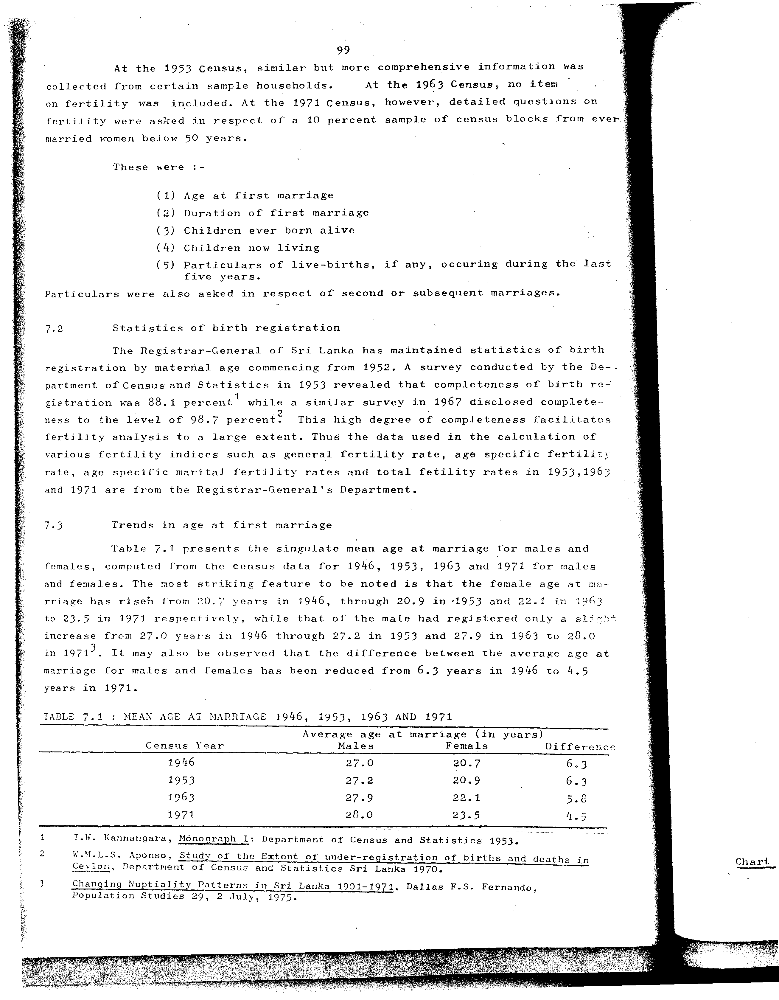

# 7.1: Mean age at marriage 1946, 1953, 1963 and 1971


- 📜 Original Table PDF - [data/tables/table-7/table-7-01/original.pdf (99.1 kB)](../../../../data/tables/table-7/table-7-01/original.pdf)
- 📜 Original Table Image - [data/tables/table-7/table-7-01/original.images/image-01.png (214.7 kB)](../../../../data/tables/table-7/table-7-01/original.images/image-01.png)
- 📄 Extracted JSON Data - [data/tables/table-7/table-7-01/data.json (1.5 kB)](../../../../data/tables/table-7/table-7-01/data.json)
- 📄 Extracted TSV Data - [data/tables/table-7/table-7-01/data.tsv (191 B)](../../../../data/tables/table-7/table-7-01/data.tsv)

## Original Table [Image](../../../../data/tables/table-7/table-7-01/original.images/image-01.png)



## Extracted [JSON Data](../../../../data/tables/table-7/table-7-01/data.json)

```json
{
    "found": true,
    "table_no": "7.1",
    "table_name": "Mean age at marriage 1946, 1953, 1963 and 1971",
    "primary_keys": [
        "Census Year"
    ],
    "field_keys": [
        "Average age at marriage (in years) - Males",
        "Average age at marriage (in years) - Femals",
        "Difference"
    ],
    "rows": [
        {
            "Census Year": 1946,
            "values": {
                "Average age at marriage (in years) - Males": 27.0,
                "Average age at marriage (in years) - Femals": 20.7,
                "Difference": 6.3
            }
        },
        {
            "Census Year": 1953,
            "values": {
                "Average age at marriage (in years) - Males": 27.2,
                "Average age at marriage (in years) - Femals": 20.9,
                "Difference": 6.3
            }
        },
        {
            "Census Year": 1963,
            "values": {
                "Average age at marriage (in years) - Males": 27.9,
                "Average age at marriage (in years) - Femals": 22.1,
                "Difference": 5.8
            }
        },
        {
            "Census Year": 1971,
            "values": {
                "Average age at marriage (in years) - Males": 28.0,
                "Average age at marriage (in years) - Femals": 23.5,
                "Difference": 4.5
            }
        }
    ],
    "notes": [
        "1 I.W. Kannangara, Monograph I: Department of Census and Statistics 1953.",
        "2 W.M.L.S. Aponso, Study of the Extent of under-registration of births and deaths in Ceylon, Department of Census and Statistics Sri Lanka 1970.",
        "3 Changing Nuptiality Patterns in Sri Lanka 1901-1971, Dallas F.S. Fernando, Population Studies 29, 2 July, 1975."
    ]
}
```

## Extracted [TSV Data](../../../../data/tables/table-7/table-7-01/data.tsv)

| Census Year | Average age at marriage (in years) - Males | Average age at marriage (in years) - Femals | Difference |
| --- | --- | --- | --- |
| 1946 | 27.0 | 20.7 | 6.3 |
| 1953 | 27.2 | 20.9 | 6.3 |
| 1963 | 27.9 | 22.1 | 5.8 |
| 1971 | 28.0 | 23.5 | 4.5 |


[](https://opensource.org/licenses/MIT)
