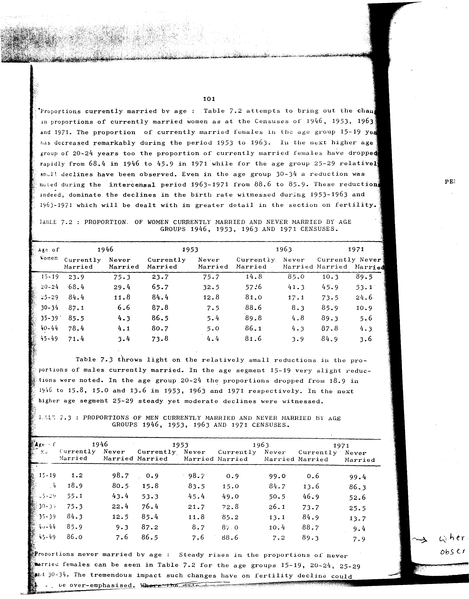

# 7.3: Proportion of men currently married and never married by age groups 1946, 1953, 1963 and 1971 censuses


- 📜 Original Table PDF - [data/tables/table-7/table-7-03/original.pdf (96.5 kB)](../../../../data/tables/table-7/table-7-03/original.pdf)
- 📜 Original Table Image - [data/tables/table-7/table-7-03/original.images/image-01.png (224.6 kB)](../../../../data/tables/table-7/table-7-03/original.images/image-01.png)
- 📄 Extracted JSON Data - [data/tables/table-7/table-7-03/data.json (3.2 kB)](../../../../data/tables/table-7/table-7-03/data.json)
- 📄 Extracted Normalized JSON Data - [data/tables/table-7/table-7-03/normalized_data.json (2.5 kB)](../../../../data/tables/table-7/table-7-03/normalized_data.json)
- 📄 Extracted TSV Data - [data/tables/table-7/table-7-03/data.tsv (512 B)](../../../../data/tables/table-7/table-7-03/data.tsv)

## Original Table [Image](../../../../data/tables/table-7/table-7-03/original.images/image-01.png)



## Extracted [TSV Data](../../../../data/tables/table-7/table-7-03/data.tsv)

| Age of Women | 1946 - Currently Married | 1946 - Never Married | 1953 - Currently Married | 1953 - Never Married | 1963 - Currently Married | 1963 - Never Married | 1971 - Currently Married | 1971 - Never Married |
| --- | --- | --- | --- | --- | --- | --- | --- | --- |
| 15-19 | 1.2 | 98.7 | 0.9 | 98.7 | 0.9 | 99.0 | 0.6 | 99.4 |
| 4 | 18.9 | 80.5 | 15.8 | 83.5 | 15.0 | 84.7 | 13.6 | 86.3 |
| 25-29 | 55.1 | 43.4 | 53.3 | 45.4 | 49.0 | 50.5 | 46.9 | 52.6 |
| 30-34 | 75.3 | 22.4 | 76.4 | 21.7 | 72.8 | 26.1 | 73.7 | 25.5 |
| 35-39 | 84.3 | 12.5 | 85.4 | 11.8 | 85.2 | 13.1 | 84.9 | 13.7 |
| 40-44 | 85.9 | 9.3 | 87.2 | 8.7 | 87.0 | 10.4 | 88.7 | 9.4 |
| 45-49 | 86.0 | 7.6 | 86.5 | 7.6 | 88.6 | 7.2 | 89.3 | 7.9 |

## Extracted [JSON Data](../../../../data/tables/table-7/table-7-03/data.json)

```json
{
    "found": true,
    "table_no": "7.3",
    "table_name": "Proportion of men currently married and never married by age groups 1946, 1953, 1963 and 1971 censuses",
    "primary_keys": [
        "Age of Women"
    ],
    "field_keys": [
        "1946 - Currently Married",
        "1946 - Never Married",
        "1953 - Currently Married",
        "1953 - Never Married",
        "1963 - Currently Married",
        "1963 - Never Married",
        "1971 - Currently Married",
        "1971 - Never Married"
    ],
    "rows": [
        {
            "Age of Women": "15-19",
            "values": {
                "1946 - Currently Married": 1.2,
                "1946 - Never Married": 98.7,
                "1953 - Currently Married": 0.9,
                "1953 - Never Married": 98.7,
                "1963 - Currently Married": 0.9,
                "1963 - Never Married": 99.0,
                "1971 - Currently Married": 0.6,
                "1971 - Never Married": 99.4
            }
        },
        {
            "Age of Women": "4",
            "values": {
                "1946 - Currently Married": 18.9,
                "1946 - Never Married": 80.5,
                "1953 - Currently Married": 15.8,
                "1953 - Never Married": 83.5,
                "1963 - Currently Married": 15.0,
                "1963 - Never Married": 84.7,
                "1971 - Currently Married": 13.6,
                "1971 - Never Married": 86.3
            }
        },
        {
            "Age of Women": "25-29",
            "values": {
                "1946 - Currently Married": 55.1,
                "1946 - Never Married": 43.4,
                "1953 - Currently Married": 53.3,
                "1953 - Never Married": 45.4,
                "1963 - Currently Married": 49.0,
                "1963 - Never Married": 50.5,
                "1971 - Currently Married": 46.9,
                "1971 - Never Married": 52.6
            }
        },
        {
            "Age of Women": "30-34",
            "values": {
                "1946 - Currently Married": 75.3,
                "1946 - Never Married": 22.4,
                "1953 - Currently Married": 76.4,
                "1953 - Never Married": 21.7,
                "1963 - Currently Married": 72.8,
                "1963 - Never Married": 26.1,
                "1971 - Currently Married": 73.7,
                "1971 - Never Married": 25.5
            }
        },
        {
            "Age of Women": "35-39",
            "values": {
                "1946 - Currently Married": 84.3,
                "1946 - Never Married": 12.5,
                "1953 - Currently Married": 85.4,
                "1953 - Never Married": 11.8,
                "1963 - Currently Married": 85.2,
                "1963 - Never Married": 13.1,
                "1971 - Currently Married": 84.9,
                "1971 - Never Married": 13.7
            }
        },
        {
            "Age of Women": "40-44",
            "values": {
                "1946 - Currently Married": 85.9,
                "1946 - Never Married": 9.3,
                "1953 - Currently Married": 87.2,
                "1953 - Never Married": 8.7,
                "1963 - Currently Married": 87.0,
                "1963 - Never Married": 10.4,
                "1971 - Currently Married": 88.7,
                "1971 - Never Married": 9.4
            }
        },
        {
            "Age of Women": "45-49",
            "values": {
                "1946 - Currently Married": 86.0,
                "1946 - Never Married": 7.6,
                "1953 - Currently Married": 86.5,
                "1953 - Never Married": 7.6,
                "1963 - Currently Married": 88.6,
                "1963 - Never Married": 7.2,
                "1971 - Currently Married": 89.3,
                "1971 - Never Married": 7.9
            }
        }
    ],
    "notes": []
}
```

## Extracted [Normalized JSON Data](../../../../data/tables/table-7/table-7-03/normalized_data.json)

```json
[
    {
        "Age of Women": "15-19",
        "values": {
            "1946 - Currently Married": 1.2,
            "1946 - Never Married": 98.7,
            "1953 - Currently Married": 0.9,
            "1953 - Never Married": 98.7,
            "1963 - Currently Married": 0.9,
            "1963 - Never Married": 99.0,
            "1971 - Currently Married": 0.6,
            "1971 - Never Married": 99.4
        }
    },
    {
        "Age of Women": "4",
        "values": {
            "1946 - Currently Married": 18.9,
            "1946 - Never Married": 80.5,
            "1953 - Currently Married": 15.8,
            "1953 - Never Married": 83.5,
            "1963 - Currently Married": 15.0,
            "1963 - Never Married": 84.7,
            "1971 - Currently Married": 13.6,
            "1971 - Never Married": 86.3
        }
    },
    {
        "Age of Women": "25-29",
        "values": {
            "1946 - Currently Married": 55.1,
            "1946 - Never Married": 43.4,
            "1953 - Currently Married": 53.3,
            "1953 - Never Married": 45.4,
            "1963 - Currently Married": 49.0,
            "1963 - Never Married": 50.5,
            "1971 - Currently Married": 46.9,
            "1971 - Never Married": 52.6
        }
    },
    {
        "Age of Women": "30-34",
        "values": {
            "1946 - Currently Married": 75.3,
            "1946 - Never Married": 22.4,
            "1953 - Currently Married": 76.4,
            "1953 - Never Married": 21.7,
            "1963 - Currently Married": 72.8,
            "1963 - Never Married": 26.1,
            "1971 - Currently Married": 73.7,
            "1971 - Never Married": 25.5
        }
    },
    {
        "Age of Women": "35-39",
        "values": {
            "1946 - Currently Married": 84.3,
            "1946 - Never Married": 12.5,
            "1953 - Currently Married": 85.4,
            "1953 - Never Married": 11.8,
            "1963 - Currently Married": 85.2,
            "1963 - Never Married": 13.1,
            "1971 - Currently Married": 84.9,
            "1971 - Never Married": 13.7
        }
    },
    {
        "Age of Women": "40-44",
        "values": {
            "1946 - Currently Married": 85.9,
            "1946 - Never Married": 9.3,
            "1953 - Currently Married": 87.2,
            "1953 - Never Married": 8.7,
            "1963 - Currently Married": 87.0,
            "1963 - Never Married": 10.4,
            "1971 - Currently Married": 88.7,
            "1971 - Never Married": 9.4
        }
    },
    {
        "Age of Women": "45-49",
        "values": {
            "1946 - Currently Married": 86.0,
            "1946 - Never Married": 7.6,
            "1953 - Currently Married": 86.5,
            "1953 - Never Married": 7.6,
            "1963 - Currently Married": 88.6,
            "1963 - Never Married": 7.2,
            "1971 - Currently Married": 89.3,
            "1971 - Never Married": 7.9
        }
    }
]
```


[](https://opensource.org/licenses/MIT)
