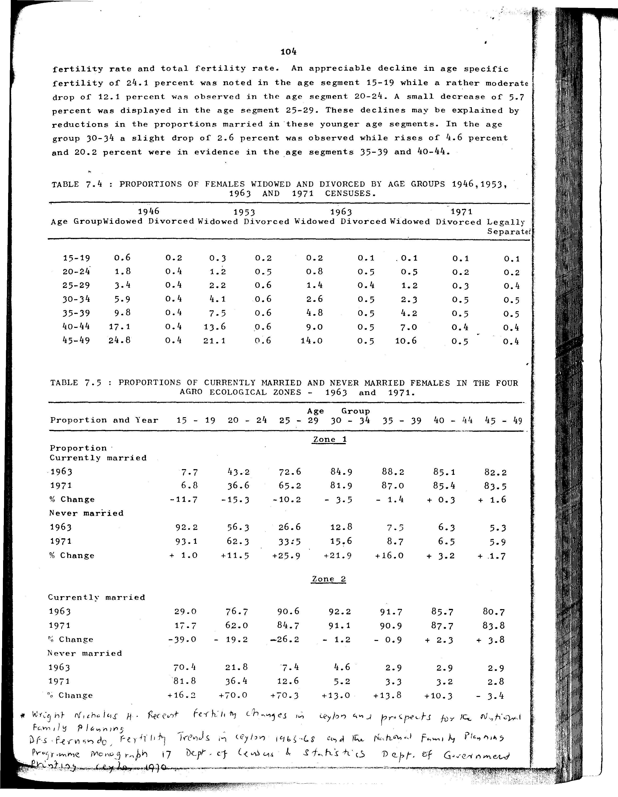

# 7.4: Proportion of females widowed and divorced by age groups 1946, 1953, 1963 and 1971 censuses


- 📜 Original Table PDF - [data/tables/table-7/table-7-04/original.pdf (83.9 kB)](../../../../data/tables/table-7/table-7-04/original.pdf)
- 📜 Original Table Image - [data/tables/table-7/table-7-04/original.images/image-01.png (216.1 kB)](../../../../data/tables/table-7/table-7-04/original.images/image-01.png)
- 📄 Extracted JSON Data - [data/tables/table-7/table-7-04/data.json (2.8 kB)](../../../../data/tables/table-7/table-7-04/data.json)
- 📄 Extracted Normalized JSON Data - [data/tables/table-7/table-7-04/normalized_data.json (2.1 kB)](../../../../data/tables/table-7/table-7-04/normalized_data.json)
- 📄 Extracted TSV Data - [data/tables/table-7/table-7-04/data.tsv (423 B)](../../../../data/tables/table-7/table-7-04/data.tsv)

## Original Table [Image](../../../../data/tables/table-7/table-7-04/original.images/image-01.png)



## Extracted [JSON Data](../../../../data/tables/table-7/table-7-04/data.json)

```json
{
    "found": true,
    "table_no": "7.4",
    "table_name": "Proportion of females widowed and divorced by age groups 1946, 1953, 1963 and 1971 censuses",
    "primary_keys": [
        "Age Group"
    ],
    "field_keys": [
        "1946 - Widowed",
        "1946 - Divorced",
        "1953 - Widowed",
        "1953 - Divorced",
        "1963 - Widowed",
        "1963 - Divorced",
        "1963 - Widowed",
        "1971 - Divorced",
        "1971 - Legally Separated"
    ],
    "rows": [
        {
            "Age Group": "15-19",
            "values": {
                "1946 - Widowed": 0.6,
                "1946 - Divorced": 0.2,
                "1953 - Widowed": 0.3,
                "1953 - Divorced": 0.2,
                "1963 - Widowed": 0.1,
                "1963 - Divorced": 0.1,
                "1971 - Divorced": 0.1,
                "1971 - Legally Separated": 0.1
            }
        },
        {
            "Age Group": "20-24",
            "values": {
                "1946 - Widowed": 1.8,
                "1946 - Divorced": 0.4,
                "1953 - Widowed": 1.2,
                "1953 - Divorced": 0.5,
                "1963 - Widowed": 0.5,
                "1963 - Divorced": 0.5,
                "1971 - Divorced": 0.2,
                "1971 - Legally Separated": 0.2
            }
        },
        {
            "Age Group": "25-29",
            "values": {
                "1946 - Widowed": 3.4,
                "1946 - Divorced": 0.4,
                "1953 - Widowed": 2.2,
                "1953 - Divorced": 0.6,
                "1963 - Widowed": 1.2,
                "1963 - Divorced": 0.4,
                "1971 - Divorced": 0.3,
                "1971 - Legally Separated": 0.4
            }
        },
        {
            "Age Group": "30-34",
            "values": {
                "1946 - Widowed": 5.9,
                "1946 - Divorced": 0.4,
                "1953 - Widowed": 4.1,
                "1953 - Divorced": 0.6,
                "1963 - Widowed": 2.3,
                "1963 - Divorced": 0.5,
                "1971 - Divorced": 0.5,
                "1971 - Legally Separated": 0.5
            }
        },
        {
            "Age Group": "35-39",
            "values": {
                "1946 - Widowed": 9.8,
                "1946 - Divorced": 0.4,
                "1953 - Widowed": 7.5,
                "1953 - Divorced": 0.6,
                "1963 - Widowed": 4.2,
                "1963 - Divorced": 0.5,
                "1971 - Divorced": 0.5,
                "1971 - Legally Separated": 0.5
            }
        },
        {
            "Age Group": "40-44",
            "values": {
                "1946 - Widowed": 17.1,
                "1946 - Divorced": 0.4,
                "1953 - Widowed": 13.6,
                "1953 - Divorced": 0.6,
                "1963 - Widowed": 7.0,
                "1963 - Divorced": 0.5,
                "1971 - Divorced": 0.4,
                "1971 - Legally Separated": 0.4
            }
        },
        {
            "Age Group": "45-49",
            "values": {
                "1946 - Widowed": 24.8,
                "1946 - Divorced": 0.4,
                "1953 - Widowed": 21.1,
                "1953 - Divorced": 0.6,
                "1963 - Widowed": 10.6,
                "1963 - Divorced": 0.5,
                "1971 - Divorced": 0.5,
                "1971 - Legally Separated": 0.4
            }
        }
    ],
    "notes": []
}
```

## Extracted [Normalized JSON Data](../../../../data/tables/table-7/table-7-04/normalized_data.json)

```json
[
    {
        "Age Group": "15-19",
        "values": {
            "1946 - Widowed": 0.6,
            "1946 - Divorced": 0.2,
            "1953 - Widowed": 0.3,
            "1953 - Divorced": 0.2,
            "1963 - Widowed": 0.1,
            "1963 - Divorced": 0.1,
            "1971 - Divorced": 0.1,
            "1971 - Legally Separated": 0.1
        }
    },
    {
        "Age Group": "20-24",
        "values": {
            "1946 - Widowed": 1.8,
            "1946 - Divorced": 0.4,
            "1953 - Widowed": 1.2,
            "1953 - Divorced": 0.5,
            "1963 - Widowed": 0.5,
            "1963 - Divorced": 0.5,
            "1971 - Divorced": 0.2,
            "1971 - Legally Separated": 0.2
        }
    },
    {
        "Age Group": "25-29",
        "values": {
            "1946 - Widowed": 3.4,
            "1946 - Divorced": 0.4,
            "1953 - Widowed": 2.2,
            "1953 - Divorced": 0.6,
            "1963 - Widowed": 1.2,
            "1963 - Divorced": 0.4,
            "1971 - Divorced": 0.3,
            "1971 - Legally Separated": 0.4
        }
    },
    {
        "Age Group": "30-34",
        "values": {
            "1946 - Widowed": 5.9,
            "1946 - Divorced": 0.4,
            "1953 - Widowed": 4.1,
            "1953 - Divorced": 0.6,
            "1963 - Widowed": 2.3,
            "1963 - Divorced": 0.5,
            "1971 - Divorced": 0.5,
            "1971 - Legally Separated": 0.5
        }
    },
    {
        "Age Group": "35-39",
        "values": {
            "1946 - Widowed": 9.8,
            "1946 - Divorced": 0.4,
            "1953 - Widowed": 7.5,
            "1953 - Divorced": 0.6,
            "1963 - Widowed": 4.2,
            "1963 - Divorced": 0.5,
            "1971 - Divorced": 0.5,
            "1971 - Legally Separated": 0.5
        }
    },
    {
        "Age Group": "40-44",
        "values": {
            "1946 - Widowed": 17.1,
            "1946 - Divorced": 0.4,
            "1953 - Widowed": 13.6,
            "1953 - Divorced": 0.6,
            "1963 - Widowed": 7.0,
            "1963 - Divorced": 0.5,
            "1971 - Divorced": 0.4,
            "1971 - Legally Separated": 0.4
        }
    },
    {
        "Age Group": "45-49",
        "values": {
            "1946 - Widowed": 24.8,
            "1946 - Divorced": 0.4,
            "1953 - Widowed": 21.1,
            "1953 - Divorced": 0.6,
            "1963 - Widowed": 10.6,
            "1963 - Divorced": 0.5,
            "1971 - Divorced": 0.5,
            "1971 - Legally Separated": 0.4
        }
    }
]
```

## Extracted [TSV Data](../../../../data/tables/table-7/table-7-04/data.tsv)

| Age Group | 1946 - Widowed | 1946 - Divorced | 1953 - Widowed | 1953 - Divorced | 1963 - Widowed | 1963 - Divorced | 1971 - Divorced | 1971 - Legally Separated |
| --- | --- | --- | --- | --- | --- | --- | --- | --- |
| 15-19 | 0.6 | 0.2 | 0.3 | 0.2 | 0.1 | 0.1 | 0.1 | 0.1 |
| 20-24 | 1.8 | 0.4 | 1.2 | 0.5 | 0.5 | 0.5 | 0.2 | 0.2 |
| 25-29 | 3.4 | 0.4 | 2.2 | 0.6 | 1.2 | 0.4 | 0.3 | 0.4 |
| 30-34 | 5.9 | 0.4 | 4.1 | 0.6 | 2.3 | 0.5 | 0.5 | 0.5 |
| 35-39 | 9.8 | 0.4 | 7.5 | 0.6 | 4.2 | 0.5 | 0.5 | 0.5 |
| 40-44 | 17.1 | 0.4 | 13.6 | 0.6 | 7.0 | 0.5 | 0.4 | 0.4 |
| 45-49 | 24.8 | 0.4 | 21.1 | 0.6 | 10.6 | 0.5 | 0.5 | 0.4 |


[](https://opensource.org/licenses/MIT)
