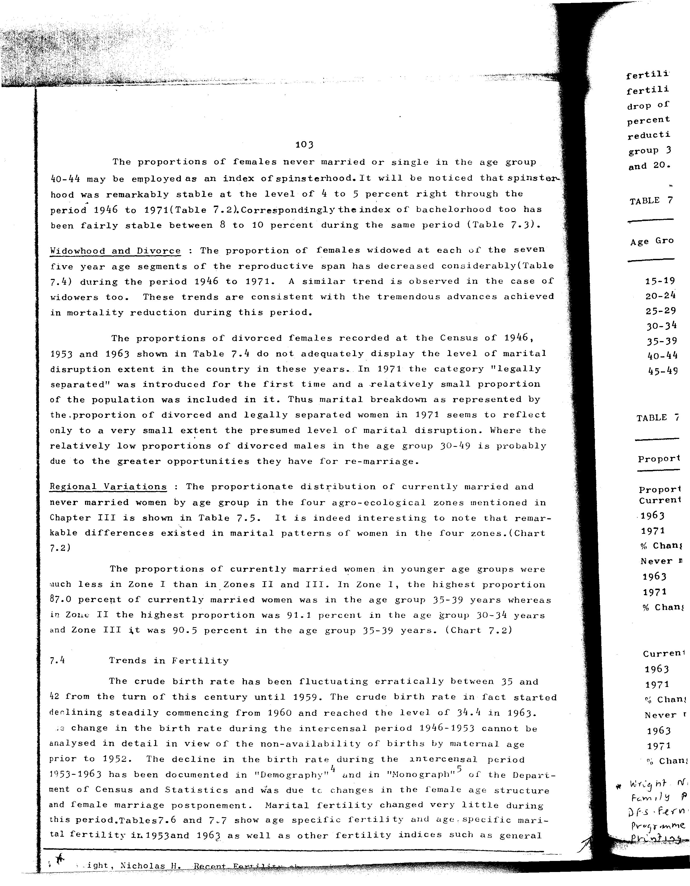

# 7.4: Proportion of females widowed and divorced by age groups 1946, 1953, 1963 and 1971 censuses

---

- 📜 Original PDF - [data/tables/table-7/table-7-04/original.pdf (93.1 kB)](../../../../data/tables/table-7/table-7-04/original.pdf)
- 📜 Original Image - [data/tables/table-7/table-7-04/original.image-01.png (220.2 kB)](../../../../data/tables/table-7/table-7-04/original.image-01.png)
- 📄 README - [data/tables/table-7/table-7-04/README.md (955 B)](../../../../data/tables/table-7/table-7-04/README.md)

## Extracted [JSON Data](../../../../data/tables/table-7/table-7-04/data.json)

*⚠️ No data extracted yet.*
## Original Table [Image](../../../../data/tables/table-7/table-7-04/original.image-01.png)

---

