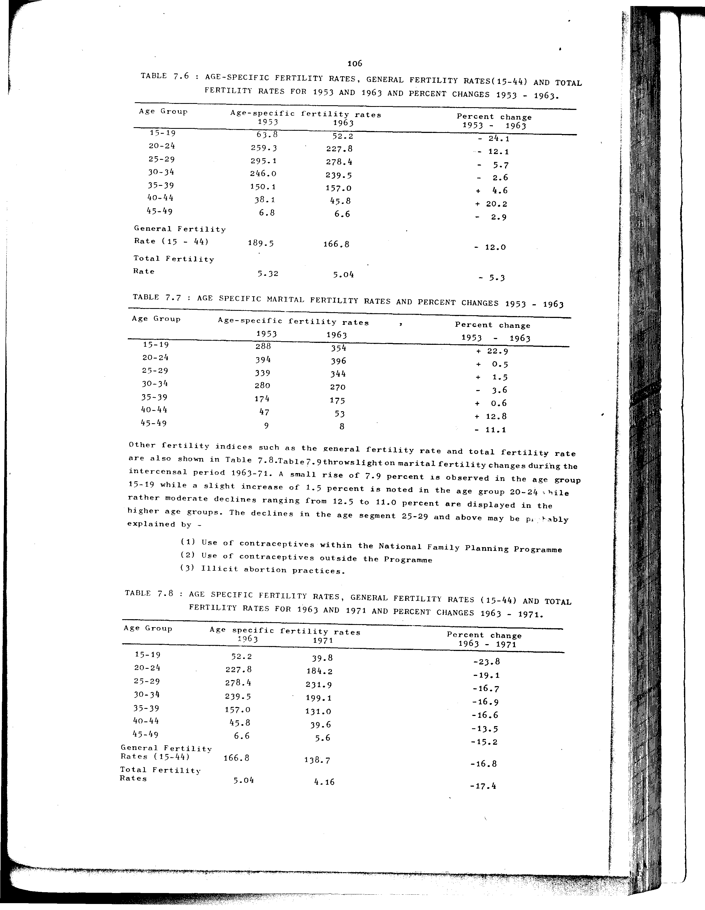

# 7.8: Age specific fertility rates, general fertility rates (15-44) and total fertility rates for 1963 and 1971 and percent changes 1963-1971

- 📜 Original Table PDF - [data/tables/table-7/table-7-08/original.pdf (73.9 kB)](../../../../data/tables/table-7/table-7-08/original.pdf)
- 📜 Original Table Image - [data/tables/table-7/table-7-08/original.image-01.png (185.8 kB)](../../../../data/tables/table-7/table-7-08/original.image-01.png)

## Extracted [JSON Data](../../../../data/tables/table-7/table-7-08/data.json)

*⚠️ No data extracted yet.*
## Original Table [Image](../../../../data/tables/table-7/table-7-08/original.image-01.png)

