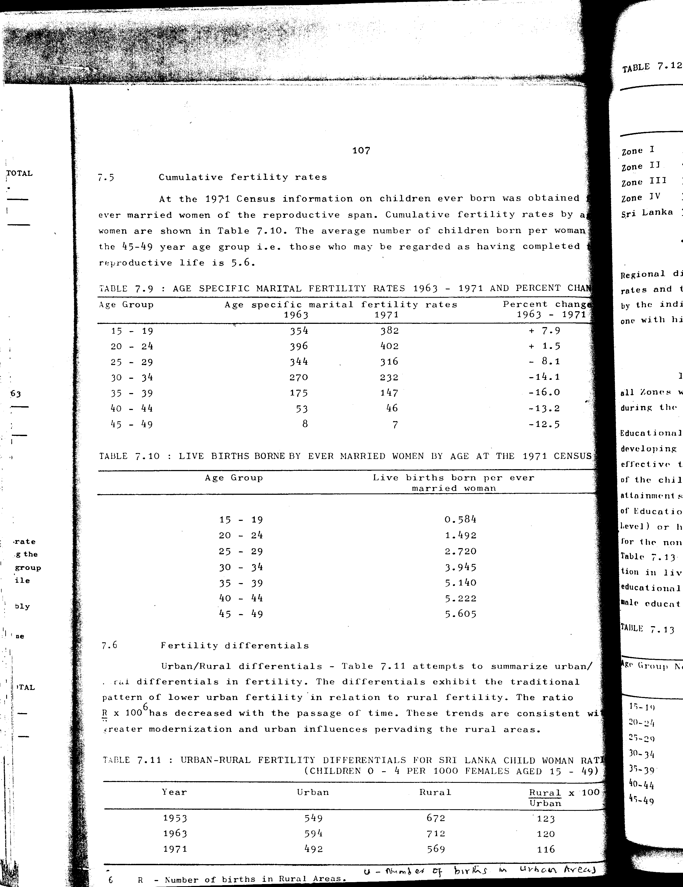

# 7.11: Urban-rural fertility differentials for Sri Lanka: child woman ratio (children 0-4 per 1000 females aged 15-49)


- 📜 Original Table PDF - [data/tables/table-7/table-7-11/original.pdf (92.8 kB)](../../../../data/tables/table-7/table-7-11/original.pdf)
- 📜 Original Table Image - [data/tables/table-7/table-7-11/original.images/image-01.png (201.2 kB)](../../../../data/tables/table-7/table-7-11/original.images/image-01.png)
- 📄 Extracted JSON Data - [data/tables/table-7/table-7-11/data.json (817 B)](../../../../data/tables/table-7/table-7-11/data.json)
- 📄 Extracted Normalized JSON Data - [data/tables/table-7/table-7-11/normalized_data.json (368 B)](../../../../data/tables/table-7/table-7-11/normalized_data.json)
- 📄 Extracted TSV Data - [data/tables/table-7/table-7-11/data.tsv (92 B)](../../../../data/tables/table-7/table-7-11/data.tsv)

## Original Table [Image](../../../../data/tables/table-7/table-7-11/original.images/image-01.png)



## Extracted [TSV Data](../../../../data/tables/table-7/table-7-11/data.tsv)

| Year | Urban | Rural | Rural x 100 / Urban |
| --- | --- | --- | --- |
| 1953 | 549 | 672 | 123 |
| 1963 | 594 | 712 | 120 |
| 1971 | 492 | 569 | 116 |

## Extracted [JSON Data](../../../../data/tables/table-7/table-7-11/data.json)

```json
{
    "found": true,
    "table_no": "7.11",
    "table_name": "Urban-rural fertility differentials for Sri Lanka: child woman ratio (children 0-4 per 1000 females aged 15-49)",
    "primary_keys": [
        "Year"
    ],
    "field_keys": [
        "Urban",
        "Rural",
        "Rural x 100 / Urban"
    ],
    "rows": [
        {
            "Year": 1953,
            "values": {
                "Urban": 549,
                "Rural": 672,
                "Rural x 100 / Urban": 123
            }
        },
        {
            "Year": 1963,
            "values": {
                "Urban": 594,
                "Rural": 712,
                "Rural x 100 / Urban": 120
            }
        },
        {
            "Year": 1971,
            "values": {
                "Urban": 492,
                "Rural": 569,
                "Rural x 100 / Urban": 116
            }
        }
    ],
    "notes": [
        "U - Number of births in Urban Areas",
        "R - Number of births in Rural Areas."
    ]
}
```

## Extracted [Normalized JSON Data](../../../../data/tables/table-7/table-7-11/normalized_data.json)

```json
[
    {
        "Year": 1953,
        "values": {
            "Urban": 549,
            "Rural": 672,
            "Rural x 100 / Urban": 123
        }
    },
    {
        "Year": 1963,
        "values": {
            "Urban": 594,
            "Rural": 712,
            "Rural x 100 / Urban": 120
        }
    },
    {
        "Year": 1971,
        "values": {
            "Urban": 492,
            "Rural": 569,
            "Rural x 100 / Urban": 116
        }
    }
]
```


[](https://opensource.org/licenses/MIT)
